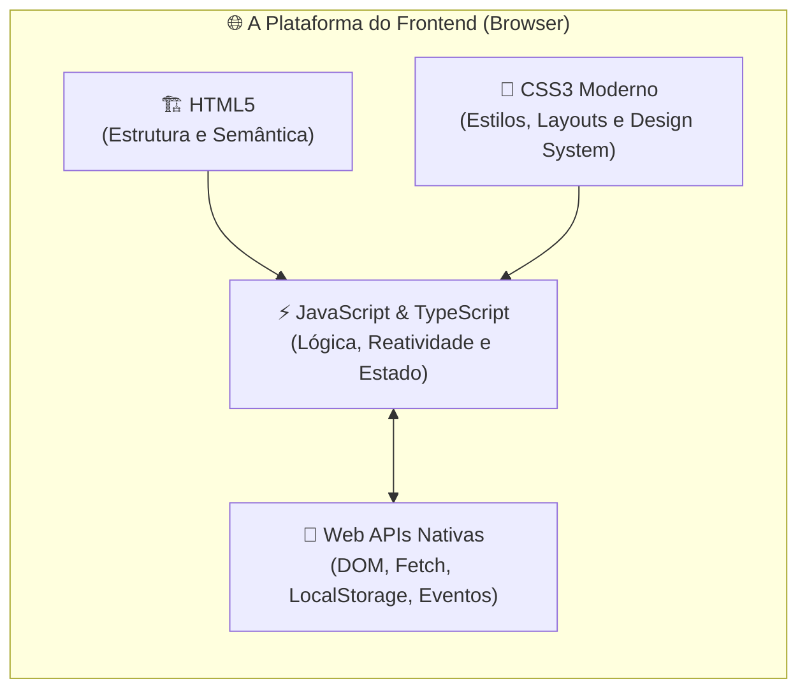
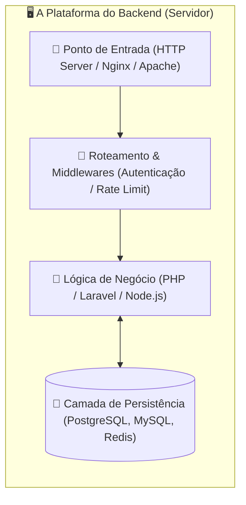
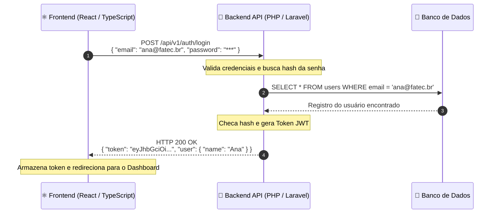
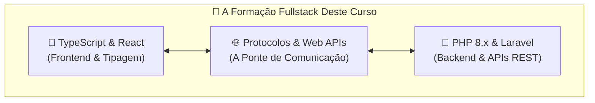

# As Duas Pontas da Web: Frontend e Backend

No capítulo anterior, compreendemos como a Web funciona por meio do modelo
Cliente-Servidor e do ciclo de requisição e resposta HTTP. Agora que temos essa
visão panorâmica, precisamos aprofundar nas **duas grandes pontas** da
engenharia de software para a web: o **Frontend** e o **Backend**.

Ao longo da história da computação, essas duas frentes evoluíram de arquivos
HTML estáticos e scripts simples para ecossistemas altamente especializados. O
objetivo deste capítulo é delimitar as responsabilidades de cada lado, entender
como eles conversam através de **APIs modernas** e orientar você sobre como
aproveitar ao máximo a jornada de aprendizado neste curso.

## A Dor do Desenvolvedor Iniciante: "Onde Fica Cada Coisa?"

Quando começamos a construir aplicações completas, é muito comum nos sentirmos
desorientados com a quantidade de camadas e tecnologias envolvidas. Perguntas
clássicas que surgem na cabeça de estudantes:

- _"Por que não posso salvar um arquivo diretamente no disco rígido do usuário
  usando TypeScript no navegador?"_
- _"Onde deve ficar a validação do formulário? No JavaScript do botão ou no PHP
  do servidor?"_
- _"Por que preciso de uma API se eu poderia gerar o HTML completo direto no
  backend?"_

Sem clareza sobre essas fronteiras, o desenvolvedor iniciante comete erros
graves de arquitetura e segurança:

1. **Validação apenas no cliente:** O usuário desabilita o JavaScript no
   navegador e envia dados corrompidos ou maliciosos direto para a aplicação.
2. **Exposição de segredos de negócio:** Regras confidenciais de precificação e
   chaves privadas de pagamento embutidas no código que vai para o navegador.
3. **Acoplamento excessivo:** Código de banco de dados misturado com tags
   visuais de interface, tornando qualquer manutenção cara e arriscada.

Para construir sistemas escaláveis e seguros, precisamos respeitar a vocação
natural de cada uma das pontas.

## O Frontend: A Ponta do Cliente e da Experiência

O **Frontend** é tudo aquilo com que o usuário interage diretamente. Ele é
executado no dispositivo final (o navegador web do computador, celular ou
tablet).



### Principais Responsabilidades do Frontend:

1. **Interface e Acessibilidade:** Apresentar informações de forma clara,
   responsiva e acessível (leitores de tela, contrastes, semântica correta).
2. **Experiência do Usuário (UX/UI):** Fornecer respostas visuais imediatas,
   animações fluidas e feedback instantâneo durante o preenchimento de ações.
3. **Gestão de Estado na Interface:** Controlar itens selecionados em um
   carrinho de compras, abas abertas, modais visíveis e dados digitados pelo
   usuário.
4. **Comunicação Assíncrona:** Enviar requisições em segundo plano para o
   backend sem travar ou recarregar a tela inteira (utilizando a função `fetch`
   nativa ou bibliotecas como `Axios`).

## O Backend: A Ponta do Servidor e da Confiabilidade

O **Backend** é o motor invisível da aplicação. Ele roda em servidores seguros e
tem acesso a recursos restritos que o navegador jamais pode tocar diretamente,
como sistemas de arquivos do servidor, filas de mensageria e bancos de dados
relacionais.



### Principais Responsabilidades do Backend:

1. **Regras de Negócio Inegociáveis:** Garantir que um usuário não consiga
   transferir dinheiro sem saldo suficiente ou comprar um produto esgotado.
2. **Segurança e Criptografia:** Armazenar senhas com algoritmos seguros de hash
   (como `bcrypt` ou `argon2`), emitir tokens criptográficos de sessão (JWT) e
   proteger contra ataques maliciosos (SQL Injection, CSRF).
3. **Persistência Confiável:** Modelar tabelas, executar transações ACID em
   bancos de dados e garantir a integridade dos dados históricos.
4. **Integrações Críticas:** Comunicar-se de servidor para servidor com gateways
   de pagamento (Stripe, PagSeguro), provedores de e-mail e APIs governamentais.

## Como as Duas Pontas Conversam: O Papel das APIs

Na arquitetura web moderna, o Frontend e o Backend são construídos de forma
**desacoplada**. O Backend funciona como um provedor de dados e serviços
disponibilizados via **API (Application Programming Interface)**, e o Frontend
consome esses recursos enviando e recebendo dados em formatos como **JSON**,
**XML**, entre outros.



### Por Que Essa Arquitetura Desacoplada Domina o Mercado?

| Vantagem                          | Descrição Prática                                                                                                                                                                           |
| :-------------------------------- | :------------------------------------------------------------------------------------------------------------------------------------------------------------------------------------------ |
| **Múltiplos Clientes**            | A mesma API em PHP/Laravel pode alimentar simultaneamente o site em React, o aplicativo iOS/Android e uma integração de terminal.                                                           |
| **Evolução Independente**         | O time de frontend pode refazer todo o design visual sem precisar alterar uma única linha de código do banco de dados no backend.                                                           |
| **Especialização de Ferramentas** | Usamos o que há de melhor em cada ecossistema: tipagem estática e reatividade no cliente com **TypeScript/React** e robustez, produtividade e ORM poderoso no servidor com **PHP/Laravel**. |

<details>
<summary>💡 Aprofundamento: Validação em Camadas (Frontend, Backend e Banco de Dados)</summary>

Um erro comum entre iniciantes é pensar: _"Se eu já validei que o campo de
e-mail está correto no TypeScript do frontend, não preciso validar de novo no
backend"_.

Isso é falso! Qualquer usuário técnico pode abrir o terminal e disparar uma
requisição direta via `cURL` ou `Postman`, contornando 100% do código do
frontend:

```bash
# O invasor ignora a validação do formulário no React e envia dados vazios ou maliciosos direto:
curl -X POST https://api.fatec.sp.gov.br/users \
  -H "Content-Type: application/json" \
  -d '{"email": "", "role": "admin"}'
```

Por isso, na engenharia de software profissional, costuma-se aplicar a
estratégia de **validação em camadas** (podendo ser dupla ou até tripla):

1. **Camada 1 · Frontend (Cliente):** Serve para **agilidade e UX** (avisar o
   usuário imediatamente na interface sobre campos obrigatórios ou formatos
   incorretos, economizando tempo e requisições de rede desnecessárias).
2. **Camada 2 · Backend (Servidor):** Serve para **segurança e regras de
   negócio** (a barreira inegociável da API que garante que nenhuma requisição
   adulterada passe).
3. **Camada 3 · Banco de Dados (Persistência):** Em muitos cenários críticos, o
   próprio banco atua como a última linha de defesa física através de restrições
   relacionais (`NOT NULL`, `UNIQUE`, `CHECK constraints`), além de _triggers_
   ou _stored procedures_ para integridade estrita dos dados.

> **⚠️ O Trade-off da Manutenção:**
>
> Ter regras validadas em múltiplas camadas traz segurança máxima, mas gera um
> **custo de sincronização**. Se a regra de tamanho mínimo de senha mudar de 8
> para 10 caracteres, o time precisa garantir que todas as camadas sejam
> atualizadas coerentemente. Caso contrário, mensagens de erro conflitantes ou
> falhas silenciosas podem ocorrer.

</details>

## O Que É Ser um Desenvolvedor Fullstack?

Ser um desenvolvedor **Fullstack** não significa saber absolutamente tudo de
todas as tecnologias existentes. Significa ter a **capacidade de transitar com
clareza entre as duas pontas**, entendendo como os dados nascem no banco, são
processados no servidor, viajam pela rede via HTTP e ganham vida na interface do
usuário.



## Como Este Curso Está Estruturado

Para transformar você em um desenvolvedor Fullstack completo, estruturamos o
curso em etapas graduais e integradas:

1. **Módulo 00 · Bases da Web:** Onde estamos agora, consolidando a visão de
   arquitetura e o ciclo cliente-servidor.
2. **Módulo 01 · Linguagens de Programação:**
   - **TypeScript:** Fundamentos sólidos, tipagem estática rigorosa, generics e
     orientação a objetos moderna.
   - **PHP 8.x Moderno:** Do modelo de execução à orientação a objetos avançada
     (Constructor Property Promotion, Traits, Enums e Composer).
3. **Módulo 02 · Plataformas e Integração:**
   - **Protocolos de Rede:** HTTP/HTTPS, WebSockets e redes.
   - **Plataforma do Browser:** Manipulação do DOM e catálogo de Web APIs
     nativas (Fetch API, Storage, Observadores).
   - **Fundamentos e Arquitetura de Backend:** Ciclo de vida de requisições no
     servidor, design de APIs RESTful e padrões arquiteturais (MVC, Camadas).
   - **Segurança & Sessão:** CORS, autenticação stateless com tokens JWT e
     proteção contra vulnerabilidades.
4. **Módulos de Ecossistema (Eixos Especializados):**
   - **TypeScript:** Bibliotecas essenciais de mercado como **Axios**, validação
     com **Zod** e componentização moderna com **React**.
   - **PHP:** Criação de APIs robustas de nível de produção com o framework
     **Laravel** (Rotas, Eloquent ORM, Migrations e Sanctum).

## O Que Vem a Seguir?

Com os fundamentos do modelo Cliente-Servidor e a visão macro das duas pontas
consolidados, é hora de mergulharmos no instrumental técnico. No **Módulo 01**,
vamos explorar as duas linguagens de programação centrais da nossa formação:
**TypeScript** e **PHP**.

Embora o ecossistema moderno permita que ambas transitem por ambos os lados da
web (o TypeScript roda no servidor com Node.js/Deno, e o PHP tradicionalmente
renderiza páginas HTML completas no servidor via SSR), neste curso atribuímos a
cada uma delas o papel em que são referências de ponta na indústria:

### 🔷 Trilha TypeScript: Frontend Moderno e Segurança de Tipos

O **TypeScript** é a espinha dorsal do nosso estudo de Frontend. Ele estende o
JavaScript adicionando um sistema de tipagem estática que previne falhas antes
mesmo do código rodar no navegador.

> **👤 Perfil do Desenvolvedor TypeScript:**
>
> Desenvolvedores focados em TypeScript costumam se destacar na criação de
> interfaces ricas e reativas, arquitetura de componentes reutilizáveis, gestão
> complexa de estado na tela e validação estrita de dados de ponta a ponta. É a
> escolha de quem valoriza produtividade em equipe e blindagem contra erros de
> execução no navegador.

👉 **[Ir para a Trilha de TypeScript](../01-linguagens-de-programacao/typescript/01-o-que-e-typescript-e-por-que-ele-existe.md)**

### 🐘 Trilha PHP 8.x: Backend Robusto e APIs de Alto Desempenho

O **PHP 8.x** é o motor do nosso estudo de Backend. Uma linguagem nativa da
web, madura, altamente performática e que evoluiu com recursos modernos de
orientação a objetos, tipagem rigorosa e um ecossistema fantástico para APIs.

> **👤 Perfil do Desenvolvedor PHP Moderno:**
>
> Desenvolvedores focados em PHP moderno destacam-se pelo domínio de modelagem de
> bancos de dados, regras de negócio complexas, segurança de autenticação,
> arquitetura limpa de APIs e agilidade de entrega de valor no servidor. É a
> escolha de quem busca robustez, pragmatismo e alta produtividade no backend.

👉 **[Ir para a Trilha de PHP](../01-linguagens-de-programacao/php/01-o-que-e-php-e-o-modelo-de-execucao-web.md)**

Você tem total liberdade para escolher por qual trilha deseja começar ou alternar
entre elas conforme avança no curso.

---

<a href="01-como-a-web-funciona-e-o-modelo-cliente-servidor.md">← Como a Web Funciona e o Modelo Cliente-Servidor</a>
