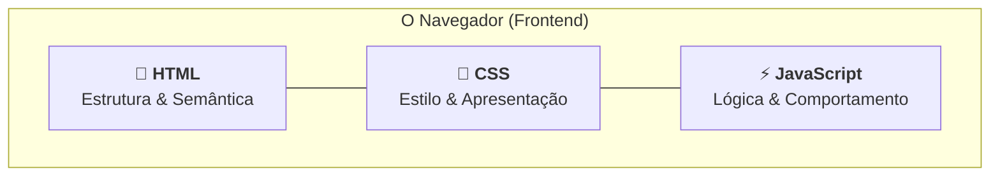
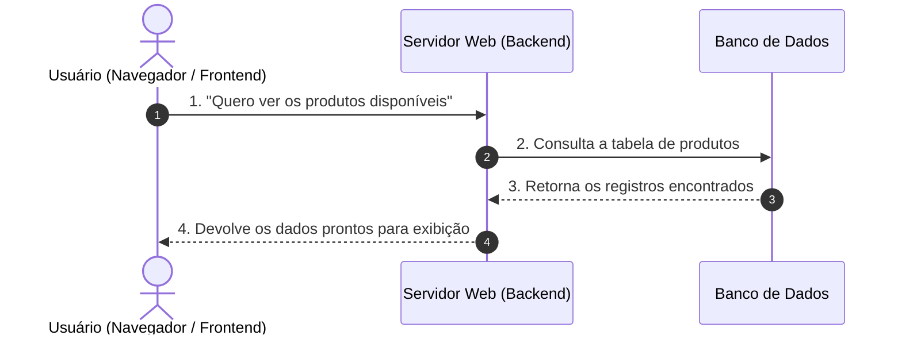
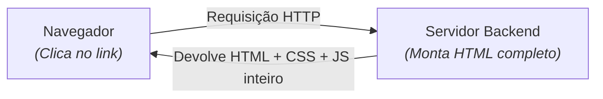
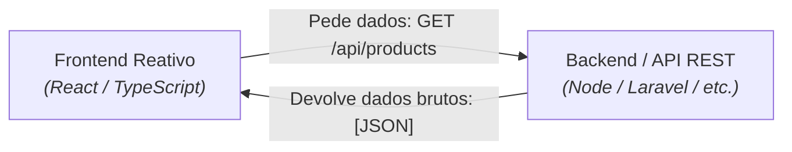

# 1. As Linguagens da Web e seus Papéis

Construir software para a Web é uma experiência fascinante porque, diferente de
aplicações tradicionais de desktop ou de linha de comando, uma aplicação web
nasce distribuída por natureza. Ela não roda em um único lugar: parte dela é
executada na máquina do usuário (no navegador) e parte roda em servidores
espalhados pelo mundo.

Antes de mergulharmos em ferramentas, compiladores e frameworks, precisamos dar
um passo atrás e responder a uma pergunta simples: **quem é responsável pelo quê
quando abrimos um site ou uma aplicação no navegador?**

Neste capítulo, vamos compreender a divisão fundamental de responsabilidades na
Web, entender os papéis da tríade do navegador e ver como a comunicação entre
cliente e servidor evoluiu para o modelo moderno de APIs.

## A Tríade do Navegador

Qualquer navegador moderno — seja o Chrome, Firefox, Edge ou Safari — é
projetado para interpretar e renderizar três tecnologias fundamentais. Cada uma
possui um propósito estrito e não tenta fazer o trabalho da outra.



Para fixar essa divisão de responsabilidades, **imagine a construção de uma
casa**:

### 1. HTML (_HyperText Markup Language_): A Estrutura e o Esqueleto

O HTML define **o que existe** na página. Ele funciona como as vigas, tijolos e
divisórias da casa.

- Ele não se preocupa se um botão é azul ou vermelho, nem o que acontece quando
  alguém clica nele;
- Sua missão é declarar: _"aqui temos um cabeçalho, aqui temos um parágrafo de
  texto, aqui temos um formulário e aqui temos um botão de envio"_;
- O HTML fornece **semântica**, permitindo que navegadores, leitores de tela
  para pessoas com deficiência visual e motores de busca (como o Google)
  entendam o significado de cada parte do conteúdo.

### 2. CSS (_Cascading Style Sheets_): O Acabamento e a Estética

O CSS define **como as coisas se parecem**. Ele é a pintura das paredes, o piso,
a iluminação, a disposição dos móveis e o design de interiores da casa.

- Com o CSS, definimos cores, tipografia, espaçamentos, alinhamentos e
  adaptações para telas menores (design responsivo para celulares e tablets);
- Uma página sem CSS é apenas um documento cru de texto preto sobre fundo branco
  com links azuis.

### 3. JavaScript: As Instalações, Sensores e Automações

O JavaScript define **como as coisas se comportam**. Ele é a fiação elétrica
inteligente, os sensores de presença, o portão automático e o sistema de
segurança da casa.

- É a única linguagem de programação real da tríade (com variáveis, loops,
  funções e lógica condicional);
- Ele reage às ações do usuário em tempo real: valida se um campo de formulário
  foi preenchido corretamente, abre janelas modais, busca informações na
  internet sem recarregar a página e atualiza a interface instantaneamente.

> **Checkpoint:**
>
> Se precisássemos criar um botão para comprar um produto em uma loja virtual:
>
> - Qual tecnologia cria o botão na tela?
> - Qual tecnologia deixa o botão verde com cantos arredondados?
> - Qual tecnologia calcula o desconto e envia o pedido quando o botão é
>   clicado?

## Os Dois Lados da Moeda: Frontend e Backend

Até aqui falamos sobre o que acontece dentro do navegador. Esse ambiente é
conhecido no mercado como **Frontend** (ou lado do cliente — _Client-side_).

No entanto, o navegador do usuário tem limitações intencionais de segurança: ele
não pode acessar diretamente o banco de dados da empresa, não pode expor senhas
mestras de pagamento e não deve guardar segredos de negócio.

É aqui que entra o **Backend** (ou lado do servidor — _Server-side_):



- **Frontend (Cliente):** A interface visual que roda no dispositivo do usuário
  (HTML, CSS, JavaScript/TypeScript). Focado em experiência do usuário (UX),
  acessibilidade e apresentação.
- **Backend (Servidor):** A aplicação central que roda em um servidor
  controlado. Focado em regras de negócio críticas, segurança, cálculos
  financeiros, autenticação de usuários e comunicação com o banco de dados
  (usando linguagens como PHP, TypeScript/Node.js, Java, C#, Python, etc.).

## A Evolução da Web: De Páginas Estáticas a APIs REST

A forma como o Frontend e o Backend conversam mudou drasticamente ao longo dos
anos. Compreender essa evolução é essencial para entender por que trabalhamos
com TypeScript e APIs hoje.

### O Modelo Tradicional: Renderização no Servidor (SSR Clássico)

Nos primórdios do desenvolvimento web dinâmico (comum em aplicações PHP
tradicionais, JSP ou ASP clássico):

1. O usuário clicava em um link ("Meus Pedidos").
2. O servidor processava tudo, consultava o banco de dados, montava o código
   HTML inteiro da página nova e enviava esse arquivo gigante de volta.
3. A tela do navegador ficava toda branca por um instante enquanto a página
   inteira recarregava do zero.



### O Modelo Moderno: Separação de Responsabilidades e APIs REST

Nas aplicações modernas (como as que construiremos neste curso):

1. O navegador carrega a estrutura visual da aplicação uma única vez.
2. Quando o usuário precisa de dados novos (por exemplo, a lista de produtos), o
   JavaScript faz uma requisição em segundo plano solicitando **apenas os dados
   brutos**, sem recarregar a tela.
3. O servidor responde com esses dados no formato **JSON** (_JavaScript Object
   Notation_).
4. O JavaScript no navegador recebe o JSON e atualiza apenas o pedaço da tela
   que mudou.



Veja como é a cara de uma resposta em JSON contendo uma lista de produtos:

```json
[
  {
    "id": 1,
    "name": "Teclado Mecânico",
    "price": 250.0,
    "inStock": true
  },
  {
    "id": 2,
    "name": "Mouse Gamer",
    "price": 120.5,
    "inStock": false
  }
]
```

<details>
<summary>🔍 Por que o formato JSON se tornou o padrão universal da Web?</summary>

Antes do JSON dominar a internet, a maior parte da comunicação entre sistemas
era feita em **XML** (_eXtensible Markup Language_).

O XML era extremamente verboso e pesado para trafegar na rede:

```xml
<!-- Exemplo em XML: muitas tags repetitivas e mais bytes trafegados -->
<products>
  <product>
    <id>1</id>
    <name>Teclado Mecânico</name>
    <price>250.00</price>
  </product>
</products>
```

O **JSON** foi criado baseado na sintaxe do JavaScript. Ele é muito mais leve,
fácil de ler por humanos e pode ser convertido diretamente para objetos na
memória em praticamente qualquer linguagem de programação moderna sem esforço.

</details>

## Resumo Comparativo dos Papéis

Para consolidar o panorama geral das tecnologias que envolvem o ecossistema web:

| Camada             | Tecnologia Principal            | Papel Principal                                                             | Onde é Executado?    |
| :----------------- | :------------------------------ | :-------------------------------------------------------------------------- | :------------------- |
| **Estrutura**      | **HTML5**                       | Definir os elementos, hierarquia e o conteúdo semântico da página.          | Navegador (Cliente)  |
| **Estilo**         | **CSS3**                        | Cuidar da identidade visual, cores, tipografia e layouts responsivos.       | Navegador (Cliente)  |
| **Comportamento**  | **JavaScript / TypeScript**     | Manipular a interface, reagir a eventos do usuário e comunicar-se com APIs. | Navegador & Servidor |
| **Regras & Dados** | **Backend (Node / PHP / etc.)** | Autenticar usuários, aplicar regras de negócio e proteger o banco de dados. | Servidor             |
| **Persistência**   | **Banco de Dados (SQL)**        | Armazenar e consultar dados de forma permanente e confiável.                | Servidor             |

## O Que Vem a Seguir?

Agora que você tem o mapa mental claro de como a Web se divide entre cliente e
servidor, surge uma questão fundamental sobre a nossa principal ferramenta de
trabalho:

> _"Se o JavaScript nasceu para rodar apenas dentro das páginas do navegador,
> como é possível que hoje possamos utilizá-lo para construir servidores,
> ferramentas de automação e scripts no computador?"_

No próximo capítulo, vamos desvendar o que é um **Runtime JavaScript** e como
motores de execução modernos transformaram a linguagem.

---

<p align="right"><a href="02-o-que-e-um-runtime-js.md">Próximo: O Que É um Runtime JavaScript? →</a></p>
