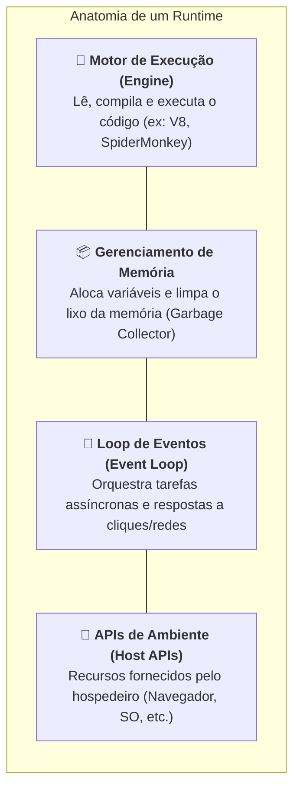
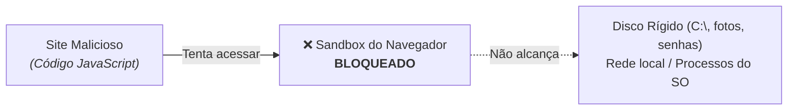
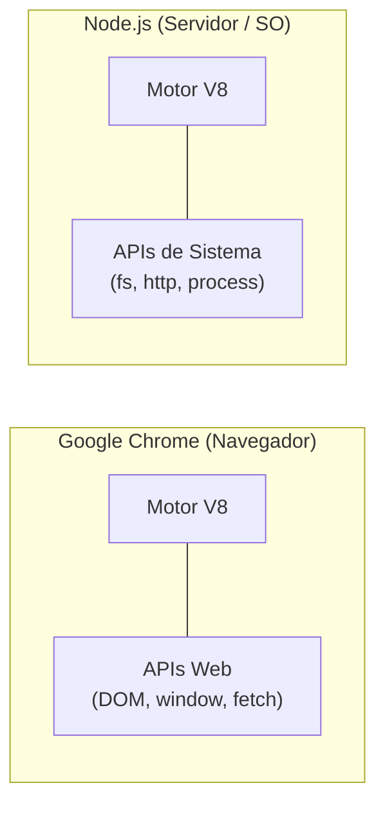
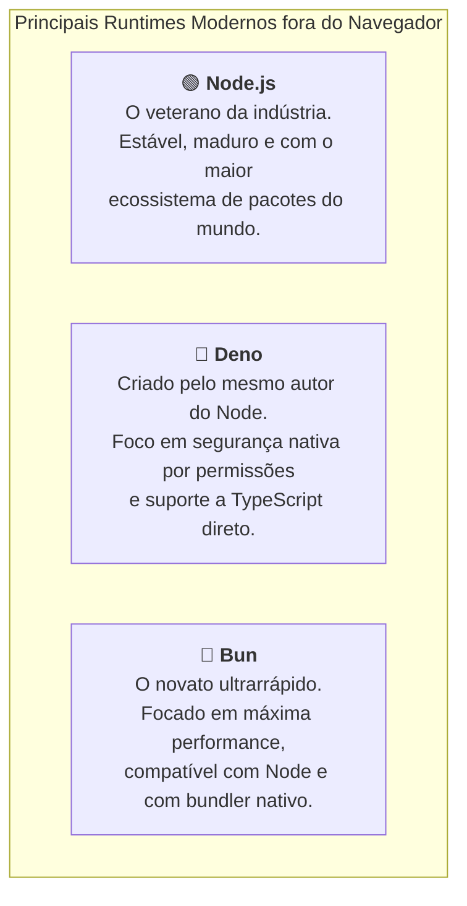

# 2. O Que É um Runtime JavaScript?

No capítulo anterior, vimos que o JavaScript é a linguagem responsável pelo
comportamento e pela lógica na Web. Mas já parou para pensar no que realmente
acontece quando você clica em "Salvar" no seu editor de código e aquele texto
ganha vida?

Um arquivo `.js` nada mais é do que um arquivo de texto comum. O seu computador,
por si só, não sabe o que significa `function`, `const` ou `console.log`. Ele só
entende instruções binárias em linguagem de máquina (zeros e uns).

Para que o código JavaScript seja lido, compreendido e executado, ele precisa de
um **ambiente de execução** — conhecido no mundo do desenvolvimento como
**Runtime**.

Neste capítulo, vamos desmistificar o que é um runtime, entender por que o
navegador é um ambiente com regras de segurança estritas e como a criação de
runtimes independentes permitiu que o JavaScript conquistasse os servidores.

## O Que É um Runtime?

De forma simples, um **Runtime** (ou ambiente de execução) é o programa que
fornece tudo o que a sua linguagem precisa para rodar:



Pense em uma linguagem de programação como uma **partitura musical**:

- O código que você escreve são as notas no papel;
- O **Runtime** é a orquestra completa: o maestro que dita o ritmo, os músicos
  que tocam os instrumentos e a sala de concerto com a acústica apropriada.

Sem o runtime, a partitura é apenas tinta sobre papel.

## O Navegador: O Primeiro Runtime do JavaScript

Historicamente, o navegador web foi o primeiro runtime onde o JavaScript viveu.

Dentro do Google Chrome, por exemplo, existe um motor de alta performance
chamado **V8** (desenvolvido pelo Google em C++). No Firefox, existe o
**SpiderMonkey**; no Safari, o **JavaScriptCore**.

Além de executar a linguagem pura, o navegador "empresta" para o JavaScript uma
série de **APIs exclusivas da Web** que só fazem sentido dentro de uma página:

- **DOM (_Document Object Model_):** Permite encontrar e alterar elementos na
  tela (`document.getElementById`, `document.querySelector`);
- **Janela e Navegação:** Informações sobre a aba atual e histórico
  (`window.location`, `window.innerWidth`);
- **Comunicação de Rede:** Capacidade de buscar dados via HTTP (`fetch`);
- **Armazenamento Local:** Guardar preferências do usuário (`localStorage`,
  `sessionStorage`).

### A Caixa de Areia (_Sandbox_) de Segurança do Navegador

Por rodar na máquina de qualquer pessoa que visita um site, o navegador impõe
uma **fronteira rígida de segurança** conhecida como _sandbox_ (caixa de areia):



> **Por que isso é vital?**
>
> Imagine o caos se qualquer site que você abrisse pudesse ler suas fotos na
> pasta `Documentos`, deletar arquivos do seu disco rígido ou ligar a sua webcam
> sem permissão expressa.
>
> O runtime do navegador garante que o JavaScript só consiga interagir com o que
> está **dentro daquela aba**, isolando o restante do seu sistema operacional.

## A Grande Virada: JavaScript Fora do Navegador

Por muitos anos, o JavaScript ficou restrito ao navegador. Se você quisesse
criar um servidor web, uma API ou um script para automatizar tarefas no
computador, precisava recorrer a outras linguagens, como Java, PHP, Python ou
Ruby.

Em 2009, um engenheiro chamado Ryan Dahl fez uma pergunta genial:

> _"E se pegássemos o motor V8 do Google Chrome (que é incrivelmente rápido e de
> código aberto) e o colocássemos para rodar diretamente no terminal do
> computador, fora do navegador?"_

Assim nasceu o **Node.js**.



Ao retirar o motor da "caixa de areia" do navegador e conectá-lo ao sistema
operacional, o Node.js deu ao JavaScript superpoderes que ele nunca teve antes:

- **Acessar o Sistema de Arquivos:** Ler, criar e modificar arquivos no disco
  (`fs`);
- **Criar Servidores de Rede:** Escutar requisições em portas de rede (como a
  porta `3000` ou `8080`) para construir APIs REST (`http`);
- **Variáveis de Ambiente e Processos:** Ler configurações do servidor e
  gerenciar memória (`process`).

## O Ecossistema Moderno: Node, Deno e Bun

Embora o **Node.js** seja o padrão absoluto da indústria há mais de uma década,
o ecossistema de runtimes continuou evoluindo e hoje temos três nomes de
destaque no mercado:



Neste curso, utilizaremos o **Node.js** como nosso ambiente de trabalho
principal por ser o padrão de mercado mais requisitado em vagas e o mais
compatível com todas as bibliotecas existentes. Porém, os conceitos que você
aprenderá aqui funcionam em qualquer um deles.

## A Regra de Ouro: O Que Roda Onde?

Uma das maiores confusões para quem está começando em desenvolvimento web é
misturar o que pertence ao **JavaScript puro**, o que pertence ao **Navegador**
e o que pertence ao **Node.js**.

Veja o comparativo essencial:

| Recurso / Objeto                              | JavaScript Puro (Core) |  Navegador (Browser)  | Node.js / Deno / Bun |
| :-------------------------------------------- | :--------------------: | :-------------------: | :------------------: |
| Tipos básicos (`string`, `number`, `boolean`) |         ✅ Sim         |        ✅ Sim         |        ✅ Sim        |
| Estruturas (`Array`, `Object`, `Map`, `Set`)  |         ✅ Sim         |        ✅ Sim         |        ✅ Sim        |
| Métodos globais (`Math`, `JSON`, `Promise`)   |         ✅ Sim         |        ✅ Sim         |        ✅ Sim        |
| Manipular tela (`document.querySelector`)     |         ❌ Não         |   ✅ **Exclusivo**    |    ❌ Não existe     |
| Janela e alertas (`window`, `alert('Olá')`)   |         ❌ Não         |   ✅ **Exclusivo**    |    ❌ Não existe     |
| Ler arquivos no disco (`fs.readFile`)         |         ❌ Não         | ❌ Proibido (Sandbox) |   ✅ **Exclusivo**   |
| Variáveis de ambiente (`process.env`)         |         ❌ Não         |     ❌ Não existe     |   ✅ **Exclusivo**   |

### Demonstração Prática de Conflito de Ambiente

Se você tentar executar um comando do navegador dentro do Node.js:

```javascript
// ❌ Tentando rodar no Node.js (Terminal)
console.log(window.innerWidth);
```

**Resultado no terminal:**

```text
ReferenceError: window is not defined
```

_(O Node não tem janelas nem abas, portanto o objeto `window` simplesmente não
existe nele)._

Da mesma forma, se você tentar importar o leitor de arquivos do Node.js dentro
de um script no navegador:

```javascript
// ❌ Tentando rodar no Navegador
import fs from "node:fs";
```

**Resultado no console do navegador:**

```text
TypeError: Failed to resolve module specifier "node:fs"
```

_(O navegador não possui acesso direto ao sistema de arquivos da sua máquina)._

> **Checkpoint:**
>
> Imagine que você precisa construir duas coisas:
>
> 1. Uma função que calcula a média de 3 notas de um aluno.
> 2. Um script que lê um arquivo `notas.txt` salvo na sua máquina e salva o
>    resultado em um banco de dados.
>
> Onde a função (1) pode rodar? E onde o script (2) pode rodar?

<details>
<summary>🔍 Curiosidade Técnica: Como o motor V8 faz o JavaScript rodar tão rápido?</summary>

Antigamente, as linguagens de script eram puramente **interpretadas** linha por
linha, o que as tornava muito mais lentas do que linguagens compiladas (como C++
ou Rust).

O motor **V8** revolucionou isso usando uma técnica chamada **Compilação JIT
(_Just-In-Time_)**:

1. Enquanto o seu código começa a rodar, o motor compila as partes mais
   executadas (_hot code_) diretamente para **código de máquina nativo da sua
   CPU** em tempo real;
2. Se uma função é chamada milhares de vezes com o mesmo tipo de dado, o V8 a
   otimiza ao extremo;
3. Isso entrega uma velocidade próxima de linguagens compiladas tradicionais com
   a flexibilidade de uma linguagem dinâmica.

</details>

## O Que Vem a Seguir?

Agora você já sabe que o JavaScript pode rodar tanto no cliente (navegador)
quanto no servidor (Node.js).

Mas desenvolver software moderno não é sobre escrever cada linha de código do
zero. No dia a dia, nós nos apoiamos em milhares de soluções criadas e testadas
pela comunidade global.

> _"Como fazemos para baixar, instalar e organizar bibliotecas de terceiros no
> nosso projeto de forma segura e padronizada?"_

No próximo capítulo, vamos entender o papel dos **Gerenciadores de Pacotes** e a
anatomia do ecossistema **NPM**.

---

<a href="01-as-linguagens-da-web-e-seus-papeis.md">← As Linguagens da Web e seus Papéis</a>

<p align="right"><a href="03-gerenciadores-de-pacotes.md">Próximo: Gerenciadores de Pacotes e o Ecossistema NPM →</a></p>
