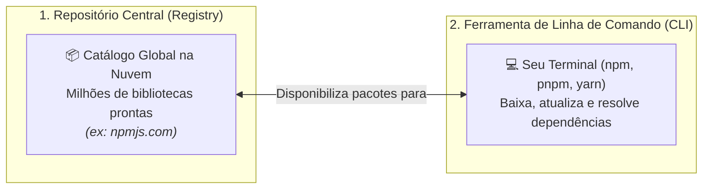
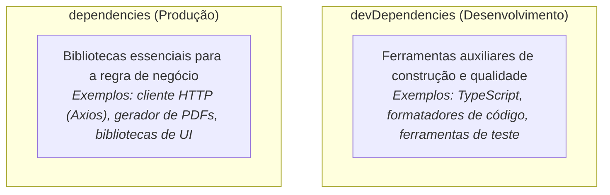
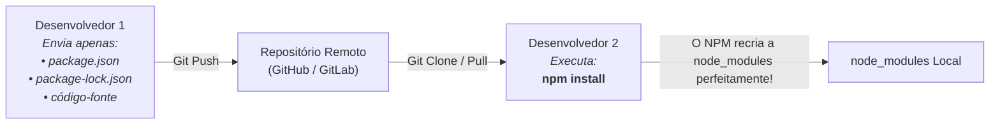

# 3. Gerenciadores de Pacotes e o Ecossistema NPM

Imagine que você foi encarregado de criar um sistema que precisa manipular datas
complexas, calcular fusos horários, validar números de cartões de crédito e
criptografar senhas.

Você passaria meses escrevendo todos esses algoritmos matemáticos do zero ou
preferiria utilizar soluções prontas, amplamente testadas por milhares de
engenheiros de software ao redor do mundo?

No desenvolvimento de software profissional, quase nunca começamos uma aplicação
a partir de uma folha em branco. Nós nos apoiamos no trabalho colaborativo de
código aberto (_open source_).

Mas isso traz um desafio: **como baixar, organizar, atualizar e garantir a
segurança de dezenas de bibliotecas externas no nosso projeto?**

Neste capítulo, vamos compreender o conceito de **Gerenciador de Pacotes**,
desvendar a anatomia do arquivo `package.json` e entender as regras de
convivência com a famosa pasta `node_modules`.

## O Que É um Gerenciador de Pacotes?

Um **Gerenciador de Pacotes** (_Package Manager_) é uma ferramenta automatizada
que resolve duas necessidades fundamentais:



1. **O Registro Central (_Registry_):** Um imenso catálogo público na nuvem onde
   desenvolvedores e empresas publicam suas bibliotecas;
2. **A Ferramenta de Linha de Comando (_CLI_):** Um utilitário no seu computador
   que baixa essas bibliotecas, verifica se uma depende de outra e as organiza
   na pasta do seu projeto.

### O NPM e Outras Ferramentas do Mercado

O **NPM** (_Node Package Manager_) é o gerenciador de pacotes padrão que já vem
instalado automaticamente com o Node.js. Ele é o responsável por administrar o
maior catálogo de bibliotecas de software do planeta.

Embora o NPM seja a referência que utilizaremos no curso, vale conhecer outros
gerenciadores populares no mercado:

- **pnpm:** Focado em eficiência de disco rígido e velocidade extrema
  (reaproveita pacotes compartilhados entre projetos);
- **Yarn:** Criado pelo Facebook (Meta) com foco em velocidade e previsibilidade
  de instalações;
- **Bun:** Possui seu próprio gerenciador de pacotes nativo ultrarrápido.

Todos eles utilizam o mesmo registro central e leem o mesmo arquivo de
configuração: o **`package.json`**.

## A Certidão de Nascimento do Projeto: `package.json`

Quando iniciamos um projeto em JavaScript ou TypeScript, a primeira coisa que
fazemos é criar o **`package.json`**.

Ele funciona como a **receita do projeto**: descreve quem é o projeto, quais
comandos ele sabe executar e de quais "ingredientes" (bibliotecas) ele precisa
para funcionar.

Podemos criar esse arquivo executando o seguinte comando no terminal:

```bash
npm init -y
```

_(A flag `-y` responde "sim" para todas as perguntas padrão de configuração)._

### Anatomia de um `package.json` Real

Veja um exemplo de como é a estrutura interna desse arquivo:

```json
{
  "name": "meu-projeto-web",
  "version": "1.0.0",
  "type": "module",
  "scripts": {
    "dev": "node src/index.js",
    "test": "echo \"Executando testes...\""
  },
  "dependencies": {
    "axios": "^1.7.0"
  },
  "devDependencies": {
    "typescript": "^5.5.0"
  }
}
```

Vamos entender os blocos principais:

- **`name` e `version`:** Identificam o nome e a versão atual da sua aplicação;
- **`"type": "module"`:** Informa ao Node.js que queremos utilizar o padrão
  moderno de importação do JavaScript (`import`/`export`);
- **`scripts`:** Atalhos de comandos para o terminal. Em vez de digitar comandos
  longos, você pode rodar simplesmente `npm run dev`.

## A Grande Distinção: `dependencies` vs `devDependencies`

Ao instalar uma biblioteca, você precisa se fazer uma pergunta crucial:

> _"Essa biblioteca é necessária para o usuário final usar a aplicação em
> produção, ou ela é apenas uma ferramenta de auxílio para mim, desenvolvedor,
> enquanto estou programando?"_

Essa resposta define em qual gaveta do `package.json` o pacote será registrado:



Para fixar essa diferença, pense no preparo de um **bolo de aniversário**:

- **`dependencies` (Ingredientes):** A farinha, o chocolate e o fermento. Eles
  fazem parte da massa final entregue ao cliente;
- **`devDependencies` (Utensílios da Cozinha):** A batedeira, a balança e a
  forma de bolo. Você precisa deles para preparar o bolo, mas você **não entrega
  a batedeira para o cliente comer**.

### Como Instalar Cada Tipo no Terminal

```bash
# 1. Instala como dependência de PRODUÇÃO (dependencies)
npm install axios

# 2. Instala como dependência de DESENVOLVIMENTO (devDependencies) usando a flag -D
npm install -D typescript
```

## A Despensa e a Garantia: `node_modules` e `package-lock.json`

Ao rodar um comando de instalação, duas coisas acontecem no seu diretório:

### 1. A Pasta `node_modules`

É a pasta física onde o código-fonte de todas as bibliotecas instaladas é
descompactado e armazenado.

Você vai notar que, ao instalar apenas uma biblioteca, a pasta `node_modules`
pode conter dezenas de outras pastas. Isso acontece por causa das **dependências
transitivas**: a biblioteca que você escolheu também se apoia em outras pequenas
bibliotecas para funcionar.

### 2. O Arquivo `package-lock.json`

Enquanto o `package.json` diz _"preciso da versão 1.x do Axios"_, o
**`package-lock.json`** registra a **foto exata** do momento da instalação: a
versão milimétrica instalada (ex: `1.7.2`), o link de onde ela foi baixada e uma
assinatura criptográfica de segurança.

> **Por que o `package-lock.json` é tão importante?**
>
> Ele garante que, quando seu colega de equipe ou o servidor de produção baixar
> o projeto amanhã, eles receberão **exatamente os mesmos arquivos e versões**
> que estavam funcionando na sua máquina, evitando o temido _"na minha máquina
> funciona"_.

---

## A Regra de Ouro: Nunca Envie a `node_modules` para o Git!

A pasta `node_modules` pode facilmente atingir centenas de megabytes com
milhares de arquivos.

**Você NUNCA deve incluir a pasta `node_modules` no controle de versão (Git).**



Para garantir que a pasta seja ignorada pelo Git, criamos um arquivo chamado
**`.gitignore`** na raiz do projeto com o seguinte conteúdo:

```text
node_modules/
```

Qualquer pessoa que baixar o seu repositório precisará apenas rodar um único
comando no terminal:

```bash
npm install
```

O NPM lerá a "receita" no `package.json` e a conferência no `package-lock.json`,
baixando e reconstruindo toda a pasta `node_modules` localmente em poucos
segundos.

> **Checkpoint:**
>
> Você acabou de criar um projeto e instalou:
>
> 1. Uma biblioteca para desenhar gráficos na tela do usuário.
> 2. O compilador do TypeScript que transforma seu código antes de rodar.
>
> Qual comando você usou para instalar o item (1) e qual usou para o item (2)?

<details>
<summary>🔍 Aprofundamento: O que significam os símbolos `^` e `~` nas versões?</summary>

O ecossistema JavaScript segue o padrão de **Versionamento Semântico**
(_SemVer_), no formato `MAJOR.MINOR.PATCH` (ex: `2.4.1`):

- **MAJOR (2):** Mudanças grandes e incompatíveis que podem quebrar código
  antigo;
- **MINOR (4):** Novas funcionalidades que não quebram o que já existia;
- **PATCH (1):** Correções de pequenos bugs e falhas de segurança.

No `package.json`, você verá símbolos antes dos números:

- `^1.2.0` (Circunflexo): Permite atualizar automaticamente correções e novas
  funções (_PATCH_ e _MINOR_), mas **bloqueia** versões que quebram código
  (_MAJOR_). É o padrão do NPM.
- `~1.2.0` (Til): Permite apenas pequenas correções de bugs (_PATCH_).
- `1.2.0` (Sem símbolo): Trava estritamente nessa versão exata.

</details>

## Resumo dos Comandos Essenciais

| Comando                   | O Que Faz?                                              | Quando Usar?                                       |
| :------------------------ | :------------------------------------------------------ | :------------------------------------------------- |
| `npm init -y`             | Cria o `package.json` com configurações padrão.         | Ao iniciar um novo projeto do zero.                |
| `npm install <pacote>`    | Instala uma dependência de **produção**.                | Quando a biblioteca é necessária para o app rodar. |
| `npm install -D <pacote>` | Instala uma dependência de **desenvolvimento**.         | Para ferramentas (compiladores, linters, testes).  |
| `npm install`             | Baixa todas as dependências listadas no `package.json`. | Ao clonar um projeto existente do Git.             |
| `npm uninstall <pacote>`  | Remove uma biblioteca do projeto.                       | Ao deixar de usar uma dependência.                 |
| `npm run <script>`        | Executa um script personalizado do `package.json`.      | Para rodar comandos como `dev`, `build`, `test`.   |

## O Que Vem a Seguir?

Com o runtime (Node.js) e o gerenciador de pacotes (NPM) dominados, você já tem
as bases para instalar ferramentas e bibliotecas.

Mas a Web moderna possui um detalhe fascinante: nós escrevemos código em
TypeScript, usamos sintaxes de última geração e quebramos nossa aplicação em
centenas de pequenos arquivos.

No entanto, o navegador do usuário precisa receber arquivos enxutos, rápidos e
compatíveis.

> _"Quem junta todos esses arquivos, remove espaços desnecessários e traduz
> nosso código moderno para que qualquer navegador entenda?"_

No próximo capítulo, vamos conhecer a linha de montagem da Web: **O Pipeline
Moderno (Transpiladores, Bundlers, Minificadores e Linters)**.

---

<a href="02-o-que-e-um-runtime-js.md">← O Que É um Runtime JavaScript?</a>

<p align="right"><a href="04-o-pipeline-moderno-da-web.md">Próximo: O Pipeline Moderno da Web →</a></p>
