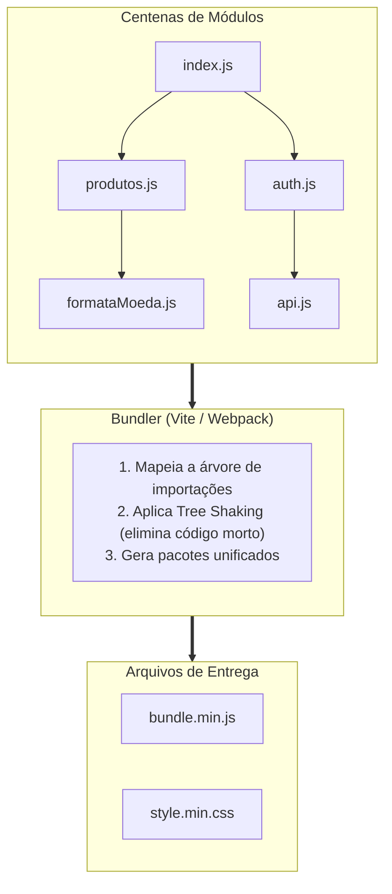
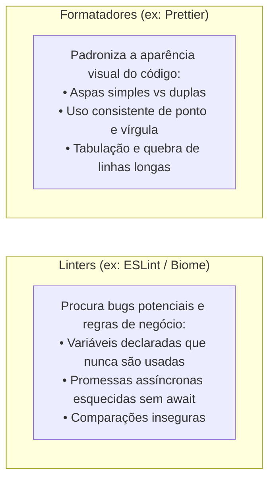

# 4. O Pipeline Moderno da Web

Até este ponto, estabelecemos dois fatos fundamentais:

1. Os navegadores web são projetados para interpretar apenas **HTML, CSS e
   JavaScript padrão**;
2. Os desenvolvedores modernos preferem programar utilizando **TypeScript,
   divisão em dezenas de arquivos, sintaxes modernas e bibliotecas externas**.

Isso cria um aparente paradoxo: como o código moderno que escrevemos no nosso
editor se transforma em algo leve, rápido e universalmente compreensível por
qualquer navegador no mundo?

A resposta está no **Pipeline de Construção** (_Build Pipeline_) — uma
verdadeira linha de montagem automatizada que processa, otimiza e empacota nosso
software antes de enviá-lo para produção.

Neste capítulo, vamos compreender o papel dos quatro pilares dessa linha de
montagem: **Transpiladores, Minificadores, Bundlers e Linters**.

## A Linha de Montagem da Web

Imagine uma fábrica de automóveis: as peças brutas de metal e componentes
eletrônicos entram de um lado e, após passarem por solda, pintura, montagem e
inspeção de qualidade, o carro sai pronto e polido para a pista.

No desenvolvimento web moderno, o processo é idêntico:


Vamos analisar detalhadamente o que cada uma dessas etapas faz e por que ela é
indispensável.

## 1. Transpiladores: A Ponte da Compatibilidade

Um **Transpilador** (_Source-to-Source Compiler_) é um tradutor de linguagens:
ele recebe código-fonte escrito em uma linguagem ou sintaxe avançada e o
transforma em código-fonte em outra linguagem compatível.


### Por Que Precisamos de Transpilação?

- **Suporte a Novas Funcionalidades:** Recursos recém-lançados na especificação
  do JavaScript podem levar anos até estarem disponíveis em todos os navegadores
  antigos. O transpilador converte essas novidades para equivalentes clássicos
  que funcionam em qualquer lugar;
- **Supersets e Extensões:** O navegador não sabe o que é uma anotação de tipo
  do TypeScript nem o que é a sintaxe JSX do React. O transpilador remove os
  tipos e converte as marcações visuais em chamadas normais de funções
  JavaScript.

> **Exemplos no Mercado:**
>
> - **TSC (_TypeScript Compiler_):** O compilador oficial da Microsoft;
> - **Babel:** O pioneiro na evolução do JavaScript moderno;
> - **SWC / esbuild:** Ferramentas modernas escritas em Rust e Go, capazes de
>   transpilar código até 20 vezes mais rápido que ferramentas antigas.

## 2. Minificadores: Cortando Cada Byte Desnecessário

Na Web, **desempenho é uma métrica de experiência do usuário**. Quanto mais
pesados forem os arquivos baixados pelo navegador, mais tempo a tela do usuário
demora para abrir em conexões móveis (3G/4G).

O papel do **Minificador** é eliminar qualquer caractere do arquivo que seja
útil apenas para humanos, mas irrelevante para a máquina:

- Remove todos os espaços em branco, quebras de linha e comentários;
- Encurta nomes de variáveis e funções locais para apenas uma ou duas letras.

### Veja o Efeito da Minificação

```javascript
// 📄 Código Original Legível (Para Humanos)
function calcularDescontoEstudante(precoOriginal, percentualDesconto) {
  // Aplica o desconto de estudante sobre o valor
  const valorFinal = precoOriginal - precoOriginal * (percentualDesconto / 100);
  return valorFinal;
}
```

Após passar pelo minificador, o código resultante é entregue ao navegador assim:

<!-- prettier-ignore -->
```javascript
// 🗜️ Código Minificado (Para a Máquina)
function a(b,c){return b-b*(c/100);}
```

Ambos os códigos executam exatamente o mesmo cálculo com a mesma precisão, mas o
arquivo minificado chega a ser **70% a 80% menor** para trafegar pela rede.

## 3. Bundlers (Empacotadores): Organizando o Caos

Em projetos reais, nós dividimos nossa aplicação em dezenas ou centenas de
arquivos modulares para manter o código limpo e organizado.

No entanto, se o navegador precisasse fazer 200 requisições HTTP individuais
para baixar 200 pequenos arquivos `.js` separados, a aplicação ficaria
extremamente lenta devido à latência de rede.

O **Bundler** (_Empacotador_) resolve esse problema:



### O Que o Bundler Faz?

1. **Grafo de Dependências:** Começa pelo arquivo principal (`index.js`) e
   mapeia todas as conexões de `import` e `export`;
2. **Otimização de Pacotes (_Chunks_):** Junta os arquivos relacionados em um ou
   poucos arquivos consolidados (`bundle.js`);
3. **Resolução de Assets:** Permite importar imagens, fontes e arquivos de
   estilo diretamente dentro do código JavaScript.

> **Exemplos no Mercado:**
>
> - **Webpack:** O grande pioneiro e veterano que consolidou a era das SPAs
>   (_Single Page Applications_);
> - **Vite:** O padrão moderno adotado pela comunidade (que utilizaremos quando
>   chegarmos ao módulo de React), famoso por inicialização instantânea e
>   atualização em milissegundos (_Hot Module Replacement_);
> - **Rollup / Turbopack:** Empacotadores modernos focados em bibliotecas e alta
>   velocidade.

<details>
<summary>🔍 Aprofundamento: O que é a técnica de Tree Shaking?</summary>

Imagine uma árvore cheia de folhas secas. Se você chacoalhar o tronco com força,
apenas as folhas mortas caem, enquanto as folhas vivas e saudáveis permanecem
presas aos galhos.

No mundo dos Bundlers, **Tree Shaking** é o processo de analisar quais funções
de uma biblioteca realmente foram utilizadas pelo seu projeto, descartando todo
o resto na hora de gerar o arquivo final.

Se você importar apenas uma função de formatação de datas de uma biblioteca
gigantesca de 500 KB:

```javascript
import { fmtDate } from "date-library";
```

O Bundler com _Tree Shaking_ incluirá **apenas** os 2 KB da função `fmtDate` no
seu pacote final, jogando os outros 498 KB fora. Isso economiza megabytes de
download para os usuários.

</details>

## 4. Linters e Formatadores: Guardiões da Qualidade

Enquanto transpiladores e bundlers preparam o código para a máquina, os
**Linters e Formatadores** cuidam da sanidade e da disciplina do time de
desenvolvedores.



Eles analisam o código estaticamente no próprio VS Code antes mesmo de você
rodar o programa, apontando sublinhados vermelhos ou amarelos para corrigir
problemas imediatamente.

## Resumo dos Papéis na Linha de Montagem

| Etapa                    | Ferramentas Populares      | Qual é o Papel Principal?                                                      |
| :----------------------- | :------------------------- | :----------------------------------------------------------------------------- |
| **Transpilação**         | `tsc`, Babel, SWC, esbuild | Traduzir linguagens modernas e supersets (TypeScript) para JS puro compatível. |
| **Minificação**          | Terser, esbuild            | Reduzir o peso dos arquivos removendo caracteres dispensáveis.                 |
| **Bundling**             | Vite, Webpack, Rollup      | Agrupar centenas de módulos em pacotes enxutos e otimizados para a rede.       |
| **Linting & Formatação** | ESLint, Prettier, Biome    | Manter a qualidade, prevenção de erros e estilo consistente do código.         |

> **Checkpoint:**
>
> Relacione cada ferramenta com o seu papel principal na linha de montagem:
>
> 1. Traduzir TypeScript e JSX para JavaScript padrão.
> 2. Juntar múltiplos arquivos e dependências em pacotes otimizados.
> 3. Encurtar nomes de variáveis e remover espaços para diminuir o tamanho do
>    arquivo.
> 4. Alertar sobre variáveis esquecidas e código mal estruturado.

## O Que Vem a Seguir?

Agora você já compreende como a engrenagem da Web funciona por trás dos panos:
temos runtimes, gerenciadores de pacotes e uma linha de montagem pronta para
transformar código de alto nível em arquivos eficientes para o navegador.

Isso nos leva ao protagonista da nossa trilha principal:

> _"Por que o JavaScript dinâmico tradicional se torna tão difícil de manter em
> projetos médios e grandes, e como o TypeScript resolve essa dor adicionando
> tipagem estática?"_

No próximo capítulo, vamos entender **O Que É o TypeScript e Por Que Ele
Existe**.

---

<a href="03-gerenciadores-de-pacotes.md">← Gerenciadores de Pacotes e o
Ecossistema NPM</a>

<p align="right"><a href="05-o-que-e-typescript-e-por-que-ele-existe.md">Próximo: O Que É o TypeScript e Por Que Ele Existe? →</a></p>
