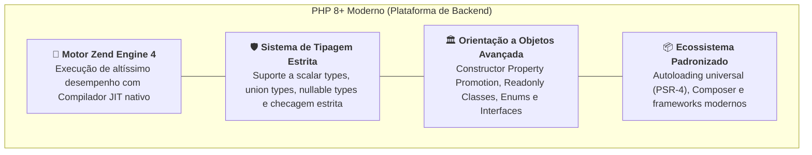
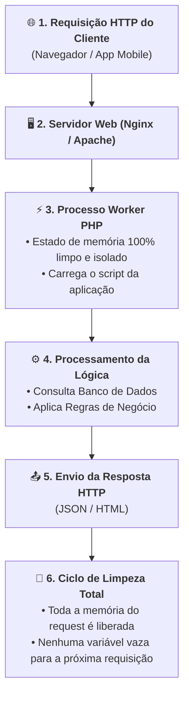

# 01. O Que É o PHP e o Modelo de Execução Web?

Quando navegamos pela internet, interagimos com centenas de serviços todos os
dias: lojas virtuais, portais de notícias, plataformas de ensino, painéis
financeiros e redes sociais. Nos bastidores de uma parcela gigantesca desses
sistemas em todo o planeta — movimentando bilhões de requisições diárias —,
opera uma das tecnologias de backend mais consolidadas e resilientes da história
da computação: o **PHP**.

Mas para compreender o verdadeiro poder dessa linguagem no cenário atual,
precisamos dar um passo atrás e responder a perguntas fundamentais: **que dor
arquitetural o PHP resolveu na criação da Web dinâmica, como ele superou os
desafios do código legado e por que a sua arquitetura de execução continua sendo
uma das mais produtivas e seguras da indústria?**

Neste capítulo, vamos compreender a evolução do ecossistema, os pilares do **PHP
8+ moderno** e o funcionamento do modelo de execução que dita as regras do jogo
no servidor.

## A Dor: O Caos da Web Primitiva e os Desafios do Passado

Nos primórdios da World Wide Web, nos anos 1990, os servidores entregavam apenas
páginas estáticas em HTML puro. Quando surgiu a necessidade de gerar páginas
dinâmicas (como ler dados de um formulário ou consultar um banco de dados), a
solução padrão da época era o uso de scripts **CGI** (_Common Gateway
Interface_), frequentemente escritos em C ou Perl.

Essa abordagem sofria de três problemas graves:

1. **Alto Custo de Recursos:** Cada visitante que acessava o site disparava um
   processo pesado e completo no sistema operacional do servidor, consumindo
   memória e derrubando máquinas facilmente sob tráfego moderado;
2. **Complexidade Excessiva de Código:** Manipular parâmetros HTTP, cabeçalhos e
   montar saídas de texto exigia dezenas de linhas de código de baixo nível;
3. **Falta de Padronização:** Não existia uma forma nativa e elegante de
   conectar a lógica do servidor diretamente ao protocolo HTTP da Web.

Em 1994, Rasmus Lerdorf criou uma série de utilitários em C para resolver essa
dor prática em seu próprio site pessoal, dando origem ao embrião do PHP
(_Personal Home Page Tools_, posteriormente renomeado para o acrônimo recursivo
_PHP: Hypertext Preprocessor_).

### O Estigma do Código Legado

Com o crescimento meteórico da linguagem nas décadas de 1990 e 2000, o PHP
democratizou a criação de sites no mundo inteiro. No entanto, sua extrema
permissividade inicial gerou problemas sérios em projetos corporativos da época:

- **Código Espaguete:** A facilidade de misturar lógica de negócio, comandos SQL
  e tags HTML no mesmo arquivo resultava em arquivos ilegíveis e impossíveis de
  manter;
- **Tipagem Fraca Excessiva:** Erros de digitação e coerções silenciosas de
  tipos causavam falhas imprevisíveis que só estouravam em produção.

Veja a diferença entre um código vulnerável do passado e o padrão profissional
adotado hoje:

```php
<?php
// ❌ CÓDIGO LEGADO (PHP 4/5): Sem tipagem, sem validação e vulnerável
$productId = $_GET['id'];
$discount = $_GET['discount'];

// Coerções implícitas perigosas e falta de tratamento
$finalPrice = $productId * 50 - $discount;

echo "<div>Preço: " . $finalPrice . "</div>";
```

No exemplo legado acima, se o usuário enviar parâmetros inválidos ou strings
arbitrárias, o script tenta realizar operações matemáticas sem validação,
gerando cálculos corrompidos ou erros silenciosos.

## A Solução: O PHP 8+ Moderno

O PHP passou por uma reformulação profunda em sua engenharia interna. Com o
lançamento das versões 7 e, especialmente, da família **PHP 8.x**, a linguagem
se transformou em uma plataforma robusta de nível corporativo:



Hoje, o desenvolvimento profissional em PHP apoia-se em **tipagem declarativa**,
**orientação a objetos madura** e **separação estrita de camadas**:

```php
<?php
declare(strict_types=1);

// ✅ PHP 8+ MODERNO: Tipagem forte, imutabilidade e boas práticas de arquitetura
final readonly class Product
{
    public function __construct(
        public int $id,
        public string $name,
        public float $price,
    ) {}

    public function applyDiscount(float $percentage): float
    {
        if ($percentage < 0 || $percentage > 100) {
            throw new InvalidArgumentException("Percentual de desconto inválido.");
        }

        return $this->price * (1 - ($percentage / 100));
    }
}

$product = new Product(id: 42, name: "Teclado Mecânico", price: 350.0);
$discountedPrice = $product->applyDiscount(percentage: 10.0);

echo $discountedPrice; // 315
```

## O Modelo de Execução: A Filosofia _Shared-Nothing_

Uma das características mais fascinantes e determinantes do PHP é o seu modelo
arquitetural de execução, conhecido na engenharia de software como
**Shared-Nothing** (_nada compartilhado entre requisições_).

Na maioria dos servidores de aplicação tradicionais, o programa principal é
iniciado uma única vez e permanece vivo na memória do servidor indefinidamente,
atendendo a todas as requisições concorrentes dentro do mesmo espaço de memória.
Se uma requisição vazar memória ou corromper um objeto global, todas as próximas
requisições sofrerão as consequências.

O PHP funciona de maneira diferente por padrão:



### Por Que Esse Modelo É Tão Poderoso?

1. **Zero Contaminação de Memória (_Memory Leak Free_):** Como toda a memória
   alocada durante uma requisição é destruída imediatamente após a resposta ser
   enviada ao cliente, vazamentos de memória comuns em processos persistentes
   são naturalmente neutralizados;
2. **Isolamento Total de Falhas:** Se o código disparar um erro fatal ao atender
   um usuário específico, apenas aquele processo isolado é finalizado. O
   servidor continua funcionando perfeitamente para todos os outros milhares de
   usuários simultâneos;
3. **Simplicidade de Implantação (_Deploy_ Descomplicado):** Como o estado não
   fica preso na memória do processo entre requisições, atualizar a aplicação em
   produção pode ser tão simples quanto atualizar os arquivos em disco, sem a
   obrigatoriedade de reiniciar servidores complexos.

## Comparativo: PHP Legado vs PHP Moderno

| Aspecto                           | PHP Legado (Versões 4 / 5)         | PHP 8+ Moderno                                      |
| :-------------------------------- | :--------------------------------- | :-------------------------------------------------- |
| **Sistema de Tipos**              | Fraco e puramente implícito        | Estrito, declarativo e com suporte a `strict_types` |
| **Paradigma**                     | Procedural misturado com HTML      | Orientado a Objetos moderno e modular               |
| **Recursos de Linguagem**         | Sintaxe verbosa e permissiva       | Constructor Promotion, Enums, Match, Readonly       |
| **Performance**                   | Interpretação clássica por passos  | Zend Engine otimizado, OPcache e Compilador JIT     |
| **Gerenciamento de Dependências** | Inclusão manual com `require_once` | Autoloading PSR-4 automatizado via Composer         |

<details>
<summary>🔍 Aprofundamento Técnico: Como o OPcache e o JIT aceleram o PHP por baixo dos panos?</summary>

Se o PHP reinicia o ciclo de execução a cada requisição, você pode se perguntar:
_"O servidor precisa ler o arquivo do disco e reinterpretar o código linha por
linha toda vez que alguém acessa a página?"_

Historicamente sim, mas nos ambientes modernos isso é resolvido com maestria por
duas camadas internas:

1. **OPcache (Cache de Opcodes):** Na primeira vez em que um arquivo `.php` é
   executado, o motor Zend o compila para uma representação intermediária em
   memória chamada **Opcodes** (instruções de baixo nível da máquina virtual do
   PHP). O OPcache armazena esse bytecode na memória RAM compartilhada do
   servidor. Nas requisições seguintes, o arquivo não precisa mais ser lido do
   disco nem analisado gramaticalmente: o motor executa diretamente os opcodes
   da memória;
2. **Compilador JIT (_Just-In-Time_):** Introduzido no PHP 8, o JIT vai ainda
   além. Ele monitora quais trechos de opcode são executados com altíssima
   frequência e os compila diretamente para **código binário de máquina da
   CPU**, executando cálculos intensivos na velocidade nativa do hardware.

Com isso, o PHP une o melhor dos dois mundos: o **isolamento seguro** da
arquitetura _Shared-Nothing_ com a **velocidade** de linguagens compiladas.

</details>

## O Que Vem a Seguir?

Agora que você compreende **o que é o PHP moderno**, sua evolução arquitetural e
a solidez do seu modelo de execução no servidor, precisamos preparar as
ferramentas de trabalho.

> _"Como configurar o interpretador PHP no nosso computador e executar nossos
> primeiros scripts sem depender de servidores web complexos?"_

No **[Capítulo 02: Configuração do Ambiente PHP e
CLI](02-configuracao-do-ambiente-php-e-cli.md)**, vamos instalar o interpretador
oficial, explorar a interface de linha de comando (`php -v`, `php -r`) e
conhecer o servidor de desenvolvimento embutido (`php -S`) para iniciar nossos
experimentos práticos.

---

<p align="right"><a href="02-configuracao-do-ambiente-php-e-cli.md">Próximo: Configuração do Ambiente PHP e CLI →</a></p>
