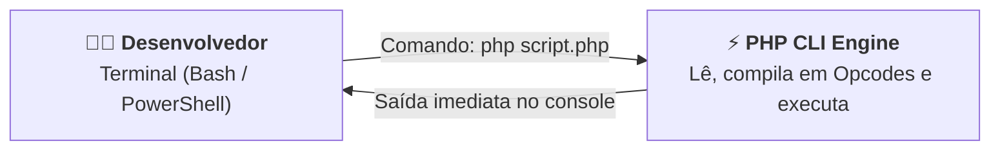
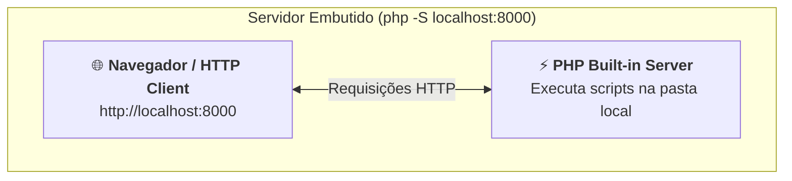
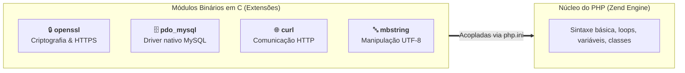

# 02. Configuração do Ambiente PHP e o Terminal (CLI)

No capítulo anterior, compreendemos o que é o PHP moderno, sua evolução
histórica e o modelo arquitetural _Shared-Nothing_, no qual cada requisição é
atendida de forma isolada e limpa.

Agora, precisamos dar o próximo passo prático: **como instalar o interpretador
na nossa máquina, executar nossos primeiros programas diretamente pelo terminal
e testar uma aplicação web sem a necessidade de instalar servidores pesados ou
configurações complexas?**

Neste capítulo, vamos desmistificar o ambiente de execução do PHP, dominar a sua
Interface de Linha de Comando (**CLI**), entender as regras essenciais da
anatomia de um arquivo `.php` e utilizar o **servidor de desenvolvimento
embutido** nativo da linguagem.

## A Dor: O Fantasma das Instalações Complexas do Passado

Historicamente, muitos estudantes tinham seu primeiro contato com o PHP por meio
de pacotes agregadores de terceiros (como XAMPP ou WampServer), que instalavam
simultaneamente o servidor web Apache, o banco de dados MySQL e o interpretador
PHP.

Embora úteis em sua época, essa abordagem trazia dores significativas para quem
estava aprendendo:

1. **Confusão entre a Linguagem e o Servidor:** O estudante frequentemente não
   sabia se um erro de configuração pertencia ao Apache, às permissões de pasta
   do sistema operacional ou à sintaxe do PHP em si;
2. **Prisão ao Diretório Raiz (_htdocs_):** Os projetos precisavam ser salvos
   obrigatoriamente dentro de pastas fixas e restritas de instalação do servidor
   web;
3. **Falta de Domínio do Terminal:** O desenvolvedor dependia de painéis com
   botões visuais para iniciar e parar serviços, sem compreender o binário da
   linguagem.

O ecossistema profissional moderno funciona de forma diferente: o PHP é um
**binário independente** que você pode executar em qualquer diretório da sua
máquina através do terminal de linha de comando.

## Como Instalar e Configurar o PHP na Sua Máquina

Para começar a programar, você precisa ter o binário do **PHP 8.2+ ou 8.3+**
instalado e registrado nas variáveis de ambiente do seu sistema operacional.

Escolha as instruções de acordo com o seu sistema:

### 1. No Windows

A forma mais rápida e moderna é utilizar o gerenciador de pacotes nativo do
Windows (**winget**) pelo PowerShell:

```powershell
# Instala a versão estável mais recente do PHP
winget install PHP.PHP.8.3
```

> **Instalação Manual Alternativa (sem gerenciador de pacotes):**
>
> 1. Baixe a versão _VS16 x64 Non Thread Safe (NTS)_ do site oficial
>    `windows.php.net/download`;
> 2. Descompacte os arquivos em uma pasta simples, como `C:\php`;
> 3. Adicione o caminho `C:\php` à variável de ambiente **`Path`** do seu
>    Windows (busque por _"Editar as variáveis de ambiente do sistema"_ no menu
>    Iniciar);
> 4. Reinicie o seu terminal ou VS Code.

### 2. No Linux (Ubuntu / Debian / WSL)

No terminal do Linux (ou no subsistema WSL do Windows), instale o interpretador
e as extensões fundamentais via `apt`:

```bash
sudo apt update
sudo apt install php-cli php-mbstring php-xml php-curl php-zip
```

### 3. No macOS

No macOS, a forma padrão e mais prática é utilizar o **Homebrew**:

```bash
brew install php
```

### 4. Configuração Recomendada no VS Code

Para obter autocompletar inteligente, realce de erros em tempo real e
documentação enquanto você digita no VS Code, recomendamos instalar a extensão:

- **PHP Intelephense** (de _Ben Mewburn_): o servidor de linguagem mais rápido e
  preciso para desenvolvimento moderno em PHP.

## O Interpretador PHP e a Linha de Comando (CLI)

O interpretador oficial do PHP fornece uma interface de terminal conhecida como
**PHP CLI** (_Command Line Interface_).



Com o PHP CLI instalado, o seu terminal passa a reconhecer o comando `php`.
Podemos validar a versão ativa e verificar se temos o PHP 8 instalado
executando:

```bash
php -v
```

**Exemplo de saída esperada:**

```text
PHP 8.3.6 (cli) (built: Apr 15 2024 18:00:00) (NTS)
Copyright (c) The PHP Group
Zend Engine v4.3.6, Copyright (c) Zend Technologies
    with Zend OPcache v8.3.6, Copyright (c), by Zend Technologies
```

### Comandos Essenciais do Terminal

A ferramenta de linha de comando possui parâmetros utilitários valiosos para o
cotidiano de desenvolvimento:

| Comando  | Finalidade                                                                | Exemplo de Uso                    |
| :------- | :------------------------------------------------------------------------ | :-------------------------------- |
| `php -v` | Exibe a versão instalada do interpretador e do motor Zend                 | `php -v`                          |
| `php -m` | Lista todos os módulos e extensões compiladas ativas                      | `php -m`                          |
| `php -r` | Executa um trecho de código PHP diretamente no terminal sem criar arquivo | `php -r "echo 'Teste rápido\n';"` |
| `php -l` | Executa uma checagem de sintaxe (_lint_) no arquivo sem rodá-lo           | `php -l app.php`                  |
| `php -S` | Inicia o servidor web de desenvolvimento embutido                         | `php -S localhost:8000`           |

## Anatomia de um Arquivo PHP

Todo arquivo contendo código PHP precisa indicar ao interpretador onde as
instruções da linguagem começam. Isso é feito por meio da **tag de abertura**:
`<?php`.

Crie um arquivo chamado `index.php` com o seguinte conteúdo:

```php
<?php

$applicationName = "FATEC Web App";
$currentYear = 2026;

echo "Bem-vindo ao " . $applicationName . " (" . $currentYear . ")!\n";
```

Para executar esse script no terminal, basta navegar até a pasta onde ele está
salvo e rodar:

```bash
php index.php
```

### A Regra de Ouro: Por Que NÃO Fechar a Tag (`?>`)?

Em arquivos de código PHP puro (como classes, funções, serviços e scripts de
backend), **é uma convenção mandatória da indústria omitir a tag de fechamento
`?>` no final do arquivo**.

Veja o contraste e a justificativa técnica:

```php
<?php
// ❌ CÓDIGO PROBLEMÁTICO: Fechar a tag em arquivos de backend puro
function getStatus(): string
{
    return "ONLINE";
}
?>

<!-- Espaços em branco invisíveis ou quebras de linha após o fechamento -->
```

```php
<?php

// ✅ PADRÃO MODERNO: Deixar o arquivo aberto no final
function getStatus(): string
{
    return "ONLINE";
}
```

> **Por que isso acontece?**
>
> Quando o interpretador encontra a tag de fechamento `?>`, ele assume que tudo
> o que vem depois dela (inclusive espaços em branco invisíveis ou quebras de
> linha causadas pelo editor) deve ser enviado diretamente como texto bruto na
> resposta HTTP.
>
> Se esses espaços forem enviados antes de você definir cabeçalhos HTTP, cookies
> ou redirecionamentos, a aplicação quebrará com o erro fatal:  
> `Warning: Cannot modify header information - headers already sent`.
>
> Ao omitir a tag `?>`, o PHP descarta automaticamente qualquer espaço em branco
> final, protegendo sua aplicação contra esse bug silencioso.

## O Servidor Web Embutido (`php -S`)

Durante o desenvolvimento local de APIs e aplicações web, você não precisa
configurar servidores complexos como Nginx ou Apache. O PHP possui um **servidor
web nativo de desenvolvimento** integrado diretamente ao executável.



### Como Iniciar o Servidor

Abra o terminal no diretório do seu projeto e execute:

```bash
php -S localhost:8000
```

O terminal exibirá a mensagem de inicialização e ficará escutando requisições:

```text
[Sun Sep 20 00:00:00 2026] PHP 8.3.6 Development Server (http://localhost:8000) started
```

Ao abrir o endereço `http://localhost:8000` no seu navegador, o PHP procurará
automaticamente um arquivo `index.php` na pasta atual e o executará, exibindo o
resultado na tela e registrando os logs de acesso em tempo real no console:

```text
[Sun Sep 20 00:00:05 2026] [200]: GET / - 127.0.0.1:52134
```

Para encerrar o servidor a qualquer momento, basta pressionar `Ctrl + C` no
terminal.

> **Regra de Uso do Servidor Embutido:**
>
> O servidor embutido (`php -S`) foi projetado **exclusivamente para testes e
> ambiente de desenvolvimento local**. Ele é monothread e atende a uma
> requisição por vez. Em servidores de produção com alto volume de acessos,
> utilizamos o gerenciador de processos **PHP-FPM** em conjunto com servidores
> reversos de alta performance (como Nginx).

<details>
<summary>🔍 Aprofundamento Técnico: O que são Extensões do PHP e o arquivo <code>php.ini</code>?</summary>

Para manter o interpretador leve e rápido, o núcleo do PHP não carrega tudo o
que existe no mundo da computação por padrão. Em vez disso, ele utiliza uma
arquitetura modular baseada em **Extensões** e regulada pelo arquivo de
configuração **`php.ini`**.

### O Que É uma Extensão no PHP?

Diferente de bibliotecas comuns de código (que você baixa para a pasta do seu
projeto), uma **extensão do PHP é um módulo binário compilado em C/C++** (um
arquivo `.dll` no Windows ou `.so` no Linux/macOS) que se acopla diretamente ao
motor interno do PHP (_Zend Engine_).

Ao ser ativada, a extensão adiciona **novas funções nativas, classes e
capacidades de baixo nível** ao interpretador com velocidade de hardware puro,
sem o custo de reescrever tudo em PHP.



### Como Elas São Ativadas no `php.ini`?

O arquivo **`php.ini`** é o painel de controle do PHP. É nele que definimos
limites de memória, relatórios de erros e quais extensões devem ser
inicializadas pelo interpretador.

Você pode descobrir qual `php.ini` está sendo utilizado na sua máquina rodando:

```bash
php --ini
```

Dentro desse arquivo de texto, você encontrará linhas que ativam ou desativam
extensões simplesmente removendo o ponto-e-vírgula (`;` é o caractere de
comentário no `php.ini`):

```ini
; Linha comentada = extensão desativada
;extension=openssl

; Linha sem ';' = extensão ATIVADA e carregada na memória
extension=openssl
extension=mbstring
extension=pdo_mysql
extension=curl
```

### As Quatro Extensões Fundamentais para a Web:

1. **`mbstring` (_Multibyte String_):** Permite medir e fatiar textos com
   acentos, caracteres especiais e emojis sem corromper bytes UTF-8;
2. **`openssl`:** Adiciona suporte nativo a algoritmos de criptografia, geração
   segura de chaves aleatórias e tráfego HTTPS;
3. **`pdo` e `pdo_mysql` / `pdo_pgsql`:** Fornece a camada de abstração de banco
   de dados e os drivers nativos de conexão segura com SQL;
4. **`curl`:** Permite que o seu servidor faça requisições HTTP para consumir
   APIs de terceiros (gateways de pagamento, serviços de CEP, etc.).

</details>

## O Que Vem a Seguir?

Agora que você tem o interpretador PHP pronto, domina a execução de scripts via
terminal e sabe inicializar o servidor de desenvolvimento embutido, temos todas
as fundações operacionais prontas.

A partir daqui, iniciaremos o **Bloco 2: Fundamentos, Tipos & Memória**.

> _"Como o PHP organiza seus tipos primitivos de dados e como declarar variáveis
> no PHP moderno?"_

No **[Capítulo 03: Tipos Primitivos Escalares](03-tipos-primitivos.md)**, vamos
mergulhar no sistema de tipos escalares (`int`, `float`, `string`, `bool`) e
compreender a representação de ausência com `null`.

---

<a href="01-o-que-e-php-e-o-modelo-de-execucao-web.md">← O Que É o PHP e o
Modelo de Execução Web?</a>

<p align="right"><a href="03-tipos-primitivos.md">Próximo: Tipos Primitivos Escalares →</a></p>
