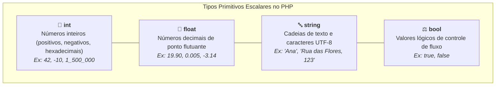

# 03. Tipos Primitivos e Tipagem Estrita

No capítulo anterior, preparamos o terreno: instalamos o interpretador PHP,
exploramos a linha de comando e inicializamos o servidor de desenvolvimento
embutido.

Agora, começamos a explorar a base da linguagem: o seu **sistema de tipos de
dados**.

No desenvolvimento de aplicações Web e APIs de backend, lidamos constantemente
com informações fundamentais: saldo de contas bancárias, identificadores de
pedidos, status de usuários e textos de autenticação. Para construir sistemas
robustos, precisamos entender com precisão como o PHP representa cada categoria
de dado na memória.

Neste capítulo, vamos explorar os **tipos primitivos (escalares)** do PHP,
compreender a representação de ausência com `null`, introduzir os tipos de união
e dominar a diretiva `declare(strict_types=1);` para blindar nossas funções
contra erros de coerção.

## Os Tipos Primitivos Escalares

No PHP, os dados mais básicos e atômicos são chamados de **tipos escalares**.
Eles representam valores numéricos, textuais e lógicos:



### 1. Inteiros (`int`)

O tipo `int` representa números inteiros, sejam eles positivos ou negativos. O
PHP permite o uso do caractere _underscore_ (`_`) como **separador visual de
milhar**, tornando valores grandes muito mais legíveis sem alterar o número:

```php
<?php
$userCount = 1_500_000; // Inteiro legível (1 milhão e meio)
$temperature = -8;      // Inteiro negativo
$binaryValue = 0b1010;  // Notação binária (valor decimal: 10)
$hexColor = 0xFF;       // Notação hexadecimal (valor decimal: 255)
```

### 2. Ponto Flutuante (`float`)

O tipo `float` (também conhecido historicamente como `double`) representa
números reais com casas decimais:

```php
<?php
$productPrice = 99.90;
$averageRating = 4.85;
$exchangeRate = 0.0034;
```

### 3. Textos (`string`)

Representa cadeias de caracteres e textos codificados (como UTF-8). Pode ser
delimitado por aspas simples (`'`) ou aspas duplas (`"`):

```php
<?php
$courseName = "Desenvolvimento Web";
$institution = 'FATEC';

$welcomeText = $courseName . " na " . $institution;
```

### 4. Booleanos (`bool`)

Representa valores lógicos fundamentais para tomada de decisões: exclusivamente
`true` ou `false` (escritos em minúsculas):

```php
<?php
$isActive = true;
$hasPendingInvoice = false;

$canAccess = $isActive && !$hasPendingInvoice;
```

## Ausência de Valor: O Tipo Especial `null`

Além dos quatro tipos escalares, o PHP fornece o tipo especial **`null`**, que
representa uma variável deliberadamente sem valor ou ainda não preenchida:

```php
<?php
$deliveryAddress = null; // Cliente ainda não cadastrou o endereço
```

### Tipos Nullable (`?Tipo`)

Em muitas situações reais, um dado pode ser opcional. Quando você precisa
indicar que um valor guardado, recebido ou retornado em algum ponto do sistema
pode conter um tipo específico **ou** `null`, utiliza-se o prefixo de
interrogação `?`:

```php
<?php
// Aceita uma string OU null
function formatGreeting(?string $userName): string
{
    if ($userName === null) {
        return "Olá, visitante!";
    }

    return "Olá, " . $userName . "!";
}

echo formatGreeting("Mariana"); // "Olá, Mariana!"
echo formatGreeting(null);      // "Olá, visitante!"
```

## Tipos de União (_Union Types_: `TipoA|TipoB`)

A partir do PHP 8.0, podemos expressar contratos mais flexíveis sem abrir mão da
segurança. Quando um determinado valor pode pertencer a mais de uma categoria
válida (por exemplo, aceitar tanto números inteiros quanto números decimais),
unimos os tipos com uma barra vertical (`|`):

```php
<?php
// Aceita inteiros OU decimais
function calculateDiscount(int|float $basePrice, float $percentage): float
{
    return $basePrice * (1 - ($percentage / 100));
}

echo calculateDiscount(100, 10.0);   // 90.0 (usando int)
echo calculateDiscount(99.50, 10.0); // 89.55 (usando float)
```

## A Dor da Coerção Implícita e a Solução: `declare(strict_types=1);`

Agora que conhecemos os tipos, surge um detalhe crucial sobre como o PHP se
comporta ao receber argumentos em funções.

Por padrão histórico, o PHP opera em **modo coercivo (fraco)**. Se uma função
espera um `int` e recebe a string `"5"`, o interpretador tenta "adivinhar" e
converte o valor automaticamente:

```php
<?php
// ❌ MODO PADRÃO (Coerção implícita fraca): Silencioso e perigoso
function processPayment(int $userId, float $amount): string
{
    return "Pagamento de R$ " . $amount . " processado para o usuário " . $userId;
}

// O PHP converte silenciosamente a string "42" para o int 42:
echo processPayment("42", 150.0);
```

### Por Que a Coerção Implícita É Perigosa?

1. **Erros Mascarados:** Se um formulário enviar o booleano `true` onde se
   esperava um número, o PHP o converterá para `1` sem emitir alerta;
2. **Perda Silenciosa de Precisão:** Decimais passados para parâmetros inteiros
   são truncados (`19.99` vira `19`), causando divergências contábeis;
3. **Falhas Tarde Demais:** O erro não explode na entrada da função, mas sim
   muito depois, quando os dados já foram salvos incorretamente no banco.

### A Solução: Ativando a Tipagem Estrita

Para eliminar esse comportamento permissivo e garantir que os tipos sejam
respeitados rigorosamente, o PHP moderno disponibiliza a diretiva
**`declare(strict_types=1);`**.

Ao adicionar essa instrução na primeiríssima linha do arquivo, o interpretador
rejeita qualquer dado cujo tipo não coincida exatamente com a assinatura:

```php
<?php
declare(strict_types=1);

// ✅ MODO ESTRITO: Rigor e segurança total em tempo de execução
function processPayment(int $userId, float $amount): string
{
    return "Pagamento de R$ " . $amount . " processado para o usuário " . $userId;
}

// Tentativa de passar string em parâmetro int:
echo processPayment("42", 150.0);
// 💥 Fatal Error: Uncaught TypeError: processPayment(): Argument #1 ($userId) must be of type int, string given
```

> **A Regra de Ouro do PHP Profissional:**
>
> A diretiva `declare(strict_types=1);` deve ser a **primeiríssima linha** de
> todo arquivo `.php` moderno. Ela blinda o arquivo contra coerções silenciosas
> e faz com que qualquer incompatibilidade de tipo lance um `TypeError`
> imediato.

## Resumo dos Tipos Primitivos

| Tipo     | Descrição           | Exemplo de Valor          | Verificador Nativo |
| :------- | :------------------ | :------------------------ | :----------------- |
| `int`    | Números inteiros    | `42`, `-100`, `1_500_000` | `is_int($val)`     |
| `float`  | Números decimais    | `3.1415`, `99.90`         | `is_float($val)`   |
| `string` | Textos e caracteres | `"FATEC"`, `'Web'`        | `is_string($val)`  |
| `bool`   | Valores lógicos     | `true`, `false`           | `is_bool($val)`    |
| `null`   | Ausência de valor   | `null`                    | `is_null($val)`    |

<details>
<summary>🔍 Aprofundamento Técnico: Como o PHP armazena variáveis na memória (ZVALs)?</summary>

Internamente no motor Zend (escrito em C), toda variável do PHP é representada
por uma estrutura de memória chamada **`zval`** (_Zend Value_).

Uma `zval` contém dois campos fundamentais:

1. **`value`:** O dado binário bruto (o número, o ponteiro de texto ou a tabela
   de memória);
2. **`type_info`:** Uma etiqueta numérica indicando o tipo daquele dado
   (`IS_LONG`, `IS_DOUBLE`, `IS_STRING`, `IS_TRUE`, `IS_FALSE`, `IS_NULL`).

Quando `strict_types=1` está ativado, o motor compara diretamente a etiqueta
`type_info` do argumento recebido com o tipo exigido pela assinatura antes de
executar o código. Havendo incompatibilidade, a execução é abortada na hora com
um `TypeError`, impedindo que dados inconsistentes transitem pelo sistema.

</details>

## O Que Vem a Seguir?

Com o catálogo de tipos primitivos dominado e a garantia de segurança do
`declare(strict_types=1);`, podemos nos aprofundar no tipo de dado mais
utilizado na comunicação Web: o texto.

> _"Como o PHP diferencia aspas simples de aspas duplas, como funciona a
> interpolação `"{$var}"` e como manipular textos de forma segura com as
> funções nativas `str`?"_

No **[Capítulo 04: Strings e Interpolação](04-strings-e-interpolacao.md)**,
vamos desvendar todos os segredos da formatação e manipulação de textos no PHP
moderno.

---

<a href="02-configuracao-do-ambiente-php-e-cli.md">← Configuração do Ambiente
PHP e o Terminal (CLI)</a>

<p align="right"><a href="04-strings-e-interpolacao.md">Próximo: Strings e Interpolação →</a></p>
