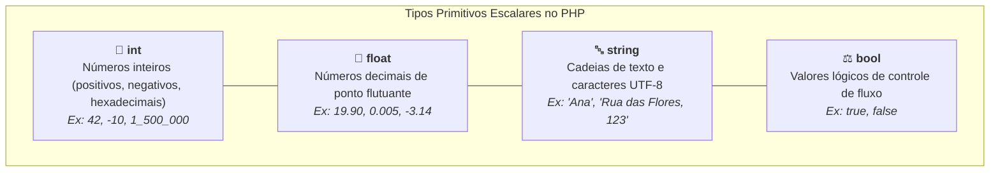

# 03. Tipos Primitivos Escalares

No capítulo anterior, preparamos o terreno: instalamos o interpretador PHP,
exploramos a linha de comando e inicializamos o servidor de desenvolvimento
embutido.

Agora, começamos a explorar a base da linguagem: o seu **sistema de tipos de
dados**.

No desenvolvimento de aplicações Web e APIs de backend, lidamos constantemente
com informações fundamentais: saldo de contas bancárias, identificadores de
pedidos, status de usuários e textos de autenticação. Para construir sistemas
robustos, precisamos entender com precisão como o PHP representa cada categoria
de dado na memória.

Neste capítulo, vamos explorar os **tipos primitivos (escalares)** do PHP e
compreender a representação de ausência com o tipo especial `null`.

## Os Tipos Primitivos Escalares

No PHP, os dados mais básicos e atômicos são chamados de **tipos escalares**.
Eles representam valores numéricos, textuais e lógicos:



### 1. Inteiros (`int`)

O tipo `int` representa números inteiros, sejam eles positivos ou negativos. O
PHP permite o uso do caractere _underscore_ (`_`) como **separador visual de
milhar**, tornando valores grandes muito mais legíveis sem alterar o número:

```php
<?php

$userCount = 1_500_000; // Inteiro legível (1 milhão e meio)
$temperature = -8;      // Inteiro negativo
$binaryValue = 0b1010;  // Notação binária (valor decimal: 10)
$hexColor = 0xFF;       // Notação hexadecimal (valor decimal: 255)
```

### 2. Ponto Flutuante (`float`)

O tipo `float` (também conhecido historicamente como `double`) representa
números reais com casas decimais:

```php
<?php

$productPrice = 99.90;
$averageRating = 4.85;
$exchangeRate = 0.0034;
```

### 3. Textos (`string`)

Representa cadeias de caracteres e textos codificados (como UTF-8). Pode ser
delimitado por aspas simples (`'`) ou aspas duplas (`"`):

```php
<?php

$courseName = "Desenvolvimento Web";
$institution = 'FATEC';

$welcomeText = $courseName . " na " . $institution;
```

### 4. Booleanos (`bool`)

Representa valores lógicos fundamentais para tomada de decisões: exclusivamente
`true` ou `false` (escritos em minúsculas):

```php
<?php

$isActive = true;
$hasPendingInvoice = false;

$canAccess = $isActive && !$hasPendingInvoice;
```

## Ausência de Valor: O Tipo Especial `null`

Além dos quatro tipos escalares, o PHP fornece o tipo especial **`null`**, que
representa uma variável deliberadamente sem valor ou ainda não inicializada:

```php
<?php

$deliveryAddress = null; // Cliente ainda não cadastrou o endereço
$discountCode = null;    // Nenhum cupom aplicado
```

O valor `null` é único e serve para indicar explicitamente que uma variável
existe na memória, mas não possui nenhum dado atribuído a ela.

## Resumo dos Tipos Primitivos

| Tipo     | Descrição           | Exemplo de Valor          | Verificador Nativo |
| :------- | :------------------ | :------------------------ | :----------------- |
| `int`    | Números inteiros    | `42`, `-100`, `1_500_000` | `is_int($val)`     |
| `float`  | Números decimais    | `3.1415`, `99.90`         | `is_float($val)`   |
| `string` | Textos e caracteres | `"FATEC"`, `'Web'`        | `is_string($val)`  |
| `bool`   | Valores lógicos     | `true`, `false`           | `is_bool($val)`    |
| `null`   | Ausência de valor   | `null`                    | `is_null($val)`    |

<details>
<summary>🔍 Aprofundamento Técnico: Como o PHP armazena variáveis na memória (ZVALs)?</summary>

Internamente no motor Zend (escrito em C), toda variável do PHP é representada
por uma estrutura de memória chamada **`zval`** (_Zend Value_).

Uma `zval` contém dois campos fundamentais:

1. **`value`:** O dado binário bruto (o número, o ponteiro de texto ou a tabela
   de memória);
2. **`type_info`:** Uma etiqueta numérica indicando o tipo daquele dado
   (`IS_LONG`, `IS_DOUBLE`, `IS_STRING`, `IS_TRUE`, `IS_FALSE`, `IS_NULL`).

Dessa forma, mesmo que o PHP seja uma linguagem de tipagem dinâmica para
variáveis soltas, internamente o interpretador rastreia a etiqueta exata do tipo
de cada valor alocado na memória.

</details>

## O Que Vem a Seguir?

Com o catálogo de tipos primitivos dominado, podemos nos aprofundar no tipo de
dado mais utilizado na comunicação Web: o texto.

> _"Como o PHP diferencia aspas simples de aspas duplas, como funciona a
> interpolação `"{$var}"` e como manipular textos de forma segura com as
> funções nativas `str`?"_

No **[Capítulo 04: Strings e Interpolação](04-strings-e-interpolacao.md)**,
vamos desvendar todos os segredos da formatação e manipulação de textos no PHP
moderno.

---

<a href="02-configuracao-do-ambiente-php-e-cli.md">← Configuração do Ambiente
PHP e o Terminal (CLI)</a>

<p align="right"><a href="04-strings-e-interpolacao.md">Próximo: Strings e Interpolação →</a></p>
