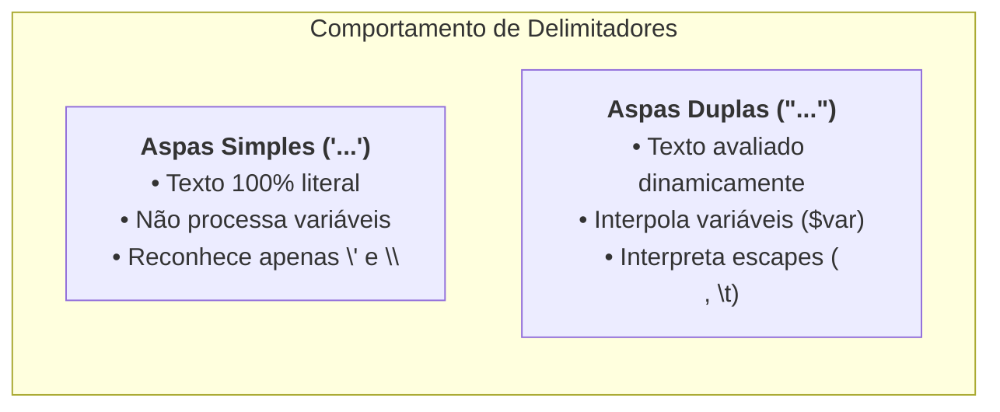
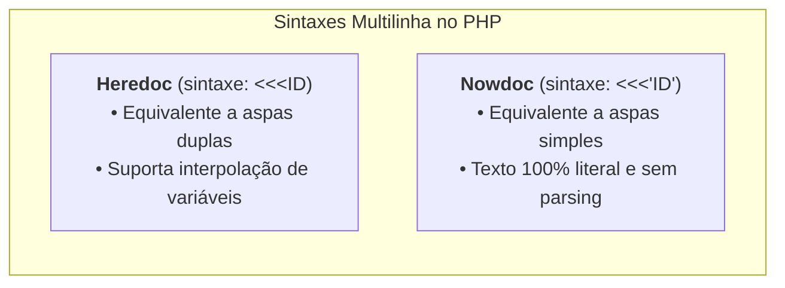

# 04. Strings e Interpolação

No desenvolvimento Web moderno, quase tudo o que trafega entre clientes e
servidores passa por texto: URLs, corpos de requisições JSON, consultas a bancos
de dados, cabeçalhos HTTP, e-mails e logs do sistema.

Dominar como o PHP manipula e formata cadeias de texto (**strings**) é essencial
para escrever código limpo, performático e seguro.

Mas você sabe qual é a real diferença técnica entre aspas simples e aspas
duplas? **Como montar mensagens complexas sem transformar o código em um
emaranhado ilegível de concatenações e quais são as funções modernas do PHP 8
para busca e transformação de texto?**

Neste capítulo, vamos compreender a distinção entre literais e interpolação,
dominar as sintaxes de textos multilinha (**Heredoc** e **Nowdoc**) e explorar
as principais funções nativas do ecossistema moderno.

## Aspas Simples vs Aspas Duplas

No PHP, uma string pode ser delimitada por aspas simples (`'`) ou por aspas
duplas (`"`). Embora ambas representem o tipo `string`, o comportamento do
interpretador é fundamentalmente diferente para cada uma:



### 1. Aspas Simples (`'...'`) — Texto Literal Puro

Tudo o que for escrito dentro de aspas simples é interpretado exatamente como
caractere literal. O PHP não perde tempo procurando variáveis dentro dela:

```php
<?php
declare(strict_types=1);

$course = "PHP 8";

// O símbolo de cifrão é tratado como texto puro:
echo 'Bem-vindo ao curso de $course!\n';
// Saída exata: Bem-vindo ao curso de $course!\n
```

### 2. Aspas Duplas (`"..."`) — Interpolação Dinâmica

Quando uma string é delimitada por aspas duplas, o PHP analisa o seu conteúdo,
substitui variáveis pelos seus respectivos valores (**interpolação**) e converte
sequências de escape (como `\n` para quebra de linha ou `\t` para tabulação):

```php
<?php
declare(strict_types=1);

$course = "PHP 8";

echo "Bem-vindo ao curso de $course!\n";
// Saída: Bem-vindo ao curso de PHP 8! (com quebra de linha real)
```

## A Sintaxe Segura de Interpolação: `{$variavel}`

Embora você possa escrever `$nome` diretamente dentro de aspas duplas, em
situações reais essa sintaxe pode causar ambiguidades quando o texto continua
imediatamente após a variável:

```php
<?php
declare(strict_types=1);

$item = "teclado";

// ❌ AMBÍGUO: O PHP tentará buscar uma variável chamada $item_novo
// echo "Comprei um $item_novo"; // Warning: Undefined variable $item_novo

// ✅ SINTAXE SEGURA COM CHAVES: Delimita explicitamente o nome da variável
echo "Comprei um {$item}_novo"; // Saída: Comprei um teclado_novo
```

A sintaxe com chaves `{$var}` é a **prática recomendada** na indústria: ela
torna a leitura do código inequívoca tanto para o interpretador quanto para os
desenvolvedores da sua equipe.

## Concatenação de Strings: O Operador Ponto (`.`)

Diferente de muitas linguagens que utilizam o operador de soma (`+`) para unir
textos, o PHP reserva o `+` exclusivamente para operações matemáticas. Para unir
duas ou mais strings, utilizamos o **operador ponto (`.`)**:

```php
<?php
declare(strict_types=1);

$firstName = "Carlos";
$lastName = "Eduardo";

// Concatenação simples:
$fullName = $firstName . " " . $lastName;

// Atribuição com concatenação (.=):
$logMessage = "[INFO] ";
$logMessage .= "Usuário autenticado com sucesso.";

echo $fullName;   // "Carlos Eduardo"
echo $logMessage; // "[INFO] Usuário autenticado com sucesso."
```

## Blocos de Texto Multilinha: Heredoc e Nowdoc

Quando precisamos escrever blocos extensos de texto (como templates HTML, corpos
de e-mails ou consultas SQL longas), quebrar strings manualmente com
concatenações e `\n` torna o código poluído.

Para resolver essa dor, o PHP fornece duas estruturas dedicadas para textos
multilinha:



### 1. Heredoc (Com Interpolação)

Iniciado por `<<<` seguido por um identificador (geralmente em maiúsculas, como
`HTML`, `SQL`, `TEXT`):

```php
<?php
declare(strict_types=1);

$customerName = "Beatriz";
$orderId = 1042;
$total = 389.90;

$emailBody = <<<EMAIL
Olá, {$customerName}!

Seu pedido #{$orderId} foi confirmado com sucesso.
Valor total: R$ {$total}.

Agradecemos pela preferência!
EMAIL;

echo $emailBody;
```

### 2. Nowdoc (Texto Literal Puro)

Funciona exatamente como o Heredoc, mas com o identificador inicial envolvido
por aspas simples (`<<<'TEXT'`). Ideal para armazenar trechos de código ou
templates brutos que não devem avaliar variáveis:

```php
<?php
declare(strict_types=1);

$documentation = <<<'DOCS'
Para exibir uma variável em PHP, utilize a sintaxe:
echo "O valor é {$valor}";
DOCS;

echo $documentation;
```

## Funções Nativas Modernas de Manipulação (`str_*`)

Até a versão 7 do PHP, verificar se uma string continha outra exigia funções
históricas com regras de retorno contra-intuitivas (como checar se `strpos()`
era estritamente diferente de `false`).

O PHP 8 modernizou completamente esse cenário, introduzindo funções dedicadas e
expressivas:

```php
<?php
declare(strict_types=1);

$endpointUrl = "https://api.empresa.com/v1/users/export.csv";

// ❌ CÓDIGO LEGADO (Frágil e contra-intuitivo):
// if (strpos($endpointUrl, 'https://') === 0) { ... }

// ✅ PHP 8+ MODERNO: Funções booleanas nativas, limpas e diretas
$isSecure = str_starts_with($endpointUrl, "https://"); // true
$isCsv = str_ends_with($endpointUrl, ".csv");          // true
$hasVersion = str_contains($endpointUrl, "/v1/");      // true
```

### Catálogo de Funções Essenciais de String

| Função                            | Finalidade                                | Exemplo de Retorno |
| :-------------------------------- | :---------------------------------------- | :----------------- |
| `str_contains($str, $busca)`      | Verifica se o texto contém o trecho       | `true` ou `false`  |
| `str_starts_with($str, $prefixo)` | Verifica se o texto começa com o prefixo  | `true` ou `false`  |
| `str_ends_with($str, $sufixo)`    | Verifica se o texto termina com o sufixo  | `true` ou `false`  |
| `strlen($str)`                    | Retorna a contagem de bytes da string     | `int`              |
| `str_replace($de, $para, $str)`   | Substitui ocorrências em um texto         | Nova `string`      |
| `trim($str)`                      | Remove espaços em branco nas extremidades | Nova `string`      |
| `explode($separador, $str)`       | Divide uma string em um array de partes   | `array`            |
| `implode($cola, $array)`          | Une elementos de um array em uma string   | `string`           |

```php
<?php
declare(strict_types=1);

// Exemplo: Limpeza e divisão de dados
$rawTags = "  tecnologia, backend , php8 , fatec  ";

// 1. Limpa espaços nas pontas:
$cleanTags = trim($rawTags);

// 2. Divide pela vírgula:
$tagList = explode(",", $cleanTags);

// 3. Substitui trechos:
$slug = str_replace(" ", "-", "desenvolvimento web fatec"); // "desenvolvimento-web-fatec"
```

## Caracteres Acentuados e a Manipulação Multibyte (UTF-8)

No desenvolvimento Web em língua portuguesa e em sistemas internacionais, lidar
com textos acentuados, caracteres especiais e emojis é parte da rotina. No
entanto, esse é um dos pontos onde desenvolvedores mais cometem erros sutis no
PHP.

### A Dor: Strings como Sequências de Bytes

Historicamente, as funções padrão de string do PHP tratam cada caractere como se
ocupasse **exatamente 1 byte** de memória (o padrão da tabela ASCII antiga).

Na Web moderna com codificação **UTF-8**, caracteres normais sem acento ocupam 1
byte, mas letras acentuadas (como `ã`, `é`, `ç`) ocupam **2 bytes**, e emojis
podem ocupar **4 bytes**.

Veja as falhas que ocorrem ao utilizar as funções legadas em textos em
português:

```php
<?php
declare(strict_types=1);

$phrase = "café com maçã";

// ❌ FUNÇÃO CLÁSSICA (Conta bytes físicos na memória):
echo strlen($phrase); // 15 (embora o texto tenha apenas 13 caracteres visuais!)

// ❌ TRANSFORMAÇÃO DE CAIXA FRÁGIL (Não reconhece acentos):
echo strtoupper("olá mundo"); // "OLá MUNDO" (a letra 'á' permaneceu minúscula!)

// ❌ CORTE DE TEXTO PERIGOSO (Pode quebrar um byte ao meio e corromper o texto):
echo substr("Atenção", 0, 5); // "Aten" (caractere corrompido!)
```

### A Solução: A Família de Funções `mb_*` (Multibyte String)

Para manipular textos com total segurança e suporte a UTF-8, o PHP fornece a
família de funções **`mb_*`** (_Multibyte String_):

```php
<?php
declare(strict_types=1);

$phrase = "café com maçã";

// ✅ CONTAGEM CORRETA DE CARACTERES:
echo mb_strlen($phrase); // 13

// ✅ MAIÚSCULAS COM ACENTUAÇÃO PERFEITA:
echo mb_strtoupper("olá mundo"); // "OLÁ MUNDO"

// ✅ RECORTE DE TEXTO SEGURO (Sem corromper bytes UTF-8):
echo mb_substr("Atenção", 0, 5); // "Atenç"
```

### Tabela Comparativa: Funções Tradicionais vs `mb_*`

| Operação                   | Função Baseada em Bytes (ASCII) | Função Segura Multibyte (UTF-8) |
| :------------------------- | :------------------------------ | :------------------------------ |
| Contar tamanho do texto    | `strlen($str)`                  | **`mb_strlen($str)`**           |
| Converter para MAIÚSCULAS  | `strtoupper($str)`              | **`mb_strtoupper($str)`**       |
| Converter para minúsculas  | `strtolower($str)`              | **`mb_strtolower($str)`**       |
| Recortar pedaço do texto   | `substr($str, 0, 5)`            | **`mb_substr($str, 0, 5)`**     |
| Localizar posição no texto | `strpos($str, $busca)`          | **`mb_strpos($str, $busca)`**   |

> **Regra de Ouro para Backend Web:**
>
> Sempre que você estiver manipulando dados de usuários (nomes, endereços,
> descrições, títulos ou posts) que possam conter acentos ou emojis, **utilize
> sempre as funções `mb_*`**. Elas garantem que nenhum dado seja corrompido e
> que contagens de caracteres para validações de formulário sejam 100% precisas.

## O Que Vem a Seguir?

Agora que você domina a criação, formatação e manipulação de textos no PHP
moderno, precisamos entender como gerenciar o ciclo de vida dos valores na
memória da nossa aplicação.

> _"Como funcionam as regras de nomenclatura de variáveis com `$`, como
> reatribuir valores e qual é a diferença entre constantes declaradas com
> `const` e com a função `define()`?"_

No **[Capítulo 05: Variáveis e Constantes](05-variaveis-e-constantes.md)**,
vamos explorar o gerenciamento de identificadores de memória e a definição de
valores imutáveis no PHP.

---

<a href="03-tipos-primitivos.md">← Tipos Primitivos e Tipagem Estrita</a>

<p align="right"><a href="05-variaveis-e-constantes.md">Próximo: Variáveis e Constantes →</a></p>
