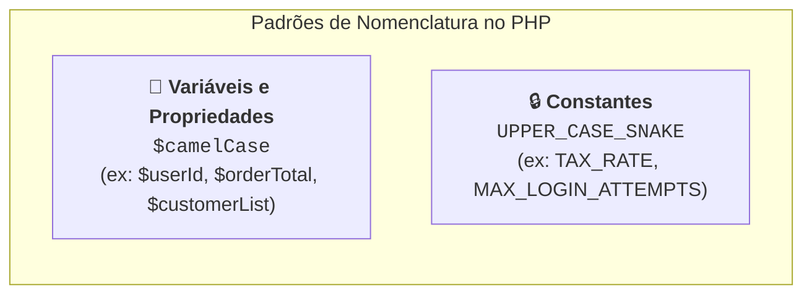
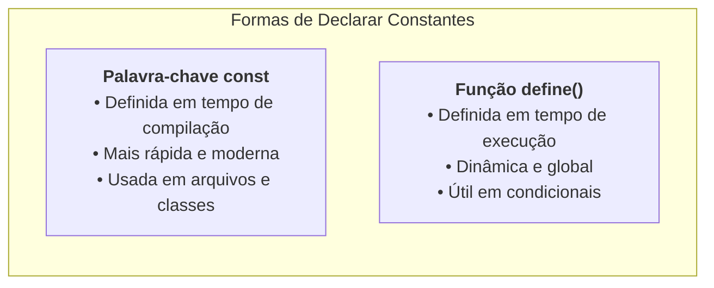

# 05. Variáveis e Constantes

Toda aplicação de backend precisa armazenar e manipular dados durante o
processamento de uma requisição: o identificador do usuário conectado, a taxa de
imposto a ser aplicada em uma compra, o caminho de uma pasta no servidor ou o
status de uma transação bancária.

Para gerenciar essas informações na memória RAM do servidor, o PHP oferece duas
estruturas fundamentais: **variáveis** (valores que podem mudar ao longo da
execução) e **constantes** (valores fixos e imutáveis).

Mas como o PHP organiza esses identificadores na memória? **Qual é a diferença
real entre declarar uma constante com `const` ou com a função `define()` e quais
são as constantes mágicas nativas que todo desenvolvedor precisa dominar?**

Neste capítulo, vamos compreender as regras de declaração, as boas práticas de
nomenclatura e a importância da imutabilidade na engenharia de software com PHP.

## Declarando Variáveis no PHP

No PHP, todas as variáveis começam obrigatoriamente com o símbolo de **cifrão
(`$`)**. O cifrão atua como um marcador para o analisador sintático do
interpretador, indicando que a palavra a seguir é um identificador de memória.

```php
<?php

$userName = "Mariana Costa";
$totalAttempts = 3;
$isAccountLocked = false;
```

### Regras de Nomenclatura e Convenções da Indústria

Para escrever código limpo e alinhado aos padrões da comunidade internacional
(**PSRs** - _PHP Standard Recommendations_), seguimos regras bem definidas:



1. **Permitido:** Identificadores devem começar com uma letra ou _underscore_
   (`_`), seguidos por qualquer número de letras, números ou _underscores_;
2. **Proibido:** Nomes de variáveis **não podem** começar com números (ex:
   `$1user` é um erro fatal de sintaxe) nem conter caracteres especiais como
   hifens (`$user-name`) ou espaços;
3. **Sensibilidade a Maiúsculas (_Case-Sensitive_):** `$totalValue` e
   `$totalvalue` são duas variáveis totalmente diferentes na memória;
4. **Convenção Padrão:** Na indústria moderna, variáveis locais e propriedades
   de classe são sempre escritas em **`$camelCase`** e em inglês.

## Reatribuição e Ciclo de Vida na Memória

Uma variável pode ter seu conteúdo substituído por um novo valor a qualquer
momento durante a execução do script:

```php
<?php

$currentStep = 1;
$currentStep = 2; // Reatribuição simples

$totalScore = 100;
$totalScore += 50; // Atribuição cumulativa (equivale a $totalScore = $totalScore + 50)
```

> **Lembrete do Modelo Shared-Nothing:**
>
> Toda variável declarada no PHP vive **apenas durante o ciclo daquela
> requisição específica**. Assim que a resposta é entregue ao cliente, o PHP
> libera toda a memória ocupada pelas variáveis automaticamente.

## Constantes: Blindando Valores Imutáveis

Em sistemas profissionais, muitos dados nunca devem ser alterados após sua
definição inicial: alíquotas de impostos, limites máximos de paginação, status
de banco de dados ou segredos de ambiente.

Permitir que esses valores sejam reatribuídos acidentalmente é uma fonte comum
de bugs graves de segurança e lógica:

```php
<?php
// ❌ CÓDIGO FRÁGIL: Usar variáveis comuns para valores de configuração críticos
$maxLoginAttempts = 5;

// Muito mais tarde no código, uma função desatenta pode alterar o valor:
$maxLoginAttempts = 9999; // 💥 Falha de segurança aberta!
```

Para proteger sua aplicação contra mutações indevidas, o PHP oferece duas formas
de criar **constantes imutáveis**:



### 1. A Palavra-chave `const` (Padrão Moderno)

A instrução `const` é a forma mais limpa, legível e recomendada para declarar
constantes em arquivos e dentro de classes:

```php
<?php

// ✅ CONSTANTE IMUTÁVEL: Impossível de ser sobrescrita
const MAX_LOGIN_ATTEMPTS = 5;
const DEFAULT_CURRENCY = "BRL";
const API_TIMEOUT_SECONDS = 30;

echo MAX_LOGIN_ATTEMPTS; // 5

// Tentativa de reatribuição:
// MAX_LOGIN_ATTEMPTS = 10; // 💥 Fatal Error: Cannot re-assign constant
```

### 2. A Função `define()`

A função `define()` foi a primeira forma de criar constantes no PHP. Ao
contrário de `const`, ela é avaliada em **tempo de execução**, o que permite que
o nome da constante ou seu valor sejam calculados dinamicamente:

```php
<?php

// Sintaxe: define("NOME_DA_CONSTANTE", $valor);
define("ENVIRONMENT", "production");

if (ENVIRONMENT === "production") {
    define("DATABASE_HOST", "db.empresa.com");
} else {
    define("DATABASE_HOST", "localhost");
}
```

### Tabela Comparativa: `const` vs `define()`

| Característica                  | `const`                            | `define()`                               |
| :------------------------------ | :--------------------------------- | :--------------------------------------- |
| **Momento de Definição**        | Tempo de Compilação                | Tempo de Execução (_Runtime_)            |
| **Uso dentro de Classes**       | ✅ Sim (`public const STATUS = 1`) | ❌ Não                                   |
| **Uso dentro de `if`/`switch`** | ❌ Não (apenas no escopo raiz)     | ✅ Sim                                   |
| **Performance**                 | ⚡ Ligeiramente superior           | Boa                                      |
| **Recomendação de Uso**         | Padrão geral da aplicação          | Configurações dinâmicas na inicialização |

## Constantes Mágicas Nativas

O interpretador PHP disponibiliza um conjunto especial de constantes
pré-definidas cujos valores mudam dinamicamente dependendo de **onde** elas são
chamadas no código. Elas são conhecidas como **Constantes Mágicas** e sempre
começam e terminam com dois caracteres _underscore_ (`__`):

```php
<?php

// Retorna o caminho absoluto do diretório onde este arquivo está salvo:
echo __DIR__;
// Ex: /var/www/meu-projeto/src ou C:\Projetos\meu-projeto\src

// Retorna o caminho absoluto completo do arquivo atual:
echo __FILE__;
// Ex: /var/www/meu-projeto/src/index.php

// Retorna o número da linha exata que está sendo executada:
echo __LINE__; // 14
```

### Principais Constantes Mágicas do PHP

| Constante      | O Que Retorna               | Exemplo de Uso Real                                                |
| :------------- | :-------------------------- | :----------------------------------------------------------------- |
| `__DIR__`      | Diretório do arquivo atual  | Carregar outros arquivos com segurança (`__DIR__ . '/config.php'`) |
| `__FILE__`     | Caminho completo do arquivo | Registros de logs e depuração                                      |
| `__LINE__`     | Linha atual no código       | Rastreamento de erros e diagnósticos                               |
| `__CLASS__`    | Nome da classe atual        | Métodos utilitários e reflexão de classes                          |
| `__FUNCTION__` | Nome da função atual        | Telemetria e medição de desempenho                                 |

```php
<?php

// Exemplo clássico de inclusão segura de arquivos usando __DIR__:
$configFilePath = __DIR__ . "/config/database.php";
```

<details>
<summary>🔍 Aprofundamento Técnico: Por que usar <code>__DIR__</code> em vez de caminhos relativos?</summary>

Ao carregar arquivos ou ler dados do disco, você pode se sentir tentado a
utilizar caminhos relativos simples, como `./config/database.php`.

No entanto, o ponto `./` refere-se ao **diretório de trabalho atual do terminal
ou do servidor web** (_Current Working Directory_), e **não** à pasta onde o
arquivo PHP realmente está salvo. Se a aplicação for executada a partir de outro
diretório, o caminho relativo quebrará com erro fatal de arquivo não encontrado.

Ao utilizar a constante mágica `__DIR__`, você garante um **caminho absoluto e
imparável**, independentemente de onde o script foi disparado no sistema
operacional.

</details>

## O Que Vem a Seguir?

Agora que você compreende como declarar variáveis com `$`, como blindar valores
com `const` e como utilizar as constantes mágicas do PHP, precisamos entender
como o PHP gerencia essas variáveis fisicamente na memória RAM.

> _"Quando passamos uma variável para outra ou para dentro de uma função, o PHP
> cria uma cópia independente dos dados ou cria um apontador compartilhado? Como
> funciona a passagem por referência com `&`?"_

No **[Capítulo 06: Atribuição por Valor e
Referência](06-atribuicao-por-valor-e-referencia.md)**, vamos desvendar o
mecanismo de _Copy-on-Write_ (CoW) da memória do PHP e as regras de segurança na
passagem de dados.

---

<a href="04-strings-e-interpolacao.md">← Strings e Interpolação</a>

<p align="right"><a href="06-atribuicao-por-valor-e-referencia.md">Próximo: Atribuição por Valor e Referência →</a></p>
