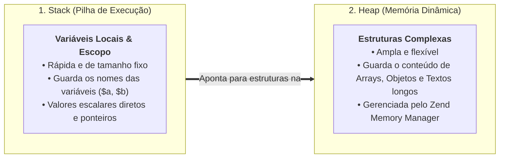
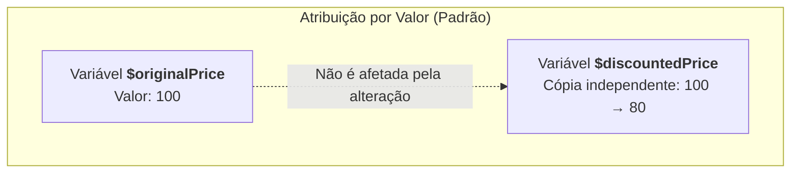
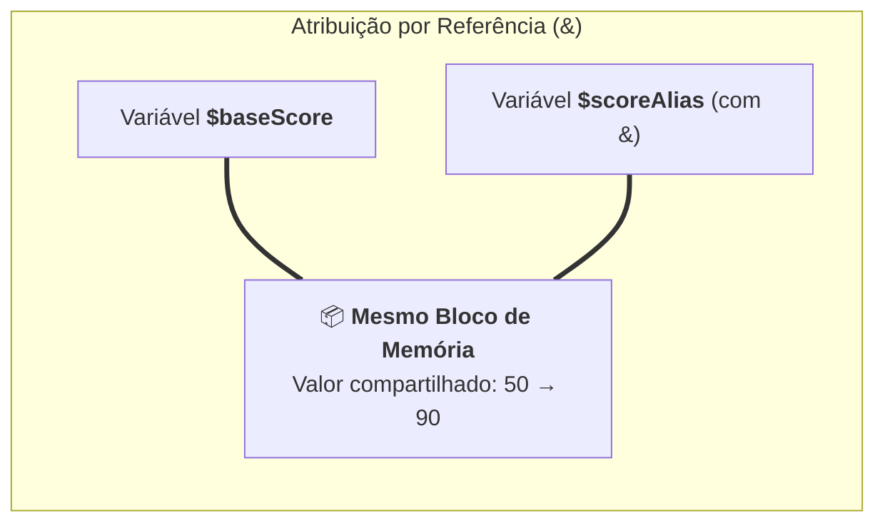

# 06. Atribuição por Valor e Referência

Quando desenvolvemos um software, frequentemente passamos dados de um lado para
o outro: transferimos o carrinho de compras para a função de cálculo de frete,
repassamos o perfil do usuário para o serviço de e-mail ou atualizamos um saldo
em conta.

Nesse processo, surge uma pergunta fundamental de arquitetura de memória:
**quando atribuímos uma variável a outra ou passamos um dado para uma função, o
PHP cria uma cópia independente dos dados ou cria um apontador compartilhado
para a mesma região de memória?**

Compreender a diferença entre **atribuição por valor** (o padrão seguro da
linguagem) e **atribuição por referência com `&`** é indispensável para evitar
mutações acidentais e efeitos colaterais imprevisíveis no backend.

Neste capítulo, vamos desvendar como o PHP organiza variáveis na memória através
da divisão entre **Stack** e **Heap**, compreender o mecanismo de
_Copy-on-Write_ (CoW) e dominar as boas práticas de imutabilidade no PHP
moderno.

## Como a Memória Funciona no PHP: Stack vs. Heap

Para entender por que as variáveis se comportam de maneira previsível no PHP,
precisamos olhar para como o interpretador organiza a memória RAM do servidor.
Toda execução divide a memória em duas regiões principais:



### 1. A Stack (Pilha de Execução)

A **Stack** é uma área de memória ultrarrápida, linear e de tamanho fixo:

- Gerencia o fluxo de execução das funções e métodos;
- Guarda as variáveis locais do escopo atual (os identificadores como
  `$userName`, `$totalPrice`);
- Armazena dados primitivos simples e os **endereços de memória (ponteiros)**
  que indicam onde estruturas maiores estão guardadas na Heap.

### 2. A Heap (Memória Dinâmica)

A **Heap** é uma região ampla, flexível e dinâmica:

- É onde residem as estruturas de tamanho variável: **Arrays**, **Objetos** e
  textos longos;
- No PHP, o gerenciador de memória do motor Zend (_Zend Memory Manager_) aloca e
  desaloca esses blocos conforme necessário durante a requisição.

Com essa divisão em mente, vamos analisar como o PHP manipula esses dados ao
fazer atribuições e chamadas de função.

## O Padrão do PHP: Atribuição por Valor (Cópia Independente)

Por padrão, quando você atribui uma variável escalar (`int`, `float`, `string`,
`bool`) ou um `array` para outra variável, o PHP realiza uma **cópia por
valor**.

Isso significa que as duas variáveis passam a ter vidas completamente
independentes. Modificar uma delas **não afeta em nada** o valor da outra:



Veja isso acontecendo no código:

```php
<?php
declare(strict_types=1);

$originalPrice = 100.0;

// Cria uma cópia independente do valor:
$discountedPrice = $originalPrice;

// Modificamos a segunda variável:
$discountedPrice = 80.0;

echo $originalPrice;   // 100.0 (permaneceu intacta!)
echo $discountedPrice; // 80.0
```

### O Mesmo Vale para Arrays

Diferente de muitas linguagens onde arrays e coleções compartilham a mesma
referência na memória por padrão, **no PHP, arrays também são copiados por
valor**:

```php
<?php
declare(strict_types=1);

$originalTags = ["php", "backend"];

// Copia o array inteiro para uma nova variável:
$customTags = $originalTags;
$customTags[] = "fatec"; // Adiciona um novo item na cópia

print_r($originalTags); // ["php", "backend"] (o array original não mudou!)
print_r($customTags);   // ["php", "backend", "fatec"]
```

## A Exceção Explícita: Atribuição por Referência com `&`

Se o comportamento padrão é a cópia independente, o que acontece quando usamos o
símbolo de **e-comercial (`&`)** antes de uma variável?

O operador `&` instrui o PHP a criar uma **referência** (um _alias_ ou apelido
de memória). Em vez de duplicar o dado, as duas variáveis passam a apontar para
o **mesmo endereço de memória**:



Veja o impacto no código:

```php
<?php
declare(strict_types=1);

$baseScore = 50;

// $scoreAlias agora é um apelido para $baseScore:
$scoreAlias = &$baseScore;

// Ao alterar uma, a outra é alterada simultaneamente:
$scoreAlias = 90;

echo $baseScore;  // 90 (o valor original foi modificado!)
echo $scoreAlias; // 90
```

## Passagem por Parâmetro: Cópia vs Efeito Colateral

Essa mesma regra se aplica diretamente na passagem de argumentos para funções.

### A Dor das Mutações Ocultas por Referência

No PHP legado, era comum encontrar funções que recebiam variáveis por referência
(`&$param`) para modificar dados do chamador. Embora parecesse prático, essa
abordagem cria **efeitos colaterais ocultos** (_side effects_), tornando o
código extremamente difícil de depurar:

```php
<?php
// ❌ CÓDIGO PROBLEMÁTICO: Função que altera o dado original por referência
function applyBonus(float &$salary): void
{
    $salary += 500.0; // Modifica a variável de fora sem retorno explícito!
}

$employeeSalary = 3000.0;
applyBonus($employeeSalary);

// Quem lê a chamada applyBonus($employeeSalary) não imagina que a variável mudou de valor!
echo $employeeSalary; // 3500.0
```

### A Solução Moderna: Funções Puras e Retorno Explícito

No desenvolvimento moderno, a regra é escrever **funções puras e previsíveis**:
a função recebe os dados por valor (cópia segura), processa a lógica de negócio
e **retorna um novo valor explicitamente**:

```php
<?php
declare(strict_types=1);

// ✅ CÓDIGO MODERNO: Função pura, explícita e sem efeitos colaterais
function calculateBonus(float $salary): float
{
    return $salary + 500.0;
}

$employeeSalary = 3000.0;
$updatedSalary = calculateBonus($employeeSalary);

echo $employeeSalary; // 3000.0 (dado original 100% preservado!)
echo $updatedSalary;  // 3500.0 (novo estado claro e rastreável)
```

## Tabela Comparativa: Valor vs Referência

| Aspecto                       | Passagem por Valor (Padrão)          | Passagem por Referência (`&`)         |
| :---------------------------- | :----------------------------------- | :------------------------------------ |
| **Sintaxe**                   | `$copia = $original;`                | `$alias = &$original;`                |
| **Isolamento de Memória**     | ✅ Totalmente isoladas               | ❌ Compartilham o mesmo espaço        |
| **Risco de Efeito Colateral** | Zero                                 | Alto                                  |
| **Rastreabilidade de Código** | Alta (fluxo previsível com `return`) | Baixa (alteração oculta de variáveis) |
| **Recomendação no PHP 8+**    | **Padrão Absoluto**                  | Evitar em regras de negócio           |

> **Regra de Ouro do PHP Moderno:**
>
> Evite o uso de referências (`&`) na sua lógica de negócio. Sempre prefira
> passar dados por valor e retornar novos valores calculados. Isso torna seu
> código imutável, fácil de testar e livre de comportamentos fantasmas.

<details>
<summary>🔍 Aprofundamento Técnico: Como o Copy-on-Write (CoW) otimiza o uso de memória?</summary>

Se o PHP copia variáveis e arrays inteiros por valor, você pode se preocupar:
_"Se eu tiver um array com 10.000 itens e atribuí-lo a outra variável, o PHP vai
duplicar toda a memória RAM instantaneamente?"_

A resposta é **não**, graças a uma otimização brilhante do motor Zend chamada
**Copy-on-Write (CoW)**:

1. Quando você faz `$b = $a;`, o PHP **não duplica os dados na memória RAM**.
   Ele apenas incrementa um contador interno de referências (`refcount = 2`) e
   faz as duas variáveis apontarem para o mesmo bloco de dados;
2. As variáveis continuam compartilhando o mesmo espaço físico enquanto forem
   apenas **lidas**;
3. No exato milissegundo em que você tenta **modificar** `$b` (ex: `$b[] =
42;`), o motor detecta a tentativa de mutação e realiza a cópia física dos dados
   naquele momento (_Copy on Write_).

Isso entrega o melhor dos dois mundos: a **segurança** da imutabilidade lógica
com a **máxima economia de memória** do hardware.

</details>

## O Que Vem a Seguir?

Agora que você compreende como as variáveis são armazenadas, copiadas e isoladas
na memória pelo mecanismo de _Copy-on-Write_, estamos prontos para aprender a
manipular e calcular esses dados.

> _"Como funcionam os operadores matemáticos, a comparação estrita `===` versus
> a comparação frouxa `==`, e quais são os operadores modernos de coalescência
> nula (`??`) e atribuição nula (`??=`) no PHP 8?"_

No **[Capítulo 07: Operadores e Expressões](07-operadores-e-expressoes.md)**,
vamos dominar todas as ferramentas de cálculo, lógica e tomada de decisões do
PHP.

---

<a href="05-variaveis-e-constantes.md">← Variáveis e Constantes</a>

<p align="right"><a href="07-operadores-e-expressoes.md">Próximo: Operadores e Expressões →</a></p>
