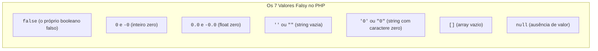

# 07. Expressões e Operadores

Nos capítulos anteriores, aprendemos como armazenar e estruturar dados na
memória com tipos primitivos, variáveis e constantes.

Agora, daremos o próximo passo fundamental: **como transformar, calcular,
comparar e avaliar esses dados em tempo de execução no backend**.

Neste capítulo, vamos compreender o que são **Expressões** e **Operadores**,
explorar as diferentes categorias de operadores aritméticos e lógicos, entender
os valores _Truthy_ e _Falsy_ no PHP, dominar a **Coalescência Nula (`??` e
`??=`)** e desvendar as regras de **Precedência e Associatividade**.

## O Que São Expressões e Operadores?

Para entender como o interpretador do PHP executa as instruções do nosso código,
precisamos diferenciar dois conceitos essenciais:

### 1. Expressão

Uma **expressão** é qualquer trecho de código válido que **produz ou se resolve
em um valor**:

```php
<?php
declare(strict_types=1);

// Exemplos de expressões no PHP:
true;                   // Produz o booleano true
10 + 5;                 // Produz o inteiro 15
"FATEC " . "Web";       // Produz a string "FATEC Web"
$accountBalance >= 50;  // Produz true ou false
```

Sempre que o PHP encontra uma expressão, ele a avalia para determinar seu
resultado final.

### 2. Operador

Um **operador** é um símbolo especial que instrui o interpretador a realizar uma
operação específica sobre um ou mais valores (chamados de **operandos**).

Podemos classificar os operadores a partir de diferentes critérios:

- **Quantidade de Operandos (Aridade):**
  - **Unários:** Operam sobre um único valor (ex: `!$isLoggedIn`,
    `-$temperature`);
  - **Binários:** Operam sobre dois valores (ex: `$total + $tax`, `$a === $b`);
  - **Ternários:** Operam sobre três valores (ex: `$score >= 6 ? "Aprovado" :
"Reprovado"`).
- **Finalidade da Operação:** Operações matemáticas, comparações lógicas,
  atribuições de memória ou coalescência;
- **Precedência e Associatividade:** A ordem de prioridade e a direção de
  avaliação quando múltiplos operadores aparecem juntos em uma mesma linha.

## Operadores Aritméticos

São utilizados para realizar cálculos matemáticos com números inteiros e
decimais:

```php
<?php
declare(strict_types=1);

$basePrice = 100.0;
$taxRate = 0.15;

$subtotal = $basePrice * 2;                       // Multiplicação: 200.0
$finalPrice = $subtotal + ($subtotal * $taxRate); // Adição e multiplicação: 230.0
$divisionResult = 10 / 4;                         // Divisão: 2.5
$remainder = 10 % 3;                              // Módulo (Resto da divisão): 1
$exponential = 2 ** 3;                            // Exponenciação (2³): 8
```

### Incremento (`++`) e Decremento (`--`)

Os operadores unários `++` e `--` adicionam ou subtraem `1` de uma variável:

```php
<?php
declare(strict_types=1);

$counter = 0;

$counter++; // Incremento: equivale a $counter = $counter + 1 (agora vale 1)
$counter--; // Decremento: equivale a $counter = $counter - 1 (agora vale 0)
```

> **Prefixado vs. Posfixado:**
>
> Quando usados em expressões, `++$counter` (prefixado) incrementa o valor
> **antes** de avaliá-lo, enquanto `$counter++` (posfixado) retorna o valor
> atual e incrementa **depois**. Em código profissional, a boa prática é
> utilizá-los em linhas isoladas ou optar pela atribuição explícita `$counter +=
1`.

## Operadores de Atribuição

Permitem armazenar ou atualizar valores em variáveis:

```php
<?php
declare(strict_types=1);

$currentScore = 50; // Atribuição simples

// Atribuição Composta (atalhos de operação + atribuição):
$currentScore += 10; // Equivale a: $currentScore = $currentScore + 10 (60)
$currentScore -= 5;  // Equivale a: $currentScore = $currentScore - 5 (55)
$currentScore *= 2;  // Equivale a: $currentScore = $currentScore * 2 (110)
$currentScore /= 2;  // Equivale a: $currentScore = $currentScore / 2 (55)
```

## Operadores de Comparação e Igualdade

Permitem comparar dois valores e retornam sempre um resultado booleano (`true`
ou `false`).

### Operadores Relacionais

```php
<?php
declare(strict_types=1);

$studentGrade = 8.5;

var_dump($studentGrade > 7.0);  // bool(true) - Maior que
var_dump($studentGrade < 6.0);  // bool(false) - Menor que
var_dump($studentGrade >= 8.5); // bool(true) - Maior ou igual a
var_dump($studentGrade <= 10.0);// bool(true) - Menor ou igual a
```

### Igualdade Estrita (`===` e `!==`)

A **igualdade estrita (`===`)** e a **desigualdade estrita (`!==`)** comparam
simultaneamente o **valor** e o **tipo** dos dados, sem realizar conversões
automáticas:

```php
<?php
declare(strict_types=1);

// ✅ RECOMENDADO: Comparações estritas e seguras
var_dump(10 === 10);   // bool(true)
var_dump(10 === "10"); // bool(false) - int !== string
var_dump(10 !== 20);   // bool(true)
```

### A Armadilha da Igualdade Frouxa (`==` e `!=`)

Os operadores `==` e `!=` realizam **coerção implícita de tipos**, tentando
converter os valores antes de compará-los. Isso gera armadilhas clássicas em
regras de negócio e verificações de segurança:

```php
<?php
// ❌ EVITE: Igualdade frouxa com coerções perigosas
var_dump(0 == "");        // bool(true) - 0 é igual a texto vazio?!
var_dump(0 == "0");       // bool(true) - número 0 é igual a string '0'!
var_dump(false == "0");   // bool(true) - false é igual a string '0'!
var_dump(null == "");     // bool(true) - null é igual a texto vazio!
var_dump([] == false);    // bool(true) - array vazio é igual a false!
```

> **Regra de Ouro:**
>
> Sempre utilize `===` e `!==`. A igualdade estrita garante que a lógica de
> comparação seja 100% determinística e previsível.

## Operadores Lógicos e Valores Truthy / Falsy

Os operadores lógicos combinam condições booleanas:

- **`&&` (E lógico):** Retorna `true` apenas se **ambos** os operandos forem
  verdadeiros;
- **`||` (OU lógico):** Retorna `true` se **ao menos um** dos operandos for
  verdadeiro;
- **`!` (NÃO lógico):** Inverte o valor lógico (`!true` $\rightarrow$ `false`).

```php
<?php
declare(strict_types=1);

$isUserAuthenticated = true;
$hasAdminPermission = false;

$canAccessSettings = $isUserAuthenticated && $hasAdminPermission; // false
$canViewPublicPage = $isUserAuthenticated || $hasAdminPermission; // true
$isGuestUser = !$isUserAuthenticated;                             // false
```

### Valores _Truthy_ e _Falsy_ no PHP

No PHP, qualquer tipo de dado pode ser avaliado dentro de um contexto lógico.
Quando um valor não-booleano é testado em uma condição, o interpretador o
considera implicitamente como verdadeiro (**Truthy**) ou falso (**Falsy**).

No PHP, existem **apenas 7 valores considerados Falsy**:



**Todos os demais valores são Truthy**, incluindo números negativos (`-10`),
textos com espaço (`" "`) e strings como `"false"`.

### Avaliação de Curto-Circuito (_Short-Circuit_)

Uma característica essencial dos operadores `&&` e `||` é que o interpretador
avalia as expressões da esquerda para a direita e **interrompe a execução assim
que o resultado final puder ser determinado**:

- **Curto-circuito com `&&`:** Se a primeira condição for **Falsy**, o operador
  para imediatamente e não executa o restante da expressão (pois o resultado já
  será `false`);
- **Curto-circuito com `||`:** Se a primeira condição for **Truthy**, o operador
  para imediatamente e ignora o restante (pois um único valor verdadeiro é
  suficiente).

<details>
<summary>🔍 Aprofundamento Técnico: A armadilha histórica dos operadores <code>and</code> e <code>or</code></summary>

No PHP, existem também as palavras-chave `and` e `or` para operações lógicas.
Embora pareçam idênticas a `&&` e `||`, **elas possuem uma precedência de
operadores muito mais baixa que o operador de atribuição (`=`)**.

Veja a armadilha silenciosa:

```php
<?php
// ❌ ARMADILHA DE PRECEDÊNCIA:
$result = true and false;
// O PHP executa primeiro ($result = true) e depois avalia 'and false'!
var_dump($result); // bool(true) - Resultado inesperado e incorreto!

// ✅ CORRETO (Usando &&):
$result = true && false;
// O PHP avalia primeiro (true && false) e atribui o resultado false a $result.
var_dump($result); // bool(false)
```

Por essa razão, **nunca utilize `and` ou `or` para lógica condicional padrão**.
Sempre utilize `&&` e `||`.

</details>

## Operadores Modernos de Decisão e Coalescência

### 1. Operador Ternário Clássico (`condicao ? valorSeVerdadeiro : valorSeFalso`)

O operador ternário é uma expressão compacta de decisão composta por três
partes:

```php
<?php
declare(strict_types=1);

$score = 7.5;

// Se a condição for verdadeira, retorna "Aprovado", senão "Reprovado":
$statusResult = $score >= 6.0 ? "Aprovado" : "Reprovado";

echo $statusResult; // "Aprovado"
```

### 2. O Operador Ternário Curto / _Elvis Operator_ (`?:`)

Quando você deseja retornar o próprio valor da expressão se ele for verdadeiro,
ou um valor alternativo se for falso, o PHP permite omitir a parte central do
operador ternário. Essa sintaxe é carinhosamente conhecida na comunidade como
**Elvis Operator** (`?:`):

```php
<?php
declare(strict_types=1);

$customUsername = "mariana_dev";

// Equivale a: $customUsername ? $customUsername : "anônimo"
$displayUser = $customUsername ?: "anônimo";
echo $displayUser; // "mariana_dev"

$emptyUsername = "";
$displayUser = $emptyUsername ?: "anônimo";
echo $displayUser; // "anônimo" (pois string vazia é Falsy)
```

### 3. A Armadilha do _Elvis Operator_ vs Coalescência Nula (`??`)

Embora o _Elvis Operator_ (`?:`) pareça prático para definir valores padrão, ele
possui uma armadilha crítica: **ele avalia a verdade lógica (_truthiness_) do
valor, tratando `0`, `0.0`, `""` e `false` como inválidos**.

Veja a falha clássica em um contador de notificações:

```php
<?php
declare(strict_types=1);

// ❌ FALHA COM ELVIS OPERATOR (Baseado em Truthiness):
$unreadAlerts = 0; // O usuário leu tudo, possui 0 alertas pendentes

// Como 0 é Falsy no PHP, o Elvis Operator assume o padrão por engano:
$badgeCount = $unreadAlerts ?: 10;
echo $badgeCount; // 10 (Incorreto! Deveria exibir 0)
```

O **Operador de Coalescência Nula (`??`)** foi introduzido para resolver esse
problema com precisão matemática: ele verifica estritamente se o valor **existe
e não é `null`**, preservando valores legítimos como `0`, `""` ou `false`:

```php
<?php
declare(strict_types=1);

// ✅ SEGURANÇA TOTAL COM COALESCÊNCIA NULA (??):
$unreadAlerts = 0;

// O '??' só aplica o fallback se for estritamente null ou inexistente:
$badgeCount = $unreadAlerts ?? 10;
echo $badgeCount; // 0 (Correto! O número 0 foi preservado)

$customPrefix = "";
$finalPrefix = $customPrefix ?? "padrao_";
echo $finalPrefix; // "" (A string vazia foi preservada)
```

### 3. Operador de Atribuição Coalescente Nula (`??=`)

Introduzido no PHP 7.4, o operador `??=` atribui um valor à variável **apenas se
ela for atualmente `null` ou inexistente**:

```php
<?php
declare(strict_types=1);

$userPreferences = [
    "theme" => "dark",
    "language" => null,
];

// Como 'language' é null, recebe o valor padrão 'pt-BR':
$userPreferences["language"] ??= "pt-BR";

// Como 'theme' já possui 'dark', seu valor permanece inalterado:
$userPreferences["theme"] ??= "light";

print_r($userPreferences);
// ["theme" => "dark", "language" => "pt-BR"]
```

## Precedência e Associatividade de Operadores

Quando combinamos múltiplos operadores na mesma expressão, como o PHP decide a
ordem dos cálculos?

### 1. Precedência de Operadores

A **precedência** determina qual operador é avaliado primeiro. Multiplicações e
divisões possuem maior prioridade que somas e subtrações:

```php
<?php
declare(strict_types=1);

// Multiplicação (*) tem maior precedência que adição (+):
$total = 10 + 5 * 2;
echo $total; // 20 (e não 30!)
```

### 2. Associatividade

Quando dois operadores possuem a **mesma precedência**, a **associatividade**
define a direção da avaliação:

- **Da esquerda para a direita (Maioria dos operadores):** `20 - 5 - 2` é
  avaliado como `(20 - 5) - 2 = 13`.
- **Da direita para a esquerda (Atribuição e Exponenciação):** `2 ** 3 ** 2` é
  avaliado como `2 ** (3 ** 2) = 2 ** 9 = 512`.

### O Uso de Parênteses `()`

> **Boas Práticas:**  
> Em vez de confiar na memorização de tabelas extensas de precedência, **utilize
> parênteses `()`** para tornar a intenção do cálculo clara para todos os
> membros da equipe:
>
> ```php
> $finalAmount = ($basePrice + $shippingFee) * (1 - $discountPercentage);
> ```

## Resumo dos Operadores

| Operador | Nome              | Exemplo          | Comportamento                                    |
| :------- | :---------------- | :--------------- | :----------------------------------------------- |
| `===`    | Igualdade Estrita | `$a === $b`      | `true` se valor e tipo forem idênticos           |
| `!==`    | Diferença Estrita | `$a !== $b`      | `true` se valor ou tipo forem diferentes         |
| `&&`     | E Lógico          | `$a && $b`       | `true` se ambos forem Truthy                     |
| `\|\|`   | OU Lógico         | `$a \|\| $b`     | `true` se ao menos um for Truthy                 |
| `?:`     | Elvis Operator    | `$a ?: $default` | Retorna `$a` se for Truthy, senão `$default`     |
| `??`     | Coalescência Nula | `$a ?? $default` | Retorna `$a` se não for `null`, senão `$default` |
| `??=`    | Atribuição Nula   | `$a ??= $val`    | Atribui `$val` a `$a` apenas se `$a` for `null`  |

## O Que Vem a Seguir?

Agora que dominamos a avaliação de expressões, operadores aritméticos, lógicos e
de igualdade estrita, estamos prontos para controlar o fluxo de execução dos
nossos programas no servidor.

> *"Como estruturar desvios de fluxo com `if`, `elseif` e `else`, e como as
> Cláusulas de Guarda (*Guard Clauses*) tornam o código de backend muito mais
> limpo e legível?"*

No **[Capítulo 08: Estruturas Condicionais](08-estruturas-condicionais.md)**,
vamos aprender a direcionar o fluxo de execução das regras de negócio com
elegância e clareza.

---

<a href="06-atribuicao-por-valor-e-referencia.md">← Atribuição por Valor e
Referência</a>

<p align="right"><a href="08-estruturas-condicionais.md">Próximo: Estruturas Condicionais →</a></p>
