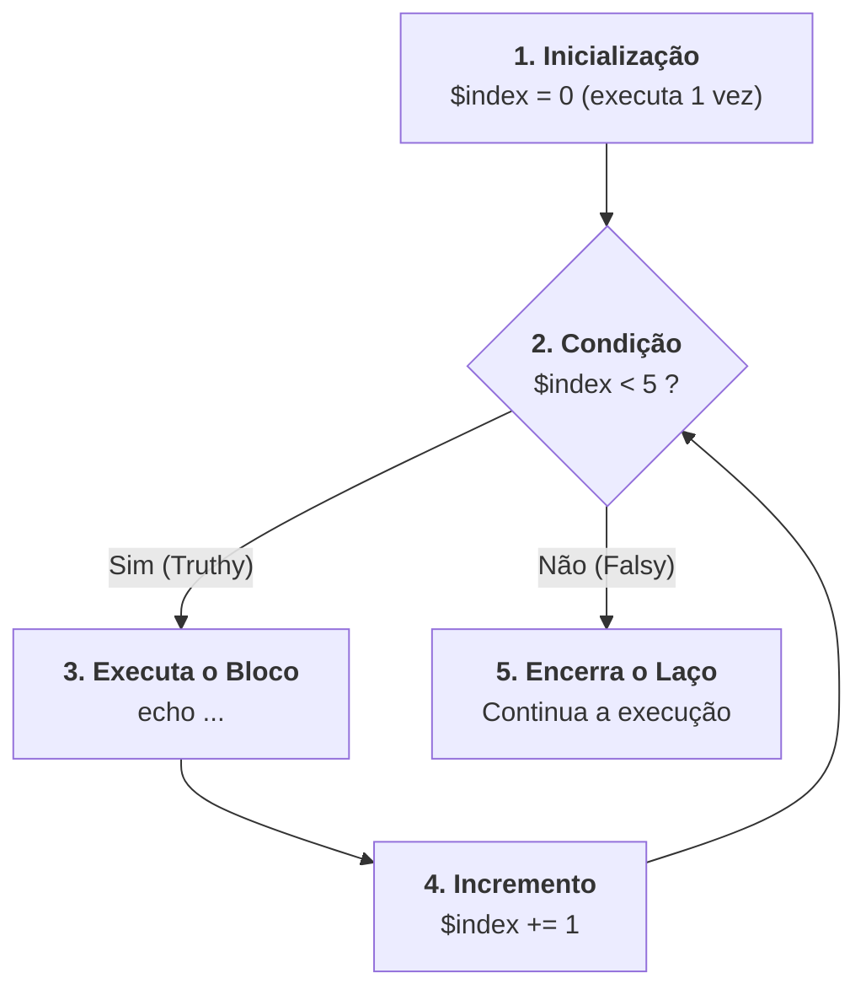

# 10. Estruturas de Repetição

Nos capítulos anteriores, aprendemos a calcular expressões, operar sobre a
memória e tomar decisões pontuais com estruturas como `if`, `switch` e `match`.

Da mesma forma que decidir o que e quando executar é um dos pilares da
computação, **executar o mesmo conjunto de instruções repetidamente** com
velocidade e consistência é indispensável: processar registros vindos de um
banco de dados, calcular o valor total de itens de um pedido ou disparar
tentativas de conexão até obter resposta.

Neste capítulo, vamos dominar os **Laços de Repetição (_Loops_)** do PHP: o
`for` clássico, `while`, `do-while`, os comandos de controle de fluxo `break` e
`continue`, e o poderoso **`foreach`**, a estrutura de iteração mais utilizada
no desenvolvimento com PHP.

## O Laço `for` Tradicional

O laço `for` clássico é utilizado quando sabemos previamente o número exato de
repetições ou quando precisamos de controle explícito sobre um índice numérico
sequencial.

Sua sintaxe é composta por três expressões separadas por ponto e vírgula:

```php
<?php

declare(strict_types=1);

// for (inicializacao; condicao_de_continuidade; incremento)
for ($index = 0; $index < 5; $index += 1) {
    echo "Iteração número: {$index}\n";
}
```



## Laços Baseados em Condição: `while` e `do-while`

Quando o número de repetições não é previamente conhecido e depende de uma
condição dinâmica (como a disponibilidade de um serviço ou o consumo de uma fila
de mensagens), utilizamos `while` ou `do-while`.

### O Laço `while` (Avaliação Prévia)

O `while` avalia a condição booleana **antes** de cada iteração. Se a condição
for falsa logo no início, o código interno nunca será executado (executa de 0 a
$N$ vezes):

```php
<?php

declare(strict_types=1);

$retryAttempts = 0;
$maxRetries = 3;

while ($retryAttempts < $maxRetries) {
    $attemptNumber = $retryAttempts + 1;
    echo "Tentativa de conexão {$attemptNumber} de {$maxRetries}...\n";
    $retryAttempts += 1;
}
```

> **Alerta de Loop Infinito:** Se a condição do `while` nunca se tornar falsa
> (_falsy_), o script continuará executando indefinidamente até estourar o
> limite de tempo de execução (`max_execution_time`) configurado no PHP.
> Certifique-se sempre de que o estado interno do laço evolua em direção ao
> término da condição.

### O Laço `do-while` (Avaliação Posterior)

O `do-while` inverte o ciclo de verificação: ele executa o bloco de instruções
**primeiro** e testa a condição apenas ao final de cada volta. Isso garante que
o bloco execute **ao menos uma vez**, independentemente do estado inicial da
condição:

```php
<?php

declare(strict_types=1);

$workerJobsProcessed = 0;

do {
    // Executa ao menos uma vez antes de checar a condição:
    echo "Verificando se há tarefas pendentes na fila...\n";
    $workerJobsProcessed += 1;
} while ($workerJobsProcessed < 1);
```

> **Atenção à Sintaxe:** Note que o comando `do-while` é finalizado com um ponto
> e vírgula obrigatório após o parêntese da condição: `while (...);`.

## Controle de Fluxo: `break` e `continue`

Podemos alterar dinamicamente o fluxo natural de qualquer laço de repetição
utilizando duas instruções fundamentais:

### 1. O Comando `break` (Interrompe o Laço)

O comando `break` encerra imediatamente a execução do laço, transferindo o
controle do programa para a primeira linha após o fechamento do bloco `{ ... }`:

```php
<?php

declare(strict_types=1);

$searchTarget = 7;

for ($currentNumber = 1; $currentNumber <= 10; $currentNumber += 1) {
    if ($currentNumber === $searchTarget) {
        echo "Alvo {$searchTarget} localizado! Interrompendo a busca.\n";
        break; // Encerra o loop for imediatamente
    }

    echo "Analisando registro: {$currentNumber}...\n";
}
```

### 2. O Comando `continue` (Pula a Iteração Atual)

O comando `continue` não interrompe o laço inteiro. Ele apenas **interrompe a
volta atual**, ignorando as linhas restantes do bloco e avançando diretamente
para a próxima iteração (executando o incremento):

```php
<?php

declare(strict_types=1);

for ($numberItem = 1; $numberItem <= 6; $numberItem += 1) {
    // Pula números pares:
    if ($numberItem % 2 === 0) {
        continue; // Ignora o echo e salta para a próxima volta
    }

    echo "Número ímpar processado: {$numberItem}\n";
}
// Saída: 1, 3, 5
```

<details>
<summary>Aprofundamento: <code>break $n</code> e <code>continue $n</code> em loops aninhados</summary>

No PHP, os comandos `break` e `continue` aceitam um argumento numérico opcional
indicando **quantos níveis de laços aninhados** devem ser interrompidos ou
pulados:

```php
for ($outer = 1; $outer <= 3; $outer += 1) {
    for ($inner = 1; $inner <= 3; $inner += 1) {
        if ($outer === 2 && $inner === 2) {
            break 2; // Encerra ambos os laços (o interno e o externo)
        }
    }
}
```

Embora seja um recurso sintático nativo do PHP, o uso de `break $n` com números
literais torna o código difícil de rastrear em manutenções. A melhor prática na
engenharia de software é extrair o laço interno para uma função dedicada e
utilizar `return` ou Cláusulas de Guarda.

</details>

## O Laço `foreach`: A Estrutura de Iteração Padrão do PHP

No ecossistema PHP, arrays são estruturas extremamente versáteis (podendo
representar listas indexadas ou mapas de chave-valor). Por essa razão, o
**`foreach` é a forma mais idiomática, expressiva e segura de percorrer
coleções**.

### 1. Iterando Exclusivamente sobre Valores

Quando precisamos apenas dos elementos contidos no array:

```php
<?php

declare(strict_types=1);

$frameworks = ["Laravel", "Symfony", "Slim"];

foreach ($frameworks as $framework) {
    echo "Framework PHP: {$framework}\n";
}
```

### 2. Iterando sobre Chaves e Valores Simultaneamente

Quando precisamos acessar tanto a chave (seja um índice numérico ou uma string
associativa) quanto o valor correspondente:

```php
<?php

declare(strict_types=1);

$serverEnvironment = [
    "APP_ENV" => "production",
    "APP_DEBUG" => "false",
    "DB_PORT" => "5432",
];

foreach ($serverEnvironment as $variableKey => $variableValue) {
    echo "Configuração '{$variableKey}': {$variableValue}\n";
}
```

### Comportamento de Cópia e Segurança com `foreach`

Por padrão, o `foreach` itera sobre os valores seguindo o modelo de valor
(_Copy-on-Write_) do PHP. Modificar a variável `$variableValue` dentro do bloco
não altera o array original:

```php
<?php

declare(strict_types=1);

$productPrices = [100.0, 250.0, 50.0];

foreach ($productPrices as $price) {
    $price = $price * 1.10; // ⚠️ Altera apenas a variável local da iteração
}

// O array original $productPrices permanece com [100.0, 250.0, 50.0]
```

Se o objetivo for transformar os dados da coleção, no Bloco 4 aprenderemos as
funções de transformação pura (como `array_map`), que são o padrão recomendado
em código moderno.

## Resumo das Estruturas de Repetição

| Estrutura      | Quando Utilizar?                                              | Exemplo de Sintaxe                         |
| :------------- | :------------------------------------------------------------ | :----------------------------------------- |
| **`for`**      | Contagem numérica sequencial com índice explícito             | `for ($i = 0; $i < 10; $i++) { ... }`      |
| **`while`**    | Repetição baseada em condição avaliada **antes** do bloco     | `while ($hasPendingJobs) { ... }`          |
| **`do-while`** | Repetição garantida de **ao menos uma execução** prévia       | `do { ... } while ($hasRetries);`          |
| **`foreach`**  | Iteração completa sobre arrays e iteráveis (chaves e valores) | `foreach ($items as $key => $val) { ... }` |

> **Regras de Ouro:**
>
> 1. Para percorrer arrays e coleções de dados, **adote `foreach` como sua
>    primeira escolha**.
> 2. Evite laços infinitos garantindo que a condição de parada de `while` e
>    `do-while` seja sempre alcançável.
> 3. Use `break` e `continue` com moderação para manter o fluxo de leitura
>    linear e previsível.

## O Que Vem a Seguir?

Parabéns! Com este capítulo, concluímos com êxito o **Bloco 2 (Fundamentos,
Tipos & Controle de Fluxo)** da Trilha de PHP.

Agora que dominamos tipos escalares, memória, strings, operadores, decisões
(`if`, `switch`, `match`) e laços de repetição, estamos prontos para avançar
para o **Bloco 3: Funções, Escopo & Tratamento de Erros**.

No próximo capítulo, vamos aprender a declarar e tipar **Funções**, explorar os
**Named Arguments** (argumentos nomeados) nativos do PHP 8+ e definir contratos
robustos de parâmetros e tipos de retorno.

---

<a href="09-expressoes-match.md">← Expressões Match (PHP 8+)</a>

<p align="right"><a href="11-declaracao-de-funcoes-e-parametros.md">Próximo: Declaração de Funções e Parâmetros →</a></p>
