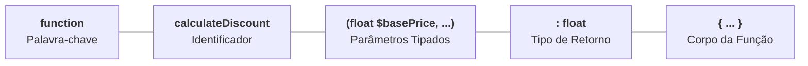

# 11. Declaração de Funções e Parâmetros

Nos capítulos anteriores, aprendemos a manipular dados escalares, operar sobre a
memória, avaliar expressões e controlar o fluxo de execução com condicionais,
expressões `match` e laços de repetição.

No entanto, até agora nosso código foi escrito em sequências lineares de
instruções. Conforme uma aplicação de backend cresce, duplicar blocos de código
para calcular descontos, validar dados de formulários ou formatar documentos
torna o sistema frágil, difícil de manter e extremamente propenso a erros.

As **funções** são os blocos de construção fundamentais para a modularização de
qualquer software. Elas nos permitem encapsular uma lógica específica,
atribuir-lhe um nome significativo e reutilizá-la quantas vezes forem
necessárias, recebendo dados de entrada (**parâmetros**) e produzindo um
resultado (**retorno**).

Neste capítulo, vamos dominar a anatomia completa de uma função no PHP 8+,
compreender a blindagem de tipos com `declare(strict_types=1);`, explorar tipos
de retorno como `void` e `never`, tipos anuláveis (`?Tipo`) e de união
(`TipoA|TipoB`), e desvendar o poder dos **Argumentos Nomeados (_Named
Arguments_)**.

## Anatomia de uma Função no PHP Moderno

Uma função declarada no PHP é composta por elementos estruturais bem definidos:



Veja esses componentes aplicados em um exemplo real de regra de negócio:

```php
<?php

declare(strict_types=1);

function calculateDiscount(float $basePrice, float $discountPercentage = 10.0): float
{
    $discountAmount = $basePrice * ($discountPercentage / 100);
    return $basePrice - $discountAmount;
}

$finalPrice = calculateDiscount(200.0, 15.0);
echo "Preço final: R$ {$finalPrice}\n"; // Preço final: R$ 170
```

Vamos analisar cada um desses componentes estruturais:

### 1. O Identificador (Nome da Função)

O **identificador** é o nome pelo qual a função é referenciada e executada no
código.

> **Convenção de Nomenclatura (PSR-12 / PER Coding Style):**
>
> Funções representam **ações**, portanto devem sempre começar com um **verbo**
> e seguir o padrão **`camelCase`** em inglês (ex: `calculateDiscount`,
> `formatUserName`, `validateCpf`, `sendNotificationEmail`).

### 2. Parâmetros e Entrada de Dados

Os **parâmetros** definem os dados que a função precisa receber para realizar o
seu processamento.

Caso a função não precise de nenhuma informação externa, os parênteses
permanecem vazios `()`:

```php
<?php

// Função sem parâmetros de entrada:
function getSystemStatus(): string
{
    return "Servidor operacional.";
}

// Função com múltiplos parâmetros tipados:
function registerStudent(string $studentName, int $studentAge, int $semester): void
{
    echo "Estudante {$studentName} ({$studentAge} anos) matriculado no {$semester}º semestre.\n";
}
```

### 3. Tipos de Retorno

O tipo de retorno declara explicitamente o formato do dado devolvido pela
instrução `return`.

Além dos tipos primitivos escalares (`int`, `float`, `string`, `bool`), o PHP
oferece tipos de retorno dedicados para expressar o ciclo de vida da execução:

#### Funções Sem Retorno (`void`)

Quando a função apenas executa uma ação (como exibir uma mensagem, salvar um log
ou enviar um e-mail) sem devolver nenhum valor utilizável com `return`, seu tipo
de retorno é anotado como **`void`**:

```php
<?php

function logWarning(string $message): void
{
    echo "[AVISO - " . date("H:i:s") . "]: {$message}\n";
    // Funções void não podem retornar valores (return $val causa erro fatal)
}
```

#### Funções Terminais (`never` - PHP 8.1+)

O tipo **`never`** indica que a função **nunca conclui seu fluxo normalmente**:
ou ela encerra a execução do script imediatamente (com `exit()` / `die()`), ou
sempre lança uma exceção.

```php
<?php

function redirectAndHalt(string $targetUrl): never
{
    header("Location: {$targetUrl}");
    exit(); // Interrompe imediatamente o script
}

function throwBusinessError(string $errorMessage): never
{
    throw new Exception("Erro de Domínio: {$errorMessage}");
}
```

> **Diferença entre `void` e `never`:**
>
> Uma função `void` conclui sua execução e devolve o controle para a linha
> seguinte do programa. Uma função `never` **nunca devolve o controle**,
> garantindo ao analisador estático que as linhas posteriores a ela jamais serão
> alcançadas.

## Tipagem Estrita e a Proteção de Parâmetros

Agora que compreendemos como declarar funções com parâmetros e retornos, surge
uma questão vital sobre como o PHP valida esses dados quando a função é chamada.

### A Dor da Coerção Automática

Por padrão histórico, o interpretador do PHP opera em **modo coercivo (fraco)**.
Se uma função espera um número inteiro (`int`) e recebe a string `"42"`, o motor
tenta converter o tipo automaticamente sem avisar:

```php
<?php

// ❌ MODO PADRÃO (Coerção implícita fraca): Silencioso e perigoso
function processPayment(int $userId, float $amount): string
{
    return "Pagamento de R$ {$amount} processado para o usuário {$userId}.";
}

// O PHP converte silenciosamente a string "42" para o int 42:
echo processPayment("42", 150.0);
```

#### Por Que a Coerção Implícita É Perigosa no Backend?

1. **Erros Mascarados:** Se um formulário enviar o booleano `true` onde se
   esperava um número de conta, o PHP o converterá para `1` sem emitir alertas;
2. **Perda Silenciosa de Precisão:** Decimais passados para parâmetros inteiros
   são truncados (`19.99` vira `19`), causando divergências contábeis graves;
3. **Falhas Tarde Demais:** O erro não explode na fronteira da função, mas sim
   muito depois, quando o dado inconsistente já foi gravado no banco de dados.

### A Solução: Ativando a Tipagem Estrita com `declare(strict_types=1);`

Para eliminar essa permissividade e garantir contratos rigorosos, o PHP moderno
disponibiliza a diretiva **`declare(strict_types=1);`**.

Ao colocar essa instrução na primeiríssima linha do arquivo, o interpretador
rejeita qualquer valor cujo tipo não coincida exatamente com a assinatura da
função, lançando um **`TypeError`** imediato:

```php
<?php

declare(strict_types=1);

// ✅ MODO ESTRITO: Rigor e segurança total em tempo de execução
function processPayment(int $userId, float $amount): string
{
    return "Pagamento de R$ {$amount} processado para o usuário {$userId}.";
}

// Tentativa de passar string em parâmetro int:
// echo processPayment("42", 150.0);
// 💥 Fatal Error: Uncaught TypeError: processPayment(): Argument #1 ($userId) must be of type int, string given
```

> **A Regra de Ouro do PHP Moderno:**
>
> A diretiva `declare(strict_types=1);` deve ser a **primeira instrução** de
> todo arquivo `.php` profissional. Ela blinda as chamadas de função contra
> conversões automáticas indesejadas.

## Tipos Anuláveis e Tipos de União em Assinaturas

Em aplicações reais, parâmetros e retornos frequentemente precisam aceitar mais
de uma possibilidade legítima.

### 1. Tipos Anuláveis (_Nullable Types_: `?Tipo`)

Quando um parâmetro ou retorno pode conter um tipo específico **ou** o valor
`null` (indicando ausência), prefixamos o tipo com uma interrogação (`?`):

```php
<?php

declare(strict_types=1);

function findCustomerEmail(int $customerId): ?string
{
    if ($customerId === 1) {
        return "carlos@fatec.sp.gov.br";
    }

    // Cliente não encontrado: retorna null explicitamente
    return null;
}

$email = findCustomerEmail(99); // Retorna null
```

### 2. Tipos de União (_Union Types_: `TipoA|TipoB` - PHP 8.0+)

Quando um dado pode assumir múltiplos tipos válidos (por exemplo, um cálculo de
imposto que aceita tanto inteiros quanto números de ponto flutuante), unimos os
tipos com uma barra vertical (`|`):

```php
<?php

declare(strict_types=1);

function calculateTax(int|float $amount, float $taxPercentage): float
{
    return $amount * ($taxPercentage / 100);
}

echo calculateTax(100, 5.0);   // 5.0 (usando int)
echo calculateTax(99.50, 5.0); // 4.975 (usando float)
```

## Parâmetros: Obrigatórios vs. Valores Padrão

Podemos definir valores pré-estabelecidos para parâmetros na assinatura da
função. Se o chamador omitir o argumento na invocação, o PHP assumirá o valor
padrão automaticamente:

```php
<?php

declare(strict_types=1);

function buildServerUrl(string $host, int $port = 8080, bool $isSecure = false): string
{
    $protocol = $isSecure ? "https" : "http";
    return "{$protocol}://{$host}:{$port}";
}

echo buildServerUrl("localhost");                  // http://localhost:8080 (usou ambos os padrões)
echo buildServerUrl("api.empresa.com", 443, true); // https://api.empresa.com:443
```

> **Regra de Posicionamento:**
>
> Parâmetros obrigatórios devem ser declarados **sempre antes** de quaisquer
> parâmetros que possuam valores padrão. Declarar um parâmetro obrigatório após
> um opcional gera um alerta de depreciação no PHP moderno.

## Argumentos Nomeados (_Named Arguments_ no PHP 8+)

Uma das maiores dores do desenvolvimento tradicional com funções que possuem
muitos parâmetros é a passagem posicional:

1. **Falta de Clareza:** Ao ler uma chamada como `createUser("Ana", 25, true, false, true)`,
   é impossível saber o que cada booleano significa sem abrir o código-fonte da
   função;
2. **A Dor dos Valores Padrão Intermediários:** Se uma função tiver 4 parâmetros
   com valores padrão e você quiser customizar apenas o último, era obrigatório
   redigitar o valor padrão de todos os parâmetros anteriores.

O **PHP 8.0 introduziu os Argumentos Nomeados (_Named Arguments_)**, permitindo
passar argumentos especificando o nome do parâmetro seguido por dois-pontos
(`nomeDoParametro: $valor`):

```php
<?php

// ❌ PASSAGEM POSICIONAL: Ordem obrigatória e difícil interpretação de booleanos
buildServerUrl("localhost", 8080, true);

// ✅ ARGUMENTOS NOMEADOS: Intenção explícita e dispensa parâmetros padrão intermediários
buildServerUrl(host: "localhost", isSecure: true);
```

Veja o salto de legibilidade e flexibilidade em uma regra de negócio real:

```php
<?php

declare(strict_types=1);

function createInvoice(
    string $customerName,
    float $amount,
    float $discountPercentage = 0.0,
    string $currency = "BRL",
    bool $sendNotification = true
): string {
    return "Fatura para {$customerName}: {$currency} {$amount} (Notificação: " . ($sendNotification ? "Sim" : "Não") . ")";
}

// 1. Clareza total: os argumentos são autodocumentados na chamada:
echo createInvoice(
    customerName: "Mariana Souza",
    amount: 1500.0,
    currency: "USD"
);

// 2. Pulando parâmetros padrão intermediários:
// Queremos apenas desativar a notificação, mantendo o desconto e a moeda padrão:
echo createInvoice(
    customerName: "Carlos Lima",
    amount: 350.0,
    sendNotification: false // 'discountPercentage' e 'currency' mantêm os valores padrão!
);
```

### Vantagens dos Argumentos Nomeados no PHP:

- **Autodocumentação:** Torna chamadas de funções com múltiplos argumentos
  instantaneamente legíveis;
- **Salto Seletivo de Defaults:** Permite customizar apenas os parâmetros
  desejados sem precisar reenviar os valores padrão de argumentos anteriores;
- **Flexibilidade de Ordem:** Quando todos os argumentos são nomeados, a ordem
  em que são passados torna-se irrelevante para o interpretador.

<details>
<summary>🔍 Código Limpo: Simplificando Funções com Guard Clauses (Early Return)</summary>

Uma das armadilhas mais comuns ao estruturar regras de negócio dentro de funções
é o aninhamento excessivo de blocos `if / else`, criando a famosa **"Pirâmide da
Perdição"** (_Arrow Anti-Pattern_):

```php
<?php

declare(strict_types=1);

// ❌ CÓDIGO COMPLEXO: Aninhamento profundo e difícil de manter
function processWithdrawal(float $accountBalance, float $amount, bool $isAccountActive): string
{
    if ($isAccountActive) {
        if ($amount > 0) {
            if ($accountBalance >= $amount) {
                return "Saque de R$ {$amount} realizado com sucesso!";
            } else {
                return "Erro: Saldo insuficiente.";
            }
        } else {
            return "Erro: O valor deve ser positivo.";
        }
    } else {
        return "Erro: Conta inativa.";
    }
}
```

A técnica de **Cláusulas de Guarda (_Guard Clauses / Early Return_)** inverte
essa estrutura: validamos e encerramos todos os casos de erro ou exceção no
**topo da função**, deixando o caminho principal (_happy path_) limpo, linear e
sem aninhamento no final:

```php
<?php

declare(strict_types=1);

// ✅ CÓDIGO LIMPO: Cláusulas de guarda com retorno antecipado
function processWithdrawal(float $accountBalance, float $amount, bool $isAccountActive): string
{
    // 1. Guarda: conta está inativa?
    if (!$isAccountActive) {
        return "Erro: Conta inativa.";
    }

    // 2. Guarda: valor inválido?
    if ($amount <= 0) {
        return "Erro: O valor deve ser positivo.";
    }

    // 3. Guarda: saldo insuficiente?
    if ($accountBalance < $amount) {
        return "Erro: Saldo insuficiente.";
    }

    // Caminho feliz: executado apenas se todas as guardas passaram
    return "Saque de R$ {$amount} realizado com sucesso!";
}
```

Ao adotar Cláusulas de Guarda, você reduz a complexidade ciclomática das suas
funções e torna cada regra de validação independente e fácil de testar.

</details>

## Resumo das Funcionalidades de Funções

| Recurso                  | Sintaxe de Exemplo                                     | Finalidade Principal                                      |
| :----------------------- | :----------------------------------------------------- | :-------------------------------------------------------- |
| **Declaração de Função** | `function calculateTotal(float $price): float { ... }` | Encapsular lógica reutilizável e tipada                   |
| **Tipagem Estrita**      | `declare(strict_types=1);`                             | Rejeitar coerções automáticas e disparar `TypeError`      |
| **Retorno `void`**       | `function logMessage(string $msg): void`               | Indicar que a função não devolve nenhum dado              |
| **Retorno `never`**      | `function halt(): never`                               | Indicar que a função interrompe o script ou lança exceção |
| **Tipos Anuláveis**      | `function findUser(int $id): ?string`                  | Permitir retorno ou parâmetro com valor `null`            |
| **Tipos de União**       | `function formatPrice(int\|float $val): string`        | Aceitar mais de uma categoria válida de dado              |
| **Valores Padrão**       | `function connect(string $host, int $port = 3306)`     | Fornecer valor fallback quando omitido                    |
| **Argumentos Nomeados**  | `connect(host: "localhost", port: 5432)`               | Autodocumentar chamadas e pular defaults                  |
| **Cláusulas de Guarda**  | `if (!$isValid) { return "Erro"; }`                    | Eliminar aninhamentos e tratar erros antecipadamente      |

> **Regras de Ouro:**
>
> 1. Adicione `declare(strict_types=1);` como a primeiríssima linha de todo
>    arquivo para garantir segurança em tempo de execução.
> 2. Sempre declare os **tipos dos parâmetros** e o **tipo de retorno** de forma
>    explícita em todas as funções.
> 3. Utilize **Argumentos Nomeados** para aumentar a legibilidade de chamadas
>    com muitos argumentos ou para ignorar parâmetros com valores padrão.
> 4. Aplique **Cláusulas de Guarda** no topo das suas funções para manter o
>    código linear e eliminar `else` desnecessários.

## O Que Vem a Seguir?

Agora que dominamos a anatomia e a declaração de funções formais, precisamos
explorar um dos recursos mais poderosos do paradigma funcional no PHP: tratar
**funções como valores de primeira classe**.

> _"E se precisarmos passar uma regra de cálculo como argumento para outra
> função, criar funções anônimas descartáveis ou declarar funções de forma
> concisa?"_

No **[Capítulo 12: Funções de Primeira Classe e
Callables](12-funcoes-de-primeira-classe-e-callables.md)**, vamos aprender a
manipular funções anônimas, Arrow Functions (`fn() => ...`), First-Class
Callables (`funcao(...)`) e a tipagem estrita com `Closure` e `callable`.

---

<a href="10-estruturas-de-repeticao.md">← Estruturas de Repetição</a>

<p align="right"><a href="12-funcoes-de-primeira-classe-e-callables.md">Próximo: Funções de Primeira Classe e Callables →</a></p>
