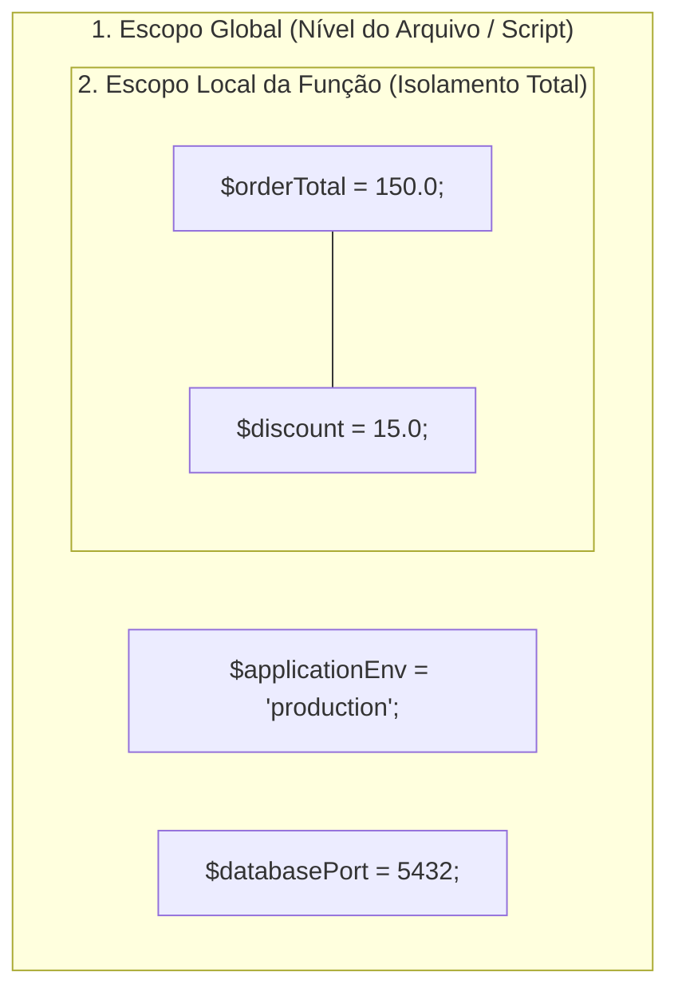
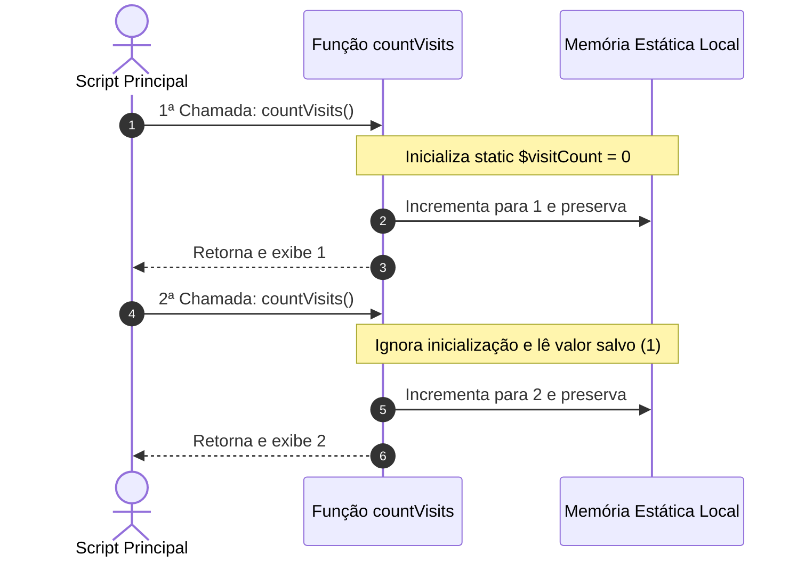

# 12. Escopo de Variáveis

No capítulo anterior, aprendemos a modularizar nosso código criando funções com
parâmetros tipados, contratos de retorno e argumentos nomeados.

No entanto, conforme nossas aplicações crescem e dividimos a lógica em múltiplos
arquivos e funções, surge uma questão fundamental de arquitetura de software:

> _"Onde exatamente uma variável nasce, onde ela pode ser acessada e quando ela
> é destruída da memória durante o ciclo de uma requisição?"_

Se todas as variáveis fossem visíveis por qualquer parte do programa a qualquer
instante, um sistema com milhares de linhas rapidamente entraria em colapso
devido a colisões de nomes e mutações acidentais de estado.

Neste capítulo, vamos compreender as regras que regem a visibilidade no PHP: o
**Isolamento Estrito de Escopo**, os riscos da palavra-chave `global` e da
superglobal `$GLOBALS`, a persistência controlada de **Variáveis Estáticas
Locais (`static`)** e a acessibilidade universal de constantes.

## O Conceito de Escopo e o Modelo de Isolamento do PHP

**Escopo** é o conjunto de regras que determina a visibilidade e a
acessibilidade de identificadores (variáveis, constantes e funções) no código.
Ele atua como uma barreira de proteção entre diferentes partes do sistema.

No PHP, existem dois níveis principais de escopo para variáveis:



### 1. Escopo Global

Variáveis declaradas na raiz de um script (fora de qualquer função ou classe)
pertencem ao **escopo global**. Elas vivem na memória durante a execução daquele
arquivo principal.

### 2. Escopo Local de Função (Isolamento Estrito)

Variáveis declaradas dentro de uma função (incluindo seus parâmetros formais)
pertencem **exclusivamente ao escopo local** daquela função.

> **A Barreira de Isolamento Padrão do PHP:**
>
> Por padrão de design da linguagem, **uma função no PHP NÃO tem acesso a
> variáveis criadas no escopo global**. Da mesma forma, o escopo global não
> consegue enxergar as variáveis internas de nenhuma função.

Veja o impacto dessa barreira no código:

```php
<?php

declare(strict_types=1);

$taxRate = 0.10; // Variável no escopo global

// ❌ ERRO COMUM: Tentar acessar a variável global diretamente dentro da função
function calculateTotalWithTax(float $basePrice): float
{
    // $taxRate NÃO existe dentro deste escopo local!
    // Warning: Undefined variable $taxRate
    return $basePrice * (1 + $taxRate);
}

// calculateTotalWithTax(100.0);
```

Para que a função opere sobre valores externos, a **prática padrão e segura** é
passar o dado explicitamente como parâmetro:

```php
<?php

declare(strict_types=1);

$taxRate = 0.10;

// ✅ RECOMENDADO: Passagem explícita via parâmetro tipado
function calculateTotalWithTax(float $basePrice, float $taxRate): float
{
    return $basePrice * (1 + $taxRate);
}

$finalTotal = calculateTotalWithTax(100.0, $taxRate);
echo "Total com taxa: R$ {$finalTotal}\n"; // Total com taxa: R$ 110
```

## E as Estruturas de Controle? A Ausência de Escopo de Bloco

Um detalhe técnico essencial que todo desenvolvedor precisa saber sobre o PHP é
que **a linguagem NÃO possui escopo de bloco**.

Diferente de muitas linguagens onde qualquer par de chaves `{ ... }` cria uma
região isolada de memória, no PHP as estruturas condicionais (`if`, `elseif`,
`else`, `switch`) e os laços de repetição (`for`, `while`, `foreach`) **não
criam um novo escopo para variáveis**.

Toda variável declarada dentro de um bloco `{ ... }` pertence, na verdade, ao
**escopo da função onde ela está contida** (ou ao escopo global, se estiver na
raiz do script):

```php
<?php

declare(strict_types=1);

$isEligible = true;

if ($isEligible) {
    // Declarada dentro do bloco 'if':
    $discountCoupon = "FATEC2026";
}

// ✅ ACESSÍVEL: A variável não ficou presa ao bloco 'if' e pode ser lida aqui:
echo "Cupom disponível: {$discountCoupon}\n"; // Cupom disponível: FATEC2026
```

### A Armadilha de Sobrevivência de Variáveis em Laços (`foreach`)

Como não há escopo de bloco, a variável utilizada para percorrer elementos em um
laço **permanece viva na memória mesmo após o laço ter terminado**, retendo o
valor da sua última iteração:

```php
<?php

declare(strict_types=1);

$frameworks = ["Laravel", "Symfony", "Slim"];

foreach ($frameworks as $framework) {
    // Processamento de cada item...
}

// ⚠️ AVISO: $framework continua existindo na memória valendo "Slim"!
echo "Último valor retido: {$framework}\n"; // Último valor retido: Slim
```

### Boas Práticas para Evitar Falhas de Inicialização

1. **Inicialização Prévia de Variáveis Condicionais:** Se uma variável for
   preenchida apenas dentro de um `if`, inicialize-a com um valor padrão ou
   `null` antes da estrutura condicional. Isso impede alertas de `Undefined
variable` caso a condição seja falsa:

   ```php
   $userAddress = null; // Inicialização preventiva

   if ($hasDelivery) {
       $userAddress = "Av. Paulista, 1000";
   }
   ```

2. **Não Reutilize Variáveis de Iteração:** Evite utilizar o mesmo nome de
   variável do `foreach` em linhas posteriores do script para não operar sobre
   resíduos do laço.

## A Palavra-chave `global` e a Superglobal `$GLOBALS`

O PHP oferece mecanismos para furar a barreira de isolamento e acessar variáveis
do escopo global dentro de funções.

### 1. A Instrução `global`

Ao declarar `global $nomeDaVariavel;` dentro de uma função, o PHP cria um
apontador local que se conecta diretamente à variável de mesmo nome existente no
escopo global:

```php
<?php

declare(strict_types=1);

$applicationVersion = "v2.4.1";

function displaySystemVersion(): void
{
    global $applicationVersion; // Importa a variável global para o escopo local
    echo "Versão ativa: {$applicationVersion}\n";
}

displaySystemVersion(); // Versão ativa: v2.4.1
```

### 2. O Array Superglobal `$GLOBALS`

O interpretador mantém um array associativo pré-definido chamado **`$GLOBALS`**,
onde as chaves são os nomes de todas as variáveis globais atualmente na memória:

```php
<?php

declare(strict_types=1);

$userRole = "admin";

function checkAdminAccess(): bool
{
    // Acessa a variável global diretamente através do array $GLOBALS:
    return $GLOBALS["userRole"] === "admin";
}

var_dump(checkAdminAccess()); // bool(true)
```

### Por Que o Uso de `global` e `$GLOBALS` É um Anti-Padrão?

Embora funcionem tecnicamente, o uso de variáveis globais dentro de funções é
considerado uma **má prática gravíssima na engenharia de software moderna**:

1. **Acoplamento Oculto:** A assinatura da função `checkAdminAccess()` parece
   não depender de nada, mas ela quebra se a variável `$userRole` não existir do
   lado de fora;
2. **Efeitos Colaterais Imprevisíveis:** Se uma função alterar uma variável
   global, todas as outras partes do sistema serão afetadas sem aviso;
3. **Dificuldade Extrema em Testes Unitários:** Testar uma função que depende de
   estado global exige configurar e limpar o ambiente global antes e depois de
   cada teste.

> **Regra de Ouro da Arquitetura:**
>
> **Nunca utilize a instrução `global` ou o array `$GLOBALS` em regras de
> negócio.** Se uma função precisa de uma informação externa, receba-a como
> **parâmetro** na assinatura. Se precisa emitir um resultado, devolva-o com
> **`return`**.

## Variáveis Estáticas Locais (`static`)

Normalmente, quando uma função encerra sua execução, **todas as suas variáveis
locais são descartadas da memória Stack**. Se a função for chamada novamente,
essas variáveis nascem do zero com seus valores iniciais:

```php
<?php

declare(strict_types=1);

function countVisits(): void
{
    $visitCount = 0; // Reinicializada a cada invocação
    $visitCount += 1;
    echo "Visitas: {$visitCount}\n";
}

countVisits(); // Visitas: 1
countVisits(); // Visitas: 1 (o valor anterior foi perdido!)
```

### Retendo Estado Local com a Palavra-chave `static`

Quando precisamos que uma variável local **mantenha o seu valor entre chamadas
consecutivas da mesma função sem vazar para o escopo global**, declaramos a
variável com a palavra-chave **`static`**:

```php
<?php

declare(strict_types=1);

function countVisits(): void
{
    // A inicialização (= 0) ocorre apenas na PRIMEIRA execução:
    static $visitCount = 0;

    $visitCount += 1;
    echo "Visitas acumuladas: {$visitCount}\n";
}

countVisits(); // Visitas acumuladas: 1
countVisits(); // Visitas acumuladas: 2
countVisits(); // Visitas acumuladas: 3
```



### Casos de Uso Legítimos para Variáveis `static`

As variáveis estáticas locais são ferramentas poderosas quando utilizadas com
parcimônia em cenários específicos:

#### 1. Cache Local em Memória (_Memoization_ Simples)

Evita recalcular ou reprocessar dados caros quando a entrada já foi processada
anteriormente na mesma requisição:

```php
<?php

declare(strict_types=1);

function getCachedConfiguration(): array
{
    // O array é carregado apenas na primeira chamada:
    static $configCache = null;

    if ($configCache === null) {
        // Simula leitura de arquivo ou cálculo custoso:
        $configCache = [
            "driver" => "pgsql",
            "host" => "db.interno.fatec",
            "timeout" => 30,
        ];
    }

    return $configCache;
}

$conf1 = getCachedConfiguration(); // Executa o carregamento
$conf2 = getCachedConfiguration(); // Retorna o cache instantaneamente da memória
```

#### 2. Geradores de Identificadores Sequenciais Únicos

Útil para criar identificadores incrementais em fixtures de testes ou logs
locais:

```php
<?php

declare(strict_types=1);

function generateNextSequenceId(): int
{
    static $currentSequence = 1000;
    $currentSequence += 1;
    return $currentSequence;
}

echo generateNextSequenceId(); // 1001
echo generateNextSequenceId(); // 1002
echo generateNextSequenceId(); // 1003
```

## Constantes: Acessibilidade Universal Segura

Diferente de variáveis comuns, as **constantes** (declaradas com `const` ou
`define()`) possuem **visibilidade global universal por padrão**.

Como as constantes são estritamente **imutáveis**, lê-las dentro de qualquer
função é uma operação 100% segura que não gera risco de efeitos colaterais:

```php
<?php

declare(strict_types=1);

const APP_DEFAULT_CURRENCY = "BRL";
const MAX_DISCOUNT_PERCENTAGE = 30.0;

function formatProductPrice(float $amount, float $discount): string
{
    // ✅ PERMITIDO E SEGURO: Constantes são acessíveis em qualquer escopo
    if ($discount > MAX_DISCOUNT_PERCENTAGE) {
        $discount = MAX_DISCOUNT_PERCENTAGE;
    }

    $finalAmount = $amount * (1 - ($discount / 100));
    return APP_DEFAULT_CURRENCY . " " . number_format($finalAmount, 2, ",", ".");
}

echo formatProductPrice(200.0, 15.0); // BRL 170,00
```

## Resumo dos Níveis de Escopo no PHP

| Tipo de Identificador       | Onde É Declarado?            | Onde Pode Ser Lido?                  | Vida Útil na Memória RAM                |
| :-------------------------- | :--------------------------- | :----------------------------------- | :-------------------------------------- |
| **Variável Global**         | Na raiz do script            | No script raiz (ou com `global`)     | Durante toda a requisição HTTP          |
| **Variável Local**          | Dentro de uma função         | Apenas dentro daquela função         | Destruída assim que a função retorna    |
| **Parâmetro de Função**     | Na assinatura da função      | Apenas dentro daquela função         | Destruído assim que a função retorna    |
| **Variável Estática Local** | Na função com `static`       | Apenas dentro daquela função         | Preservada entre chamadas da função     |
| **Constante**               | Na raiz com `const`/`define` | Em qualquer lugar (escopo universal) | Imutável durante toda a requisição HTTP |

> **Regras de Ouro:**
>
> 1. Respeite o isolamento de escopo: **nunca dependa de `global` ou
>    `$GLOBALS`** para transferir dados para dentro de funções.
> 2. Sempre passe informações para funções através de **parâmetros tipados** e
>    retorne novos dados explicitamente com **`return`**.
> 3. Utilize variáveis locais **`static`** apenas quando houver necessidade
>    genuína de retenção de estado entre chamadas (como caches em memória ou
>    geradores de sequência).
> 4. Use **constantes** para valores de configuração e tabelas fixas que
>    precisam ser acessadas globalmente sem risco de alteração.
> 5. Lembre-se de que o PHP **não possui escopo de bloco**: variáveis criadas
>    dentro de `if`s ou laços `foreach` pertencem ao escopo da função (ou
>    script) circundante.

## O Que Vem a Seguir?

Até agora, assumimos que nossas funções recebem dados perfeitos e operam sem
falhas. No entanto, em sistemas reais de backend, imprevistos acontecem
constantemente: conexões de rede caem, arquivos não existem no disco e dados
inválidos chegam em requisições de clientes.

No próximo capítulo, vamos aprender sobre **Tratamento de Erros e Exceções**,
compreendendo a árvore hierárquica `Throwable` (`Error` vs `Exception`), os
blocos de captura segura `try / catch / finally` e a criação de exceções
personalizadas de domínio.

---

<a href="11-declaracao-de-funcoes-e-parametros.md">← Declaração de Funções e
Parâmetros</a>

<p align="right"><a href="13-tratamento-de-erros-e-excecoes.md">Próximo: Tratamento de Erros e Exceções →</a></p>
