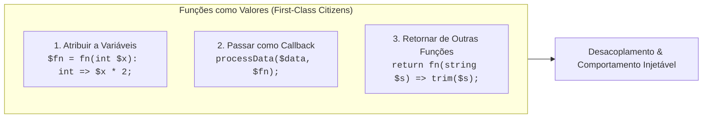
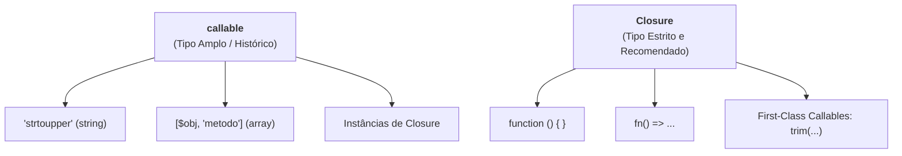

# 12. Funções de Primeira Classe e Callables

No capítulo anterior, dominamos a anatomia e a declaração formal de funções no
PHP, aprendendo a definir parâmetros tipados, contratos de retorno e argumentos
nomeados.

Agora daremos um dos passos conceituais mais importantes da programação moderna:
compreender como o PHP trata funções como **cidadãs de primeira classe**
(_First-Class Citizens_).

Em vez de trafegar apenas dados estáticos (números, textos, booleanos ou arrays)
entre as partes do sistema, podemos passar e retornar **comportamentos
customizáveis**. Essa capacidade é a base da arquitetura de software desacoplada
no backend — desde validações dinâmicas e middlewares de requisição até
transformações funcionais de coleções.

Neste capítulo, vamos compreender o conceito de funções como valores, dominar a
sintaxe de **Funções Anônimas** e **Arrow Functions (`fn() => ...`)**, explorar
o padrão de **Callbacks**, compreender a tipagem com `Closure` e `callable`, e
utilizar a moderna sintaxe de **First-Class Callables (`funcao(...)`)** do PHP
8.1+.



## O Que São Funções de Primeira Classe?

Dizer que funções são **cidadãs de primeira classe** (_First-Class Citizens_)
significa que a linguagem as trata como **valores em si** (da mesma forma que
trata inteiros, strings e objetos).

Elas desfrutam de todos os privilégios que qualquer outro tipo de dado possui:

1. Podem ser **armazenadas em variáveis e constantes**;
2. Podem ser **passadas como argumentos** (callbacks) para outras funções;
3. Podem ser **retornadas por outras funções** como resultado de um cálculo ou
   fábrica.

## Funções Anônimas (Sintaxe Clássica)

Uma **Função Anônima** é uma função sem identificador nominal no escopo global.
Ela é criada como uma expressão executável e atribuída diretamente a uma
variável:

```php
<?php

declare(strict_types=1);

// ✅ Atribuição de uma função anônima a uma variável
$formatCurrency = function (float $amount): string {
    return "R$ " . number_format($amount, 2, ",", ".");
};

// Invocação utilizando a variável seguida de parênteses:
echo $formatCurrency(1250.75) . "\n"; // Saída: R$ 1.250,75
```

> **Atenção à Sintaxe:** A declaração de uma função anônima atribuída a uma
> variável é uma instrução de atribuição comum, portanto exige o ponto e vírgula
> (`;`) após o fechamento da chave: `};`.

## Arrow Functions (`fn() => ...`)

Introduzidas no PHP 7.4, as **Arrow Functions** oferecem uma sintaxe enxuta e
expressiva para funções anônimas compostas por uma **expressão única**.

### Sintaxe e Retorno Implícito

Uma Arrow Function utiliza a palavra-chave `fn`, recebe parâmetros tipados e
retorna automaticamente o resultado produzido à direita do operador `=>`:

```php
<?php

declare(strict_types=1);

// ✅ Arrow Function com retorno implícito de expressão única
$calculateTax = fn(float $price, float $percentage): float => $price * ($percentage / 100);

echo "Taxa: R$ " . $calculateTax(200.0, 10.0) . "\n"; // Saída: Taxa: R$ 20.00
```

### Leitura Automática de Variáveis Externas

Diferente de funções anônimas clássicas, as Arrow Functions capturam variáveis
do escopo pai **automaticamente por valor**, sem necessidade de configuração
adicional:

```php
<?php

declare(strict_types=1);

$fixedDiscount = 25.0;

// A variável $fixedDiscount é lida diretamente na expressão
$applyDiscount = fn(float $price): float => $price - $fixedDiscount;

echo "Preço com desconto: R$ " . $applyDiscount(100.0) . "\n"; // Saída: R$ 75.00
```

## Tipagem de Funções: `callable` vs `Closure`

No PHP moderno, quando uma função recebe outra função como parâmetro, precisamos
declarar o tipo esperado no contrato:



No PHP, toda função anônima (`function () {}`) e Arrow Function (`fn() => {}`) é
uma instância da classe interna e final `Closure`.

Ao tipar parâmetros como `Closure`, impedimos que strings soltas arbitrárias
sejam passadas por engano, garantindo segurança estrita de tipos em tempo de
execução:

| Tipo           | O que aceita?                                                                                                                   | Quando utilizar?                                                                                 |
| :------------- | :------------------------------------------------------------------------------------------------------------------------------ | :----------------------------------------------------------------------------------------------- |
| **`callable`** | Aceita qualquer estrutura invocável: strings com nomes de funções (`'trim'`), arrays de método (`[$obj, 'metodo']`) e Closures. | Quando você precisa de compatibilidade com métodos legados ou referências procedurais em string. |
| **`Closure`**  | Aceita **estritamente** objetos da classe `Closure` (funções anônimas, Arrow Functions e First-Class Callables).                | **Recomendado:** Garante segurança total de tipos em código moderno com `strict_types=1`.        |

## O Padrão de Callbacks: Passando Comportamentos como Argumento

Um **Callback** (ou _função de retorno_) é uma função passada como argumento
para outra rotina, permitindo que o algoritmo principal delegue uma decisão ou
transformação para quem o chamou.

### Exemplo Prático: Formatador e Notificador

Imagine uma função responsável por enviar alertas no sistema. Em vez de engessar
a formatação do texto, ela recebe uma `Closure` customizada:

```php
<?php

declare(strict_types=1);

function sendNotification(string $message, Closure $formatter): void
{
    $formattedMessage = $formatter($message);
    echo "[SISTEMA]: {$formattedMessage}\n";
}

// 1. Definindo comportamentos específicos:
$shoutingFormatter = fn(string $text): string => strtoupper($text) . "!!!";
$whisperFormatter = fn(string $text): string => strtolower($text) . "...";

// 2. Passando funções previamente atribuídas a variáveis:
sendNotification("Atenção ao prazo de entrega", $shoutingFormatter);
// Saída: [SISTEMA]: ATENÇÃO AO PRAZO DE ENTREGA!!!

sendNotification("Manutenção preventiva agendada", $whisperFormatter);
// Saída: [SISTEMA]: manutenção preventiva agendada...

// 3. Passando uma Arrow Function anônima diretamente na chamada:
sendNotification("Operação concluída", fn(string $t): string => "✨ {$t} ✨");
// Saída: [SISTEMA]: ✨ Operação concluída ✨
```

Observe o poder do desacoplamento: a função `sendNotification` não precisa saber
_como_ a mensagem será formatada; ela apenas sabe que receberá uma função que
cumpre o contrato esperado.

## First-Class Callables no PHP 8.1+ (`funcao(...)`)

Frequentemente, o callback que desejamos passar já existe como uma função nativa
do PHP (`trim`, `strtoupper`, `intval`) ou como método de uma classe do projeto.

Antes do PHP 8.1, era necessário encapsular a chamada em uma Arrow Function
redundante (`fn($x) => trim($x)`) ou passar uma string solta (`'trim'`).

No PHP 8.1+, a sintaxe **First-Class Callable (`...`)** transforma qualquer
função ou método existente em um objeto `Closure` tipado e verificado
estaticamente:

```php
<?php

declare(strict_types=1);

// 1. Função nativa transformada em Closure tipada
$cleaner = trim(...);
echo $cleaner("   dados com espacos   ") . "\n"; // "dados com espacos"

// 2. Método de instância existente
class SlugGenerator
{
    public function generate(string $title): string
    {
        return strtolower(str_replace(" ", "-", trim($title)));
    }
}

$generator = new SlugGenerator();

// Captura o método amarrado à instância em uma Closure:
$makeSlug = $generator->generate(...);

echo $makeSlug("Curso Web FATEC") . "\n"; // "curso-web-fatec"
```

## Callbacks Opcionais e Invocação Segura

Em muitas rotinas de backend (como processamento de transações ou rotinas em
segundo plano), um callback de finalização ou log pode ser **opcional**
(`?Closure`).

Para invocar um callback anulável de forma segura sem disparar erros fatais
quando ele não for fornecido:

```php
<?php

declare(strict_types=1);

function executeTask(string $taskName, ?Closure $onComplete = null): void
{
    echo "Iniciando processamento de: {$taskName}...\n";

    // Simulação de processamento...

    // ✅ Invocação segura: executa apenas se o callback foi fornecido
    if ($onComplete !== null) {
        $onComplete("concluído com sucesso");
    }
}

// 1. Chamada fornecendo o callback:
executeTask("Backup Noturno", function (string $status): void {
    echo "Notificação: Tarefa finalizada com status '{$status}'.\n";
});

// 2. Chamada omitindo o callback opcional (executa sem falhas):
executeTask("Limpeza de Arquivos Temporários");
```

## Introdução a Funções de Alta Ordem (Fábricas)

Funções que recebem outras funções como argumentos ou que **retornam novas
funções** são chamadas na ciência da computação de **Funções de Alta Ordem**
(_Higher-Order Functions_ ou HOFs).

Podemos utilizar funções como **fábricas geradoras de regras especializadas**:

```php
<?php

declare(strict_types=1);

// Fábrica que gera funções multiplicadoras sob medida
function createMultiplier(int $factor): Closure
{
    return fn(int $value): int => $value * $factor;
}

// Criando funções especializadas a partir da fábrica:
$double = createMultiplier(2);
$triple = createMultiplier(3);

echo $double(10) . "\n"; // Saída: 20
echo $triple(10) . "\n"; // Saída: 30
```

No exemplo acima, a função retornada por `createMultiplier(2)` "lembra" do valor
do parâmetro `$factor` no momento em que foi criada. Esse mecanismo de retenção
de variáveis na memória é o princípio das **Closures**, que exploraremos a fundo
mais adiante no curso!

## O Que Vem a Seguir?

Neste capítulo, compreendemos como tratar funções como valores de primeira
classe, utilizando funções anônimas, Arrow Functions, First-Class Callables e
callbacks desacoplados.

No entanto, conforme passamos funções entre diferentes pontos da aplicação,
surge uma questão vital de arquitetura:

> _"Onde uma variável nasce na memória, até onde ela pode ser acessada e por que
> uma função no PHP não consegue enxergar variáveis externas por padrão?"_

No **[Capítulo 13: Escopo de Variáveis](13-escopo-de-variaveis.md)**, vamos
desvendar o modelo de isolamento estrito de escopo do PHP, os riscos da
palavra-chave `global` e a persistência de variáveis `static` locais.

---

<a href="11-declaracao-de-funcoes-e-parametros.md">← Declaração de Funções e
Parâmetros</a>

<p align="right"><a href="13-escopo-de-variaveis.md">Próximo: Escopo de Variáveis →</a></p>
