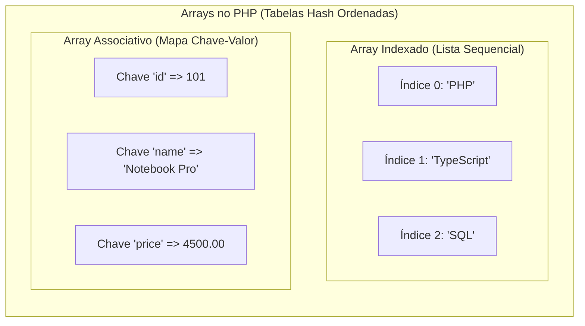
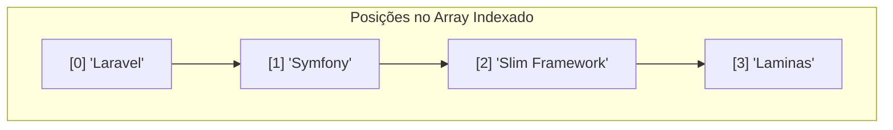
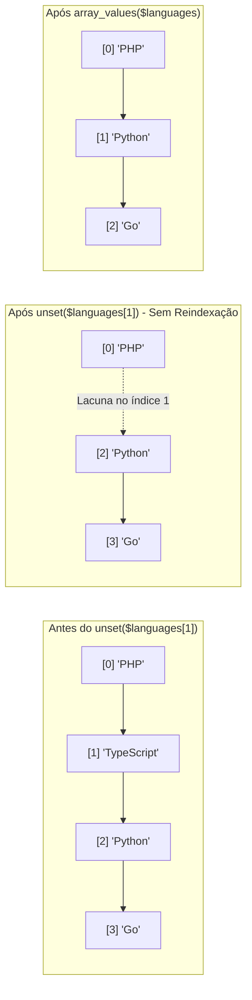

# 14. Arrays Indexados e Associativos

Nos capítulos anteriores, aprendemos a estruturar funções, blindar tipos
escalares, gerenciar o escopo de variáveis e tratar falhas de forma resiliente
com exceções.

No entanto, até agora nossos programas manipulavam valores atômicos e isolados.
No desenvolvimento backend real, lidamos a todo momento com conjuntos
estruturados de informações: listas de produtos em um carrinho de compras,
registros retornados por uma consulta ao banco de dados, cabeçalhos de uma
requisição HTTP ou as permissões de acesso de um usuário.

Neste capítulo, vamos dominar os **Arrays** no PHP: a dualidade entre **Arrays
Indexados** (listas sequenciais) e **Arrays Associativos** (mapas chave-valor),
sua estrutura interna de tabela hash ordenada (_HashTable_), a verificação
segura com `isset()` e `array_key_exists()`, e as armadilhas comuns de
manipulação como a remoção com `unset()`.



<details>
<summary>🔍 Por Baixo dos Panos: A Estrutura Zend HashTable e o Consumo de Memória</summary>

Diferente de linguagens como C ou Java — onde um array tradicional é um bloco
contíguo de memória de tamanho fixo contendo apenas elementos do mesmo tipo —,
no PHP todo array é internamente uma **HashTable (Tabela Hash Ordenada)**
mantida pela _Zend Engine_.

Isso significa que:

1. **Acesso O(1) em média:** Buscar um elemento pelo índice numérico ou por uma
   chave de texto possui custo de tempo constante.
2. **Preservação da ordem de inserção:** A engine mantém uma lista duplamente
   encadeada interna de ponteiros para garantir que a iteração (`foreach`)
   percorra os elementos exatamente na ordem em que foram adicionados,
   independentemente do valor das chaves.
3. **Gerenciamento dinâmico:** Os arrays crescem e encolhem sob demanda na
   memória _Heap_, sem que você precise pré-alocar capacidade inicial.
4. **Copy-on-Write (CoW):** Ao atribuir um array a uma nova variável ou passá-lo
   como argumento para uma função, o PHP não duplica a memória imediatamente. A
   cópia física dos dados só ocorre se uma das variáveis sofrer alteração
   (mutação).

</details>

## A Dor de Variáveis Isoladas vs A Necessidade de Coleções

Imagine que você está desenvolvendo o backend de um checkout de e-commerce e
precisa calcular o valor total de uma compra com múltiplos itens. Sem uma
estrutura de coleção, você seria forçado a criar variáveis soltas para cada
produto:

```php
<?php

declare(strict_types=1);

// ❌ Abordagem frágil: variáveis isoladas sem estrutura de coleção
$item1Name = "Teclado Mecânico";
$item1Price = 250.00;

$item2Name = "Mouse Ergonômico";
$item2Price = 180.00;

$item3Name = "Mousepad XL";
$item3Price = 80.00;

// O cálculo precisa referenciar cada variável manualmente
$totalPrice = $item1Price + $item2Price + $item3Price;

// E se o cliente adicionar o 4º, 10º ou 50º item?
// O código é rígido, não escala e impossibilita automação por laços de repetição!
```

Essa abordagem é inviável em cenários reais:

1. **Incapacidade de escala:** Você não sabe de antemão quantos itens o cliente
   colocará no carrinho. Criar variáveis `$item4`, `$item5`... `$itemN` é
   impossível em tempo de execução.
2. **Impossibilidade de iteração:** Variáveis soltas não podem ser percorridas
   dinamicamente por laços (`for`, `foreach`), forçando repetição massiva de
   código.
3. **Ausência de coesão:** Os dados do produto (nome e preço) ficam dispersos em
   identificadores desconexos, aumentando o risco de inconsistências.

Com arrays, agrupamos esses dados em uma única entidade manipulável:

```php
<?php

declare(strict_types=1);

// ✅ Abordagem robusta: coleção de dados coesa e dinamicamente iterável
$cartItems = [
    ["name" => "Teclado Mecânico", "price" => 250.00],
    ["name" => "Mouse Ergonômico", "price" => 180.00],
    ["name" => "Mousepad XL", "price" => 80.00],
];

$totalPrice = 0.0;
foreach ($cartItems as $item) {
    $totalPrice += $item["price"];
}

echo "Total do carrinho: R$ " . number_format($totalPrice, 2, ',', '.') . "\n";
```

## Arrays Indexados (Listas Sequenciais)

Um **Array Indexado** é uma lista ordenada de valores onde cada elemento é
identificado automaticamente por um índice numérico inteiro não negativo,
iniciando em zero (`0`).

### Sintaxe e Criação

No PHP moderno, utilizamos exclusivamente a sintaxe curta com colchetes (`[]`):

```php
<?php

declare(strict_types=1);

// ✅ Criação com colchetes (sintaxe moderna e padrão da indústria)
$backendLanguages = ["PHP", "TypeScript", "Go", "Python", "Rust"];

// Contagem do número total de elementos
$totalLanguages = count($backendLanguages);
echo "Total de linguagens cadastradas: {$totalLanguages}\n"; // 5
```

<details>
<summary>🔍 Sintaxe Legada: O Construtor array()</summary>

Em versões anteriores ao PHP 5.4, a declaração de arrays exigia o construto de
linguagem `array()`:

```php
<?php

// ❌ Sintaxe legada (evite em código novo)
$legacyList = array("PHP", "MySQL", "Apache");
```

Embora ainda seja interpretada pelo motor do PHP para manter
retrocompatibilidade, a sintaxe `array()` é considerada obsoleta pelas
convenções modernas da comunidade (PSR-12/PER Coding Style). Utilize sempre
colchetes `[]`.

</details>

### Acesso, Modificação e Inserção

Para acessar ou modificar um elemento, informamos o índice desejado entre
colchetes:

```php
<?php

declare(strict_types=1);

$frameworks = ["Laravel", "Symfony", "FastRoute"];

// 1. Acesso por índice (base 0)
echo "Framework principal: {$frameworks[0]}\n"; // Laravel
echo "Segundo framework: {$frameworks[1]}\n";   // Symfony

// 2. Modificação de um elemento existente
$frameworks[2] = "Slim Framework";

// 3. Inserção de um novo elemento no final da lista (colchetes vazios [])
$frameworks[] = "Laminas";

// O índice 3 é atribuído automaticamente
echo "Novo item adicionado no índice 3: {$frameworks[3]}\n"; // Laminas
```



## Arrays Associativos (Mapas Chave-Valor)

Enquanto arrays indexados utilizam posições numéricas sequenciais, os **Arrays
Associativos** permitem associar chaves textuais arbitrárias (_strings_) aos
seus respectivos valores.

Eles funcionam como dicionários ou mapas de dados, sendo a forma nativa do PHP
para representar registros estruturados, entidades e payloads de requisições.

### Sintaxe e Operador Double Arrow (`=>`)

A associação entre chave e valor é feita por meio do operador `=>` (_double
arrow_):

```php
<?php

declare(strict_types=1);

// ✅ Modelagem de um registro de cliente como array associativo
$customerProfile = [
    "id" => 1042,
    "fullName" => "Marina Albuquerque",
    "email" => "marina.albuquerque@example.com",
    "plan" => "Enterprise",
    "isActive" => true,
    "monthlyFee" => 289.90,
];

// 1. Acesso aos dados pela chave de texto
echo "Cliente: {$customerProfile['fullName']}\n";
echo "Plano atual: {$customerProfile['plan']}\n";

// 2. Atualização de um valor existente
$customerProfile["plan"] = "Enterprise Ultra";

// 3. Adição de um novo campo dinamicamente
$customerProfile["lastLoginAt"] = "2026-09-21 14:30:00";
```

### Remoção de Elementos com `unset()`

Para remover um elemento de um array (associativo ou indexado), utilizamos a
construção nativa `unset()`:

```php
<?php

declare(strict_types=1);

$userSession = [
    "userId" => 55,
    "ipAddress" => "192.168.1.100",
    "temporaryMfaToken" => "temp_xyz_9988",
    "isAuthenticated" => true,
];

// O token temporário deve ser descartado após validação
unset($userSession["temporaryMfaToken"]);

// A chave 'temporaryMfaToken' não existe mais no array
```

#### A Armadilha do `unset()` em Arrays Indexados

Remover um elemento de uma lista numérica com `unset($languages[1])` remove o
índice especificado, mas **não reorganiza** os índices subsequentes. Os índices
restantes tornam-se `[0, 2, 3]`, criando lacunas ("buracos"):

```php
<?php

declare(strict_types=1);

$languages = ["PHP", "TypeScript", "Python", "Go"];
unset($languages[1]); // Remove "TypeScript" no índice 1

// ❌ Tentar acessar $languages[1] gera Warning: Undefined array key 1!

// ✅ Solução 1: Itere sempre com foreach (independe de índices sequenciais)
foreach ($languages as $index => $lang) {
    echo "Posição {$index}: {$lang}\n";
}

// ✅ Solução 2: Para restaurar índices contíguos (0 a N-1), use array_values()
$reindexedLanguages = array_values($languages);
// $reindexedLanguages agora possui índices sequenciais: [0 => 'PHP', 1 => 'Python', 2 => 'Go']
```



## Verificação de Chaves e Operações Seguras

No PHP 8+, tentar acessar uma chave ou índice que não existe em um array dispara
uma mensagem de aviso (`Warning: Undefined array key ...`) e avalia a expressão
como `null`.

No desenvolvimento profissional, nunca devemos acessar posições incertas sem
antes verificar sua existência ou fornecer um valor padrão de contingência.

```php
<?php

// ❌ CÓDIGO PERIGOSO: Acesso cego a chaves não garantidas
$role = $userPayload["role"]; // Emite Warning se 'role' não foi enviada!
```

Para lidar com isso de forma segura, o PHP oferece operadores e funções de
inspeção:

### 1. O Operador Null Coalescing (`??`) e Atribuição (`??=`)

O operador `??` verifica se a chave existe e se o seu valor não é `null`. Caso a
chave não exista, ele retorna o valor padrão fornecido à direita sem disparar
nenhum aviso:

```php
<?php

declare(strict_types=1);

$requestPayload = [
    "title" => "Novo Artigo de Backend",
    "content" => "Conteúdo detalhado...",
    // O campo 'status' não foi informado pelo cliente da API
];

// ✅ Acesso seguro com valor fallback de contingência
$status = $requestPayload["status"] ?? "draft";
$category = $requestPayload["category"] ?? "general";

echo "Status definido: {$status}\n";       // "draft"
echo "Categoria: {$category}\n";            // "general"

// Atribuição de coalescência nula (??=): define a chave se ela não existir ou for null
$requestPayload["status"] ??= "draft";
```

### 2. O Duelo: `isset()` vs `array_key_exists()`

Quando precisamos inspecionar explicitamente a presença de uma chave em um
array, existem duas ferramentas com comportamentos distintos:

| Recurso                           | O que verifica?                                                    | Retorno se o valor for `null` |
| :-------------------------------- | :----------------------------------------------------------------- | :---------------------------- |
| `isset($arr['chave'])`            | Se a chave existe **E** seu valor é diferente de `null`            | `false`                       |
| `array_key_exists('chave', $arr)` | Se a chave **está registrada no mapa**, independentemente do valor | `true`                        |

Observe a diferença crítica em ação:

```php
<?php

declare(strict_types=1);

$systemConfig = [
    "debugMode" => true,
    "databasePort" => 3306,
    "customProxyUrl" => null, // Chave existe, mas o valor é explicitamente null
];

// 1. Teste com isset(): falha porque o valor é null!
if (isset($systemConfig["customProxyUrl"])) {
    echo "isset: Configuração encontrada.\n";
} else {
    echo "isset: Não definida ou é null.\n"; // <-- Este bloco será executado!
}

// 2. Teste com array_key_exists(): confirma com precisão que o campo existe no array
if (array_key_exists("customProxyUrl", $systemConfig)) {
    echo "array_key_exists: A chave existe no mapa de configurações!\n"; // <-- Executado!
}
```

> **Regra de Ouro:**
>
> Use `isset()` ou `??` para a grande maioria das verificações diárias onde você
> precisa garantir a existência e a utilidade do dado. Use `array_key_exists()`
> quando a presença da chave for semanticamente relevante para a regra de
> negócio, mesmo que seu valor seja explicitamente `null`.

## Arrays Multidimensionais e Aninhados

Como os arrays no PHP aceitam qualquer tipo de valor, é possível aninhar arrays
dentro de outros arrays, formando matrizes, árvores e estruturas de dados
complexas.

```php
<?php

declare(strict_types=1);

// Estrutura representando uma resposta de catálogo de e-commerce
$storeCatalog = [
    "category" => "Hardware",
    "updatedAt" => "2026-09-21",
    "products" => [
        [
            "sku" => "SSD-1TB-NVME",
            "name" => "SSD NVMe 1TB HighSpeed",
            "pricing" => [
                "cost" => 320.00,
                "retail" => 499.90,
                "currency" => "BRL",
            ],
            "inStock" => true,
            "tags" => ["storage", "fast-boot", "nvme"],
        ],
        [
            "sku" => "RAM-16GB-DDR5",
            "name" => "Memória RAM 16GB DDR5 5600MHz",
            "pricing" => [
                "cost" => 280.00,
                "retail" => 430.00,
                "currency" => "BRL",
            ],
            "inStock" => false,
            "tags" => ["memory", "ddr5"],
        ],
    ],
];

// Acesso encadeado aos níveis da estrutura
$firstProductName = $storeCatalog["products"][0]["name"];
$firstProductPrice = $storeCatalog["products"][0]["pricing"]["retail"];
$firstProductPrimaryTag = $storeCatalog["products"][0]["tags"][0];

echo "Produto: {$firstProductName}\n";             // SSD NVMe 1TB HighSpeed
echo "Preço: R$ {$firstProductPrice}\n";           // R$ 499.9
echo "Tag principal: {$firstProductPrimaryTag}\n"; // storage
```

## Boas Práticas: Evite Arrays Híbridos/Mistos

O PHP permite tecnicamente misturar índices numéricos inteiros e chaves de texto
no mesmo array. No entanto, criar estruturas híbridas sem um padrão formal torna
o código imprevisível, difícil de tipar e sujeito a comportamentos inesperados:

```php
<?php

// ❌ EVITE: Array híbrido caótico (mistura índices numéricos com strings)
$confusingArray = [
    0 => "Primeiro",
    "name" => "Serviço de Email",
    1 => "Segundo",
    "port" => 587,
];

// ✅ RECOMENDADO: Mantenha propósito único — ou é uma lista indexada homogênea, ou um mapa associativo
$orderedSteps = ["Primeiro", "Segundo"];
$serviceConfig = [
    "name" => "Serviço de Email",
    "port" => 587,
];
```

## O Que Vem a Seguir?

Neste capítulo, compreendemos a versatilidade dos arrays no PHP como listas
indexadas e mapas associativos, aprendendo a inspecionar chaves de forma segura
com `isset()` e `array_key_exists()`, além dos cuidados ao manipular índices com
`unset()`.

No [Capítulo 15: Desestruturação e Operador
Spread](15-desestruturacao-e-operador-spread.md), aprenderemos como extrair
dados de coleções de forma concisa com a sintaxe de desestruturação posicional e
associativa, e como compor e desempacotar arrays utilizando o _Spread Operator_
(`...`).

---

<a href="13-tratamento-de-erros-e-excecoes.md">← Tratamento de Erros e
Exceções</a>

<p align="right"><a href="15-desestruturacao-e-operador-spread.md">Próximo: Desestruturação e Operador Spread →</a></p>
