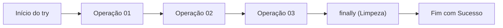
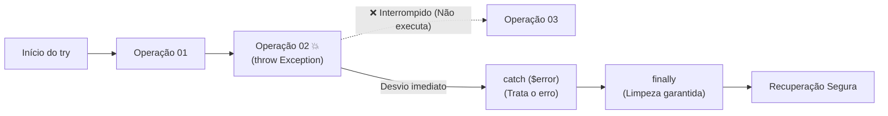
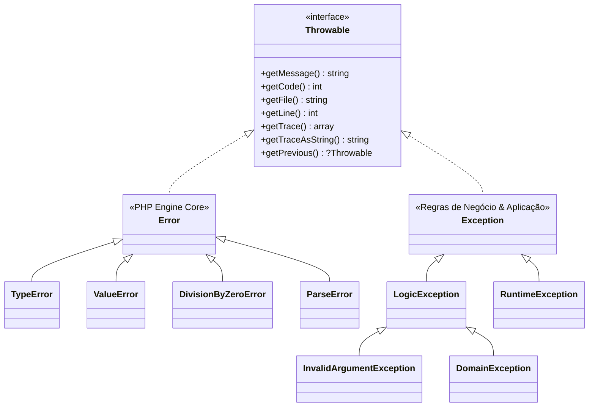

# 14. Tratamento de Erros e Exceções

No mundo ideal, todo cálculo matemático é exato, todo banco de dados está
acessível, arquivos nunca desaparecem e os usuários preenchem formulários com
perfeição. No mundo real do desenvolvimento backend, sistemas falham, redes
oscilam e entradas inesperadas acontecem a todo momento.

Escrever software robusto não significa impedir que erros aconteçam, mas sim
**controlar o que acontece quando algo dá errado**, garantindo que a aplicação
falhe de forma previsível e segura sem corromper dados ou interromper a execução
abruptamente.

**1. Fluxo Normal (Caminho Feliz):**



**2. Fluxo com Exceção (Ocorrência de Falha):**



<details>
<summary>🔍 O Histórico de Erros no PHP: De Warnings Legados a Exceções Modernas</summary>

Historicamente, o PHP utilizava níveis de notificação procedurais (`E_WARNING`,
`E_NOTICE`, `E_DEPRECATED`) disparados com funções como `trigger_error()`.
Nesses cenários, a execução continuava a menos que houvesse um `E_ERROR` fatal.

No PHP 8+, a linguagem realizou uma migração massiva para o paradigma orientado
a objetos:

1. Muitas funções internas que antes emitiam warnings agora disparam `TypeError`
   ou `ValueError`.
2. Funções legadas com o operador `@` (silenciador de erros) são desencorajadas
   porque dificultam o rastreamento de falhas.
3. Frameworks modernos configuram manipuladores globais (`set_error_handler`)
para converter qualquer aviso procedural residual em uma `ErrorException`,
unificando todo o ecossistema sob a árvore `Throwable`.
</details>

## A Dor dos Códigos de Retorno e Valores Sentinela

Antes da consolidação do modelo orientado a objetos e das exceções, o tratamento
de erros era baseado em **valores sentinela** — funções retornavam valores
especiais como `false`, `null`, `0` ou `-1` para indicar falha:

```php
declare(strict_types=1);

// ❌ Abordagem frágil: retorno sentinela
function divide(float $dividend, float $divisor): float|false
{
    if ($divisor === 0.0) {
        return false; // Como diferenciar falha de um cálculo válido?
    }

    return $dividend / $divisor;
}

$result = divide(10.0, 0.0);

// Obriga checagens manuais repetitivas a cada chamada
if ($result === false) {
    echo "Erro ao calcular divisão.\n";
} else {
    echo "Resultado: {$result}\n";
}
```

Essa abordagem traz problemas severos em aplicações reais:

1. **Poluição do fluxo principal:** O código de negócio fica soterrado por
   dezenas de `if ($res === false)` a cada linha.
2. **Ambiguidade de tipos:** Funções precisam retornar `float|false` ou
   `string|null`, forçando o consumidor a desempacotar tipos constantemente.
3. **Erros silenciosos:** Se o desenvolvedor esquecer de verificar o retorno, um
   valor booleano `false` segue adiante no sistema, gerando erros bizarros e
   difíceis de depurar muito longe de onde o problema realmente ocorreu.

## O Modelo de Exceções

O mecanismo de **Exceções** resolve esse problema separando o **caminho feliz**
(a lógica que deve rodar quando tudo dá certo) do **tratamento de anomalias**.

Quando uma condição anormal ocorre, a execução normal é interrompida
imediatamente e um objeto de erro é **lançado** (`throw`). O interpretador sobe
a pilha de execução (call stack) até encontrar um bloco preparado para
**capturar** (`catch`) e tratar o problema.

```php
declare(strict_types=1);

// ✅ Abordagem com exceções: contrato limpo e previsível
function divide(float $dividend, float $divisor): float
{
    if ($divisor === 0.0) {
        throw new InvalidArgumentException("O divisor não pode ser zero.");
    }

    return $dividend / $divisor;
}

try {
    $result = divide(10.0, 0.0);
    echo "Resultado: {$result}\n";
} catch (InvalidArgumentException $error) {
    echo "Falha na operação: " . $error->getMessage() . "\n";
}
```

Se o divisor for zero, a linha `echo "Resultado: ..."` nunca será executada; o
controle pula diretamente para o bloco `catch`.

## A Árvore de Erros do PHP Moderno: `Throwable`

No PHP moderno, todo objeto que pode ser lançado com `throw` e capturado com
`catch` implementa a interface interna **`Throwable`**.

Essa árvore divide-se em dois grandes ramos:



### 1. `Error` (Erros do Motor/Linguagem)

Representa falhas graves de execução disparadas pelo próprio interpretador do
PHP. Raramente devem ser lançados manualmente pelo desenvolvedor da aplicação.

- `TypeError`: Violação de tipo de parâmetro ou retorno (especialmente com
  `strict_types=1`).
- `ValueError`: Tipo correto fornecido, mas com valor inaceitável para a função
  interna (ex.: `json_decode(depth: 0)`).
- `DivisionByZeroError`: Divisão inteira ou resto de divisão por zero.
- `ParseError`: Erros de sintaxe ao avaliar código dinâmico.

### 2. `Exception` (Exceções de Aplicação e Domínio)

Representa condições excepcionais em tempo de execução que uma aplicação bem
projetada pode prever e tratar. É a classe base que você deve estender para
criar suas próprias regras de erro.

- `InvalidArgumentException`: Um argumento passado não atende às pré-condições
  da função.
- `RuntimeException`: Erros que só podem ser descobertos durante a execução
  (ex.: falha de rede, arquivo não encontrado, banco indisponível).
- `DomainException`: Violação de uma regra de negócio do domínio (ex.: tentativa
  de saque com saldo insuficiente).

<details>
<summary>🔍 Estendendo a Árvore: Criando Exceções Personalizadas</summary>

> Aprenderemos a fundo os conceitos de **Classes, Construtores e Herança** no
> bloco de Programação Orientada a Objetos (POO). Contudo, a mecânica básica
> para criar exceções específicas da sua regra de negócio é direta.

No desenvolvimento de sistemas profissionais, depender apenas de classes
genéricas como `Exception` ou `RuntimeException` empobrece a semântica do
código. Criar suas próprias classes permite capturar erros específicos com
precisão cirúrgica:

```php
declare(strict_types=1);

// 1. Definição da Exceção Customizada herdando de DomainException
class InsufficientFundsException extends DomainException
{
    public function __construct(
        private float $currentBalance,
        private float $attemptedAmount,
        string $message = "Saldo insuficiente para completar a transação."
    ) {
        parent::__construct($message);
    }

    public function getCurrentBalance(): float
    {
        return $this->currentBalance;
    }

    public function getAttemptedAmount(): float
    {
        return $this->attemptedAmount;
    }
}

// 2. Função de negócio lançando a exceção específica
function withdrawMoney(float &$balance, float $amount): void
{
    if ($amount > $balance) {
        throw new InsufficientFundsException(
            currentBalance: $balance,
            attemptedAmount: $amount,
            message: "Tentativa de saque de R$ {$amount} excede o saldo de R$ {$balance}."
        );
    }

    $balance -= $amount;
}

// 3. Consumo com Captura Semântica
$accountBalance = 100.0;

try {
    withdrawMoney($accountBalance, 250.0);
} catch (InsufficientFundsException $error) {
    echo "Operação negada: " . $error->getMessage() . "\n";
    echo "Saldo atual: R$ " . $error->getCurrentBalance() . "\n";
    echo "Tentativa de saque: R$ " . $error->getAttemptedAmount() . "\n";
}
```

</details>

## Anatomia do Bloco `try`, `catch` e `finally`

A estrutura completa de contenção é composta por três blocos:

```php
declare(strict_types=1);

try {
    echo "1. Tentando executar operação...\n";

    // Simulação de condição de falha
    $isConnected = false;
    if (!$isConnected) {
        throw new RuntimeException("Falha na conexão com o serviço.");
    }

    echo "2. Operação realizada com sucesso!\n";
} catch (RuntimeException $error) {
    // Executado apenas se ocorrer uma exceção compatível dentro do try
    echo "2. Falha interceptada: " . $error->getMessage() . "\n";
} finally {
    // Sempre executado (com ou sem erro), garantindo a limpeza
    echo "3. Bloco finally executado (liberação de recursos).\n";
}
```

### Quando usar o `finally`?

O bloco `finally` é ideal para tarefas de **limpeza e liberação de recursos**,
tais como:

- Fechar conexões ou arquivos abertos (`fclose`, desconectar sockets).
- Liberar locks de concorrência ou transações pendentes.
- Finalizar cronômetros ou registrar métricas de fim de execução.

O `finally` é executado **mesmo se houver um comando `return`** dentro do bloco
`try` ou `catch`.

## Múltiplos Blocos `catch` e Captura em União (Multi-catch)

Uma mesma rotina pode disparar diferentes categorias de falhas. Você pode
encadear blocos `catch` do mais específico para o mais genérico, ou agrupar
exceções com o operador pipe (`|`).

```php
declare(strict_types=1);

function processUserRegistration(string $email, int $age): void
{
    if (!filter_var($email, FILTER_VALIDATE_EMAIL)) {
        throw new InvalidArgumentException("Formato de e-mail inválido.");
    }

    if ($age < 18) {
        throw new DomainException("O cadastro exige idade mínima de 18 anos.");
    }

    echo "Usuário registrado com sucesso!\n";
}

try {
    processUserRegistration("usuario-invalido", 16);
} catch (InvalidArgumentException $error) {
    // Trata especificamente erro de formato/entrada
    echo "Erro de validação: " . $error->getMessage() . "\n";
} catch (DomainException $error) {
    // Trata especificamente regra de negócio
    echo "Regra violada: " . $error->getMessage() . "\n";
} catch (Throwable $error) {
    // Captura qualquer outra falha inesperada (fallback)
    echo "Erro crítico inesperado: " . $error->getMessage() . "\n";
}
```

### Captura Agrupada com Pipe (`|`)

Se o tratamento for idêntico para múltiplos tipos de exceção, você pode
combiná-los na mesma cláusula `catch`:

```php
declare(strict_types=1);

try {
    // Operação que pode lançar múltiplos tipos de erro de validação
    processUserRegistration("admin@local", 15);
} catch (InvalidArgumentException | DomainException $error) {
    // Trata ambos da mesma forma (ex.: retorno HTTP 422 - Unprocessable Entity)
    echo "Falha de validação ou regra de negócio: " . $error->getMessage() . "\n";
}
```

## Inspecionando o Objeto de Erro

Todo objeto derivado de `Throwable` fornece métodos essenciais para diagnóstico
e logging:

| Método                       | Retorno      | Descrição                                                             |
| :--------------------------- | :----------- | :-------------------------------------------------------------------- |
| `$error->getMessage()`       | `string`     | Retorna a mensagem descritiva do erro.                                |
| `$error->getCode()`          | `int`        | Retorna o código numérico do erro (se fornecido).                     |
| `$error->getFile()`          | `string`     | Retorna o caminho absoluto do arquivo onde a exceção foi lançada.     |
| `$error->getLine()`          | `int`        | Retorna o número da linha exata onde ocorreu o `throw`.               |
| `$error->getTrace()`         | `array`      | Retorna a pilha de chamadas (stack trace) como um array estruturado.  |
| `$error->getTraceAsString()` | `string`     | Retorna o stack trace formatado como texto legível para logs.         |
| `$error->getPrevious()`      | `?Throwable` | Retorna a exceção anterior que motivou esta (encadeamento de causas). |

Exemplo prático de extração de metadados para auditoria/log:

```php
declare(strict_types=1);

try {
    throw new RuntimeException("Serviço de pagamento indisponível.", 5003);
} catch (RuntimeException $error) {
    $logPayload = [
        "message" => $error->getMessage(),
        "code"    => $error->getCode(),
        "file"    => $error->getFile(),
        "line"    => $error->getLine(),
    ];

    echo "Log de Erro: [Código {$logPayload['code']}] {$logPayload['message']} em {$logPayload['file']}:{$logPayload['line']}\n";
}
```

<details>
<summary>🔍 Encadeamento de Exceções (Previous Exceptions)</summary>

Ao capturar uma exceção de infraestrutura de baixo nível (como um erro de
conexão PDO), é uma boa prática convertê-la em uma exceção de domínio mais
amigável, sem perder a causa raiz original. O PHP permite passar o `$previous`
no construtor:

```php
declare(strict_types=1);

class PaymentGatewayException extends RuntimeException {}

function chargeCustomer(string $customerId, float $amount): void
{
    try {
        // Simulação de chamada de rede que falha com erro nativo
        throw new RuntimeException("Connection timeout ao comunicar com a operadora de cartão.");
    } catch (RuntimeException $networkError) {
        // Envelopa o erro técnico em uma exceção de domínio, preservando o histórico
        throw new PaymentGatewayException(
            message: "Não foi possível processar o pagamento no momento.",
            code: 502,
            previous: $networkError
        );
    }
}

try {
    chargeCustomer("cust_12345", 99.90);
} catch (PaymentGatewayException $error) {
    echo "Mensagem para o cliente: " . $error->getMessage() . "\n";

    // Inspeciona a causa original para logs internos
    $rootCause = $error->getPrevious();
    if ($rootCause !== null) {
        echo "Causa técnica original: " . $rootCause->getMessage() . "\n";
    }
}
```

</details>

## Boas Práticas e Anti-Padrões

### 1. Nunca "engula" exceções silenciosamente

Capturar uma exceção e deixar o bloco `catch` vazio mascara bugs graves e torna
a depuração quase impossível.

```php
// ❌ Anti-padrão: erro engolido silenciosamente
try {
    saveDatabaseRecord($record);
} catch (Throwable $e) {
    // Nada aqui: o sistema parece que salvou, mas falhou!
}

// ✅ Recomendado: registre no log ou repasse o erro
try {
    saveDatabaseRecord($record);
} catch (Throwable $e) {
    error_log("Falha crítica ao persistir registro: " . $e->getMessage());
    throw $e; // Re-lança para a camada superior tratar
}
```

### 2. Não use exceções para controle normal de fluxo

Exceções são destinadas a situações **excepcionais**. Usá-las no lugar de
estruturas condicionais simples degrada o desempenho e torna o código confuso.

```php
// ❌ Anti-padrão: exceção usada como se fosse um if/else
try {
    $user = findUserById($id);
} catch (UserNotFoundException $e) {
    $user = createDefaultUser();
}

// ✅ Recomendado: retorno explícito de tipo anulável para casos esperados
$user = findUserById($id);

if ($user === null) {
    $user = createDefaultUser();
}
```

## O Que Vem a Seguir?

Com este capítulo, encerramos os fundamentos de funções, contratos de tipos,
isolamento de escopo e estratégias de tratamento de erros no PHP moderno. Você
agora possui todas as ferramentas para escrever rotinas previsíveis e
resilientes a falhas.

No próximo bloco, entraremos no coração do processamento de dados no PHP: as
**Coleções**. No [Capítulo 15: Arrays Indexados e
Associativos](15-arrays-indexados-e-associativos.md), exploraremos a
versatilidade dos arrays no PHP como listas ordenadas e mapas associativos
chave-valor, sua sintaxe moderna e as operações fundamentais do dia a dia
backend.

---

<a href="13-escopo-de-variaveis.md">← Escopo de Variáveis</a>

<p align="right"><a href="15-arrays-indexados-e-associativos.md">Próximo: Arrays Indexados e Associativos →</a></p>
