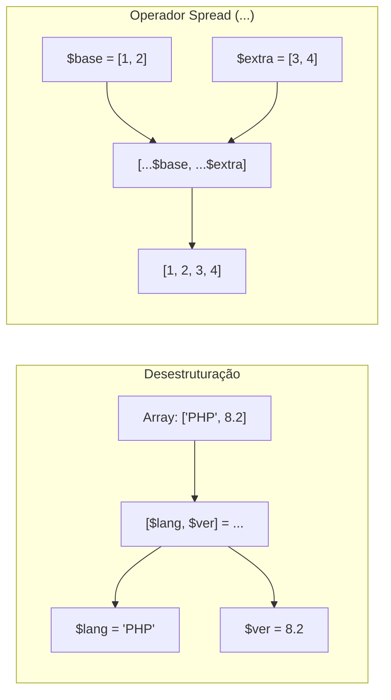
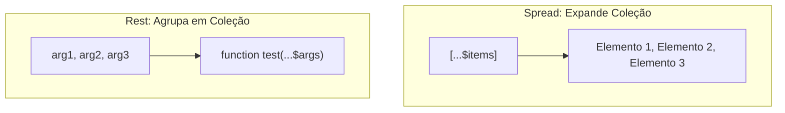

# 15. Desestruturação e Operador Spread

No capítulo anterior, aprendemos como os arrays atuam como a espinha dorsal de
coleções e mapas estruturados no PHP, permitindo agrupar listas de elementos e
dicionários chave-valor em uma única estrutura manipulável.

No entanto, conforme nossos sistemas recebem payloads de requisições HTTP,
configurações complexas ou registros de banco de dados, frequentemente
precisamos **extrair variáveis individuais de dentro dessas coleções** ou
**combinar múltiplos arrays de maneira expressiva e declarativa**.

Fazer isso acessando índices manuais repetidamente (`$name = $user['name'];
$email = $user['email'];`) torna o código verboso e propenso a ruídos
sintáticos.

Neste capítulo, vamos dominar duas ferramentas modernas do PHP que transformam a
manipulação de coleções: a **Desestruturação de Arrays** (posicional e
associativa) e o **Operador Spread / Rest (`...`)**, explorando desempacotamento
de listas, fusão de dicionários e passagem flexível de parâmetros em funções.



<details>
<summary>🔍 Evolução Histórica: Do construto list() à Desestruturação Simétrica com []</summary>

Historicamente (antes do PHP 7.1), a única forma nativa de desestruturar arrays
era por meio do construto `list()`:

```php
<?php

// ❌ Sintaxe histórica / legada:
list($first, $second) = ["Laravel", "Symfony"];
```

A partir do PHP 7.1, a linguagem introduziu a **Sintaxe Simétrica de Arrays com
Colchetes (`[]`)**, permitindo que a sintaxe usada para extrair valores espelhe
exatamente a sintaxe usada para declará-los. Além disso, o PHP 7.1 adicionou
suporte à desestruturação de **arrays associativos** por chave (`['key' =>
$var]`), tornando o uso de `list()` completamente obsoleto no PHP moderno.

</details>

## A Dor do Acesso Manual Repetitivo

Considere um cenário clássico onde um controller de API recebe um array contendo
dados de um formulário de cadastro:

```php
<?php

declare(strict_types=1);

$requestData = [
    "username" => "mariana_dev",
    "email" => "mariana@example.com",
    "role" => "admin",
    "country" => "Brasil",
];

// ❌ Abordagem repetitiva e verbosa: extração manual linha por linha
$username = $requestData["username"];
$email = $requestData["email"];
$role = $requestData["role"];

echo "Processando cadastro de {$username} ({$email}) com perfil {$role}.\n";
```

Embora funcione, essa abordagem apresenta desvantagens claras:

1. **Repetição de identificadores:** O nome da chave e a variável de destino
   precisam ser digitados repetidamente a cada campo extraído.
2. **Poluição visual:** Funções que recebem matrizes ou coordenadas passam a
   conter dezenas de linhas dedicadas unicamente a desempacotar dados antes de
   iniciar a lógica de negócio real.

Com a desestruturação, expressamos essa intenção de forma direta e compacta.

## Desestruturação Posicional (Arrays Indexados)

A desestruturação posicional mapeia os valores de um array indexado para
variáveis com base na sua ordem sequencial (da esquerda para a direita):

```php
<?php

declare(strict_types=1);

$httpResponse = [200, "OK", "application/json"];

// ✅ Desestruturação simétrica posicional
[$statusCode, $statusMessage, $contentType] = $httpResponse;

echo "Código: {$statusCode}\n";      // 200
echo "Mensagem: {$statusMessage}\n";  // OK
echo "Header: {$contentType}\n";      // application/json
```

### Ignorando Posições Específicas

Se você precisar apenas de determinados elementos da sequência, basta omitir o
identificador da variável, mantendo as vírgulas de separação:

```php
<?php

declare(strict_types=1);

$coordinates = [23.5505, 46.6333, 760.0]; // Latitude, Longitude, Altitude

// Extraímos apenas Latitude e Altitude, ignorando a Longitude (segunda posição)
[$latitude, , $altitude] = $coordinates;

echo "Latitude: {$latitude} | Altitude: {$altitude}m\n";
```

### Desestruturação Aninhada

Podemos espelhar matrizes e arrays aninhados de forma profunda:

```php
<?php

declare(strict_types=1);

$matrix = [
    [10, 20],
    [30, 40],
];

// Extração dos valores internos diretamente
[[$x1, $y1], [$x2, $y2]] = $matrix;

echo "Ponto 1: ({$x1}, {$y1}) | Ponto 2: ({$x2}, {$y2})\n"; // (10, 20) | (30, 40)
```

## Desestruturação Associativa (Arrays por Chave)

A **Desestruturação Associativa** permite extrair valores de um array nomeado
especificando o nome da chave correspondente, independentemente da ordem em que
as chaves foram declaradas no array original.

### Sintaxe Básica

A sintaxe utiliza o operador `=>` dentro dos colchetes de atribuição:

```php
<?php

declare(strict_types=1);

$account = [
    "id" => 8021,
    "balance" => 1500.50,
    "currency" => "BRL",
    "owner" => "Carlos Silva",
];

// ✅ Extração por chave para variáveis com nomes customizados
["owner" => $accountOwner, "balance" => $currentBalance] = $account;

echo "Titular: {$accountOwner}\n";   // Carlos Silva
echo "Saldo: R$ {$currentBalance}\n"; // 1500.5
```

> **Atenção:** As chaves que não forem listadas na desestruturação são
> simplesmente ignoradas, mantendo o código limpo e focado nos campos
> necessários.

> **Atenção ao Desestruturar Chaves Inexistentes:**
>
> Tentar desestruturar uma chave ausente em um array associativo dispara um
> `Warning: Undefined array key` e atribui `null` à variável correspondente.
> Utilize desestruturação quando a estrutura do array for contratualmente
> garantida (como retornos tipados ou payloads validados). Para entradas
> incertas, combine verificações prévias com `isset()` ou o operador `??`.

### Desestruturação Direta em Laços `foreach`

Um dos usos mais elegantes da desestruturação associativa e posicional no PHP
moderno ocorre diretamente no cabeçalho do laço `foreach`:

```php
<?php

declare(strict_types=1);

$customers = [
    ["id" => 1, "name" => "Ana Souza", "active" => true],
    ["id" => 2, "name" => "Bruno Lima", "active" => false],
    ["id" => 3, "name" => "Carla Dias", "active" => true],
];

// ✅ Desestruturação de cada registro diretamente na iteração
foreach ($customers as ["id" => $customerId, "name" => $customerName, "active" => $isActive]) {
    $statusLabel = $isActive ? "Ativo" : "Inativo";
    echo "[#{$customerId}] {$customerName} -> {$statusLabel}\n";
}
```

## O Operador Spread / Rest (`...`)

O operador de três pontos (`...`) desempenha dois papéis complementares no PHP:

1. **Spread (Espalhar / Desempacotar):** Expande os elementos de uma coleção
   dentro de outro array ou na chamada de uma função.
2. **Rest (Agrupar / Coletar):** Captura múltiplos argumentos individuais e os
   reúne dentro de um array formal (parâmetros variádicos).



### 1. Spread em Arrays Indexados

Permite concatenar e intercalar coleções de forma imutável, muito mais limpa do
que a função procedural `array_merge()`:

```php
<?php

declare(strict_types=1);

$baseHeaders = ["Content-Type: application/json", "Accept: application/json"];
$authHeaders = ["Authorization: Bearer token_xyz123"];

// ✅ Combinação imutável preservando a sequência exata
$allHeaders = [
    "X-Request-Id: req_9901",
    ...$baseHeaders,
    ...$authHeaders,
    "X-Client-Version: 2.4.0",
];

/*
Resultado:
[
    "X-Request-Id: req_9901",
    "Content-Type: application/json",
    "Accept: application/json",
    "Authorization: Bearer token_xyz123",
    "X-Client-Version: 2.4.0"
]
*/
```

### 2. Spread em Arrays Associativos (PHP 8.1+)

A partir do PHP 8.1, o operador spread foi expandido para aceitar arrays com
chaves em string.

Neste cenário, **chaves posteriores sobrescrevem chaves anteriores**, tornando o
operador ideal para compor configurações com valores padrão e sobreposições
customizadas:

```php
<?php

declare(strict_types=1);

$defaultDatabaseConfig = [
    "driver" => "pgsql",
    "host" => "localhost",
    "port" => 5432,
    "timeout" => 30,
];

$customEnvironmentConfig = [
    "host" => "db.production.internal", // Sobrescreve o localhost
    "timeout" => 60,                   // Sobrescreve os 30s
    "sslMode" => "require",             // Adiciona nova diretiva
];

// ✅ Fusão declarativa de mapas associativos
$resolvedConfig = [
    ...$defaultDatabaseConfig,
    ...$customEnvironmentConfig,
];

/*
$resolvedConfig conterá:
[
    "driver" => "pgsql",
    "host" => "db.production.internal",
    "port" => 5432,
    "timeout" => 60,
    "sslMode" => "require"
]
*/
```

### 3. Argument Unpacking (Desempacotamento na Chamada de Funções)

Podemos utilizar o operador `...` antes de um array ao invocar uma função para
que seus elementos sejam passados como argumentos individuais para os parâmetros
correspondentes:

```php
<?php

declare(strict_types=1);

function sendEmailNotification(string $recipient, string $subject, string $template): void
{
    echo "Enviando e-mail para {$recipient} | Assunto: '{$subject}' | Template: {$template}\n";
}

$emailPayload = [
    "dev@example.com",
    "Deploy Realizado com Sucesso",
    "deploy_success.html",
];

// ✅ Desempacota o array posicionalmente nos 3 parâmetros da função
sendEmailNotification(...$emailPayload);
```

Também funciona com arrays associativos através dos **Argumentos Nomeados** do
PHP 8+:

```php
<?php

declare(strict_types=1);

$namedPayload = [
    "template" => "alert.html",
    "recipient" => "security@example.com",
    "subject" => "Alerta de Segurança",
];

// ✅ Mapeia as chaves do array diretamente para os nomes dos parâmetros
sendEmailNotification(...$namedPayload);
```

### 4. Parâmetros Variádicos (Funções com Número Variável de Argumentos)

No lado da declaração da função, o operador `...` atua como **Rest Parameter**,
agrupando uma quantidade indeterminada de argumentos em um único array tipado:

```php
<?php

declare(strict_types=1);

// O parâmetro $numbers recebe todos os argumentos passados e os converte em um array int[]
function sumAll(int ...$numbers): int
{
    $accumulator = 0;
    foreach ($numbers as $number) {
        $accumulator += $number;
    }
    return $accumulator;
}

echo "Soma 1: " . sumAll(10, 20) . "\n";             // 30
echo "Soma 2: " . sumAll(5, 15, 25, 35, 45) . "\n";  // 125
echo "Soma 3: " . sumAll() . "\n";                   // 0
```

> **Regra de Assinatura Variádica:**
>
> O parâmetro variádico (`...`) deve ser **obrigatoriamente o último** na lista
> de parâmetros de uma função. Tentar declarar parâmetros fixos após um
> parâmetro variádico resulta em erro de compilação.
>
> ```php
> <?php
> // ❌ Erro de compilação:
> // function logEvents(string ...$events, string $logLevel): void {}
>
> // ✅ Correto: parâmetros fixos primeiro, variádico por último
> function logEvents(string $logLevel, string ...$events): void
> {
>     foreach ($events as $event) {
>         echo "[{$logLevel}] {$event}\n";
>     }
> }
> ```

## O Que Vem a Seguir?

Neste capítulo, vimos como extrair dados com precisão e elegância através da
desestruturação posicional e associativa, além de compor coleções e criar
assinaturas flexíveis de funções com o operador spread e parâmetros variádicos.

No [Capítulo 16: Funções de Primeira Classe, Closures e Arrow Functions](16-funcoes-de-primeira-classe-closures-e-arrow-functions.md),
daremos o próximo passo na programação funcional em PHP: entenderemos como
funções podem ser tratadas como valores, a captura explícita de escopo externo
com `use ($var)` em Closures e a sintaxe concisa de expressão única das _Arrow
Functions_ (`fn() => $val`).

---

<a href="14-arrays-indexados-e-associativos.md">← Arrays Indexados e
Associativos</a>

<p align="right"><a href="16-funcoes-de-primeira-classe-closures-e-arrow-functions.md">Próximo: Funções de Primeira Classe, Closures e Arrow Functions →</a></p>
