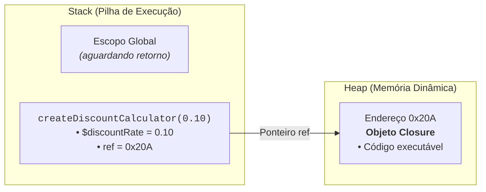
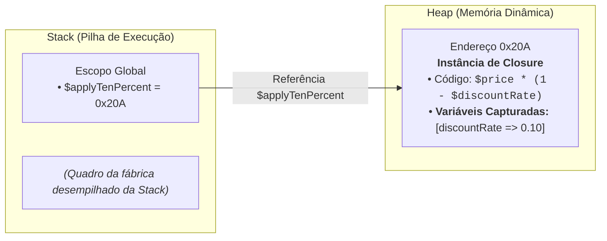
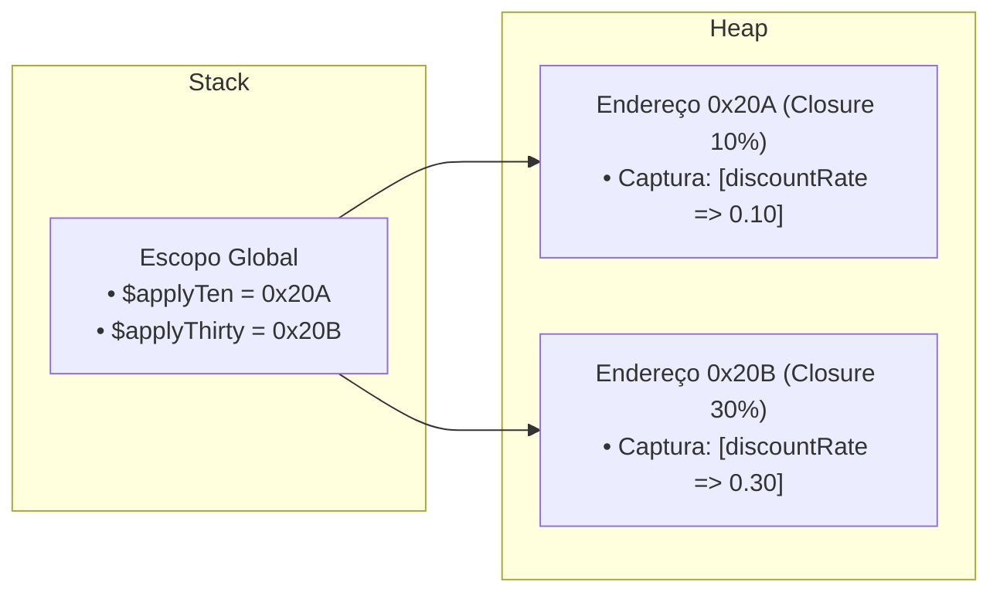

# 17. Closures e Fábricas de Funções

No [Capítulo 12](12-funcoes-de-primeira-classe-e-callables.md), aprendemos que
funções são cidadãs de primeira classe no PHP e podem ser atribuídas a
variáveis, passadas como argumentos e retornadas por outras funções. No
[Capítulo 13](13-escopo-de-variaveis.md), vimos as regras de isolamento de
escopo e o ciclo de vida das variáveis na memória. E, nos [Capítulos
15](15-arrays-indexados-e-associativos.md) e
[16](16-desestruturacao-e-operador-spread.md), dominamos a modelagem de coleções
estruturadas com arrays e desestruturação.

Agora, conectaremos todos esses blocos fundamentais para desvendar um dos
recursos mais expressivos do paradigma funcional no PHP: as **Closures** e as
**Fábricas de Funções** (_Function Factories_).

Com elas, aprenderemos a gerar funções dinâmicas sob medida, encapsular estados
privados de forma segura e criar predicados reutilizáveis para nossos pipelines
de processamento de dados.

## A Evolução da Generalização: De Funções Rígidas a Fábricas Dinâmicas

Imagine que você esteja desenvolvendo o módulo financeiro de um e-commerce para
calcular descontos sobre itens do catálogo. Em um primeiro momento ingênuo, você
poderia se deparar com a seguinte estrutura:

### Nível 0: Funções Rígidas e Repetitivas

```php
<?php

declare(strict_types=1);

// ❌ NÍVEL 0: Funções rígidas que repetem a mesma lógica matemática
function applyTenPercentDiscount(float $price): float
{
    return $price * 0.90;
}

function applyTwentyPercentDiscount(float $price): float
{
    return $price * 0.80;
}

function applyThirtyPercentDiscount(float $price): float
{
    return $price * 0.70;
}
```

O problema aqui é evidente: estamos duplicando a mesma estrutura de cálculo,
variando apenas o percentual de desconto.

### Nível 1: Parametrização de Dados (O Padrão Clássico)

A solução tradicional que aprendemos ao introduzir funções é **generalizar por
parâmetros**: extraímos o dado que varia (`$discountRate`) como argumento:

```php
<?php

declare(strict_types=1);

// 🔄 NÍVEL 1: Função genérica parametrizada por dados
function applyDiscount(float $price, float $discountRate): float
{
    return $price * (1.0 - $discountRate);
}

echo applyDiscount(100.0, 0.10) . "\n"; // 90 (10% de desconto)
echo applyDiscount(100.0, 0.30) . "\n"; // 70 (30% de desconto)
```

Isso resolve perfeitamente chamadas pontuais e avulsas onde todos os argumentos
são conhecidos no mesmo instante. No entanto, no desenvolvimento backend real,
frequentemente precisamos de **funções especializadas com comportamentos
pré-configurados** (como 10% para catálogo geral, 15% para clientes VIP e 30%
para Black Friday) para alimentar rotinas de processamento e pipelines
funcionais.

### O Novo Problema: Múltiplas Variações e Fragilidade de Regras de Negócio

Se precisarmos de diferentes comportamentos de desconto em múltiplos pontos do
sistema, poderíamos tentar criar funções anônimas manuais para cada taxa:

```php
<?php

declare(strict_types=1);

// ⚠️ Múltiplos callbacks manuais: a lógica de como aplicar o desconto é repetida
$applyStandardDiscount = fn(float $price): float => $price * (1.0 - 0.10);
$applyVipDiscount      = fn(float $price): float => $price * (1.0 - 0.15);
$applyBlackFriday      = fn(float $price): float => $price * (1.0 - 0.30);
```

Perceba os problemas dessa abordagem:

1. **Dispersão da Regra de Negócio:** A fórmula matemática e o comportamento
   estão espalhados e duplicados em cada callback criado.
2. **Fragilidade de Manutenção Extrema:** Se a estratégia de desconto mudar (por
   exemplo, se a empresa exigir arredondamento financeiro com `round($val, 2)`,
   aplicação de piso mínimo ou registro de auditoria), teremos que localizar e
   reescrever **todas** as funções criadas manualmente pelo código.

### Nível 2: Parametrização de Comportamento (Fábricas de Funções)

E se aplicarmos **a mesma lógica de generalização**, mas em vez de parametrizar
apenas dados para um cálculo imediato, parametrizarmos a **geração do próprio
comportamento**?

É exatamente isso que uma **Fábrica de Funções** (_Function Factory_) realiza:
ela centraliza a **estratégia e a regra de negócio em um único lugar**,
recebendo a configuração desejada e devolvendo uma nova função pré-configurada
sob medida:

```php
<?php

declare(strict_types=1);

// ✅ NÍVEL 2: Fábrica que encapsula a estratégia e gera funções especializadas
function createDiscountCalculator(float $discountRate): Closure
{
    // A regra/estratégia completa fica centralizada aqui:
    return function (float $price) use ($discountRate): float {
        $finalPrice = $price * (1.0 - $discountRate);
        return round($finalPrice, 2);
    };
}

// 1. Geramos funções especializadas reutilizáveis a partir da mesma estratégia central
$applyTenPercent = createDiscountCalculator(0.10);
$applyVipDiscount = createDiscountCalculator(0.15);
$applyBlackFriday = createDiscountCalculator(0.30);

$cartPrices = [100.0, 250.0, 400.0];
$catalogPrices = [80.0, 150.0, 300.0];

// 2. Passamos as funções diretamente por referência para qualquer rotina ou pipeline!
$discountedCart = array_map($applyTenPercent, $cartPrices);
$discountedCatalog = array_map($applyBlackFriday, $catalogPrices);

// Resultado:
// $discountedCart: [90.0, 225.0, 360.0]
// $discountedCatalog: [56.0, 105.0, 210.0]
```

Se amanhã a diretoria financeira mudar a estratégia de cálculo (por exemplo,
adicionar uma regra que impede que qualquer item saia por menos de R$ 5,00),
alteramos **apenas o corpo de `createDiscountCalculator`** e automaticamente
todas as funções geradas no sistema (`$applyTenPercent`, `$applyVipDiscount`,
`$applyBlackFriday`) passarão a aplicar a nova política com total consistência!

Mas como a função interna gerada sabe qual era o valor de `$discountRate`, se a
função criadora `createDiscountCalculator` já terminou de executar? A resposta
está no mecanismo das **Closures**.

## O Que É uma Closure?

Uma **Closure** (_fechamento léxico_) é a união de uma **função** com as
**variáveis do seu ambiente de criação** que foram capturadas no momento em que
a função foi definida.

Em termos práticos: **a função "lembra" das variáveis externas que foram
anexadas a ela**, mesmo quando for executada em outro ponto do programa ou muito
tempo após a função que a criou ter encerrado sua execução.

No [Capítulo 12](12-funcoes-de-primeira-classe-e-callables.md), vimos um exemplo
como este ao trabalhar com Arrow Functions:

```php
<?php

declare(strict_types=1);

$taxRate = 0.08;

// ✅ A Arrow Function lê $taxRate do escopo externo automaticamente:
$calculateTax = fn(float $amount): float => $amount * $taxRate;

echo "Taxa: R$ " . $calculateTax(500.0) . "\n"; // Taxa: R$ 40
```

Essa captura e leitura automática de `$taxRate` a partir do escopo pai é, na
verdade, um exemplo prático de **Closure** em ação!

### A Cláusula `use`: A Ponte Explícita do PHP

Enquanto em linguagens como JavaScript todas as funções capturam o escopo léxico
automaticamente, no PHP o modelo padrão de funções anônimas tradicionais
(`function () {}`) adota **isolamento estrito de escopo** (como estudamos no
[Capítulo 13](13-escopo-de-variaveis.md)).

Se tentarmos acessar diretamente uma variável do escopo externo sem autorização
explícita, o PHP emitirá um erro:

```php
<?php

declare(strict_types=1);

$taxRate = 0.08;

// ❌ ERRO: Funções anônimas tradicionais NÃO enxergam variáveis externas por padrão
$calculateTax = function (float $amount): float {
    return $amount * $taxRate; // ⚠️ Warning / Error: Undefined variable $taxRate
};
```

Para conectar e capturar uma variável do ambiente externo dentro da função
anônima tradicional, o PHP exige o uso explícito da cláusula **`use ($variavel)`**:

```php
<?php

declare(strict_types=1);

$taxRate = 0.08;

// ✅ A cláusula 'use' cria a ponte e vincula $taxRate ao escopo da Closure
$calculateTax = function (float $amount) use ($taxRate): float {
    return $amount * $taxRate;
};

echo "Taxa calculada: R$ " . $calculateTax(500.0) . "\n"; // Taxa calculada: R$ 40
```

## O Mecanismo de Memória: Como a Closure Funciona na Heap

Para compreender por que os dados capturados não desaparecem após o encerramento
da função criadora, precisamos analisar o modelo de execução da _Zend Engine_:

### 1. Durante a Execução da Fábrica

Quando invocamos `createDiscountCalculator(0.10)`, um quadro de execução é
empilhado na **Stack**. A variável local `$discountRate` é registrada na Stack,
enquanto o objeto nativo `Closure` é instanciado na memória **Heap**:



### 2. Após o `return` (A Captura da Memória)

Ao atingir o `return`, o quadro de `createDiscountCalculator` é desempilhado da
Stack e liberado.

No entanto, a cláusula `use ($discountRate)` faz com que o PHP empacote o valor
de `$discountRate` **dentro do próprio objeto `Closure` na Heap** (em uma tabela
interna de propriedades da instância).



Como a variável `$applyTenPercent` mantém uma referência ativa para o objeto
`0x20A`, a memória não é destruída pelo coletor de lixo (_Garbage Collector_).

### Múltiplas Instâncias e Isolamento de Estado

Cada chamada a uma função fábrica cria um **novo objeto `Closure` independente
na Heap**. Por isso, instâncias criadas com configurações diferentes operam de
forma 100% isolada:



## Captura por Valor vs Captura por Referência (`&`)

A forma como declaramos a cláusula `use` define o comportamento de mutação do
dado capturado:

### 1. Captura por Valor (Padrão)

Por padrão, a cláusula `use ($var)` cria uma **cópia independente** do valor da
variável no instante em que a Closure é instanciada. Alterações na variável
externa após a criação não afetam a função:

```php
<?php

declare(strict_types=1);

$systemPrefix = "[INFO]";

$logger = function (string $message) use ($systemPrefix): void {
    echo "{$systemPrefix} {$message}\n";
};

// Alteração externa após a criação da Closure:
$systemPrefix = "[CRITICAL]";

$logger("Servidor iniciado"); // Saída: [INFO] Servidor iniciado (manteve a cópia original!)
```

### 2. Captura por Referência com `&` (Encapsulamento de Estado Mutável)

Ao adicionar o caractere `&` antes da variável (`use (&$var)`), a Closure passa
a compartilhar o mesmo endereço de memória da variável externa. Isso permite que
a Closure **leia e altere o estado original**:

```php
<?php

declare(strict_types=1);

function createSequenceGenerator(int $startValue = 1): Closure
{
    $currentId = $startValue;

    // Captura $currentId por referência (&)
    return function () use (&$currentId): int {
        $generatedId = $currentId;
        $currentId += 1; // Incrementa e persiste o estado interno
        return $generatedId;
    };
}

$nextOrderId = createSequenceGenerator(1001);

echo "Pedido: " . $nextOrderId() . "\n"; // Pedido: 1001
echo "Pedido: " . $nextOrderId() . "\n"; // Pedido: 1002
echo "Pedido: " . $nextOrderId() . "\n"; // Pedido: 1003
```

Essa técnica permite encapsular **estado privado mutável** sem a necessidade de
instanciar classes completas para rotinas simples.

## Aplicações Práticas de Fábricas de Funções

### 1. Formatadores e Sanitizadores Reutilizáveis

Fábricas de funções são ideais para criar formatadores configurados uma única
vez:

```php
<?php

declare(strict_types=1);

function createCurrencyFormatter(string $symbol, int $decimals = 2): Closure
{
    return fn(float $value): string => $symbol . " " . number_format($value, $decimals, ",", ".");
}

$formatBRL = createCurrencyFormatter("R$", 2);
$formatUSD = createCurrencyFormatter("USD", 2);
$formatCrypto = createCurrencyFormatter("BTC", 6);

echo $formatBRL(1850.5) . "\n";    // R$ 1.850,50
echo $formatUSD(1850.5) . "\n";    // USD 1.850,50
echo $formatCrypto(0.045123) . "\n"; // BTC 0,045123
```

### 2. Geradores de Predicados Dinâmicos para Filtragem

Fábricas que geram predicados booleanos (`Closure: (array $item) => bool`)
tornam o código extremamente expressivo:

```php
<?php

declare(strict_types=1);

function createCategoryFilter(string $targetCategory): Closure
{
    return fn(array $product): bool => ($product["category"] ?? "") === $targetCategory;
}

function createPriceThresholdFilter(float $maxPrice): Closure
{
    return fn(array $product): bool => ($product["price"] ?? 0.0) <= $maxPrice;
}

$products = [
    ["name" => "Mouse Gamer", "category" => "perifericos", "price" => 150.0],
    ["name" => "Teclado Mecânico", "category" => "perifericos", "price" => 350.0],
    ["name" => "Monitor 24pol", "category" => "monitores", "price" => 800.0],
];

// Gerando regras dinâmicas
$isPeripheral = createCategoryFilter("perifericos");
$isAffordable = createPriceThresholdFilter(200.0);

// Filtragem combinada
$affordablePeripherals = array_filter(
    array_filter($products, $isPeripheral),
    $isAffordable
);
```

## Boas Práticas e Ciclo de Vida da Memória

1. **Evite Capturar Estruturas Excessivamente Pesadas:** Ao utilizar `use
($largePayload)`, a Closure mantém uma cópia ou referência a todo o volume de
   dados. Se a função precisar apenas de um identificador escalar, capture
   apenas esse identificador (`use ($userId)` em vez de `use
($entireUserArray)`).
2. **Prefira Arrow Functions para Lógicas Simples e Imutáveis:** Se a função for
   uma expressão única de leitura, a sintaxe `fn(...) => ...` é mais limpa e
   evita erros de digitação na lista de `use`.
3. **Use Captura por Referência (`&`) com Cautela:** Alterar variáveis externas
   através de closures introduz mutabilidade de estado. Utilize apenas quando o
   objetivo for explicitamente encapsular acumuladores ou geradores.

## O Que Vem a Seguir?

Neste capítulo, exploramos a mecânica interna das Closures, a retenção de escopo
na memória Heap e a composição elegante de Fábricas de Funções.

No [Capítulo 18: Funções Nativas de Manipulação de
Arrays](18-funcoes-nativas-de-manipulacao-de-arrays.md), colocaremos todas essas
técnicas funcionais em ação sobre coleções do mundo real: dominaremos as funções
`array_map`, `array_filter`, `array_reduce`, `in_array`, além de ordenações
customizadas com o **Operador Spaceship (`<=>`)** e `usort`.

---

<a href="16-desestruturacao-e-operador-spread.md">← Desestruturação e Operador
Spread</a>

<p align="right"><a href="18-funcoes-nativas-de-manipulacao-de-arrays.md">Próximo: Funções Nativas de Manipulação de Arrays →</a></p>
