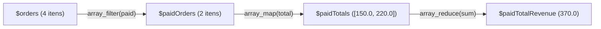
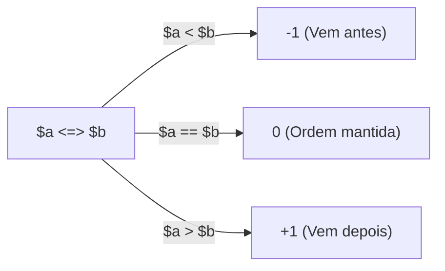

# 18. Funções Nativas de Manipulação de Arrays

Nos [Capítulos 15](15-arrays-indexados-e-associativos.md) e
[16](16-desestruturacao-e-operador-spread.md), dominamos a estrutura de arrays
no PHP, aprendendo a ler, inserir dados, desestruturar coleções e combinar
listas com o operador spread (`...`). Nos [Capítulos
12](12-funcoes-de-primeira-classe-e-callables.md) e
[17](17-closures-e-fabricas-de-funcoes.md), aprendemos a tratar funções como
valores e a gerar Closures sob medida.

Agora, uniremos esses fundamentos para explorar a **manipulação funcional e
declarativa de dados no PHP**.

Em vez de escrever laços imperativos manuais cheios de variáveis de controle e
acumuladores mutáveis, o PHP disponibiliza um conjunto poderoso de **funções de
alta ordem** embutidas (`array_map`, `array_filter`, `array_reduce`,
`array_column`, `in_array` e `usort`). Com elas, expressamos com clareza **o
que** queremos fazer com os dados, mantendo a previsibilidade e a legibilidade
do código.

## A Dor do Modelo Imperativo vs. Abordagem Declarativa

Imagine que sua aplicação backend receba de um banco de dados uma lista de
pedidos. Sua missão é:

1. Filtrar apenas os pedidos com status `"paid"` (pagos);
2. Extrair o valor total de cada pedido;
3. Somar todos os valores para calcular o faturamento consolidado.

No modelo imperativo clássico (com laço `foreach`), o código ficaria estruturado
assim:

```php
<?php

declare(strict_types=1);

$orders = [
    ["id" => "ORD-101", "customer" => "Alice", "total" => 150.0, "status" => "paid"],
    ["id" => "ORD-102", "customer" => "Bob",   "total" => 80.0,  "status" => "pending"],
    ["id" => "ORD-103", "customer" => "Carol", "total" => 220.0, "status" => "paid"],
    ["id" => "ORD-104", "customer" => "David", "total" => 50.0,  "status" => "cancelled"],
];

// ❌ ABORDAGEM IMPERATIVA: Variáveis mutáveis, laços manuais e lógica misturada
$paidTotalRevenue = 0.0;

foreach ($orders as $order) {
    if ($order["status"] === "paid") {
        $paidTotalRevenue += $order["total"];
    }
}

echo "Faturamento dos pedidos pagos: R$ {$paidTotalRevenue}\n"; // 370
```

Embora funcione, essa abordagem traz custos claros de manutenção:

1. **Mutabilidade Desnecessária:** A variável `$paidTotalRevenue` precisa ser
   iniciada como `0.0` e sofrer sucessivas mutações ao longo da iteração, o que
   pode produzir bugs silenciosos em programas maiores e mais complexos.
2. **Mistura de Responsabilidades:** O mesmo bloco de código está filtrando,
   extraindo valores e calculando a soma simultaneamente.
3. **Baixa Reutilização:** Se outro ponto do sistema precisar apenas da lista
   dos pedidos pagos (sem somar o faturamento), seremos forçados a duplicar a
   estrutura do laço `foreach`.

Com funções de manipulação funcional, separamos cada etapa do processamento de
forma declarativa e imutável:

```php
<?php

declare(strict_types=1);

// ✅ ABORDAGEM DECLARATIVA: Cada etapa tem um propósito único e previsível
$paidOrders = array_filter(
    $orders,
    fn(array $order): bool => $order["status"] === "paid"
);

$paidTotals = array_map(
    fn(array $order): float => $order["total"],
    $paidOrders
);

$paidTotalRevenue = array_reduce(
    $paidTotals,
    fn(float $acc, float $total): float => $acc + $total,
    0.0
);

echo "Faturamento dos pedidos pagos: R$ {$paidTotalRevenue}\n"; // 370
```



## A Inconsistência Histórica de Parâmetros no PHP

Antes de mergulhar em cada função, precisamos destacar uma particularidade
histórica do PHP: **a ordem dos parâmetros não é uniforme entre todas as funções
de array**.

Por motivos de evolução da linguagem ao longo de décadas, algumas funções
esperam a coleção como primeiro argumento, enquanto outras esperam o callback
primeiro:

| Função             | Assinatura Resumida                                              | Ordem dos Argumentos                    | Retorno                            |
| :----------------- | :--------------------------------------------------------------- | :-------------------------------------- | :--------------------------------- |
| **`array_map`**    | `array_map(callable $callback, array ...$arrays)`                | **Callback primeiro**, Array depois     | Novo `array` transformado          |
| **`array_filter`** | `array_filter(array $array, ?callable $callback)`                | **Array primeiro**, Callback depois     | Novo `array` filtrado              |
| **`array_reduce`** | `array_reduce(array $array, callable $callback, mixed $initial)` | **Array primeiro**, Callback depois     | Valor escalar ou agregado          |
| **`usort`**        | `usort(array &$array, callable $callback)`                       | **Array primeiro (&)**, Callback depois | `bool` (modifica o array original) |
| **`in_array`**     | `in_array(mixed $needle, array $haystack, bool $strict)`         | **Item buscado**, Array depois          | `bool`                             |

> **Dica Mnemônica para Memorização:**
>
> Apenas **`array_map`** recebe o callback como primeiro parâmetro (porque ela
> permite passar múltiplos arrays subsequentes para mapeamento conjunto). A
> maioria das outras funções nativas (`array_filter`, `array_reduce`, `usort`)
> recebe o array no primeiro argumento.

## 1. Transformação de Dados com `array_map()`

A função `array_map()` aplica uma função de transformação a cada elemento de um
array, devolvendo um **novo array** com exatamente o mesmo número de itens, sem
modificar o array de entrada.

### Sintaxe e Funcionamento

```php
<?php

declare(strict_types=1);

$pricesInCents = [1500, 3200, 4990, 12000];

// Converte centavos para reais formatados
$formattedPrices = array_map(
    fn(int $cents): string => "R$ " . number_format($cents / 100, 2, ",", "."),
    $pricesInCents
);

print_r($formattedPrices);
// Array
// (
//     [0] => R$ 15,00
//     [1] => R$ 32,00
//     [2] => R$ 49,90
//     [3] => R$ 120,00
// )
```

### Mapeando Estruturas Complexas (Arrays Associativos)

No contexto de APIs backend, `array_map()` é excelente para gerar _Data Transfer
Objects_ (DTOs) ou sanitizar payloads antes de responder a requisições HTTP:

```php
<?php

declare(strict_types=1);

$rawUsers = [
    ["id" => 1, "first_name" => " ana ", "last_name" => "SILVA", "role" => "admin"],
    ["id" => 2, "first_name" => "CARLOS", "last_name" => "souza", "role" => "editor"],
];

$sanitizedUsers = array_map(function (array $user): array {
    $fullName = trim($user["first_name"]) . " " . trim($user["last_name"]);

    return [
        "id"       => $user["id"],
        "name"     => ucwords(strtolower($fullName)),
        "isAdmin"  => $user["role"] === "admin",
    ];
}, $rawUsers);

print_r($sanitizedUsers);
// Array
// (
//     [0] => Array ( [id] => 1 [name] => Ana Silva [isAdmin] => 1 )
//     [1] => Array ( [id] => 2 [name] => Carlos Souza [isAdmin] => )
// )
```

<details>
<summary>Aprofundamento: Mapeando múltiplos arrays simultaneamente</summary>

A função `array_map()` pode receber mais de um array passado como argumento.
Nesse caso, a operação segue as seguintes regras de execução:

1. **Pareamento Paralelo por Índice (_Zip_):** A combinação **não** é um produto
   cartesiano. O PHP itera em paralelo, passando os elementos de mesmo índice de
   cada array para os parâmetros correspondentes do callback (`($arr1[0],
$arr2[0])`, `($arr1[1], $arr2[1])`, e assim por diante).
2. **Arrays de Tamanhos Diferentes:** A iteração continua até o tamanho do
   **maior array**. Os arrays menores são automaticamente estendidos e
   preenchidos com **`null`**.
3. **Atenção ao `TypeError` sob `strict_types=1`:** Se os arrays tiverem
   tamanhos diferentes e o callback declarar tipos não anuláveis (como `float
$price`), a passagem de `null` causará um `TypeError`. Use tipos anuláveis
   (`?float $price`) caso os arrays possam ter comprimentos desiguais.

```php
<?php

declare(strict_types=1);

$products = ["Mouse", "Teclado", "Monitor", "Webcam"];
$prices   = [150.0, 350.0, 900.0]; // Possui 1 item a menos

$catalog = array_map(
    function (string $prod, ?float $price): string {
        if ($price === null) {
            return "{$prod}: Sob Consulta";
        }

        return "{$prod}: R$ " . number_format($price, 2, ",", ".");
    },
    $products,
    $prices
);

print_r($catalog);
// Array
// (
//     [0] => Mouse: R$ 150,00
//     [1] => Teclado: R$ 350,00
//     [2] => Monitor: R$ 900,00
//     [3] => Webcam: Sob Consulta
// )
```

> **Dica Bônus (_Zip_ Nativo):** Passar `null` como callback em `array_map(null,
$arr1, $arr2)` cria uma matriz zipada combinando os pares `[[$arr1[0],
$arr2[0]], [$arr1[1], $arr2[1]], ...]`.

</details>

## 2. Filtragem de Dados com `array_filter()`

A função `array_filter()` itera sobre os elementos da coleção e submete cada um
a um predicado booleano (`callable(mixed $item): bool`). Se o callback retornar
`true`, o elemento é mantido; se retornar `false`, o elemento é descartado.

```php
<?php

declare(strict_types=1);

$scores = [45, 78, 92, 30, 85, 60];

// Mantém apenas pontuações de aprovação (>= 60)
$passingScores = array_filter(
    $scores,
    fn(int $score): bool => $score >= 60
);

print_r($passingScores);
// Array
// (
//     [1] => 78
//     [2] => 92
//     [4] => 85
//     [5] => 60
// )
```

### ⚠️ A Armadilha dos Índices Preservados e o Uso de `array_values()`

Observe com atenção a saída do exemplo anterior: os índices resultantes foram
`[1, 2, 4, 5]`, e **não** `[0, 1, 2, 3]`.

Por padrão, **o `array_filter()` preserva as chaves originais do array**.

No PHP puro isso raramente causa problemas, mas ao serializar a coleção para
**JSON** (como veremos no [Capítulo
19](19-manipulacao-de-json-e-serializacao.md)), um array com chaves não
sequenciais (`1, 2, 4, 5`) será convertido em um **Objeto JSON** (`{"1": 78,
"2": 92, ...}`) em vez de uma **Lista JSON** (`[78, 92, 85, 60]`).

Para reindexar a lista sequencialmente do `0` ao `N-1`, utilize
**`array_values()`**:

```php
<?php

declare(strict_types=1);

// ✅ Reindexa as chaves sequencialmente do 0 em diante:
$cleanPassingScores = array_values(array_filter(
    $scores,
    fn(int $score): bool => $score >= 60
));

print_r($cleanPassingScores);
// Array
// (
//     [0] => 78
//     [1] => 92
//     [2] => 85
//     [3] => 60
// )
```

<details>
<summary>Aprofundamento: Filtragem com chaves (ARRAY_FILTER_USE_KEY e ARRAY_FILTER_USE_BOTH)</summary>

Por padrão, o callback de `array_filter` recebe apenas o valor do elemento. Se
você precisar inspecionar a chave do array associativo, passe uma flag como
terceiro parâmetro:

```php
<?php

declare(strict_types=1);

$headers = [
    "Content-Type"  => "application/json",
    "X-Debug-Trace" => "true",
    "Authorization" => "Bearer token-abc",
    "X-Request-Id"  => "req-123",
];

// Filtra apenas cabeçalhos customizados com prefixo 'X-'
$customHeaders = array_filter(
    $headers,
    fn(string $key): bool => str_starts_with($key, "X-"),
    ARRAY_FILTER_USE_KEY
);

// Array: ["X-Debug-Trace" => "true", "X-Request-Id" => "req-123"]
```

</details>

## 3. Redução e Agregação com `array_reduce()`

A função `array_reduce()` processa a lista iterativamente, acumulando seus
elementos em um único valor final (que pode ser um número, uma string ou uma
nova estrutura de dados).

A assinatura do callback recebe dois parâmetros: `function (mixed $accumulator,
mixed $currentItem): mixed`.

### Exemplo 1: Somatório e Médias

```php
<?php

declare(strict_types=1);

$invoiceItems = [
    ["title" => "Hospedagem Cloud", "amount" => 120.0],
    ["title" => "Domínio Anual",     "amount" => 45.0],
    ["title" => "Certificado SSL",   "amount" => 80.0],
];

// Soma todos os itens iniciando o acumulador em 0.0
$totalInvoice = array_reduce(
    $invoiceItems,
    fn(float $acc, array $item): float => $acc + $item["amount"],
    0.0
);

echo "Total da Fatura: R$ " . number_format($totalInvoice, 2, ",", ".") . "\n"; // R$ 245,00
```

### Exemplo 2: Agrupamento de Dados por Categoria

O acumulador de `array_reduce` não precisa ser um tipo escalar: ele pode ser um
array associativo acumulando coleções agrupadas:

```php
<?php

declare(strict_types=1);

$transactions = [
    ["id" => 1, "type" => "credit", "value" => 500.0],
    ["id" => 2, "type" => "debit",  "value" => 150.0],
    ["id" => 3, "type" => "credit", "value" => 200.0],
    ["id" => 4, "type" => "debit",  "value" => 50.0],
];

// Agrupa as transações em 'credit' e 'debit'
$groupedTransactions = array_reduce(
    $transactions,
    function (array $acc, array $trx): array {
        $type = $trx["type"];
        $acc[$type][] = $trx; // Anexa a transação à chave correspondente
        return $acc;
    },
    ["credit" => [], "debit" => []] // Estado inicial
);

print_r($groupedTransactions);
// Array
// (
//     [credit] => Array ( [0] => Array ( [id] => 1 ... ) [1] => Array ( [id] => 3 ... ) )
//     [debit]  => Array ( [0] => Array ( [id] => 2 ... ) [1] => Array ( [id] => 4 ... ) )
// )
```

## 4. Utilitários Essenciais: `array_column()` e `in_array()`

Além das funções clássicas de transformação e filtragem, o PHP possui
utilitários especializados que resolvem necessidades recorrentes no
desenvolvimento de APIs.

### Extração Rápida de Colunas com `array_column()`

Frequentemente recebemos listas de registros de tabelas ou consultas de banco de
dados. Em vez de escrever um `array_map` apenas para extrair uma chave
específica, `array_column()` extrai os valores de forma direta:

```php
<?php

declare(strict_types=1);

$students = [
    ["id" => 101, "name" => "Mariana", "email" => "mariana@fatec.sp.gov.br"],
    ["id" => 102, "name" => "Lucas",   "email" => "lucas@fatec.sp.gov.br"],
    ["id" => 103, "name" => "Beatriz", "email" => "beatriz@fatec.sp.gov.br"],
];

// 1. Extrair apenas uma lista de e-mails:
$emails = array_column($students, "email");
// ["mariana@fatec.sp.gov.br", "lucas@fatec.sp.gov.br", "beatriz@fatec.sp.gov.br"]

// 2. Extrair e-mails usando a coluna 'id' como chave do array associativo:
$emailsById = array_column($students, "email", "id");
// [
//     101 => "mariana@fatec.sp.gov.br",
//     102 => "lucas@fatec.sp.gov.br",
//     103 => "beatriz@fatec.sp.gov.br"
// ]
```

### Verificação de Pertencimento com `in_array()`

Para verificar se um valor existe dentro de um array indexado, utilizamos
`in_array()`.

> **Sempre utilize o terceiro parâmetro `$strict = true`:**  
> Por padrão, `in_array()` opera em modo frouxo (`==`), o que pode causar falhas
> graves de segurança (por exemplo, `in_array(0, ["admin", "root"])` avaliaria
> para `true` em versões antigas ou coerções inesperadas).

```php
<?php

declare(strict_types=1);

$allowedRoles = ["admin", "financial", "manager"];

$userRole = "financial";

// ✅ Verificação estrita com strict: true
if (in_array($userRole, $allowedRoles, strict: true)) {
    echo "Acesso autorizado ao painel financeiro.\n";
} else {
    echo "Acesso negado.\n";
}
```

## 5. Ordenação Customizada com `usort()` e o Operador Spaceship (`<=>`)

No PHP, ordenar arrays simples de valores escalares pode ser feito com funções
nativas como `sort()` (crescente) ou `rsort()` (decrescente). No entanto, ao
trabalhar com **arrays associativos e estruturas complexas**, precisamos definir
nossas próprias regras de comparação com **`usort()`** (_user-defined sort_).

### A Assinatura de Comparação

O callback de comparação de `usort` recebe dois itens (`$a` e `$b`) e deve
retornar um inteiro:

- Um número **negativo** (`< 0`) se `$a` deve vir **antes** de `$b`;
- **Zero** (`0`) se `$a` e `$b` são **iguais** na ordem;
- Um número **positivo** (`> 0`) se `$a` deve vir **depois** de `$b`.

### O Operador Spaceship (`<=>`)

Introduzido para simplificar essas comparações, o operador nave espacial **`$a
<=> $b`** compara dois valores e retorna exatamente:

- `-1` se `$a < $b`
- `0` se `$a == $b`
- `1` se `$a > $b`



### Ordenando Arrays de Registros

> **Atenção à Mutabilidade de `usort`:**
>
> Ao contrário de `array_map` e `array_filter` (que devolvem novos arrays), a
> função `usort()` **modifica o array original diretamente por referência
> (`&$array`)** e retorna um booleano de sucesso (`true`/`false`).

```php
<?php

declare(strict_types=1);

$products = [
    ["name" => "Mouse Gamer",     "price" => 150.0, "rating" => 4.5],
    ["name" => "Teclado Mecânico", "price" => 350.0, "rating" => 4.8],
    ["name" => "Webcam Full HD",   "price" => 200.0, "rating" => 4.2],
    ["name" => "Headset 7.1",      "price" => 150.0, "rating" => 4.9],
];

// 1. Ordenação Crescente por Preço (Menor para Maior)
usort($products, fn(array $a, array $b): int => $a["price"] <=> $b["price"]);

// 2. Ordenação Decrescente por Avaliação (Maior para Menor: basta inverter $b <=> $a)
usort($products, fn(array $a, array $b): int => $b["rating"] <=> $a["rating"]);

// 3. Ordenação Multi-Critério: por Preço ASC, e em caso de empate, por Rating DESC
usort($products, function (array $a, array $b): int {
    $priceComparison = $a["price"] <=> $b["price"];

    if ($priceComparison !== 0) {
        return $priceComparison; // Se os preços forem diferentes, usa a ordem do preço
    }

    // Desempate pelo rating decrescente:
    return $b["rating"] <=> $a["rating"];
});

print_r($products);
// Headset 7.1 (R$ 150, rating 4.9) vem antes de Mouse Gamer (R$ 150, rating 4.5)
```

## Construindo Pipelines Funcionais Reutilizáveis

Agora que dominamos `array_filter`, `array_map`, `array_reduce` e `usort`,
podemos combinar tudo com as Fábricas de Funções que aprendemos no [Capítulo
17](17-closures-e-fabricas-de-funcoes.md) para construir um pipeline de
relatório de vendas robusto e expressivo:

```php
<?php

declare(strict_types=1);

$sales = [
    ["product" => "Monitor 27pol", "category" => "hardware", "amount" => 1400.0, "status" => "completed"],
    ["product" => "Curso Laravel", "category" => "digital",  "amount" => 350.0,  "status" => "completed"],
    ["product" => "Mouse Sem Fio", "category" => "hardware", "amount" => 120.0,  "status" => "refunded"],
    ["product" => "SSD 1TB NVMe",  "category" => "hardware", "amount" => 450.0,  "status" => "completed"],
];

// Fábrica de predicado configurável:
$createStatusFilter = fn(string $targetStatus): Closure =>
    fn(array $sale): bool => $sale["status"] === $targetStatus;

// 1. Filtra apenas vendas concluídas
$completedSales = array_values(array_filter($sales, $createStatusFilter("completed")));

// 2. Extrai apenas vendas da categoria 'hardware'
$hardwareSales = array_values(array_filter(
    $completedSales,
    fn(array $sale): bool => $sale["category"] === "hardware"
));

// 3. Ordena as vendas do maior valor para o menor valor
usort($hardwareSales, fn(array $a, array $b): int => $b["amount"] <=> $a["amount"]);

// 4. Calcula a receita total de hardware
$totalHardwareRevenue = array_reduce(
    $hardwareSales,
    fn(float $acc, array $sale): float => $acc + $sale["amount"],
    0.0
);

echo "Total de vendas em Hardware concluídas: R$ " . number_format($totalHardwareRevenue, 2, ",", ".") . "\n";
// Total de vendas em Hardware concluídas: R$ 1.850,00
```

## Boas Práticas na Manipulação de Arrays

1. **Favoreça a Imutabilidade:** Evite alterar arrays passados como entrada
   direta para funções a menos que haja restrições severas de memória em lotes
   massivos de dados.
2. **Reindexe Arrays Filtrados antes de Serializar:** Sempre envolva
   `array_filter()` com `array_values()` quando os dados forem destinados a
   respostas JSON em APIs REST.
3. **Sempre use Comparação Estrita:** Nunca chame `in_array()` ou
   `array_search()` sem o parâmetro `strict: true`.
4. **Use `array_column()` em vez de `array_map()` para Extrações Simples:** É
   mais rápido, mais legível e consome menos memória.
5. **Aproveite o Spaceship (`<=>`) em Ordenações:** Elimina blocos `if/else`
   prolixos e torna funções de ordenação expressivas em uma única linha.

## O Que Vem a Seguir?

Neste capítulo, exploramos como transformar, filtrar, agregar e ordenar coleções
de dados com as funções funcionais nativas do PHP e o operador Spaceship.

No [Capítulo 19: Manipulação de JSON e
Serialização](19-manipulacao-de-json-e-serializacao.md), daremos o passo
definitivo para a comunicação web: aprenderemos a serializar e desserializar
dados com `json_encode` e `json_decode`, lidando com flags de segurança,
tratamento de erros de parsing e a conversão entre objetos e arrays
associativos.

---

<a href="17-closures-e-fabricas-de-funcoes.md">← Closures e Fábricas de
Funções</a>

<p align="right"><a href="19-manipulacao-de-json-e-serializacao.md">Próximo: Manipulação de JSON e Serialização →</a></p>
