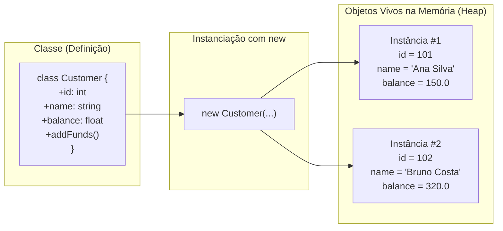

# 20. Classes e Objetos

Até o momento, modelamos e manipulamos dados utilizando tipos escalares, funções
isoladas e arrays associativos. No entanto, à medida que sistemas reais crescem,
manipular dicionários de dados soltos torna-se uma das principais fontes de
falhas em produção.

Neste capítulo, aprenderemos como o PHP moderno estrutura a **Programação
Orientada a Objetos (POO)**. Veremos a transição de estruturas de dados soltas
para entidades ricas com identidade, estado e comportamento, dividindo o estudo
em quatro etapas: a declaração de classes e seus membros, a inicialização com
construtores modernos, o acesso a membros com operadores seguros e a modelagem
de um domínio real.

<details>
<summary>🔍 Aprofundamento Histórico: A Evolução da POO no PHP (do PHP 4 ao PHP 8+)</summary>

Historicamente, o suporte a Orientação a Objetos no PHP passou por
transformações profundas:

- **PHP 4:** Os objetos eram copiados por valor por padrão, como se fossem
  arrays primitivos, o que gerava comportamentos imprevisíveis e exigia o uso
  generalizado de referências manuais com `&`.
- **PHP 5:** O motor Zend Engine II reescreveu completamente o modelo de
  objetos, passando a manipulá-los por identificadores de referência no Heap e
  introduzindo modificadores de acesso formais (`public`, `protected`,
  `private`).
- **PHP 7:** Trouxe declarações estritas de tipo para propriedades, parâmetros e
  valores de retorno, elevando a confiabilidade do código.
- **PHP 8.x:** Introduziu _Constructor Property Promotion_, _Named Arguments_,
  _Union Types_, _Attributes_, tipos _readonly_ e o operador _Nullsafe_,
  consolidando o PHP como uma linguagem com sistema de tipos robusto e OO de
  padrão industrial.

</details>

## A Dor: Estruturas Soltas e a Perda de Integridade

Imagine que estamos desenvolvendo o backend de uma plataforma de e-commerce e
precisamos gerenciar clientes e seus pedidos. Utilizando apenas arrays
associativos e funções avulsas, o código tipicamente se parece com isto:

```php
<?php

declare(strict_types=1);

// ❌ ABORDAGEM FRÁGIL: Dados em arrays associativos soltos sem invariantes

$customer = [
    "id"      => 101,
    "name"    => "Ana Silva",
    "email"   => "ana.silva@email.com",
    "balance" => 150.0,
];

// Qualquer parte do sistema pode mutar as chaves diretamente, violando o domínio:
$customer["balance"] = -500.0; // Saldo negativo inválido!
$customer["e_mail"] = "outro@email.com"; // Erro de digitação da chave cria novo campo!

function applyDiscount(array &$customer, float $amount): void
{
    // Falta garantia de que as chaves esperadas existem ou contêm os tipos corretos
    $customer["balance"] -= $amount;
}

applyDiscount($customer, 50.0);
```

Essa abordagem apresenta quatro problemas críticos em aplicações corporativas:

1. **Ausência de Tipagem Estrita nas Chaves:** Um erro de digitação
   (`$customer["e_mail"]`) cria uma chave inexistente sem aviso do
   interpretador.
2. **Inexistência de Invariantes:** Não há como impedir que um estado inválido
   (como um saldo negativo ou um e-mail sem formato válido) seja atribuído em
   qualquer ponto da aplicação.
3. **Desconexão entre Dados e Ações:** Os dados residem em um array, enquanto as
   regras de negócio ficam dispersas em funções espalhadas pelo projeto.
4. **Sem Suporte da IDE:** IDEs não conseguem oferecer autocompletion confiável
   nem realizar refatorações automáticas com segurança em arrays genéricos.

A **Orientação a Objetos** resolve essa fragilidade unindo estado (propriedades)
e comportamento (métodos) sob um mesmo contrato formal.

## O Conceito: Classes como Moldes e Objetos como Instâncias

Uma **Classe** é uma especificação formal — um molde arquitetural que define
quais propriedades (dados) e métodos (comportamentos) uma determinada entidade
do domínio possui.

Um **Objeto** é a corporificação desse molde na memória durante a execução do
programa: uma **instância** concreta alocada na memória Heap, com valores
próprios e ciclo de vida isolado.



## Declarando uma Classe e seus Membros

A estrutura de uma classe em PHP é composta essencialmente por sua declaração,
suas propriedades (o estado) e seus métodos (o comportamento).

### 1. Declaração da Classe

Para definir uma nova classe, utilizamos a palavra-chave `class` seguida pelo
nome em formato **PascalCase** (convenção padrão da comunidade PHP e PSR-12):

```php
<?php

declare(strict_types=1);

class Customer
{
    // O corpo da classe conterá propriedades e métodos
}
```

### 2. Propriedades (O Estado do Objeto)

As propriedades representam os dados ou variáveis que pertencem à classe. No PHP
moderno (a partir do PHP 7.4), as propriedades devem ser **estritamente
tipadas**:

```php
<?php

declare(strict_types=1);

class Customer
{
    // Propriedades com tipos declarados e valores padrão opcionais:
    public int $id;
    public string $name;
    public string $email;
    public float $balance = 0.0;
}
```

> **Nota sobre visibilidade:**
>
> No PHP moderno, as propriedades requerem um modificador de visibilidade (como
> `public`, `protected` ou `private`). No próximo capítulo, exploraremos a fundo
> o encapsulamento e as diferenças entre esses modificadores. Por enquanto,
> utilizaremos `public` para compreender a mecânica estrutural.

#### Acessando Propriedades com o Operador Seta (`->`) e Acesso Seguro (`?->`)

Quando já temos uma instância em mãos (por exemplo, recebida como argumento de
uma função), utilizamos o operador seta simples (**`->`**) para ler ou alterar
suas propriedades:

```php
function printCustomer(Customer $customer): void
{
    echo "Cliente: " . $customer->name;
}
```

Em aplicações reais, é muito frequente lidarmos com variáveis ou relações que
podem ser `null` (por exemplo, um cliente que ainda não foi associado a um
carrinho). Se tentarmos acessar uma propriedade no valor `null` usando `->`, o
PHP interrompe o programa com um erro fatal (`Fatal error: Cannot access
property on null`).

Para evitar verificações manuais excessivas com `if`, o PHP 8 introduziu o
**Operador Nullsafe (`?->`)**:

```php
function printOptionalCustomer(?Customer $customer): void
{
    // O operador ?-> avalia com curto-circuito:
    // - Se $customer for um objeto válido, acessa a propriedade ->name
    // - Se $customer for null, retorna null imediatamente sem disparar erro
    echo "Cliente: " . ($customer?->name ?? "Não informado");
}
```

### 3. Métodos (O Comportamento do Objeto)

Os métodos são funções declaradas dentro do corpo da classe. Eles definem as
ações, operações e regras de negócio que os objetos desse tipo são capazes de
executar:

```php
<?php

declare(strict_types=1);

class Customer
{
    public int $id;
    public string $name;
    public string $email;
    public float $balance = 0.0;

    // Métodos declaram as operações que a classe disponibiliza:
    public function addFunds(float $amount): void
    {
        if ($amount <= 0) {
            throw new InvalidArgumentException("O valor do depósito deve ser positivo.");
        }

        $this->balance += $amount;
    }

    public function getFormattedBalance(): string
    {
        return "R$ " . number_format($this->balance, 2, ",", ".");
    }
}
```

A sintaxe para invocar um método externamente utiliza o operador seta (`->` ou
`?->`) seguido pelo nome do método e os parênteses com os eventuais argumentos:

- `$customer->addFunds(50.0);`
- `echo $customer?->getFormattedBalance();`

#### A Pseudovariável `$this`

Você pode ter notado que, dentro do corpo dos métodos, referenciamos a variável
`$this`, mas ela não foi declarada como propriedade nem recebida como parâmetro
em lugar nenhum da assinatura da função.

O PHP fornece automaticamente a pseudovariável **`$this`** como uma referência
implícita que **aponta para a instância específica que executou o método naquele
instante**:

```php
function processTransactions(Customer $ana, Customer $bruno): void
{
    // Ao executar esta chamada, o $this dentro de addFunds() aponta para a $ana:
    $ana->addFunds(50.0);

    // Ao executar esta chamada, o $this dentro de addFunds() aponta para o $bruno:
    $bruno->addFunds(30.0);
}
```

> **Por que `$this` é chamada de pseudovariável?**
>
> No PHP, `$this` é classificada como uma _pseudovariável_ porque, embora tenha
> a sintaxe de uma variável comum (iniciando com `$`), ela é gerenciada de forma
> automática pelo interpretador. Você não pode atribuir um novo valor a ela (um
> comando como `$this = null;` resulta em um erro de sintaxe imediato), pois seu
> valor é dinamicamente amarrado à instância em execução.

## Criando Instâncias e Inicializando o Estado

Uma classe por si só é apenas uma definição estática no arquivo. Para dar vida a
essa estrutura na memória, precisamos criar instâncias e definir seus valores
iniciais.

### O Operador `new` e a Instanciação

Para dar vida a uma classe e alocar uma nova instância independente na memória,
utilizamos a palavra-chave **`new`** seguida pelo nome da classe:

```php
<?php

declare(strict_types=1);

class SimpleCustomer
{
    public int $id = 0;
    public string $name = "Sem Nome";
}

// Cria uma nova instância na memória:
$customer = new SimpleCustomer();
```

Contudo, este cenário levanta uma questão essencial de arquitetura: **e se
precisarmos fornecer dados obrigatórios logo no momento da criação do objeto ou
garantir validações de integridade para que ele nunca nasça em um estado
inválido?**

### O Método Construtor (`__construct`)

Para garantir que o objeto seja inicializado corretamente desde o primeiro
instante, o PHP oferece o método mágico especial **`__construct()`**.

Esse método é executado de forma automática pelo interpretador no momento exato
em que a instrução `new` é chamada, permitindo receber parâmetros de
inicialização, aplicar validações prévias e atribuir valores ao `$this`:

```php
<?php

declare(strict_types=1);

class Customer
{
    public int $id;
    public string $name;
    public string $email;
    public float $balance;

    public function __construct(int $id, string $name, string $email, float $balance = 0.0)
    {
        if (!filter_var($email, FILTER_VALIDATE_EMAIL)) {
            throw new InvalidArgumentException("O e-mail fornecido é inválido: {$email}");
        }

        // Atribuindo os parâmetros iniciais às propriedades da instância:
        $this->id = $id;
        $this->name = $name;
        $this->email = $email;
        $this->balance = $balance;
    }
}

// 1. Ao executar este `new`, o PHP aloca a memória da Ana e repassa os dados ao __construct:
$ana = new Customer(101, "Ana Silva", "ana.silva@email.com", 150.0);

// 2. Ao executar este segundo `new`, o PHP aloca um NOVO objeto para o Bruno:
$bruno = new Customer(102, "Bruno Costa", "bruno@email.com"); // balance assume 0.0

echo "Cliente: {$ana->name} | Saldo: R$ {$ana->balance}\n";   // Ana Silva | R$ 150
echo "Cliente: {$bruno->name} | Saldo: R$ {$bruno->balance}\n"; // Bruno Costa | R$ 0
```

#### Constructor Property Promotion (PHP 8+)

Na abordagem clássica do PHP 7, declarar uma classe com muitas propriedades
exigia uma repetição exaustiva: declarar a propriedade, colocá-la como parâmetro
no `__construct` e atribuir manualmente `$this->prop = $prop`.

O PHP 8 revolucionou essa sintaxe com o **Constructor Property Promotion**: ao
declarar o modificador de visibilidade (`public`, `protected` ou `private`)
diretamente nos parâmetros do construtor, o PHP automaticamente cria a
propriedade na classe e atribui o valor recebido:

```php
<?php

declare(strict_types=1);

// ❌ ABORDAGEM VERBOSA (PHP 7.4 ou anterior): Repetição de 3 vezes por propriedade
class LegacyProduct
{
    public int $id;
    public string $title;
    public float $price;
    public int $stock;

    public function __construct(
        int $id,
        string $title,
        float $price,
        int $stock = 0
    ) {
        $this->id = $id;
        $this->title = $title;
        $this->price = $price;
        $this->stock = $stock;

        if ($this->price < 0) {
            throw new InvalidArgumentException("O preço não pode ser negativo.");
        }
    }
}

// ✅ ABORDAGEM MODERNA (PHP 8+): Constructor Property Promotion
class Product
{
    public function __construct(
        public int $id,
        public string $title,
        public float $price,
        public int $stock = 0
    ) {
        // O corpo do construtor fica limpo, apenas com validações de domínio:
        if ($this->price < 0) {
            throw new InvalidArgumentException("O preço não pode ser negativo.");
        }
    }
}

$laptop = new Product(id: 1, title: "Notebook Pro", price: 4500.0, stock: 10);

echo "Produto: {$laptop->title} | Preço: R$ {$laptop->price}\n";
// Produto: Notebook Pro | Preço: R$ 4500
```

## Exemplo Completo do Domínio: Carrinho e Itens de Pedido

Vamos integrar todos os conceitos aprendidos (classes, construtores com property
promotion, métodos com `$this` e operador nullsafe) em um exemplo consistente de
comércio eletrônico:

```php
<?php

declare(strict_types=1);

class OrderItem
{
    public function __construct(
        public int $productId,
        public string $name,
        public float $unitPrice,
        public int $quantity
    ) {
        if ($this->quantity <= 0) {
            throw new InvalidArgumentException("A quantidade deve ser de no mínimo 1 item.");
        }
        if ($this->unitPrice < 0) {
            throw new InvalidArgumentException("O preço unitário não pode ser negativo.");
        }
    }

    public function getSubtotal(): float
    {
        return $this->unitPrice * $this->quantity;
    }
}

class Order
{
    /** @var array<OrderItem> */
    public array $items = [];

    public function __construct(
        public string $orderNumber,
        public ?Customer $customer = null
    ) {}

    public function addItem(OrderItem $item): void
    {
        $this->items[] = $item;
    }

    public function calculateTotal(): float
    {
        $total = 0.0;
        foreach ($this->items as $item) {
            $total += $item->getSubtotal();
        }
        return $total;
    }
}

// Execução prática:
$customer = new Customer(1, "Mariana Ramos", "mariana@email.com");
$order = new Order("ORD-2026-001", $customer);

$order->addItem(new OrderItem(productId: 10, name: "Teclado Mecânico", unitPrice: 350.0, quantity: 2));
$order->addItem(new OrderItem(productId: 20, name: "Mouse Óptico", unitPrice: 150.0, quantity: 1));

// Navegação segura para obter o nome do cliente:
$customerName = $order->customer?->name ?? "Cliente Convidado";
$orderTotal = $order->calculateTotal();

echo "Pedido: {$order->orderNumber}\n";
echo "Comprador: {$customerName}\n";
echo "Total a pagar: R$ " . number_format($orderTotal, 2, ",", ".") . "\n";
// Saída:
// Pedido: ORD-2026-001
// Comprador: Mariana Ramos
// Total a pagar: R$ 850,00
```

## O Que Vem a Seguir?

Neste capítulo, aprendemos a fundação da Programação Orientada a Objetos no PHP
moderno: a criação de **Classes e Objetos**, a auto-referência com **`$this`**,
a inicialização limpa com **Constructor Property Promotion** e a navegação
segura com o operador **Nullsafe (`?->`)**.

Contudo, até o momento declaramos todas as propriedades como `public`, o que
significa que qualquer parte externa do sistema pode acessar ou sobrescrever os
dados de um objeto livremente, sem validações.

No **[Capítulo 21: Modificadores de Acesso e
Encapsulamento](21-modificadores-de-acesso-e-encapsulamento.md)**, aprenderemos
a proteger o estado interno de nossas entidades com visibilidade `public`,
`protected` e `private`, métodos Getters/Setters e propriedades `readonly`
nativas do PHP 8.1+.

---

<a href="19-manipulacao-de-json-e-serializacao.md">← Manipulação de JSON e
Serialização</a>

<p align="right"><a href="21-modificadores-de-acesso-e-encapsulamento.md">Próximo: Modificadores de Acesso e Encapsulamento →</a></p>
