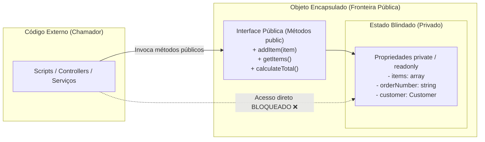

# 21. Modificadores de Acesso e Encapsulamento

No capítulo anterior, aprendemos a declarar classes, instanciar objetos e
organizar métodos e propriedades. Para facilitar a introdução à sintaxe,
declaramos todas as propriedades como `public`.

No entanto, no desenvolvimento de sistemas reais de produção, deixar
propriedades abertas ao acesso direto é uma das práticas mais arriscadas da
engenharia de software.

Neste capítulo, aprenderemos o pilar fundamental do **Encapsulamento**,
dominando os modificadores de visibilidade (**`public`**, **`protected`** e
**`private`**), o uso consciente de métodos de leitura e escrita (**Getters** e
**Setters**) e a proteção nativa de imutabilidade com **propriedades
`readonly`** introduzidas no PHP 8.1+.

## A Dor: Propriedades Públicas e a Quebra de Invariantes

Vamos retomar o domínio de comércio eletrônico construído no final do capítulo
anterior, composto pelas classes `Customer`, `OrderItem` e `Order`.

Observe o que acontece quando qualquer script externo tem liberdade total para
ler e escrever diretamente nas propriedades desses objetos:

```php
<?php

declare(strict_types=1);

// ❌ ABORDAGEM VULNERÁVEL: Todas as propriedades expostas como public

class Customer
{
    public function __construct(
        public int $id,
        public string $name,
        public string $email,
        public float $balance = 0.0
    ) {}

    public function addFunds(float $amount): void
    {
        if ($amount <= 0) {
            throw new InvalidArgumentException("O valor do depósito deve ser positivo.");
        }
        $this->balance += $amount;
    }
}

class OrderItem
{
    public function __construct(
        public int $productId,
        public string $name,
        public float $unitPrice,
        public int $quantity
    ) {}

    public function getSubtotal(): float
    {
        return $this->unitPrice * $this->quantity;
    }
}

class Order
{
    /** @var array<OrderItem> */
    public array $items = [];

    public function __construct(
        public string $orderNumber,
        public ?Customer $customer = null
    ) {}

    public function addItem(OrderItem $item): void
    {
        $this->items[] = $item;
    }
}

// Execução em produção:
$customer = new Customer(1, "Mariana Ramos", "mariana@email.com", 500.0);
$order = new Order("ORD-2026-001", $customer);
$order->addItem(new OrderItem(10, "Teclado Mecânico", 350.0, 1));

// 🚨 CENÁRIOS DE CORRUPÇÃO DE ESTADO POR CÓDIGO EXTERNO:

// 1. Um desenvolvedor desatento limpa a lista de itens sem passar pelas regras do pedido:
$order->items = [];

// 2. Um script de integração altera o preço unitário para um valor negativo:
$item = new OrderItem(20, "Mouse", 100.0, 1);
$item->unitPrice = -999.0; // Corrompe o cálculo de faturamento!

// 3. O saldo do cliente é modificado diretamente sem validação de regras de crédito:
$customer->balance = 1000000.0; // Injeção arbitrária de saldo!
$customer->id = 999; // O ID de banco de dados do cliente é alterado em tempo de execução!
```

Esse exemplo expõe as três maiores falhas de arquitetura de um objeto não
encapsulado:

1. **Violação de Invariantes de Negócio:** Uma _invariante_ é uma condição de
   verdade que deve sempre se manter válida durante todo o ciclo de vida do
   objeto (por exemplo: _"o preço unitário nunca pode ser negativo"_ ou _"o
   saldo nunca pode ser alterado sem um registro contábil"_). Propriedades
   públicas tornam impossível garantir essas regras.
2. **Efeitos Colaterais Inesperados:** Qualquer arquivo do projeto pode mutar o
   estado do objeto sem que a própria classe tome conhecimento. Quando um erro
   acontece, rastrear quem alterou o dado torna-se uma tarefa quase impossível.
3. **Alto Acoplamento:** Se a estrutura interna de armazenamento da classe
   precisar mudar no futuro (por exemplo, transformar o array `$items` em uma
   coleção especializada ou renomear uma coluna de banco), todo o código externo
   que acessava a propriedade diretamente quebrará.

O **Encapsulamento** resolve esse problema ao criar uma fronteira de proteção em
torno do estado interno do objeto.

## O Conceito: A Fronteira do Encapsulamento

O princípio do **Encapsulamento** estabelece que os detalhes internos de
armazenamento de um objeto devem ficar ocultos do mundo exterior. O estado deve
ser gerenciado e protegido exclusivamente pela própria classe.

O código externo não deve tocar nos dados brutos; em vez disso, deve **enviar
mensagens** solicitando que o objeto execute operações controladas:



## Os Três Modificadores de Visibilidade

O PHP fornece três palavras-chave para definir quem tem permissão de acessar
propriedades e métodos:

| Modificador     | Onde é Acessível?                                          | Finalidade Principal                                            |
| :-------------- | :--------------------------------------------------------- | :-------------------------------------------------------------- |
| **`private`**   | **Apenas dentro da própria classe** onde foi declarado     | Blindagem máxima. Nem classes filhas podem acessar diretamente. |
| **`protected`** | **Dentro da própria classe e em classes filhas** (herança) | Compartilhamento seguro entre classes de uma mesma hierarquia.  |
| **`public`**    | **De qualquer lugar** (dentro, herança e código externo)   | Interface pública de comunicação do objeto.                     |

### 1. Visibilidade `private` na Prática

Ao marcar uma propriedade como `private`, qualquer tentativa de leitura ou
escrita fora do escopo da classe resultará em um erro fatal em tempo de
execução:

```php
<?php

declare(strict_types=1);

class BankAccount
{
    // Propriedade estritamente privada:
    private float $balance = 0.0;

    public function deposit(float $amount): void
    {
        if ($amount <= 0) {
            throw new InvalidArgumentException("O depósito deve ser positivo.");
        }
        $this->balance += $amount; // Permitido: dentro do corpo da classe
    }

    public function getBalance(): float
    {
        return $this->balance; // Permitido: leitura controlada
    }
}

$account = new BankAccount();
$account->deposit(100.0); // ✅ Permitido: método público

// ❌ ERRO FATAL: Tentativa de acesso direto a membro privado
// $account->balance = 5000.0;
// Fatal error: Cannot access private property BankAccount::$balance
```

### 2. Visibilidade `protected` (Introdução)

O modificador `protected` atua como um meio-termo: impede o acesso público
direto a partir de scripts externos, mas permite que classes que herdam desta
classe (subclasses via `extends`) acessem a propriedade.

```php
<?php

declare(strict_types=1);

class BaseUser
{
    // Acessível por BaseUser e qualquer classe que herde de BaseUser:
    protected string $registrationStatus = "pending";
}

class AdminUser extends BaseUser
{
    public function activate(): void
    {
        // Permitido: AdminUser é subclasse de BaseUser
        $this->registrationStatus = "active";
    }
}
```

> Exploraremos a herança e o modificador `protected` em profundidade no
> **Capítulo 23: Herança e Classes Abstratas**. A regra geral para o design de
> domínio atual é: **inicie sempre com `private`** e abra para `protected`
> apenas quando houver real necessidade de especialização por subclasses.

## Métodos de Acesso: Getters e Setters Conscientes

Quando fechamos as propriedades com `private`, como permitimos que o restante do
sistema leia informações ou solicite alterações de forma segura? Através de
**Métodos de Acesso**.

### Getters (Métodos de Leitura)

Um **Getter** é um método público que expõe o valor de uma propriedade privada
sem permitir que o chamador a sobrescreva:

```php
<?php

declare(strict_types=1);

class Customer
{
    private int $id;
    private string $name;

    public function __construct(int $id, string $name)
    {
        $this->id = $id;
        $this->name = $name;
    }

    // Getter para leitura segura:
    public function getId(): int
    {
        return $this->id;
    }

    public function getName(): string
    {
        return $this->name;
    }
}

$customer = new Customer(1, "Carlos Dias");
echo $customer->getName(); // Carlos Dias
```

### Setters (Métodos de Modificação Controlada)

Um **Setter** é um método público que recebe um novo valor e aplica validações
de domínio rigorosas antes de permitir a alteração do estado interno:

```php
<?php

declare(strict_types=1);

class CustomerProfile
{
    private string $email;

    public function __construct(string $email)
    {
        $this->setEmail($email); // Reutiliza a validação centralizada
    }

    public function getEmail(): string
    {
        return $this->email;
    }

    public function setEmail(string $email): void
    {
        if (!filter_var($email, FILTER_VALIDATE_EMAIL)) {
            throw new InvalidArgumentException("Formato de e-mail inválido: {$email}");
        }

        $this->email = $email;
    }
}
```

### O Perigo de Getters e Setters "Ingênuos"

Muitos desenvolvedores iniciantes caem no vício de criar automaticamente um
`getCampo()` e um `setCampo()` para todas as propriedades privadas de uma
classe. No entanto, quando aplicados sem critério, métodos de acesso ingênuos
enfraquecem o encapsulamento de duas maneiras:

#### 1. Setters sem Validação são Ilusões de Segurança

Se um setter apenas recebe um valor e o atribui sem qualquer verificação, na
prática ele torna a propriedade tão desprotegida quanto uma propriedade
`public`:

```php
// ❌ SETTER INGÊNUO: Apenas adiciona ruído e não protege nenhuma regra
public function setBalance(float $balance): void
{
    $this->balance = $balance; // Permite balance negativo ou valores arbitrários!
}
```

Em vez de setters genéricos, prefira **métodos com intenção de negócio** que
reflitam ações reais do domínio:

```php
// ✅ MÉTODO DE NEGÓCIO: Protege a invariante e expressa a intenção com clareza
public function deposit(float $amount): void
{
    if ($amount <= 0) {
        throw new InvalidArgumentException("O valor do depósito deve ser positivo.");
    }
    $this->balance += $amount;
}
```

#### 2. Getters Calculados vs Exposição de Componentes Brutos

Em muitas situações, o código externo não precisa conhecer os dados atômicos
brutos, mas sim o **resultado de uma operação** sobre eles. Em vez de expor
múltiplos campos privados para que o chamador faça contas por fora, centralize o
cálculo em um **getter calculado**:

```php
<?php

declare(strict_types=1);

class Name
{
    public function __construct(
        private string $firstName,
        private string $lastName
    ) {}

    // ❌ EVITE: Expor getFirstName() e getLastName() para terceiros concatenarem por fora

    // ✅ RECOMENDADO: Getter calculado centralizado na própria classe
    public function getFullName(): string
    {
        return "{$this->firstName} {$this->lastName}";
    }
}

class CartItem
{
    public function __construct(
        private float $unitPrice,
        private int $quantity
    ) {}

    // ✅ Centraliza a regra de faturamento dentro da entidade:
    public function getSubtotal(): float
    {
        return $this->unitPrice * $this->quantity;
    }
}
```

## Imutabilidade Nativa com Propriedades `readonly` (PHP 8.1+)

Em muitos modelos de domínio, certas propriedades nascem com um valor e **nunca
mais podem ser alteradas** ao longo de toda a existência do objeto (por exemplo:
o ID de uma entidade, o número de um pedido, ou a data de criação).

Antes do PHP 8.1, para tornar uma propriedade imutável era obrigatório
declará-la como `private` e escrever um método Getter dedicado apenas para
leitura:

```php
<?php

declare(strict_types=1);

// ❌ ABORDAGEM VERBOSA (PHP 7.4): Propriedade privada apenas para simular imutabilidade
class LegacyTransaction
{
    private string $transactionId;
    private float $amount;

    public function __construct(string $transactionId, float $amount)
    {
        $this->transactionId = $transactionId;
        $this->amount = $amount;
    }

    public function getTransactionId(): string
    {
        return $this->transactionId;
    }

    public function getAmount(): float
    {
        return $this->amount;
    }
}
```

A partir do PHP 8.1, podemos utilizar a palavra-chave **`readonly`** diretamente
na declaração da propriedade. Uma propriedade `readonly`:

1. **Pode ser lida publicamente:** Elimina a necessidade de criar métodos
   Getters triviais.
2. **Só pode ser inicializada uma única vez:** Qualquer tentativa de
   reatribuição após a conclusão do construtor dispara um erro fatal (`Error:
Cannot modify readonly property`).
3. **Requer obrigatoriamente tipagem estrita:** Não é permitido declarar
   propriedades `readonly` sem tipo explícito.

```php
<?php

declare(strict_types=1);

// ✅ ABORDAGEM MODERNA (PHP 8.1+): Readonly com Constructor Property Promotion
class Transaction
{
    public function __construct(
        public readonly string $transactionId,
        public readonly float $amount,
        public readonly DateTimeImmutable $createdAt
    ) {
        if ($this->amount <= 0) {
            throw new InvalidArgumentException("O valor da transação deve ser positivo.");
        }
    }
}

$trx = new Transaction("TRX-9981", 450.0, new DateTimeImmutable());

// Leitura pública direta e limpa:
echo "Transação: {$trx->transactionId} | Valor: R$ {$trx->amount}\n";

// ❌ ERRO FATAL: Imutabilidade garantida pelo motor do PHP
// $trx->amount = 500.0;
// Fatal error: Cannot modify readonly property Transaction::$amount
```

<details>
<summary>🔍 Aprofundamento Técnico: Classes Inteiras como Readonly (PHP 8.2+)</summary>

Se todas as propriedades de uma classe forem imutáveis (como em DTOs ou Value
Objects), o PHP 8.2 permite marcar a própria classe como `readonly`. Isso aplica
o modificador `readonly` a todas as suas propriedades automaticamente:

```php
<?php

declare(strict_types=1);

// Todas as propriedades públicas tornam-se readonly automaticamente:
readonly class AddressDto
{
    public function __construct(
        public string $street,
        public string $city,
        public string $zipCode
    ) {}
}
```

</details>

## O Domínio Refatorado e 100% Encapsulado

Agora que dominamos o encapsulamento, modificadores de acesso e propriedades
`readonly`, vamos refatorar o domínio de carrinho de compras do capítulo
anterior para torná-lo robusto e imune a corrupções de estado:

```php
<?php

declare(strict_types=1);

class Customer
{
    public function __construct(
        public readonly int $id,
        public readonly string $name,
        private string $email,
        private float $balance = 0.0
    ) {
        $this->setEmail($email);
    }

    public function getEmail(): string
    {
        return $this->email;
    }

    public function setEmail(string $email): void
    {
        if (!filter_var($email, FILTER_VALIDATE_EMAIL)) {
            throw new InvalidArgumentException("E-mail inválido: {$email}");
        }
        $this->email = $email;
    }

    public function getBalance(): float
    {
        return $this->balance;
    }

    public function addFunds(float $amount): void
    {
        if ($amount <= 0) {
            throw new InvalidArgumentException("O depósito deve ser positivo.");
        }
        $this->balance += $amount;
    }

    public function debitFunds(float $amount): void
    {
        if ($amount <= 0) {
            throw new InvalidArgumentException("O débito deve ser positivo.");
        }
        if ($amount > $this->balance) {
            throw new DomainException("Saldo insuficiente para debitar R$ {$amount}.");
        }
        $this->balance -= $amount;
    }
}

class OrderItem
{
    public function __construct(
        public readonly int $productId,
        public readonly string $name,
        public readonly float $unitPrice,
        private int $quantity
    ) {
        if ($this->unitPrice < 0) {
            throw new InvalidArgumentException("O preço não pode ser negativo.");
        }
        $this->setQuantity($quantity);
    }

    public function getQuantity(): int
    {
        return $this->quantity;
    }

    public function setQuantity(int $quantity): void
    {
        if ($quantity <= 0) {
            throw new InvalidArgumentException("A quantidade mínima é 1 item.");
        }
        $this->quantity = $quantity;
    }

    public function getSubtotal(): float
    {
        return $this->unitPrice * $this->quantity;
    }
}

class Order
{
    /** @var array<OrderItem> */
    private array $items = [];

    public function __construct(
        public readonly string $orderNumber,
        private ?Customer $customer = null
    ) {}

    public function getCustomer(): ?Customer
    {
        return $this->customer;
    }

    public function addItem(OrderItem $item): void
    {
        $this->items[] = $item;
    }

    /**
     * Retorna uma cópia dos itens para leitura, protegendo o array interno original.
     * @return array<OrderItem>
     */
    public function getItems(): array
    {
        return $this->items;
    }

    public function calculateTotal(): float
    {
        $total = 0.0;
        foreach ($this->items as $item) {
            $total += $item->getSubtotal();
        }
        return $total;
    }

    public function checkout(): void
    {
        if (empty($this->items)) {
            throw new DomainException("Não é possível fechar um pedido sem itens.");
        }

        if ($this->customer === null) {
            throw new DomainException("Pedido sem cliente associado.");
        }

        $total = $this->calculateTotal();
        $this->customer->debitFunds($total);
    }
}

// Execução segura:
$customer = new Customer(1, "Mariana Ramos", "mariana@email.com", 1000.0);
$order = new Order("ORD-2026-001", $customer);

$order->addItem(new OrderItem(10, "Teclado Mecânico", 350.0, 2));
$order->addItem(new OrderItem(20, "Mouse Óptico", 150.0, 1));

echo "Total do Pedido: R$ " . number_format($order->calculateTotal(), 2, ",", ".") . "\n";
// Total do Pedido: R$ 850,00

// Realiza o checkout com validação de invariantes e débito seguro:
$order->checkout();

echo "Saldo restante de {$customer->name}: R$ " . number_format($customer->getBalance(), 2, ",", ".") . "\n";
// Saldo restante de Mariana Ramos: R$ 150,00
```

## Resumo dos Modificadores e Regras de Visibilidade

| Recurso / Palavra-chave  |    Acesso Externo     | Acesso em Subclasses  | Mutabilidade após Construtor |
| :----------------------- | :-------------------: | :-------------------: | :--------------------------: |
| `public $prop`           | Leitura & Escrita ✅  | Leitura & Escrita ✅  |          Mutável 🔄          |
| `protected $prop`        |     Bloqueado ❌      | Leitura & Escrita ✅  |          Mutável 🔄          |
| `private $prop`          |     Bloqueado ❌      |     Bloqueado ❌      |  Mutável (internamente) 🔄   |
| `public readonly $prop`  | **Apenas Leitura ✅** | **Apenas Leitura ✅** |       **Imutável 🔒**        |
| `private readonly $prop` |     Bloqueado ❌      |     Bloqueado ❌      |       **Imutável 🔒**        |

<details>
<summary>🔍 Aprofundamento Técnico: Visibilidade Assimétrica (PHP 8.4+)</summary>

No PHP 8.4, foi introduzida a **Visibilidade Assimétrica** (_Asymmetric
Visibility_). Ela permite definir níveis de visibilidade distintos para leitura
e escrita na mesma propriedade:

```php
<?php

declare(strict_types=1);

class ProductStock
{
    // Leitura pública, mas escrita estritamente privada:
    public private(set) int $quantity;

    public function __construct(int $initialStock)
    {
        $this->quantity = $initialStock;
    }

    public function increment(int $amount): void
    {
        $this->quantity += $amount; // Permitido: escrita interna
    }
}

$stock = new ProductStock(10);
echo $stock->quantity; // ✅ Leitura pública permitida: 10
// $stock->quantity = 20; // ❌ Erro fatal: escrita privada bloqueada externamente
```

</details>

## O Que Vem a Seguir?

Neste capítulo, aprendemos a blindar o estado interno de nossas classes com os
modificadores **`private`**, **`protected`**, **`public`** e **`readonly`**,
garantindo que nossas entidades de negócio mantenham sempre suas invariantes
intactas.

No entanto, no PHP, objetos são manipulados como identificadores na memória
(ponteiros no Heap). O que acontece quando atribuímos um objeto a outra variável
ou tentamos comparar duas instâncias diferentes?

No **[Capítulo 22: Clonagem e Comparação de
Objetos](22-clonagem-e-comparacao-de-objetos.md)**, entenderemos como o PHP
gerencia a identidade de objetos, a diferença entre os operadores `==` e `===`,
o uso do operador `clone` e o método mágico `__clone()` para cópias superficiais
(_shallow_) e profundas (_deep copy_).

---

<a href="20-classes-e-objetos.md">← Classes e Objetos</a>

<p align="right"><a href="22-clonagem-e-comparacao-de-objetos.md">Próximo: Clonagem e Comparação de Objetos →</a></p>
