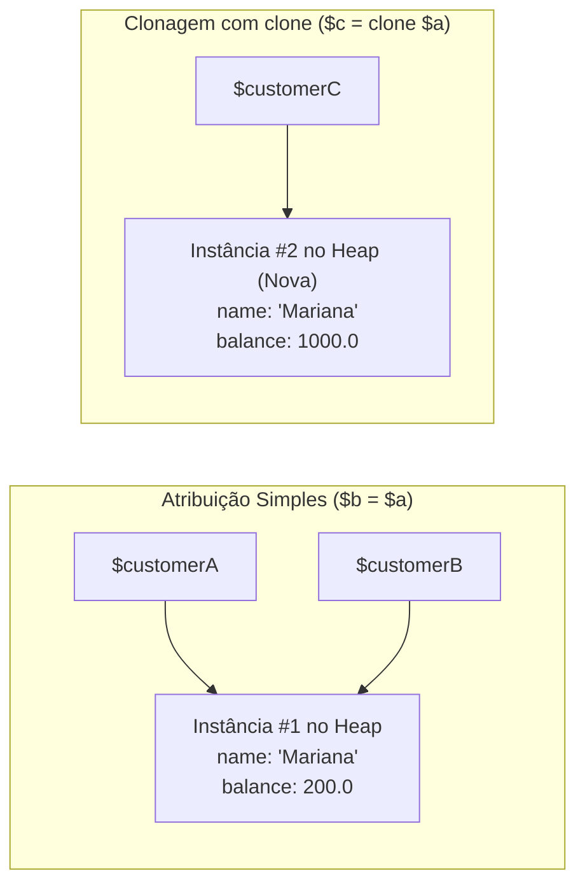
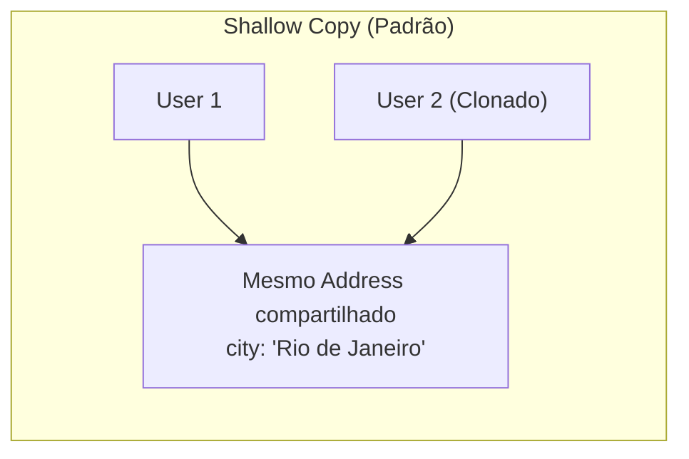
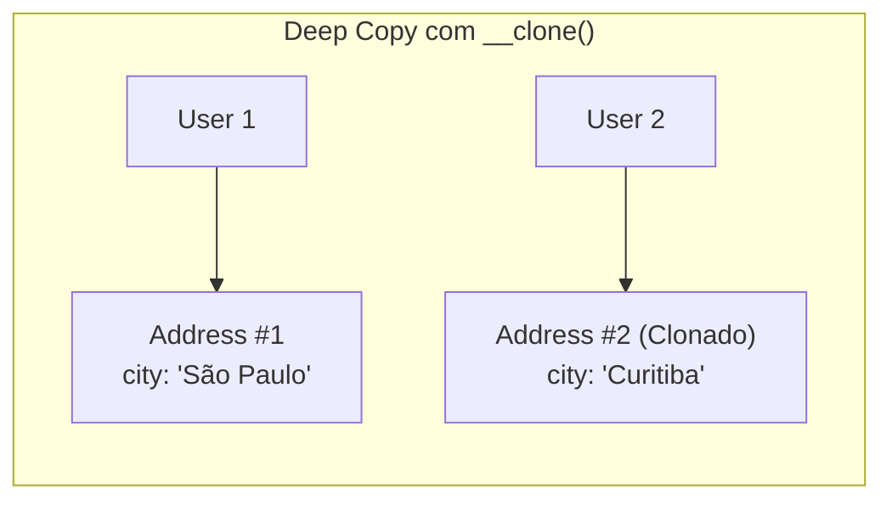

# 22. Clonagem e Comparação de Objetos

Nos capítulos anteriores, vimos como criar classes, instanciar objetos e
proteger seu estado com modificadores de acesso e encapsulamento. No entanto,
para utilizar Orientação a Objetos de forma segura em sistemas complexos,
precisamos compreender com exatidão como o motor do PHP gerencia objetos na
memória.

Ao contrário de tipos primitivos e arrays — que são copiados por valor —, os
objetos em PHP são manipulados por **identificadores de referência**. Essa
distinção muda completamente a forma como atribuímos variáveis, clonamos
estruturas e comparamos dados.

Neste capítulo, aprenderemos o modelo de memória de instâncias, o operador
**`clone`**, a diferença crucial entre cópia superficial (_shallow copy_) e
cópia profunda (_deep copy_) com o método mágico **`__clone()`**, e a semântica
de comparação com **`==`** (equivalência de valores) vs **`===`** (identidade na
memória).

## A Dor: Atribuição de Objetos e a Mutação Inadvertida

Nos módulos anteriores, aprendemos que atribuir um array a uma nova variável
cria uma cópia independente (graças ao mecanismo _Copy-on-Write_ do PHP):

```php
// Com arrays (Cópia por Valor):
$originalCart = ["item1", "item2"];
$copiedCart = $originalCart;
$copiedCart[] = "item3"; // Altera APENAS $copiedCart; $originalCart permanece intacto!
```

Contudo, ao trabalhar com **Objetos**, a simples atribuição com o operador `=`
**não cria uma nova instância**. Ela apenas copia o identificador que aponta
para o mesmo espaço na memória Heap:

```php
<?php

declare(strict_types=1);

// ❌ ARMADILHA: Supor que a atribuição de objetos cria uma cópia independente

class Customer
{
    public function __construct(
        public string $name,
        public float $balance
    ) {}
}

$customerA = new Customer("Mariana Ramos", 1000.0);

// O desenvolvedor supõe que está criando um cliente separado para uma simulação:
$customerB = $customerA;

// Ao alterar $customerB...
$customerB->balance = 200.0;

// 🚨 EFEITO COLATERAL: O cliente original ($customerA) também foi modificado!
echo "Saldo de A: R$ {$customerA->balance}\n"; // Saldo de A: R$ 200 (Corrompido!)
echo "Saldo de B: R$ {$customerB->balance}\n"; // Saldo de B: R$ 200
```

Esse comportamento ocorre porque `$customerA` e `$customerB` não guardam
instâncias separadas; ambas as variáveis contêm o mesmo ponteiro que aponta para
o exato mesmo objeto alocado no Heap.

## O Conceito: Identificadores no Heap e o Operador `clone`

Quando você executa `new Customer(...)`, o interpretador do PHP aloca a
estrutura do objeto na memória Heap e devolve um **identificador numérico
interno** (um _handle_). A variável local guarda apenas esse identificador.

Para criar uma **cópia real e independente** de um objeto na memória, o PHP
fornece a palavra-chave **`clone`**:



### Usando o Operador `clone`

O operador `clone` aloca um novo espaço na memória Heap e copia todas as
propriedades da instância original para a nova instância:

```php
<?php

declare(strict_types=1);

$original = new Customer("Mariana Ramos", 1000.0);

// ✅ CLONAGEM REAL: Cria uma nova instância isolada na memória
$duplicate = clone $original;

$duplicate->balance = 500.0;

echo "Original: R$ {$original->balance}\n";   // Original: R$ 1000 (Preservado!)
echo "Duplicata: R$ {$duplicate->balance}\n"; // Duplicata: R$ 500
```

## Cópia Superficial (_Shallow Copy_) vs Cópia Profunda (_Deep Copy_)

O operador `clone` realiza, por padrão, uma **Cópia Superficial** (_Shallow
Copy_). Isso significa que:

1. Todas as propriedades primitivas e escalares (`int`, `float`, `string`,
   `bool`, `array`) são duplicadas de forma independente.
2. No entanto, se o objeto contiver propriedades que referenciam **outros
   objetos**, o `clone` copiará apenas os identificadores desses objetos
   internos!

Observe a armadilha do Shallow Copy quando temos objetos aninhados:

```php
<?php

declare(strict_types=1);

class Address
{
    public function __construct(
        public string $city,
        public string $country
    ) {}
}

class User
{
    public function __construct(
        public string $name,
        public Address $address // Propriedade que referencia outro objeto
    ) {}
}

$user1 = new User("Carlos", new Address("São Paulo", "Brasil"));

// Cópia superficial:
$user2 = clone $user1;

// Alteramos a cidade do segundo usuário:
$user2->address->city = "Rio de Janeiro";

// 🚨 EFEITO COLATERAL: O endereço do primeiro usuário também mudou!
echo "Cidade User 1: {$user1->address->city}\n"; // Rio de Janeiro!
echo "Cidade User 2: {$user2->address->city}\n"; // Rio de Janeiro!
```

Como o `clone` padrão apenas duplicou a estrutura da classe `User`, a
propriedade `$address` de ambos os usuários continuou apontando para a mesma
instância de `Address`.



## O Método Mágico `__clone()` e a Cópia Profunda

Para resolver o problema da cópia superficial e garantir um isolamento completo
(**Deep Copy**), o PHP disponibiliza o método mágico **`__clone()`**.

Esse método é invocado automaticamente pelo interpretador sobre a **nova
instância recém-clonada**, logo após a duplicação padrão das propriedades.
Dentro dele, temos a oportunidade de clonar manualmente quaisquer objetos
aninhados:

```php
<?php

declare(strict_types=1);

class Address
{
    public function __construct(
        public string $city,
        public string $country
    ) {}
}

class User
{
    public function __construct(
        public string $name,
        public Address $address
    ) {}

    // Executado automaticamente sobre o novo objeto clonado:
    public function __clone(): void
    {
        // Força a clonagem da instância interna de Address:
        $this->address = clone $this->address;
    }
}

$user1 = new User("Carlos", new Address("São Paulo", "Brasil"));

// Agora a clonagem é profunda (Deep Copy):
$user2 = clone $user1;
$user2->address->city = "Curitiba";

echo "Cidade User 1: {$user1->address->city}\n"; // São Paulo (Totalmente isolado!)
echo "Cidade User 2: {$user2->address->city}\n"; // Curitiba
```



<details>
<summary>🔍 Aprofundamento Técnico: Clonagem com Propriedades Readonly (PHP 8.3+)</summary>

### Modificação de Propriedades `readonly` dentro de `__clone()` (PHP 8.3+)

No PHP 8.1 e 8.2, propriedades declaradas como `readonly` não podiam ter seu
valor redefinido nem mesmo dentro do método mágico `__clone()`. Isso dificultava
cenários em que um objeto clonado precisava receber um novo ID ou código
identificador.

A partir do **PHP 8.3**, o interpretador permite que propriedades `readonly`
sejam redefinidas **uma única vez** dentro do corpo do método `__clone()`:

```php
<?php

declare(strict_types=1);

class Invoice
{
    public function __construct(
        public readonly string $invoiceNumber,
        public readonly float $amount
    ) {}

    public function __clone(): void
    {
        // Permitido a partir do PHP 8.3:
        // Redefine a propriedade readonly exclusivamente na nova instância clonada
        $this->invoiceNumber = "INV-" . bin2hex(random_bytes(4));
    }
}

$inv1 = new Invoice("INV-ORIGINAL", 900.0);
$inv2 = clone $inv1;

echo "Fatura 1: {$inv1->invoiceNumber}\n"; // INV-ORIGINAL
echo "Fatura 2: {$inv2->invoiceNumber}\n"; // INV-a1b2c3d4 (Novo código gerado!)
```

</details>

## Comparação de Objetos: Equivalência (`==`) vs Identidade (`===`)

Assim como a atribuição e a clonagem exigem atenção, a comparação de objetos no
PHP possui regras estritas que diferenciam o conteúdo do objeto da sua
identidade na memória:

### 1. Operador de Equivalência (`==`)

Dois objetos são considerados equivalentes (`$a == $b`) se:

1. Pertencerem à **mesma classe**.
2. Tiverem as **mesmas propriedades com os mesmos valores** (a comparação de
   cada propriedade é recursiva).

### 2. Operador de Identidade Estrita (`===`)

Dois objetos só são considerados estritamente idênticos (`$a === $b`) se:

1. Ambos apontarem para a **exata mesma instância na memória** (o mesmo handle
   no Heap).

```php
<?php

declare(strict_types=1);

class ProductItem
{
    public function __construct(
        public int $id,
        public string $name,
        public float $price
    ) {}
}

// Três variáveis com instâncias distintas e referências:
$productA = new ProductItem(1, "Teclado", 250.0);
$productB = new ProductItem(1, "Teclado", 250.0); // Mesmos valores, mas instância separada
$productC = $productA;                            // Aponta para a mesma instância de $productA

// 1. Comparando instâncias distintas com o mesmo conteúdo:
var_dump($productA == $productB);  // bool(true)  -> Equivalência de dados
var_dump($productA === $productB); // bool(false) -> Instâncias diferentes no Heap!

// 2. Comparando variáveis que apontam para a mesma instância:
var_dump($productA === $productC); // bool(true)  -> Mesmíssima instância na memória
```

| Operador        | O que Compara?             | Quando Retorna `true`?                                    |
| :-------------- | :------------------------- | :-------------------------------------------------------- |
| **`$a == $b`**  | **Equivalência de Estado** | Mesma classe e todos os atributos possuem valores iguais. |
| **`$a === $b`** | **Identidade de Memória**  | As duas variáveis apontam para o mesmo objeto no Heap.    |

## Exemplo Completo do Domínio: Duplicação de Pedidos

Vamos aplicar a clonagem profunda em nosso domínio de comércio eletrônico.
Imagine que precisamos oferecer um recurso de **"Repetir Pedido"** ou
**"Duplicar Orçamento"**, no qual geramos um novo pedido com um novo código e
data, mas mantendo os itens duplicados de forma 100% independente do pedido
original:

```php
<?php

declare(strict_types=1);

class OrderItem
{
    public function __construct(
        public readonly int $productId,
        public readonly string $name,
        public float $unitPrice,
        public int $quantity
    ) {}

    public function getSubtotal(): float
    {
        return $this->unitPrice * $this->quantity;
    }
}

class Order
{
    /** @var array<OrderItem> */
    private array $items = [];
    public DateTimeImmutable $createdAt;

    public function __construct(
        public string $orderNumber,
        public ?Customer $customer = null
    ) {
        $this->createdAt = new DateTimeImmutable();
    }

    public function addItem(OrderItem $item): void
    {
        $this->items[] = $item;
    }

    /** @return array<OrderItem> */
    public function getItems(): array
    {
        return $this->items;
    }

    public function calculateTotal(): float
    {
        $total = 0.0;
        foreach ($this->items as $item) {
            $total += $item->getSubtotal();
        }
        return $total;
    }

    // Configura o comportamento de clonagem profunda para o pedido:
    public function __clone(): void
    {
        // 1. Atualiza metadados do novo pedido clonado:
        $this->createdAt = new DateTimeImmutable(); // Nova data de emissão
        $this->orderNumber = $this->orderNumber . "-COPY";

        // 2. Clona profundamente o cliente (se existir):
        if ($this->customer !== null) {
            $this->customer = clone $this->customer;
        }

        // 3. Clona profundamente cada item da lista interna:
        $clonedItems = [];
        foreach ($this->items as $item) {
            $clonedItems[] = clone $item;
        }
        $this->items = $clonedItems;
    }
}

// Execução prática:
$customer = new Customer("Mariana Ramos", 1000.0);
$originalOrder = new Order("ORD-100", $customer);
$originalOrder->addItem(new OrderItem(1, "Headset Gamer", 300.0, 1));
$originalOrder->addItem(new OrderItem(2, "Mousepad", 80.0, 1));

// Duplica o pedido para criar um novo orçamento com base no anterior:
$duplicatedOrder = clone $originalOrder;

// Alteramos o preço do item no pedido duplicado:
$duplicatedOrder->getItems()[0]->unitPrice = 250.0; // Desconto especial na cópia

echo "Total Pedido Original ({$originalOrder->orderNumber}): R$ " . $originalOrder->calculateTotal() . "\n";
echo "Total Pedido Duplicado ({$duplicatedOrder->orderNumber}): R$ " . $duplicatedOrder->calculateTotal() . "\n";

// Saída:
// Total Pedido Original (ORD-100): R$ 380
// Total Pedido Duplicado (ORD-100-COPY): R$ 330
```

## O Que Vem a Seguir?

Neste capítulo, compreendemos a fundo a gestão de memória de objetos no PHP,
dominando a duplicação segura com **`clone`**, o método mágico **`__clone()`** e
a semântica de comparação entre **`==`** e **`===`**.

No entanto, à medida que um sistema cresce, diferentes classes de negócio
começam a compartilhar comportamentos e estruturas em comum (como diferentes
tipos de usuários, formas de pagamento ou contas bancárias).

No **[Capítulo 23: Herança e Sobrescrita de
Métodos](23-heranca-e-sobrescrita-de-metodos.md)**, aprenderemos a especializar
classes com **`extends`**, controlar o acesso em subclasses com **`protected`**,
reaproveitar inicializações e comportamentos com **`parent::`** e redefinir
comportamentos através da **Sobrescrita de Métodos**.

---

<a href="21-modificadores-de-acesso-e-encapsulamento.md">← Modificadores de
Acesso e Encapsulamento</a>

<p align="right"><a href="23-heranca-e-sobrescrita-de-metodos.md">Próximo: Herança e Sobrescrita de Métodos →</a></p>
