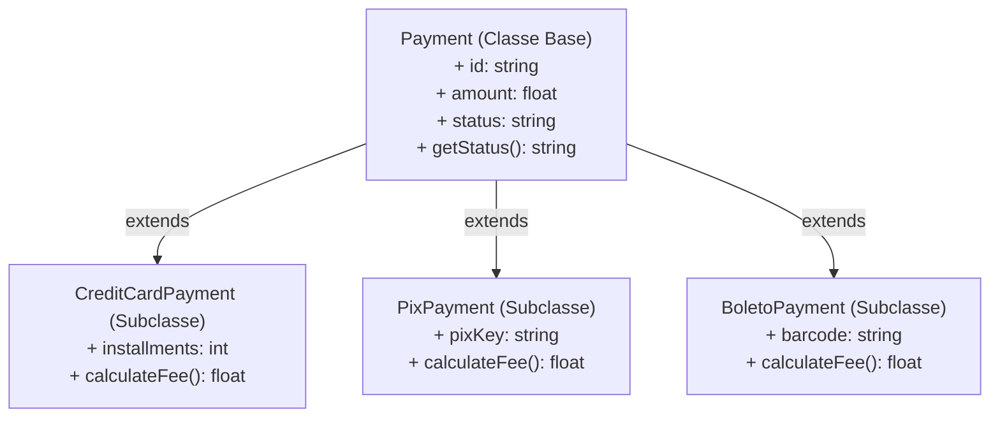

# 23. Herança e Sobrescrita de Métodos

Nos capítulos anteriores, vimos como declarar classes, encapsular o estado
interno com modificadores de acesso e gerenciar o ciclo de vida e a cópia de
objetos na memória. Conforme uma aplicação cresce, começam a surgir entidades
que compartilham propriedades e comportamentos em comum, mas que também possuem
particularidades exclusivas.

Neste capítulo, aprenderemos o conceito de **Herança** — o mecanismo que permite
criar novas classes a partir de classes existentes —, o modificador de
visibilidade **`protected`**, a palavra-chave **`parent::`** para acessar
membros da classe base e a **Sobrescrita de Métodos** (_Method Overriding_).

## A Dor: Duplicação de Estruturas e Acoplamento

Imagine que estejamos desenvolvendo o módulo financeiro de um e-commerce.
Precisamos lidar com diferentes formas de pagamento: **Cartão de Crédito**,
**PIX** e **Boleto Bancário**.

Sem um mecanismo de especialização e herança, poderíamos ser tentados a
concentrar todas as regras em uma única classe cheia de condicionais:

```php
<?php

declare(strict_types=1);

// ❌ ABORDAGEM PROBLEMÁTICA: Uma única classe acumulando regras de todos os tipos
class MonolithicPaymentProcessor
{
    public function __construct(
        public readonly string $id,
        public readonly float $amount,
        public readonly string $type, // 'credit_card', 'pix', 'boleto'
        public readonly ?int $installments = null,
        public readonly ?string $pixKey = null,
        public readonly ?string $barcode = null
    ) {}

    public function calculateFee(): float
    {
        return match ($this->type) {
            'credit_card' => ($this->amount * 0.035) + 0.50, // 3.5% + R$ 0,50
            'pix'         => 0.0,                           // Isento
            'boleto'      => 2.50,                          // Taxa bancária fixa
            default       => throw new InvalidArgumentException("Tipo de pagamento desconhecido."),
        };
    }

    public function process(): void
    {
        if ($this->type === 'credit_card') {
            echo "Processando cartão em {$this->installments}x de R$ " . ($this->amount / (int) $this->installments) . "\n";
        } elseif ($this->type === 'pix') {
            echo "Gerando cobrança PIX para a chave: {$this->pixKey}\n";
        } elseif ($this->type === 'boleto') {
            echo "Emitindo boleto com código de barras: {$this->barcode}\n";
        }
    }
}
```

Essa estrutura quebra dois princípios consolidados no design de software:

1. **Princípio da Responsabilidade Única (SRP):** Uma única classe é responsável
   por gerenciar regras de cartões, de boletos bancários e de chaves PIX ao
   mesmo tempo. Qualquer alteração em um meio afeta a classe inteira.
2. **Princípio Aberto/Fechado (OCP):** Entidades de software devem estar abertas
   para extensão, mas fechadas para modificação. Adicionar uma nova modalidade
   (como carteira digital ou criptomoeda) exige reabrir e modificar código já
   testado e homologado em produção.
3. **Propriedades Nulas Irrelevantes:** Um objeto de pagamento via PIX precisa
   carregar propriedades de parcelas de cartão e código de barras de boleto que
   não fazem sentido para ele.

A **Herança** resolve essa dor permitindo extrair tudo o que é comum para uma
classe base, delegando apenas o comportamento especializado para as subclasses.

## O Conceito: Herança e a Relação "É-UM"

A **Herança** é um mecanismo que permite criar uma nova classe (chamada de
**classe filha** ou **subclasse**) a partir de uma classe existente (chamada de
**classe pai**, **superclasse** ou **classe base**).

A classe filha estabelece uma relação do tipo **"É-UM"** (_Is-A_):

- Um `CreditCardPayment` **é um** `Payment`.
- Um `PixPayment` **é um** `Payment`.
- Um `BoletoPayment` **é um** `Payment`.



No PHP, a herança é expressa através da palavra-chave **`extends`**:

```php
<?php

declare(strict_types=1);

// Classe Base (Superclasse)
class Payment
{
    public function __construct(
        public readonly string $id,
        public readonly float $amount
    ) {
        if ($this->amount <= 0) {
            throw new InvalidArgumentException("O valor do pagamento deve ser positivo.");
        }
    }

    public function getSummary(): string
    {
        return "Pagamento #{$this->id} no valor de R$ " . number_format($this->amount, 2);
    }
}

// Subclasse herdando da classe base
class PixPayment extends Payment
{
    public function __construct(
        string $id,
        float $amount,
        public readonly string $pixKey
    ) {
        // Repassa a inicialização dos dados comuns para a superclasse:
        parent::__construct($id, $amount);
    }
}

$pix = new PixPayment("PIX-101", 350.0, "financeiro@empresa.com");

// Acessa propriedades e métodos herdados diretamente:
echo $pix->getSummary() . "\n";
// Define as propriedades específicas da subclasse:
echo "Chave de destino: {$pix->pixKey}\n";
// Pagamento #PIX-101 no valor de R$ 350.00
// Chave de destino: financeiro@empresa.com
```

### Herança de Memória e o Modificador `protected`

É importante notar que um objeto da subclasse possui **todo o estado** da classe
pai alocado na memória (inclusive propriedades declaradas como `private`). A
diferença diz respeito estritamente à **visibilidade de acesso** no código:

- **Membros `public`:** Acessíveis de qualquer ponto da aplicação (pela própria
  classe, subclasses e chamadores externos).
- **Membros `protected`:** Ocultos de chamadores externos, mas **livremente
  acessíveis e manipuláveis pelo código das subclasses**.
- **Membros `private`:** Acessíveis **apenas** dentro do escopo da classe onde
  foram declarados. A subclasse herda esse estado na memória e os métodos
  herdados continuam interagindo com ele, mas a subclasse não pode referenciá-lo
  diretamente pelo nome.

```php
<?php

declare(strict_types=1);

class BaseAccount
{
    public string $publicInfo = "Informação Pública";
    protected float $balance = 1000.0;
    private string $internalSecurityKey = "SECRET_KEY_123";

    public function getBalance(): float
    {
        return $this->balance;
    }
}

class SavingsAccount extends BaseAccount
{
    public function applyInterest(float $rate): void
    {
        // ✅ PERMITIDO: $balance é protected, acessível em subclasses
        $this->balance += $this->balance * $rate;

        // ❌ ERRO: $internalSecurityKey é private na classe pai
        // echo $this->internalSecurityKey;
    }
}
```

## Acessando Membros da Classe Pai com `parent::`

Quando uma subclasse especializa o comportamento da classe pai, é muito comum
que ela precise referenciar ou reaproveitar rotinas e inicializações já
definidas na classe base.

Para acessar propriedades, métodos ou construtores da superclasse a partir do
escopo da subclasse, o PHP disponibiliza a palavra-chave **`parent`** em
conjunto com o operador de resolução de escopo (**`::`**).

Isso nos permite delegar tarefas diretamente para a implementação da classe pai
sem duplicar código.

### 1. Delegando a Inicialização para o Construtor Pai (`parent::__construct()`)

Quando uma subclasse declara seu próprio método construtor para receber dados
específicos, o construtor da classe pai **não** é executado automaticamente.

Para garantir que a inicialização da classe base ocorra corretamente, a
subclasse deve invocar explicitamente o construtor pai utilizando
`parent::__construct()`:

```php
<?php

declare(strict_types=1);

class Payment
{
    protected string $status = "pending";

    public function __construct(
        public readonly string $id,
        public readonly float $amount
    ) {
        if ($this->amount <= 0) {
            throw new InvalidArgumentException("O valor do pagamento deve ser positivo.");
        }
    }

    public function getStatus(): string
    {
        return $this->status;
    }
}

class CreditCardPayment extends Payment
{
    // A subclasse recebe os dados base e seus próprios dados adicionais:
    public function __construct(
        string $id,
        float $amount,
        public readonly int $installments // Propriedade exclusiva do cartão
    ) {
        if ($installments < 1 || $installments > 12) {
            throw new InvalidArgumentException("O número de parcelas deve ser entre 1 e 12.");
        }

        // ✅ Repassa a inicialização dos dados comuns para a classe pai:
        parent::__construct($id, $amount);
    }
}

$cc = new CreditCardPayment("PAY-901", 1200.0, 3);
echo "Pagamento: {$cc->id} | Valor: R$ {$cc->amount} | Parcelas: {$cc->installments}\n";
// Pagamento: PAY-901 | Valor: R$ 1200 | Parcelas: 3
```

### 2. Delegando e Estendendo Métodos da Classe Pai

Além do construtor, qualquer método da classe pai pode ser referenciado e
executado dentro de uma subclasse por meio de `parent::nomeDoMetodo()`.

Essa técnica é ideal quando a subclasse deseja **estender** ou complementar o
comportamento original da classe pai, executando a lógica base antes ou depois
de sua rotina personalizada:

```php
<?php

declare(strict_types=1);

class Payment
{
    protected string $status = "pending";

    public function __construct(
        public readonly string $id,
        public readonly float $amount
    ) {}

    public function approve(): void
    {
        $this->status = "approved";
    }

    public function getStatus(): string
    {
        return $this->status;
    }
}

class PixPayment extends Payment
{
    public ?DateTimeImmutable $paidAt = null;

    public function approve(): void
    {
        // 1. Executa a lógica base da classe pai:
        parent::approve();

        // 2. Adiciona o comportamento específico do PIX:
        $this->paidAt = new DateTimeImmutable();
    }
}

$pix = new PixPayment("PIX-300", 150.0);
$pix->approve();

echo "Status PIX: {$pix->getStatus()}\n"; // approved
```

## Sobrescrita de Métodos (_Method Overriding_)

A **Sobrescrita de Métodos** (_Method Overriding_) ocorre quando uma subclasse
redefine um método herdado da classe pai com a mesma assinatura, substituindo
integralmente a implementação original sem necessariamente delegar a execução
para `parent::`.

No PHP, ao chamar o método em um objeto da classe filha, o interpretador executa
a versão especializada definida na subclasse:

```php
<?php

declare(strict_types=1);

class Payment
{
    public function getReceipt(): string
    {
        return "Comprovante de pagamento genérico.";
    }
}

class BoletoPayment extends Payment
{
    public function __construct(
        public readonly string $barCode
    ) {}

    // Substitui integralmente o comportamento padrão da classe pai:
    public function getReceipt(): string
    {
        return "Linha digitável do Boleto: {$this->barCode}";
    }
}

$boleto = new BoletoPayment("34191.79001 01043.510047 91020.150008 5 99990000015000");
echo $boleto->getReceipt();
// Linha digitável do Boleto: 34191.79001 01043.510047 91020.150008 5 99990000015000
```

<details>
<summary>🔍 Regras de compatibilidade na sobrescrita (Assinaturas e Covariância/Contravariância)</summary>

Ao sobrescrever um método, o PHP exige compatibilidade de assinatura:

1. **Visibilidade:** O método na classe filha não pode ser mais restritivo que
   na classe pai (ex: um método `public` no pai não pode se tornar `protected`
   ou `private` no filho).
2. **Tipos de Retorno (Covariância):** O tipo de retorno na subclasse pode ser
   mais específico (subtipo), mas nunca mais amplo.
3. **Tipos de Parâmetros (Contravariância):** O tipo dos parâmetros na subclasse
   pode ser mais amplo (supertipo), mas nunca mais restritivo.
4. **Assinatura:** O número de argumentos obrigatórios deve ser compatível
   (parâmetros adicionais na classe filha devem ter valores padrão opcionais).

</details>

## Exemplo Completo do Domínio: Hierarquia de Notificações

Vamos consolidar esses conceitos em um cenário comum: um serviço de envio de
notificações transacionais com diferentes canais de entrega (E-mail e SMS).

```php
<?php

declare(strict_types=1);

// Classe Base
class Notification
{
    protected string $status = "created";
    protected ?DateTimeImmutable $sentAt = null;

    public function __construct(
        public readonly string $recipient,
        public readonly string $message
    ) {
        if (trim($this->message) === "") {
            throw new InvalidArgumentException("A mensagem da notificação não pode estar vazia.");
        }
    }

    public function send(): void
    {
        $this->status = "sent";
        $this->sentAt = new DateTimeImmutable();
    }

    public function getStatus(): string
    {
        return $this->status;
    }

    public function getFormattedLog(): string
    {
        $timestamp = $this->sentAt?->format("Y-m-d H:i:s") ?? "Não enviado";
        return "[{$timestamp}] Para: {$this->recipient} | Status: {$this->status}";
    }
}

// Subclasse Especializada: EmailNotification
class EmailNotification extends Notification
{
    public function __construct(
        string $recipient,
        string $message,
        public readonly string $subject
    ) {
        if (trim($subject) === "") {
            throw new InvalidArgumentException("O assunto do e-mail é obrigatório.");
        }

        parent::__construct($recipient, $message);
    }

    // Sobrescrita com extensão de comportamento (chama parent::send):
    public function send(): void
    {
        // 1. Executa a rotina base de auditoria e status:
        parent::send();

        // 2. Simula o disparo via protocolo SMTP:
        echo "📧 [SMTP] Enviando e-mail '{$this->subject}' para {$this->recipient}...\n";
    }
}

// Subclasse Especializada: SmsNotification
class SmsNotification extends Notification
{
    public function __construct(
        string $recipient,
        string $message
    ) {
        if (strlen($message) > 160) {
            throw new InvalidArgumentException("SMS excede o limite de 160 caracteres.");
        }

        parent::__construct($recipient, $message);
    }

    // Sobrescrita com extensão de comportamento:
    public function send(): void
    {
        parent::send();

        echo "📱 [SMS Gateway] Enviando SMS para {$this->recipient}: '{$this->message}'\n";
    }
}

// Uso polimórfico das notificações:
/** @var array<Notification> */
$queue = [
    new EmailNotification("aluno@fatec.sp.gov.br", "Sua matrícula foi confirmada.", "Confirmação de Matrícula"),
    new SmsNotification("+5511999998888", "Código de verificação: 489201"),
];

foreach ($queue as $notification) {
    $notification->send();
    echo $notification->getFormattedLog() . "\n\n";
}
```

## Composição vs Herança: Quando NÃO Herdar

A herança é uma ferramenta poderosa, mas seu uso inadequado é uma das causas
mais comuns de acoplamento excessivo em sistemas orientados a objetos. Esse
fenômeno é conhecido como o **Problema da Hierarquia Frágil**.

### A Regra de Ouro

Pergunte-se sempre:

- Existe uma relação genuína de **"É-UM"** (_Is-A_)? $\rightarrow$ **Herança**
- Existe uma relação de **"TEM-UM"** ou **"USA-UM"** (_Has-A_ / _Uses-A_)?
  $\rightarrow$ **Composição**

```php
<?php

declare(strict_types=1);

// ❌ HERANÇA INDEVIDA: Um repositório de usuários NÃO "é um" banco de dados
class DatabaseConnection
{
    public function query(string $sql): array { return []; }
}

class UserRepository extends DatabaseConnection
{
    public function findById(int $id): ?array
    {
        return $this->query("SELECT * FROM users WHERE id = {$id}");
    }
}

// ✅ COMPOSIÇÃO CORRETA: O repositório "TEM UMA" conexão como dependência
class CorrectUserRepository
{
    public function __construct(
        private readonly DatabaseConnection $db
    ) {}

    public function findById(int $id): ?array
    {
        return $this->db->query("SELECT * FROM users WHERE id = {$id}");
    }
}
```

> **Regra de Ouro:**
>
> Favoreça composição sobre herança sempre que a classe apenas precisar utilizar
> os serviços de outra classe, e não for uma especialização conceitual dela.

## O Que Vem a Seguir?

Neste capítulo, vimos como especializar classes e reaproveitar código comum com
**Herança** e `parent::`.

No entanto, em arquiteturas orientadas a objetos, frequentemente precisamos:

1. **Impedir que uma classe base incompleta seja instanciada diretamente** com
   `new` (forçando-a a ser apenas um molde conceitual);
2. **Obrigar que subclasses forneçam implementações obrigatórias para métodos
   específicos**;
3. **Bloquear classes ou métodos para que não possam ser estendidos ou
   sobrescritos por terceiros**.

No **[Capítulo 24: Controle de Herança: Classes Abstratas e Modificador
Final](24-classes-abstratas-e-modificador-final.md)**, aprenderemos a utilizar
os modificadores **`abstract`** e **`final`** para governar com precisão os
limites e contratos da nossa hierarquia de tipos.

---

<a href="22-clonagem-e-comparacao-de-objetos.md">← Clonagem e Comparação de
Objetos</a>

<p align="right"><a href="24-classes-abstratas-e-modificador-final.md">Próximo: Controle de Herança: Classes Abstratas e Modificador Final →</a></p>
