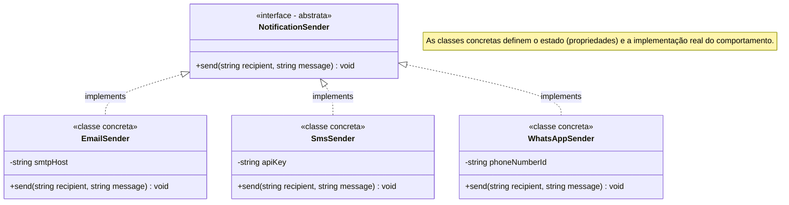

# 23. Interfaces e Polimorfismo

Nos capítulos anteriores, aprendemos a criar classes, encapsular dados e
comportamentos com modificadores de acesso e gerenciar o ciclo de vida e a
identidade de objetos na memória.

Até aqui, sempre que tipamos um parâmetro de função ou propriedade, utilizamos
tipos primitivos ou o nome de uma **classe concreta específica**. No entanto, à
medida que um sistema web evolui, acoplar o código a classes concretas cria
sistemas rígidos, difíceis de testar e caros de manter.

Neste capítulo, aprenderemos o mecanismo fundamental de abstração e
desacoplamento no PHP moderno: as **Interfaces** (palavras-chave **`interface`**
e **`implements`**), a implementação de múltiplos contratos e o conceito central
de **Polimorfismo**.

## O Problema ao Modelar Conceitos Abstratos

Imagine que estamos desenvolvendo uma plataforma de e-commerce e precisamos
notificar o cliente sempre que o status de um pedido for atualizado.
Inicialmente, a empresa envia notificações apenas por **E-mail**.

Podemos criar uma classe de serviço e utilizá-la diretamente no processador de
pedidos:

```php
<?php

declare(strict_types=1);

class EmailNotificationService
{
    public function sendEmail(string $recipient, string $message): void
    {
        echo "📧 Enviando E-mail para {$recipient}: \"{$message}\"\n";
    }
}

class OrderProcessor
{
    // ❌ ACOPLAMENTO DIRETO: Depende exclusivamente de uma classe concreta
    public function __construct(
        private EmailNotificationService $emailService
    ) {}

    public function completeOrder(string $orderId, string $customerEmail): void
    {
        // Lógica de fechamento do pedido...
        echo "Pedido #{$orderId} finalizado com sucesso.\n";

        // Dispara a notificação:
        $this->emailService->sendEmail($customerEmail, "Seu pedido #{$orderId} foi confirmado!");
    }
}
```

Essa implementação funciona perfeitamente no primeiro dia. Porém, o negócio
cresce e a equipe de produto traz novas demandas:

1. _"Clientes VIP devem receber notificações por **WhatsApp**."_
2. _"Notificações urgentes de cancelamento devem ser enviadas por **SMS**."_
3. _"Em ambiente de testes automatizados, não devemos enviar mensagens reais,
   apenas registrar em um mock/log."_

Se tentarmos resolver isso na classe concreta adicionando métodos ou
condicionais, caímos em uma armadilha:

```php
// ❌ CÓDIGO PROBLEMÁTICO: A classe acumula serviços concretos e condicionais
class OrderProcessor
{
    public function __construct(
        private ?EmailNotificationService $emailService = null,
        private ?SmsNotificationService $smsService = null,
        private ?WhatsAppNotificationService $whatsAppService = null
    ) {}

    public function completeOrder(string $orderId, string $recipient, string $channel): void
    {
        match ($channel) {
            'email' => $this->emailService?->sendEmail($recipient, "Confirmado!"),
            'sms' => $this->smsService?->sendSms($recipient, "Confirmado!"),
            'whatsapp' => $this->whatsAppService?->sendWhatsAppMessage($recipient, "Confirmado!"),
            default => throw new InvalidArgumentException("Canal inválido"),
        };
    }
}
```

Esse design viola princípios fundamentais da boa engenharia de software:

- **Forte Acoplamento:** Para cada novo canal (Telegram, Push Notification), a
  classe `OrderProcessor` precisa ser editada, testada novamente e recompilada.
- **Inconsistência de Métodos:** Cada serviço concreto inventa seus próprios
  nomes de método (`sendEmail`, `sendSms`, `sendWhatsAppMessage`), impedindo um
  tratamento uniforme.
- **Dificuldade de Testes:** É impossível testar `OrderProcessor` sem instanciar
  serviços reais ou complexos.

## O Conceito: Contratos Puros com `interface`

Para resolver essa dor, precisamos inverter a forma como pensamos a modelagem:
em vez de nos perguntarmos **"qual classe concreta vai realizar essa tarefa?"**,
devemos nos perguntar **"qual é o papel ou comportamento esperado?"**.

No PHP, uma **`interface`** é um contrato 100% abstrato que define **o que** uma
classe deve fazer, sem determinar **como** ela deve fazer.

### Características de uma Interface

1. **Apenas Assinaturas de Métodos:** Define o nome do método, parâmetros e tipo
   de retorno. Métodos de interface **nunca possuem corpo (`{}`)**, terminando
   sempre com ponto e vírgula (`;`).
2. **Visibilidade Sempre Pública:** Todos os métodos declarados em uma interface
   são implicitamente `public`.
3. **Sem Estado:** Interfaces não podem conter propriedades de instância
   (variáveis `$nome`), mas podem conter **constantes**.
4. **Instanciação Proibida:** É impossível executar `new MinhaInterface()`.



### Declarando uma Interface

```php
<?php

declare(strict_types=1);

interface NotificationSender
{
    /**
     * Assina o contrato de envio: qualquer classe que implemente esta interface
     * DEVE fornecer um método 'send' com esta exata assinatura.
     */
    public function send(string $recipient, string $message): void;
}
```

### Implementando a Interface com `implements`

Para que uma classe se comprometa a cumprir as regras da interface, utilizamos a
palavra-chave **`implements`**:

```php
<?php

declare(strict_types=1);

class EmailSender implements NotificationSender
{
    public function __construct(
        private string $smtpHost
    ) {}

    public function send(string $recipient, string $message): void
    {
        echo "📧 [SMTP: {$this->smtpHost}] E-mail enviado para {$recipient}: \"{$message}\"\n";
    }
}

class SmsSender implements NotificationSender
{
    public function __construct(
        private string $apiKey
    ) {}

    public function send(string $recipient, string $message): void
    {
        echo "📱 [SMS Gateway] Mensagem enviada para {$recipient}: \"{$message}\"\n";
    }
}

class WhatsAppSender implements NotificationSender
{
    public function __construct(
        private string $phoneNumberId
    ) {}

    public function send(string $recipient, string $message): void
    {
        echo "💬 [WhatsApp API] Mensagem enviada para {$recipient}: \"{$message}\"\n";
    }
}
```

> ⚠️ **Regra do Compilador:**
>
> Se uma classe declarar `implements NotificationSender` e esquecer de
> implementar qualquer um dos métodos exigidos ou alterar os tipos da
> assinatura, o PHP emitirá um erro fatal imediato no carregamento do arquivo.

## Polimorfismo: O Poder da Tipagem por Contrato

A palavra **Polimorfismo** tem origem grega e significa _"muitas formas"_. Em
programação orientada a objetos, polimorfismo é a capacidade de **tratar objetos
de tipos diferentes de forma uniforme, através de uma interface compartilhada**.

Agora, a classe `OrderProcessor` não depende mais de nenhuma classe concreta de
e-mail, SMS ou WhatsApp. Ela depende apenas da interface:

```php
<?php

declare(strict_types=1);

class OrderProcessor
{
    // ✅ DESACOPLAMENTO TOTAL: Recebe qualquer objeto que cumpra o contrato NotificationSender
    public function __construct(
        private NotificationSender $notifier
    ) {}

    public function completeOrder(string $orderId, string $recipient): void
    {
        echo "Processando pedido #{$orderId}...\n";

        // O processador não sabe nem se importa como a mensagem será enviada:
        $this->notifier->send($recipient, "Seu pedido #{$orderId} foi confirmado!");
    }
}
```

Veja como o mesmo código se comporta de formas completamente diferentes conforme
o objeto que injetamos:

```php
// Cenário 1: Notificação por E-mail
$emailProcessor = new OrderProcessor(new EmailSender("smtp.empresa.com"));
$emailProcessor->completeOrder("ORD-001", "cliente@fatec.sp.gov.br");
// Processando pedido #ORD-001...
// 📧 [SMTP: smtp.empresa.com] E-mail enviado para cliente@fatec.sp.gov.br: "Seu pedido #ORD-001 foi confirmado!"

// Cenário 2: Notificação por WhatsApp (sem alterar uma única linha de OrderProcessor!)
$whatsappProcessor = new OrderProcessor(new WhatsAppSender("WA-PHONE-99"));
$whatsappProcessor->completeOrder("ORD-002", "+5511999998888");
// Processando pedido #ORD-002...
// 💬 [WhatsApp API] Mensagem enviada para +5511999998888: "Seu pedido #ORD-002 foi confirmado!"
```

Isso viabiliza o **Princípio Aberto/Fechado** (_Open/Closed Principle_): o
sistema está **aberto para extensão** (podemos criar `TelegramSender` ou
`DiscordSender` a qualquer momento) e **fechado para modificação** (a classe
`OrderProcessor` nunca precisará ser alterada).

## Múltiplas Interfaces

No PHP, uma classe não está limitada a um único contrato. Ela pode assinar e
implementar **quantas interfaces forem necessárias**, separadas por vírgula:

```php
<?php

declare(strict_types=1);

interface Loggable
{
    public function log(string $action): void;
}

interface Encryptable
{
    public function getEncryptionKey(): string;
}

// Uma classe cumprindo três contratos simultaneamente:
class SecureWhatsAppSender implements NotificationSender, Loggable, Encryptable
{
    public function send(string $recipient, string $message): void
    {
        $this->log("Enviando mensagem segura para {$recipient}");
        echo "💬🔒 Mensagem criptografada enviada para {$recipient}.\n";
    }

    public function log(string $action): void
    {
        echo "[LOG - " . date('Y-m-d H:i:s') . "]: {$action}\n";
    }

    public function getEncryptionKey(): string
    {
        return "AES-256-GCM-KEY-123";
    }
}
```

## Extensão de Interfaces (`extends`)

Contratos também podem ser compostos e especializados. No PHP, **uma interface
pode estender outra interface** utilizando a palavra-chave **`extends`**:

```php
<?php

declare(strict_types=1);

interface PaymentGateway
{
    public function charge(float $amount): bool;
}

// Interface especializada: herda o método charge() e adiciona refund()
interface RefundablePaymentGateway extends PaymentGateway
{
    public function refund(string $transactionId, float $amount): bool;
}

// Uma classe que implementar RefundablePaymentGateway DEVE implementar ambos os métodos:
class StripeGateway implements RefundablePaymentGateway
{
    public function charge(float $amount): bool
    {
        echo "Cobrando R$ {$amount} via Stripe.\n";
        return true;
    }

    public function refund(string $transactionId, float $amount): bool
    {
        echo "Estornando R$ {$amount} da transação {$transactionId} no Stripe.\n";
        return true;
    }
}
```

## Constantes em Interfaces

Interfaces podem definir constantes públicas para padronizar valores de retorno,
códigos de status ou limites operacionais:

```php
<?php

declare(strict_types=1);

interface StorageDriver
{
    public const MAX_FILE_SIZE_MB = 25;
    public const DEFAULT_DISK = "s3";

    public function store(string $filename, string $content): bool;
}

// Acesso direto via nome da interface:
echo "Limite máximo: " . StorageDriver::MAX_FILE_SIZE_MB . " MB\n";
```

<details>
<summary>🔍 Aprofundamento: O Princípio de Segregação de Interfaces (ISP) e o Equilíbrio de Coesão</summary>

O **Princípio de Segregação de Interfaces** (_Interface Segregation Principle_ —
o **I** do SOLID) estabelece que:

> _"Nenhum cliente deve ser forçado a depender de métodos que não utiliza."_

Quando projetamos interfaces para um sistema web, a tendência inicial é criar
contratos monolíticos que tentam prever todas as operações possíveis de um
recurso:

```php
// ❌ Interface "Gorda" (Fat Interface): Mistura responsabilidades distintas
interface OrderRepositoryInterface
{
    // Operações de consulta/leitura:
    public function findById(string $id): ?array;
    public function listAll(int $limit, int $offset): array;

    // Operações de persistência/mutação:
    public function save(array $orderData): void;
    public function delete(string $id): void;

    // Operações de auditoria e exportação:
    public function exportToCsv(): string;
    public function sendAuditNotification(): void;
}
```

Se um serviço de **Geração de Relatórios** precisa apenas listar pedidos, ele
será forçado a depender de uma interface que expõe métodos de exclusão
(`delete`) e envio de notificações (`sendAuditNotification`), criando
acoplamento desnecessário.

A solução é separar essas operações em **interfaces coesas por contexto de
uso**:

```php
// ✅ Interfaces Coesas e Focadas em Papéis:
interface OrderReaderInterface
{
    public function findById(string $id): ?array;
    public function listAll(int $limit, int $offset): array;
}

interface OrderWriterInterface
{
    public function save(array $orderData): void;
    public function delete(string $id): void;
}
```

**⚖️ O Perigo da Fragmentação Excessiva (_Interface Explosion_):**

Segregar interfaces **não significa criar uma interface para cada método
individual** (como `OrderFinderByIdInterface`, `OrderSaverInterface`,
`OrderDeleterInterface`).

Levar o princípio ao extremo gera o antipadrão da _explosão de interfaces_,
resultando em:

- Dezenas de arquivos de interface minúsculos e dispersos no projeto;
- Assinaturas de classes poluídas (`implements A, B, C, D, E, F`);
- Dificuldade de navegação e sobrecarga cognitiva desnecessária para o time.

> 💡 **Regra Prática de Coesão:**
>
> Agrupe em uma mesma interface métodos que **mudam juntos** ou que atendem ao
> **mesmo papel/consumidor**. Só divida uma interface quando clientes reais
> precisarem de apenas um subconjunto isolado de suas capacidades.

</details>

## Exemplo Completo do Domínio: Processador de Pagamentos Plugável

Vejamos um exemplo completo de um sistema financeiro que aceita múltiplos
provedores de pagamento de forma 100% polimórfica:

```php
<?php

declare(strict_types=1);

// 1. DTO de Resultado da Operação:
readonly class PaymentResult
{
    public function __construct(
        public bool $success,
        public string $transactionId,
        public string $message
    ) {}
}

// 2. CONTRATO: Interface de Gateway de Pagamento
interface PaymentGatewayInterface
{
    public function processPayment(float $amount, string $customerDocument): PaymentResult;
    public function getGatewayName(): string;
}

// 3. Implementação Concreta 1: Mercado Pago
class MercadoPagoGateway implements PaymentGatewayInterface
{
    public function processPayment(float $amount, string $customerDocument): PaymentResult
    {
        // Simulação de chamada de API externa:
        $txId = "MP-" . bin2hex(random_bytes(4));
        return new PaymentResult(
            success: true,
            transactionId: $txId,
            message: "Pagamento de R$ " . number_format($amount, 2) . " aprovado via Mercado Pago."
        );
    }

    public function getGatewayName(): string
    {
        return "Mercado Pago";
    }
}

// 4. Implementação Concreta 2: Pagar.me
class PagarMeGateway implements PaymentGatewayInterface
{
    public function processPayment(float $amount, string $customerDocument): PaymentResult
    {
        $txId = "PAGARME-" . bin2hex(random_bytes(4));
        return new PaymentResult(
            success: true,
            transactionId: $txId,
            message: "Pagamento de R$ " . number_format($amount, 2) . " processado via Pagar.me."
        );
    }

    public function getGatewayName(): string
    {
        return "Pagar.me";
    }
}

// 5. Implementação Concreta 3: Provedor Mock para Testes Automatizados
class NullPaymentGateway implements PaymentGatewayInterface
{
    public function processPayment(float $amount, string $customerDocument): PaymentResult
    {
        return new PaymentResult(
            success: true,
            transactionId: "MOCK-0000",
            message: "Transação de teste simulada com sucesso."
        );
    }

    public function getGatewayName(): string
    {
        return "Simulador de Testes";
    }
}

// 6. Serviço de Checkout de Domínio:
class CheckoutService
{
    public function __construct(
        private PaymentGatewayInterface $gateway
    ) {}

    public function checkout(float $total, string $document): void
    {
        echo "=== Iniciando Checkout com provedor: {$this->gateway->getGatewayName()} ===\n";

        $result = $this->gateway->processPayment($total, $document);

        if ($result->success) {
            echo "✅ [SUCESSO]: {$result->message}\n";
            echo "ID da Transação: {$result->transactionId}\n\n";
        } else {
            echo "❌ [FALHA]: {$result->message}\n\n";
        }
    }
}

// 7. Execução Polimórfica:
$checkoutMercadoPago = new CheckoutService(new MercadoPagoGateway());
$checkoutMercadoPago->checkout(250.00, "123.456.789-00");

$checkoutPagarMe = new CheckoutService(new PagarMeGateway());
$checkoutPagarMe->checkout(1200.50, "987.654.321-99");

$checkoutTestes = new CheckoutService(new NullPaymentGateway());
$checkoutTestes->checkout(99.00, "000.000.000-00");
```

**Saída da Execução:**

```text
=== Iniciando Checkout com provedor: Mercado Pago ===
✅ [SUCESSO]: Pagamento de R$ 250.00 aprovado via Mercado Pago.
ID da Transação: MP-8a3b1c2d

=== Iniciando Checkout com provedor: Pagar.me ===
✅ [SUCESSO]: Pagamento de R$ 1,200.50 processado via Pagar.me.
ID da Transação: PAGARME-f4e5d6c7

=== Iniciando Checkout com provedor: Simulador de Testes ===
✅ [SUCESSO]: Transação de teste simulada com sucesso.
ID da Transação: MOCK-0000
```

## Comparativo: Quando Usar Interfaces?

| Característica            | `class` Concreta                            | `interface`                             |
| :------------------------ | :------------------------------------------ | :-------------------------------------- |
| **Pode dar `new`?**       | Sim                                         | **Não**                                 |
| **Pode ter código `{}`?** | Sim                                         | **Não** (apenas assinaturas de métodos) |
| **Propriedades (`$var`)** | Sim (privadas, públicas, etc.)              | **Não** (apenas constantes `const`)     |
| **Múltipla Adoção**       | Não (uma classe define uma estrutura única) | **Sim** (`implements A, B, C`)          |
| **Objetivo Principal**    | Implementação concreta e dados              | **Definir contratos de tipos e papéis** |

## O Que Vem a Seguir?

Neste capítulo, aprendemos como as **Interfaces** permitem definir contratos
puros e como o **Polimorfismo** desacopla nosso código, permitindo que serviços
operem sobre qualquer implementação que respeite o contrato.

No entanto, observe o que acontece quando várias classes implementam a mesma
interface: frequentemente, essas classes precisam compartilhar propriedades em
comum (como identificadores, status ou datas) e métodos utilitários idênticos.
Se usarmos apenas interfaces, seremos forçados a duplicar esse código concreto
em cada classe.

No **[Capítulo 24: Herança e Sobrescrita de
Métodos](24-heranca-e-sobrescrita-de-metodos.md)**, aprenderemos como a
**Herança** (`extends`) nos permite reaproveitar propriedades e métodos entre
classes afins, controlar o acesso com `protected` e delegar rotinas com
`parent::`.

---

<a href="22-clonagem-e-comparacao-de-objetos.md">← Clonagem e Comparação de
Objetos</a>

<p align="right"><a href="24-heranca-e-sobrescrita-de-metodos.md">Próximo: Herança e Sobrescrita de Métodos →</a></p>
