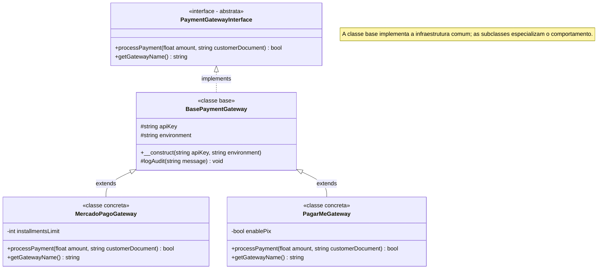

# 24. Herança e Sobrescrita de Métodos

No capítulo anterior, aprendemos a utilizar as **Interfaces** para estabelecer
contratos formais e alcançar o **Polimorfismo**. Vimos que classes distintas
podem cumprir o mesmo papel através de `implements`, desacoplando completamente
os serviços consumidores das implementações concretas.

No entanto, conforme começamos a implementar múltiplos serviços a partir de uma
mesma interface, surge um novo desafio de design: **como compartilhar
propriedades e rotinas concretas idênticas entre essas classes sem duplicar
código?**

Neste capítulo, aprenderemos o mecanismo de **Herança** no PHP — a palavra-chave
**`extends`**, o modificador de visibilidade **`protected`**, a delegação com
**`parent::`** e a **Sobrescrita de Métodos** (_Method Overriding_).

## A Dor de Compartilhar Código entre Implementações

No capítulo anterior, modelamos a interface `PaymentGatewayInterface` e criamos
classes como `MercadoPagoGateway` e `PagarMeGateway`.

Vejamos o que acontece na prática quando desenvolvemos esses gateways de forma
isolada:

```php
<?php

declare(strict_types=1);

interface PaymentGatewayInterface
{
    public function processPayment(float $amount, string $customerDocument): bool;
    public function getGatewayName(): string;
}

// IMPLEMENTAÇÃO 1: Mercado Pago
class MercadoPagoGateway implements PaymentGatewayInterface
{
    public function __construct(
        private string $apiKey,
        private string $environment // 'sandbox' ou 'production'
    ) {
        if (empty($this->apiKey)) {
            throw new InvalidArgumentException("API Key obrigatória.");
        }
    }

    public function processPayment(float $amount, string $customerDocument): bool
    {
        // Rotina de auditoria duplicada:
        echo "[AUDIT - " . date('Y-m-d H:i:s') . "] Iniciando cobrança de R$ {$amount} no ambiente {$this->environment}.\n";

        // Lógica específica do Mercado Pago...
        echo "Integrando com API do Mercado Pago via token: {$this->apiKey}...\n";
        return true;
    }

    public function getGatewayName(): string
    {
        return "Mercado Pago";
    }
}

// IMPLEMENTAÇÃO 2: Pagar.me (Repete praticamente toda a infraestrutura)
class PagarMeGateway implements PaymentGatewayInterface
{
    public function __construct(
        private string $apiKey,
        private string $environment // 'sandbox' ou 'production'
    ) {
        if (empty($this->apiKey)) {
            throw new InvalidArgumentException("API Key obrigatória.");
        }
    }

    public function processPayment(float $amount, string $customerDocument): bool
    {
        // Exatamente o mesmo formato de log e validação:
        echo "[AUDIT - " . date('Y-m-d H:i:s') . "] Iniciando cobrança de R$ {$amount} no ambiente {$this->environment}.\n";

        // Lógica específica do Pagar.me...
        echo "Integrando com API do Pagar.me via token: {$this->apiKey}...\n";
        return true;
    }

    public function getGatewayName(): string
    {
        return "Pagar.me";
    }
}
```

Observe os problemas evidentes dessa abordagem:

1. **Código e Estruturas Duplicadas:** Ambas as classes precisam das
   propriedades `$apiKey` e `$environment`, da validação no construtor e da
   rotina de log de auditoria.
2. **Fragilidade de Manutenção:** Se a equipe de segurança decidir alterar o
   formato dos logs de auditoria ou adicionar um cabeçalho padrão de requisição,
   teremos que alterar manualmente cada classe de gateway do projeto.
3. **Interfaces não resolvem esse problema sozinhas:** Interfaces definem apenas
   _o que_ deve ser feito (assinaturas), mas **não podem armazenar estado
   (`$apiKey`) nem fornecer código implementado `{}`**.

## O Conceito: Herança de Classes com `extends`

A **Herança** é o mecanismo da programação orientada a objetos que permite criar
uma nova classe (chamada de **subclasse** ou **classe filha**) a partir de uma
classe já existente (chamada de **superclasse** ou **classe base** / **classe
pai**).

A subclasse **herda automaticamente todas as propriedades e métodos** da
superclasse, podendo:

- Reutilizar a implementação existente sem reescrevê-la;
- Adicionar novas propriedades e métodos especializados;
- Modificar comportamentos existentes através de sobrescrita.

### A Relação "É-UM" (_Is-A_)

A herança estabelece uma relação conceitual de especialização:

- `MercadoPagoGateway` **É-UM** `BasePaymentGateway`.
- `PagarMeGateway` **É-UM** `BasePaymentGateway`.



## O Modificador de Visibilidade `protected`

Até aqui, exploramos a fundo dois modificadores de acesso:

- **`public`:** Acessível por qualquer parte do código (fora e dentro da
  classe).
- **`private`:** Acessível **estritamente dentro da própria classe** que o
  declarou.

Quando utilizamos herança, propriedades e métodos marcados como `private` na
superclasse **não podem ser acessados diretamente pelas subclasses**.

Para resolver isso, o PHP disponibiliza o modificador **`protected`**:

| Modificador     | Acessível no Objeto Externo? | Acessível dentro da Própria Classe? | Acessível dentro das Subclasses? |
| :-------------- | :--------------------------: | :---------------------------------: | :------------------------------: |
| **`public`**    |            ✅ Sim            |               ✅ Sim                |              ✅ Sim              |
| **`protected`** |            ❌ Não            |               ✅ Sim                |            ✅ **Sim**            |
| **`private`**   |            ❌ Não            |               ✅ Sim                |            ❌ **Não**            |

### Criando a Superclasse Base

```php
<?php

declare(strict_types=1);

class BasePaymentGateway implements PaymentGatewayInterface
{
    // ✅ Propriedades protegidas: subclasses têm acesso direto, mas o mundo externo não!
    public function __construct(
        protected string $apiKey,
        protected string $environment = "sandbox"
    ) {
        if (empty($this->apiKey)) {
            throw new InvalidArgumentException("API Key obrigatória.");
        }
    }

    // ✅ Método protegido compartilhado por todos os gateways:
    protected function logAudit(string action, float $amount): void
    {
        $timestamp = date('Y-m-d H:i:s');
        echo "[AUDIT - {$timestamp}] Gateway [{$this->getGatewayName()}] no ambiente [{$this->environment}]: {$action} R$ " . number_format($amount, 2) . "\n";
    }

    public function processPayment(float $amount, string $customerDocument): bool
    {
        $this->logAudit("Processando cobrança para {$customerDocument} no valor de", $amount);
        return true;
    }

    public function getGatewayName(): string
    {
        return "Gateway Genérico";
    }
}
```

> ⚠️ **Aviso de Design: Proteja as Invariantes com `protected`**
>
> Marcar um campo como `protected` **não significa que ele está 100%
> encapsulado**. Se uma superclasse expuser propriedades mutáveis sensíveis como
> `protected` (ex: `protected string $status` ou `protected float $balance`),
> qualquer subclasse poderá alterá-las livremente sem passar por validações,
> **violando as invariantes de negócio da classe base por dentro da própria
> hierarquia**.
>
> **Boas Práticas:**
>
> 1. **Prefira `protected readonly`** para campos que as subclasses apenas
>    precisam ler (como chaves de API, credenciais ou endpoints).
> 2. **Para estados mutáveis críticos, mantenha-os `private`** e forneça métodos
>    `protected` controlados com validação (ex: `protected function
setStatus(...)`) em vez de permitir reatribuição direta pelas subclasses.

## Estendendo Classes e Reaproveitando Construtores com `parent::`

Agora, podemos criar o `MercadoPagoGateway` utilizando a palavra-chave
**`extends`**.

Quando a subclasse precisa de parâmetros adicionais em seu próprio construtor
(por exemplo, um limite de parcelas `$installmentsLimit`), ela deve invocar o
construtor da classe base usando **`parent::__construct(...)`**:

```php
<?php

declare(strict_types=1);

class MercadoPagoGateway extends BasePaymentGateway
{
    // A subclasse define seus parâmetros específicos e repassa os comuns ao pai:
    public function __construct(
        string $apiKey,
        string $environment,
        private int $installmentsLimit = 12
    ) {
        // ✅ Delega a validação e inicialização de $apiKey e $environment para o pai:
        parent::__construct($apiKey, $environment);

        // Adiciona validação específica da subclasse:
        if ($this->installmentsLimit < 1) {
            throw new InvalidArgumentException("O limite de parcelas deve ser maior que zero.");
        }
    }

    // Sobrescreve o nome do gateway:
    public function getGatewayName(): string
    {
        return "Mercado Pago (Até {$this->installmentsLimit}x)";
    }
}
```

> ⚠️ **Atenção ao Construtor:**
>
> Se a subclasse declarar seu próprio `__construct()`, o construtor da classe
> base **não será executado automaticamente**. É fundamental chamar
> `parent::__construct(...)` para garantir que as propriedades e validações da
> classe pai sejam devidamente inicializadas.

## Sobrescrita de Métodos (_Method Overriding_)

A **Sobrescrita de Métodos** ocorre quando uma subclasse redefine um método que
já foi declarado na superclasse, adaptando seu comportamento para suas próprias
necessidades.

A subclasse pode:

1. **Substituir totalmente** a lógica da superclasse;
2. **Complementar** a lógica da superclasse, invocando `parent::nomeDoMetodo()`
   para executar o comportamento base antes ou depois de sua lógica exclusiva.

```php
<?php

declare(strict_types=1);

class PagarMeGateway extends BasePaymentGateway
{
    public function __construct(
        string $apiKey,
        string $environment,
        private bool $enablePix = true
    ) {
        parent::__construct($apiKey, $environment);
    }

    // ✅ SOBRESCRITA DE MÉTODO: Estende o comportamento padrão herdado
    public function processPayment(float $amount, string $customerDocument): bool
    {
        // 1. Executa a lógica padrão de auditoria da classe base:
        parent::processPayment($amount, $customerDocument);

        // 2. Adiciona o comportamento exclusivo do Pagar.me:
        if ($this->enablePix) {
            echo "⚡ [Pagar.me] Gerando payload PIX com chave vinculada à conta...\n";
        }

        echo "💳 [Pagar.me] Comunicando com adquirente Stone via chave: {$this->apiKey}\n";
        return true;
    }

    public function getGatewayName(): string
    {
        return "Pagar.me V5";
    }
}
```

### Regras do PHP Moderno para Sobrescrita de Métodos

Para garantir a integridade dos contratos de tipos, o PHP impõe regras estritas
de compatibilidade na sobrescrita:

1. **Visibilidade Não Pode Ser Reduzida:** Se o método na classe base for
   `public`, a subclasse não pode torná-lo `protected` ou `private`. Ela pode,
   no entanto, tornar um método `protected` mais aberto (`public`).
2. **Compatibilidade de Tipos nos Parâmetros (Contravariância):** Os tipos dos
   parâmetros na subclasse devem ser iguais ou mais amplos (genéricos) do que na
   superclasse.
3. **Compatibilidade de Tipos no Retorno (Covariância):** O tipo de retorno na
   subclasse deve ser igual ou mais restrito (específico) do que na superclasse.

## Exemplo Completo do Domínio: Arquitetura em Camadas com Interfaces e Herança

Vejamos a junção harmoniosa entre o contrato da **Interface** (visto no Cap. 23)
e o compartilhamento de código da **Herança**:

```php
<?php

declare(strict_types=1);

// 1. CONTRATO PÚBLICO (Interface)
interface PaymentGatewayInterface
{
    public function processPayment(float $amount, string $customerDocument): bool;
    public function getGatewayName(): string;
}

// 2. SUPERCLASSE BASE (Compartilha estado protegido, auditoria e inicialização)
class BasePaymentGateway implements PaymentGatewayInterface
{
    public function __construct(
        protected string $apiKey,
        protected string $environment = "sandbox"
    ) {
        if (strlen($this->apiKey) < 8) {
            throw new InvalidArgumentException("Chave de API inválida.");
        }
    }

    protected function logAudit(string $action, float $amount): void
    {
        $envTag = strtoupper($this->environment);
        echo "[AUDIT - {$envTag}] [{$this->getGatewayName()}]: {$action} R$ " . number_format($amount, 2) . "\n";
    }

    public function processPayment(float $amount, string $customerDocument): bool
    {
        $this->logAudit("Cobrança autorizada para doc {$customerDocument} no total de", $amount);
        return true;
    }

    public function getGatewayName(): string
    {
        return "Gateway Padrão";
    }
}

// 3. SUBCLASSE 1: Mercado Pago
class MercadoPagoGateway extends BasePaymentGateway
{
    public function __construct(
        string $apiKey,
        string $environment,
        private int $maxInstallments = 12
    ) {
        parent::__construct($apiKey, $environment);
    }

    public function processPayment(float $amount, string $customerDocument): bool
    {
        parent::processPayment($amount, $customerDocument);
        echo "   ↳ Autorizado em até {$this->maxInstallments} parcelas sem juros.\n";
        return true;
    }

    public function getGatewayName(): string
    {
        return "Mercado Pago";
    }
}

// 4. SUBCLASSE 2: Pagar.me
class PagarMeGateway extends BasePaymentGateway
{
    public function __construct(
        string $apiKey,
        string $environment,
        private string $postbackUrl
    ) {
        parent::__construct($apiKey, $environment);
    }

    public function processPayment(float $amount, string $customerDocument): bool
    {
        parent::processPayment($amount, $customerDocument);
        echo "   ↳ Webhook de notificação configurado para: {$this->postbackUrl}\n";
        return true;
    }

    public function getGatewayName(): string
    {
        return "Pagar.me";
    }
}

// 5. CONSUMIDOR POLIMÓRFICO: Depende apenas da Interface
class CheckoutService
{
    public function __construct(
        private PaymentGatewayInterface $gateway
    ) {}

    public function handle(float $amount, string $document): void
    {
        echo "Iniciando processamento com: {$this->gateway->getGatewayName()}\n";
        $this->gateway->processPayment($amount, $document);
        echo "Processamento concluído com sucesso!\n\n";
    }
}

// 6. Execução prática:
$mp = new MercadoPagoGateway("MP_PROD_SEC_KEY_9999", "production", 6);
$checkout1 = new CheckoutService($mp);
$checkout1->handle(450.00, "111.222.333-44");

$pagarme = new PagarMeGateway("PAGARME_LIVE_KEY_8888", "production", "https://api.fatec.sp.gov.br/webhooks");
$checkout2 = new CheckoutService($pagarme);
$checkout2->handle(1200.00, "555.666.777-88");
```

**Saída da Execução:**

```text
Iniciando processamento com: Mercado Pago
[AUDIT - PRODUCTION] [Mercado Pago]: Cobrança autorizada para doc 111.222.333-44 no total de R$ 450.00
   ↳ Autorizado em até 6 parcelas sem juros.
Processamento concluído com sucesso!

Iniciando processamento com: Pagar.me
[AUDIT - PRODUCTION] [Pagar.me]: Cobrança autorizada para doc 555.666.777-88 no total de R$ 1,200.00
   ↳ Webhook de notificação configurado para: https://api.fatec.sp.gov.br/webhooks
Processamento concluído com sucesso!
```

## Composição vs Herança: Quando Usar Cada Uma?

A herança é uma ferramenta poderosa, mas cria o nível mais forte de
**acoplamento** na orientação a objetos: a subclasse fica amarrada aos detalhes
internos de implementação da superclasse. Qualquer alteração ou chamada interna
na classe pai pode quebrar silenciosamente as subclasses — um fenômeno clássico
conhecido como o **Problema da Classe Base Frágil** (_Fragile Base Class
Problem_).

### O Risco da Herança Frágil na Prática

Considere uma lista de usuários que gerencia inserções:

```php
<?php

declare(strict_types=1);

class UserList
{
    /** @var array<string> */
    protected array $users = [];

    public function add(string $user): void
    {
        $this->users[] = $user;
    }

    public function addAll(array $users): void
    {
        foreach ($users as $user) {
            // A classe pai optou por reutilizar internamente seu próprio método add():
            $this->add($user);
        }
    }

    public function count(): int
    {
        return count($this->users);
    }
}
```

Agora, imagine que um desenvolvedor cria uma subclasse com o objetivo de
**contabilizar quantas tentativas de inserção foram feitas**:

```php
// ❌ HERANÇA FRÁGIL: A subclasse assume premissas sobre como o pai funciona internamente
class LoggedUserList extends UserList
{
    private int $insertionCount = 0;

    public function add(string $user): void
    {
        $this->insertionCount++;
        parent::add($user);
    }

    public function addAll(array $users): void
    {
        // Incrementa pelo total de itens recebidos:
        $this->insertionCount += count($users);
        parent::addAll($users);
    }

    public function getInsertionCount(): int
    {
        return $this->insertionCount;
    }
}

$list = new LoggedUserList();
$list->addAll(["Alice", "Bob", "Carlos"]);

echo "Total inserido registrado: " . $list->getInsertionCount() . "\n";
// ❌ SAÍDA INESPERADA: Total inserido registrado: 6 (Contou em dobro!)
```

**Por que o erro aconteceu?**

Quando `LoggedUserList::addAll()` somou 3 e chamou `parent::addAll()`, a classe
pai executou um laço chamando `$this->add()` para cada elemento. Como `$this`
aponta para a instância da subclasse, o método sobrescrito `add()` foi disparado
mais 3 vezes, duplicando a contagem silenciosamente!

Se o desenvolvedor tivesse utilizado **Composição com Interfaces** (definindo um
contrato compartilhado e mantendo a lista original como um objeto interno
encapsulado), esse efeito colateral oculto jamais teria ocorrido:

```php
// 1. Contrato compartilhado:
interface UserListInterface
{
    public function add(string $user): void;
    /** @param array<string> $users */
    public function addAll(array $users): void;
    public function count(): int;
}

// 2. Implementação básica concreta:
class BasicUserList implements UserListInterface
{
    /** @var array<string> */
    private array $users = [];

    public function add(string $user): void
    {
        $this->users[] = $user;
    }

    public function addAll(array $users): void
    {
        foreach ($users as $user) {
            $this->add($user);
        }
    }

    public function count(): int
    {
        return count($this->users);
    }
}

// 3. ✅ SOLUÇÃO COM COMPOSIÇÃO: Implementa o mesmo contrato e encapsula a lista interna
class LoggedUserList implements UserListInterface
{
    private int $insertionCount = 0;

    public function __construct(
        private UserListInterface $innerList = new BasicUserList()
    ) {}

    public function add(string $user): void
    {
        $this->insertionCount++;
        $this->innerList->add($user); // Delega a inserção real
    }

    public function addAll(array $users): void
    {
        $this->insertionCount += count($users);
        $this->innerList->addAll($users); // ✅ Seguro: sem armadilhas de sobrescrita!
    }

    public function count(): int
    {
        return $this->innerList->count();
    }

    public function getInsertionCount(): int
    {
        return $this->insertionCount;
    }
}

// Ambas as classes cumprem UserListInterface e podem ser usadas de forma transparente:
$list = new LoggedUserList(new BasicUserList());
$list->addAll(["Alice", "Bob", "Carlos"]);

echo "Total na lista: " . $list->count() . "\n";
echo "Total inserido registrado: " . $list->getInsertionCount() . "\n";
// ✅ SAÍDA CORRETA:
// Total na lista: 3
// Total inserido registrado: 3
```

### Regra Prática de Decisão

Para decidir entre herança e composição, utilize a seguinte regra prática:

1. **Use Herança quando houver uma relação legítima "É-UM" (_Is-A_):**  
   Um `MercadoPagoGateway` é, conceitualmente, um gateway de pagamentos. Ele
   compartilha a identidade, a finalidade e a estrutura central da base.
2. **Use Composição quando houver uma relação "TEM-UM" ou "USA-UM" (_Has-A_ /
   _Uses-A_):**  
   Um `OrderService` **usa** um `PaymentGatewayInterface` e **tem** um
   `NotificationSender`. Ele não deve herdar do gateway nem do serviço de
   notificações.

> 💡 **Princípio de Design:**
>
> _"Prefira Composição sobre Herança."_ A herança deve ser reservada para
> famílias de classes altamente afins que realmente compartilham regras de
> infraestrutura e domínio.

## O Que Vem a Seguir?

Neste capítulo, aprendemos a eliminar a duplicação de código criando classes
base compartilhadas com **`extends`**, protegendo o estado interno com
**`protected`** e estendendo comportamentos com **`parent::`**.

No entanto, observe uma brecha estrutural em nossa classe `BasePaymentGateway`:
ela é uma classe comum, o que significa que qualquer desenvolvedor ainda pode
executar acidentalmente `new BasePaymentGateway("CHAVE", "prod")` — criando um
gateway genérico que não se comunica com nenhuma operadora real.

Além disso, como podemos **obrigar** que cada subclasse implemente sua própria
chamada HTTP de comunicação externa, sem permitir que fiquem incompletas?

No **[Capítulo 25: Controle de Herança: Classes Abstratas e Modificador
Final](25-classes-abstratas-e-modificador-final.md)**, aprenderemos a utilizar o
modificador **`abstract`** para impedir a instanciação direta e impor métodos
obrigatórios, além de utilizar o modificador **`final`** para blindar classes e
métodos críticos contra sobrescritas indevidas.

---

<a href="23-interfaces-e-polimorfismo.md">← Interfaces e Polimorfismo</a>

<p align="right"><a href="25-classes-abstratas-e-modificador-final.md">Próximo: Controle de Herança: Classes Abstratas e Modificador Final →</a></p>
