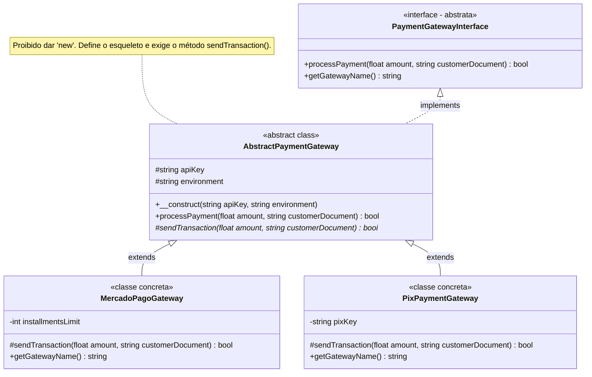
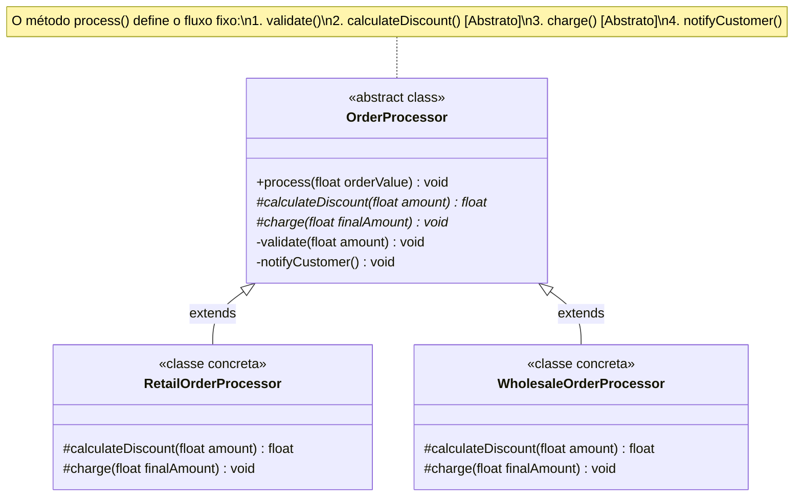

# 25. Controle de Herança: Classes Abstratas e Modificador Final

Nos capítulos anteriores, aprendemos a definir contratos puros com
**Interfaces** (Cap. 23) e a compartilhar propriedades e comportamentos comuns
através da **Herança** com a palavra-chave `extends` (Cap. 24).

No entanto, conforme a arquitetura de um sistema se torna mais robusta, surgem
duas necessidades críticas de governança sobre a hierarquia de tipos:

1. **Impedir a instanciação de classes base incompletas:** Garantir que classes
   conceituais (como uma superclasse de gateway genérico) nunca sejam
   instanciadas diretamente com `new`, forçando as subclasses a implementar seus
   passos obrigatórios.
2. **Proteger rotinas críticas contra alterações indevidas:** Impedir que
   subclasses alterem algoritmos sensíveis (como regras de segurança, cálculos
   de auditoria ou o fluxo de execução) ou que certas classes sejam estendidas.

Neste capítulo, aprenderemos a dominar os dois lados do controle de herança no
PHP moderno: os modificadores **`abstract`** (para fornecer esqueletos parciais
e obrigar contratos) e **`final`** (para restringir extensões e blindar a
integridade).

## O Problema ao Modelar Conceitos Abstratos

No capítulo anterior, criamos a classe `BasePaymentGateway` para evitar a
duplicação de código entre diferentes implementações de
`PaymentGatewayInterface`:

```php
<?php

declare(strict_types=1);

interface PaymentGatewayInterface
{
    public function processPayment(float $amount, string $customerDocument): bool;
    public function getGatewayName(): string;
}

class BasePaymentGateway implements PaymentGatewayInterface
{
    public function __construct(
        protected readonly string $apiKey,
        protected readonly string $environment = "sandbox"
    ) {}

    public function processPayment(float $amount, string $customerDocument): bool
    {
        // ❌ O que a classe base deve fazer aqui?
        // Ela não tem como saber como se comunicar com uma operadora genérica!
        return false;
    }

    public function getGatewayName(): string
    {
        return "Gateway Genérico";
    }
}
```

Essa abordagem introduz dois problemas imediatos de integridade e segurança:

1. **Instanciação Sem Significado:** Qualquer desenvolvedor pode executar `new
BasePaymentGateway("CHAVE_TESTE")`. Porém, no mundo real, **não existe um
   gateway genérico funcional**; todo pagamento real precisa de uma operadora
   concreta (Mercado Pago, Pagar.me, PIX).
2. **Implementações Omissas e Frágeis:** Se uma nova subclasse for criada (ex.:
   `PixGateway`) e o desenvolvedor esquecer de implementar a lógica de
   comunicação externa, o PHP executará silenciosamente o método da classe base
   (retornando `false`), sem disparar qualquer erro de compilação ou aviso no
   momento do desenvolvimento.

## O Conceito: Classes e Métodos Abstratos (`abstract`)

Para resolver essa dor, o PHP fornece a palavra-chave **`abstract`**, que pode
ser aplicada tanto a **classes** quanto a **métodos**.

### 1. Classes Abstratas (`abstract class`)

Uma **Classe Abstrata** é um molde parcial que:

- **Não pode ser instanciada diretamente com `new`** (tentar fazer isso dispara
  um erro fatal do PHP em tempo de execução).
- Serve exclusivamente como superclasse base para outras subclasses concretas.
- Pode conter propriedades, construtores e métodos com código implementado `{}`
  (que serão compartilhados por todas as subclasses).
- Pode assinar contratos com **`implements`**, deixando métodos pendentes para
  suas filhas.

### 2. Métodos Abstratos (`abstract function`)

Um **Método Abstrato** é uma declaração de assinatura (nome, visibilidade,
parâmetros e tipo de retorno) **sem corpo de código** (termina com `;` em vez de
`{}`).

Ele atua como um **contrato obrigatório para a hierarquia**: qualquer subclasse
concreta que herde da classe abstrata **é forçada pelo compilador a fornecer uma
implementação para esse método**, garantindo que nenhuma subclasse fique
incompleta.



### Aplicando `abstract` na Prática

```php
<?php

declare(strict_types=1);

abstract class AbstractPaymentGateway implements PaymentGatewayInterface
{
    public function __construct(
        protected readonly string $apiKey,
        protected readonly string $environment = "sandbox"
    ) {
        if (strlen($this->apiKey) < 8) {
            throw new InvalidArgumentException("Chave de API inválida.");
        }
    }

    // Método concreto compartilhado por todas as subclasses:
    public function processPayment(float $amount, string $customerDocument): bool
    {
        $this->logAudit("Iniciando transação para {$customerDocument}", $amount);

        // Delega o envio real para o método abstrato que cada subclasse implementa:
        return $this->sendTransaction($amount, $customerDocument);
    }

    // ✅ MÉTODO ABSTRATO: Assinatura obrigatória para todas as subclasses concretas
    abstract protected function sendTransaction(float $amount, string $customerDocument): bool;

    protected function logAudit(string $action, float $amount): void
    {
        echo "[AUDIT - {$this->environment}] [{$this->getGatewayName()}]: {$action} R$ " . number_format($amount, 2) . "\n";
    }
}
```

Se tentarmos instanciar a classe abstrata diretamente:

```php
// ❌ ERRO FATAL DO PHP:
// $gateway = new AbstractPaymentGateway("CHAVE-123");
// Fatal error: Cannot instantiate abstract class AbstractPaymentGateway
```

Agora, qualquer classe concreta é obrigada a cumprir o contrato:

```php
class PixPaymentGateway extends AbstractPaymentGateway
{
    public function __construct(
        string $apiKey,
        string $environment,
        private readonly string $pixKey
    ) {
        parent::__construct($apiKey, $environment);
    }

    // ✅ Obrigatório: Se não implementar sendTransaction(), o PHP dispara um erro fatal!
    protected function sendTransaction(float $amount, string $customerDocument): bool
    {
        echo "⚡ [PIX API] Gerando QR Code para a chave: {$this->pixKey}...\n";
        return true;
    }

    public function getGatewayName(): string
    {
        return "PIX Instantâneo";
    }
}

$pix = new PixPaymentGateway("PIX_PROD_KEY_999", "production", "financeiro@fatec.sp.gov.br");
$pix->processPayment(250.00, "123.456.789-00");
// [AUDIT - production] [PIX Instantâneo]: Iniciando transação para 123.456.789-00 R$ 250.00
// ⚡ [PIX API] Gerando QR Code para a chave: financeiro@fatec.sp.gov.br...
```

## O Padrão de Projeto _Template Method_

Um dos usos mais elegantes de classes abstratas em conjunto com interfaces é o
padrão de projeto **Template Method** (Método Modelo).

Nesse padrão, a classe base abstrata define o **esqueleto invariável de um
algoritmo** em um método concreto, enquanto os **passos variáveis ou
específicos** são declarados como métodos abstratos protegidos para que cada
subclasse os implemente:



Vejamos a implementação em PHP:

```php
<?php

declare(strict_types=1);

abstract class OrderProcessor
{
    // O Template Method: a ordem dos passos é fixa e protegida
    public function process(float $orderValue): void
    {
        $this->validate($orderValue);
        $discount = $this->calculateDiscount($orderValue);
        $finalAmount = $orderValue - $discount;
        $this->charge($finalAmount);
        $this->notifyCustomer();
    }

    private function validate(float $amount): void
    {
        if ($amount <= 0) {
            throw new InvalidArgumentException("Pedido inválido.");
        }
    }

    // Passo variável 1: cada tipo de cliente tem sua regra de desconto
    abstract protected function calculateDiscount(float $amount): float;

    // Passo variável 2: forma de cobrança específica
    abstract protected function charge(float $finalAmount): void;

    private function notifyCustomer(): void
    {
        echo "Notificação enviada com sucesso.\n";
    }
}

class RetailOrderProcessor extends OrderProcessor
{
    protected function calculateDiscount(float $amount): float
    {
        return $amount * 0.05; // 5% de desconto no varejo
    }

    protected function charge(float $finalAmount): void
    {
        echo "Cobrando R$ " . number_format($finalAmount, 2) . " via Cartão de Crédito.\n";
    }
}

$processor = new RetailOrderProcessor();
$processor->process(1000.0);
// Cobrando R$ 950.00 via Cartão de Crédito.
// Notificação enviada com sucesso.
```

## O Problema ao Permitir a Extensão de Conceitos Finalizados

Enquanto o modificador `abstract` é usado para **forçar** a extensão e a
implementação de métodos, surge o problema oposto: **o que acontece quando uma
subclasse sobrescreve um comportamento crítico que deveria ser estritamente
invariável, ou quando uma classe conceitualmente completa é estendida de forma
indesejada?**

Considere, por exemplo, o fluxo de processamento da classe `OrderProcessor` que
acabamos de construir:

```php
<?php

declare(strict_types=1);

// ❌ VULNERABILIDADE: O método process() não está blindado contra sobrescrita!
class FreeOrderProcessor extends OrderProcessor
{
    protected function calculateDiscount(float $amount): float
    {
        return 0.0;
    }

    protected function charge(float $finalAmount): void
    {
        // Vazio
    }

    // A subclasse redefine a pipeline inteira e remove a cobrança e validação!
    public function process(float $orderValue): void
    {
        echo "🎁 [BYPASS]: Pedido de R$ {$orderValue} liberado diretamente sem validação ou cobrança!\n";
        // Pula $this->validate(), $this->charge() e executa diretamente:
        $this->notifyCustomer();
    }
}
```

Se um método com regras de negócio críticas, validações de segurança ou logs de
auditoria puder ser livremente sobrescrito, qualquer subclasse descuidada ou
maliciosa poderá corromper o comportamento fundamental do sistema.

Além disso, existem classes que representam conceitos finalizados e
autossuficientes (como tokens de segurança, chaves criptográficas ou objetos de
valor imutáveis) que **não devem servir de base para herança**, pois já
representam entidades completas.

## O Conceito: Travando a Hierarquia com `final`

Para blindar classes e métodos contra modificações ou extensões não autorizadas,
o PHP disponibiliza a palavra-chave **`final`**.

### 1. Métodos `final` (Prevenindo a Sobrescrita)

Quando um método na superclasse é marcado com `final`, **as subclasses continuam
herdando e executando esse método normalmente, mas o PHP proíbe estritamente a
sua sobrescrita**:

```php
<?php

declare(strict_types=1);

abstract class OrderProcessor
{
    // ✅ MÉTODO FINAL: A pipeline invariável está blindada para sempre!
    final public function process(float $orderValue): void
    {
        $this->validate($orderValue);
        $discount = $this->calculateDiscount($orderValue);
        $finalAmount = $orderValue - $discount;
        $this->charge($finalAmount);
        $this->notifyCustomer();
    }

    private function validate(float $amount): void
    {
        if ($amount <= 0) {
            throw new InvalidArgumentException("Pedido inválido.");
        }
    }

    abstract protected function calculateDiscount(float $amount): float;
    abstract protected function charge(float $finalAmount): void;

    private function notifyCustomer(): void
    {
        echo "Notificação enviada com sucesso.\n";
    }
}

class InsecureOrderProcessor extends OrderProcessor
{
    // ❌ ERRO FATAL DO PHP:
    // public function process(float $orderValue): void {}
    // Fatal error: Cannot override final method OrderProcessor::process()

    protected function calculateDiscount(float $amount): float
    {
        return 0.0;
    }

    protected function charge(float $finalAmount): void
    {
        echo "Cobrando R$ " . number_format($finalAmount, 2) . "...\n";
    }
}
```

### 2. Classes `final` (Proíbem Qualquer Extensão)

Quando uma classe é marcada como `final`, **nenhuma outra classe pode estendê-la
com `extends`**, transformando-a em uma folha terminal da árvore de herança:

```php
<?php

declare(strict_types=1);

final class SecurityToken
{
    public function __construct(
        public readonly string $value,
        public readonly DateTimeImmutable $expiresAt
    ) {}

    public function isValid(): bool
    {
        return new DateTimeImmutable() < $this->expiresAt;
    }
}

// ❌ ERRO FATAL DO PHP:
// class CustomToken extends SecurityToken {}
// Fatal error: Class CustomToken cannot extend final class SecurityToken
```

> 💡 **Design Defensivo:**
>
> Classes que representam valores imutáveis (_Value Objects_), tokens, chaves de
> acesso ou serviços autossuficientes devem ser preferencialmente marcadas como
> `final` para evitar hierarquias frágeis desnecessárias.

## Exemplo Completo do Domínio: Arquitetura Financeira com `interface`, `abstract` e `final`

Vamos consolidar todo o aprendizado dos capítulos 23, 24 e 25 em uma arquitetura
financeira completa, segura e polimórfica:

```php
<?php

declare(strict_types=1);

// 1. CONTRATO PÚBLICO (Interface - Cap. 23):
interface PaymentGatewayInterface
{
    public function processPayment(float $amount, string $customerDocument): bool;
    public function getGatewayName(): string;
}

// 2. SUPERCLASSE BASE ABSTRATA (Template Method + Auditoria Invariante - Cap. 24 e 25):
abstract class AbstractPaymentGateway implements PaymentGatewayInterface
{
    public function __construct(
        protected readonly string $apiKey,
        protected readonly string $environment = "sandbox"
    ) {
        if (strlen($this->apiKey) < 8) {
            throw new InvalidArgumentException("Chave de API inválida.");
        }
    }

    // Template Method final: garante que a ordem do fluxo nunca seja burlada por subclasses
    final public function processPayment(float $amount, string $customerDocument): bool
    {
        $this->logAudit("Iniciando cobrança para {$customerDocument}", $amount);

        // Executa o envio específico implementado pela subclasse concreta:
        $success = $this->sendExternalCharge($amount, $customerDocument);

        if ($success) {
            $this->logAudit("Cobrança concluída com sucesso", $amount);
        }

        return $success;
    }

    // Contrato obrigatório: cada subclasse implementa sua própria chamada de rede
    abstract protected function sendExternalCharge(float $amount, string $customerDocument): bool;

    // Rotina de auditoria travada contra sobrescrita
    final protected function logAudit(string $action, float $amount): void
    {
        $env = strtoupper($this->environment);
        echo "[AUDIT - {$env}] [{$this->getGatewayName()}]: {$action} (R$ " . number_format($amount, 2) . ")\n";
    }
}

// 3. SUBCLASSE FINAL: Não permite mais derivações (folha da árvore de herança)
final class CreditCardGateway extends AbstractPaymentGateway
{
    public function __construct(
        string $apiKey,
        string $environment,
        private readonly int $installments = 1
    ) {
        parent::__construct($apiKey, $environment);
    }

    protected function sendExternalCharge(float $amount, string $customerDocument): bool
    {
        echo "💳 [Cielo API] Cobrando R$ {$amount} em {$this->installments}x no cartão do doc {$customerDocument}...\n";
        return true;
    }

    public function getGatewayName(): string
    {
        return "Cartão de Crédito";
    }
}

// 4. SUBCLASSE FINAL: PixGateway
final class PixGateway extends AbstractPaymentGateway
{
    public function __construct(
        string $apiKey,
        string $environment,
        private readonly string $pixKey
    ) {
        parent::__construct($apiKey, $environment);
    }

    protected function sendExternalCharge(float $amount, string $customerDocument): bool
    {
        echo "⚡ [PIX API] Liquidando pagamento instantâneo via chave: {$this->pixKey}...\n";
        return true;
    }

    public function getGatewayName(): string
    {
        return "PIX";
    }
}

// 5. SERVIÇO DE CHECKOUT: Polimorfismo puro operando sobre a Interface
class CheckoutService
{
    public function __construct(
        private readonly PaymentGatewayInterface $gateway
    ) {}

    public function checkout(float $amount, string $document): void
    {
        echo "=== Processando Checkout ===\n";
        $this->gateway->processPayment($amount, $document);
        echo "Checkout finalizado com sucesso!\n\n";
    }
}

// 6. Execução prática:
$ccCheckout = new CheckoutService(new CreditCardGateway("CIELO_PROD_KEY_9999", "production", 3));
$ccCheckout->checkout(600.00, "111.222.333-44");

$pixCheckout = new CheckoutService(new PixGateway("PIX_PROD_KEY_8888", "production", "financeiro@fatec.sp.gov.br"));
$pixCheckout->checkout(150.00, "555.666.777-88");
```

**Saída da Execução:**

```text
=== Processando Checkout ===
[AUDIT - PRODUCTION] [Cartão de Crédito]: Iniciando cobrança para 111.222.333-44 (R$ 600.00)
💳 [Cielo API] Cobrando R$ 600 em 3x no cartão do doc 111.222.333-44...
[AUDIT - PRODUCTION] [Cartão de Crédito]: Cobrança concluída com sucesso (R$ 600.00)
Checkout finalizado com sucesso!

=== Processando Checkout ===
[AUDIT - PRODUCTION] [PIX]: Iniciando cobrança para 555.666.777-88 (R$ 150.00)
⚡ [PIX API] Liquidando pagamento instantâneo via chave: financeiro@fatec.sp.gov.br...
[AUDIT - PRODUCTION] [PIX]: Cobrança concluída com sucesso (R$ 150.00)
Checkout finalizado com sucesso!
```

## Comparativo: Quando Usar `interface` vs `abstract class`?

Uma das dúvidas mais frequentes em design orientado a objetos é saber quando
escolher uma **`interface`** ou uma **`abstract class`**:

| Critério                  | `interface`                                    | `abstract class`                                        | `class` Concreta                     |
| :------------------------ | :--------------------------------------------- | :------------------------------------------------------ | :----------------------------------- |
| **Instanciação (`new`)**  | ❌ **Proibido**                                | ❌ **Proibido**                                         | ✅ **Permitido**                     |
| **Código nos Métodos**    | ❌ **Não** (apenas assinaturas)                | 🟡 **Misto** (métodos concretos e abstratos)            | ✅ **Sim** (todos os métodos)        |
| **Propriedades (`$var`)** | ❌ **Não** (apenas constantes `const`)         | ✅ **Sim** (`protected`, `private`, etc.)               | ✅ **Sim**                           |
| **Adoção Múltipla**       | ✅ **Sim** (`implements A, B, C`)              | ❌ **Não** (apenas herança simples `extends`)           | ❌ **Não**                           |
| **Finalidade Principal**  | **Definir contratos puros de tipos e papéis.** | **Compartilhar esqueleto de algoritmo e estado comum.** | **Criar instâncias reais de dados.** |

### Guia Rápido de Decisão

```text
Você precisa apenas definir o que as classes devem fazer (contrato público puro)?
 ↳ Use INTERFACE.

Você tem várias classes que cumprem a mesma interface e compartilham estado e código idênticos?
 ↳ Crie uma ABSTRACT CLASS implementando a interface para servir de base.

Você precisa de uma classe pronta para ser instanciada no sistema?
 ↳ Use CLASSE CONCRETA (preferencialmente FINAL se for folha).
```

## O Que Vem a Seguir?

Neste capítulo, aprendemos a governar nossa hierarquia de classes com precisão,
usando **`abstract`** para fornecer esqueletos parciais com estado e métodos
modelo (_Template Method_), e **`final`** para blindar códigos críticos contra
extensões indevidas.

Contudo, a herança com classes abstratas possui uma limitação estrutural
importante: o PHP permite apenas herança **simples** (uma classe só pode
estender uma única superclasse com `extends`).

E quando precisamos compartilhar métodos concretos utilitários entre classes que
pertencem a árvores de herança completamente diferentes (como um `User`, um
`Product` e um `Order` que precisam de uma mesma rotina de geração de Slugs ou
registro de Auditoria)?

No **[Capítulo 26: Traits e Composição
Horizontal](26-traits-e-composicao-horizontal.md)**, aprenderemos como utilizar
**`trait`** e a instrução **`use`** para compor comportamentos reutilizáveis de
forma modular e horizontal, evitando heranças forçadas.

---

<a href="24-heranca-e-sobrescrita-de-metodos.md">← Herança e Sobrescrita de
Métodos</a>

<p align="right"><a href="26-traits-e-composicao-horizontal.md">Próximo: Traits e Composição Horizontal →</a></p>
