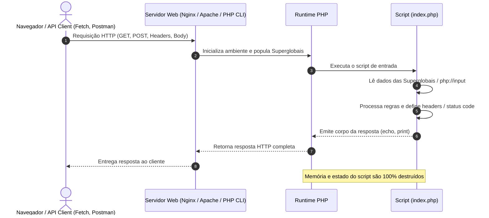
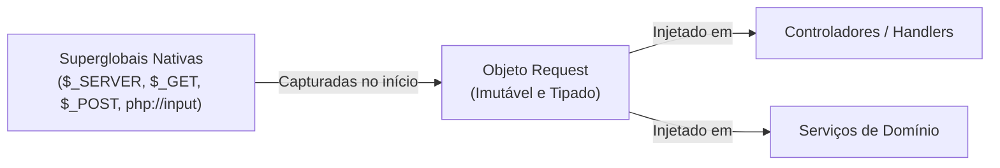

# 26. Superglobais e Ciclo de Vida da Requisição

Nos capítulos anteriores, exploramos a fundo a sintaxe do PHP, seus tipos de
dados, funções, tratamento de erros e todos os fundamentos da Orientação a
Objetos moderna. Até agora, executamos nossos scripts predominantemente via
linha de comando (CLI).

Chegou o momento de dar o próximo passo: **entender como o PHP trata requisições
web de fato na prática**. Ao contrário de runtimes que mantêm servidores HTTP
persistentes em memória (como o Node.js ou Go), o PHP foi desenhado com uma
integração nativa e imediata com o protocolo HTTP.

Quando uma requisição chega ao servidor web, o interpretador PHP é acionado,
processa as informações recebidas, disponibiliza esses dados em estruturas
especiais chamadas **Superglobais**, executa o script e devolve a resposta.

Neste capítulo, estudaremos o **ciclo de vida de uma requisição HTTP no PHP**,
conheceremos cada uma das **Superglobais nativas e suas principais
propriedades**, veremos como emitir respostas com códigos de status e cabeçalhos
e, ao final, entenderemos os riscos de depender de variáveis globais e como os
frameworks modernos encapsulam esses dados em objetos de requisição.

## O Ciclo de Vida da Requisição no PHP

Como vimos no **[Capítulo 01: O Que É PHP e o Modelo de Execução
Web](01-o-que-e-php-e-o-modelo-de-execucao-web.md)**, o PHP opera
tradicionalmente sob a arquitetura **_Shared-Nothing_** (Nada Compartilhado).
Cada requisição HTTP possui um ciclo de vida completamente isolado:



1. **Recepção:** O servidor web recebe a requisição HTTP.
2. **Inicialização:** Antes da execução da primeira linha do script, o runtime
   do PHP analisa a URL, método, cabeçalhos, cookies e corpo da mensagem,
   preenchendo automaticamente as variáveis superglobais.
3. **Execução:** O código da aplicação é executado, processa as informações e
   produz uma resposta.
4. **Finalização:** A resposta é enviada ao cliente e **toda a memória e o
   estado do script são descartados**.

## O Que São Superglobais?

As **Superglobais** são variáveis pré-definidas pelo PHP que possuem **escopo
automático global**. Isso significa que elas estão acessíveis em qualquer parte
do código — dentro de funções, métodos de classes ou arquivos incluídos — sem a
necessidade de declarar a palavra-chave `global`.

Todas as superglobais são estruturadas como **arrays associativos**.

## As Principais Superglobais e Suas Propriedades

### 1. `$_SERVER`: Metadados do Servidor e da Requisição

A superglobal `$_SERVER` contém informações sobre o ambiente de execução,
caminhos de scripts, cabeçalhos HTTP recebidos e detalhes da conexão.

As propriedades mais utilizadas em aplicações web incluem:

| Propriedade / Chave  | Tipo     | Descrição e Exemplo                                                              |
| :------------------- | :------- | :------------------------------------------------------------------------------- |
| `REQUEST_METHOD`     | `string` | O método HTTP utilizado (`GET`, `POST`, `PUT`, `DELETE`, `PATCH`).               |
| `REQUEST_URI`        | `string` | A URI completa solicitada pelo cliente (ex.: `/produtos?categoria=eletronicos`). |
| `QUERY_STRING`       | `string` | Apenas os parâmetros de consulta após a `?` (ex.: `categoria=eletronicos`).      |
| `CONTENT_TYPE`       | `string` | O tipo de mídia do corpo da requisição (ex.: `application/json`).                |
| `REMOTE_ADDR`        | `string` | O endereço IP do cliente que fez a requisição (ex.: `192.168.1.10`).             |
| `HTTP_HOST`          | `string` | O cabeçalho `Host` enviado pelo cliente (ex.: `api.exemplo.com`).                |
| `HTTP_USER_AGENT`    | `string` | A identificação do cliente/navegador (ex.: `Mozilla/5.0...`).                    |
| `HTTP_AUTHORIZATION` | `string` | O cabeçalho de autenticação (ex.: `Bearer eyJhbGci...`).                         |
| `SCRIPT_FILENAME`    | `string` | O caminho absoluto do arquivo PHP em execução no sistema operacional.            |
| `DOCUMENT_ROOT`      | `string` | O diretório raiz de arquivos públicos configurado no servidor web.               |

```php
<?php

declare(strict_types=1);

$method = $_SERVER['REQUEST_METHOD'] ?? 'GET';
$uri = $_SERVER['REQUEST_URI'] ?? '/';
$clientIp = $_SERVER['REMOTE_ADDR'] ?? 'Desconhecido';
$userAgent = $_SERVER['HTTP_USER_AGENT'] ?? 'Não informado';

echo "Método: {$method}\n";
echo "URI: {$uri}\n";
echo "IP do Cliente: {$clientIp}\n";
echo "User-Agent: {$userAgent}\n";
```

> 💡 **Como o PHP nomeia cabeçalhos HTTP em `$_SERVER`:**
>
> Qualquer cabeçalho enviado pelo cliente é prefixado com `HTTP_`, convertido
> para letras maiúsculas e tem seus hífens substituídos por sublinhados (ex.:
> `Accept-Language` torna-se `$_SERVER['HTTP_ACCEPT_LANGUAGE']`).

### 2. `$_GET`: Parâmetros de URL (_Query Strings_)

A superglobal `$_GET` é preenchida automaticamente com os parâmetros passados na
URL após o caractere `?` (ex.:
`https://exemplo.com/busca?termo=livro&ordem=asc`).

- Todos os valores em `$_GET` chegam inicialmente como `string` (ou `array` de
  strings, caso a chave utilize colchetes como `filtro[]`).
- Caso um parâmetro não seja enviado, a chave não existirá no array.

```php
<?php

declare(strict_types=1);

// Acesso com valor padrão via operador de coalescência nula (??):
$searchTerm = (string) ($_GET['termo'] ?? '');
$order = (string) ($_GET['ordem'] ?? 'asc');
$page = isset($_GET['pagina']) ? (int) $_GET['pagina'] : 1;

echo "Buscando por: '{$searchTerm}' | Ordem: {$order} | Página: {$page}\n";
```

### 3. `$_POST`: Dados de Formulários Tradicionais

A superglobal `$_POST` captura dados enviados no corpo de uma requisição HTTP
utilizando o método `POST`, quando o cabeçalho `Content-Type` for:

- `application/x-www-form-urlencoded` (formulários HTML padrão);
- `multipart/form-data` (formulários com upload de arquivos).

```php
<?php

declare(strict_types=1);

if ($_SERVER['REQUEST_METHOD'] === 'POST') {
    $email = (string) ($_POST['email'] ?? '');
    $password = (string) ($_POST['password'] ?? '');

    if (empty($email) || empty($password)) {
        echo "Preencha todos os campos obrigatórios.\n";
    } else {
        echo "Processando login para: {$email}\n";
    }
}
```

### 4. `$_FILES`: Metadados de Upload de Arquivos

Quando um formulário HTML envia arquivos via `multipart/form-data`, os arquivos
não são armazenados em `$_POST`, mas sim na superglobal `$_FILES`.

Para cada campo de arquivo enviado (ex.: `<input type="file" name="avatar">`), o
PHP cria um array associativo com cinco propriedades fundamentais:

| Propriedade | Tipo     | Descrição                                                         |
| :---------- | :------- | :---------------------------------------------------------------- |
| `name`      | `string` | Nome original do arquivo na máquina do cliente (ex.: `foto.png`). |
| `type`      | `string` | Tipo MIME informado pelo navegador (ex.: `image/png`).            |
| `tmp_name`  | `string` | Caminho temporário onde o PHP salvou o arquivo no servidor.       |
| `error`     | `int`    | Código numérico que indica o status do upload (`UPLOAD_ERR_*`).   |
| `size`      | `int`    | Tamanho do arquivo recebido, em bytes.                            |

```php
<?php

declare(strict_types=1);

if (isset($_FILES['avatar'])) {
    $file = $_FILES['avatar'];

    $fileName = (string) $file['name'];
    $tmpPath  = (string) $file['tmp_name'];
    $fileSize = (int) $file['size'];
    $errorCode = (int) $file['error'];

    // 1. Validação do status de upload:
    if ($errorCode !== UPLOAD_ERR_OK) {
        throw new RuntimeException("Erro ao receber arquivo. Código: {$errorCode}");
    }

    // 2. Validação de tamanho (máximo 2 MB):
    if ($fileSize > 2 * 1024 * 1024) {
        throw new InvalidArgumentException("O arquivo não pode ultrapassar 2 MB.");
    }

    // 3. Movimentação do arquivo temporário para o destino final:
    $destination = __DIR__ . '/uploads/' . basename($fileName);
    if (!move_uploaded_file($tmpPath, $destination)) {
        throw new RuntimeException("Falha ao persistir o arquivo no servidor.");
    }

    echo "Upload realizado com sucesso: {$destination}\n";
}
```

### 5. `$_COOKIE`: Cookies HTTP do Navegador

Contém os pares de chave-valor enviados pelo navegador através do cabeçalho
`Cookie`. Para gravar um cookie a ser enviado na resposta, utiliza-se a função
nativa `setcookie()`:

```php
<?php

declare(strict_types=1);

// Lendo um cookie previamente gravado:
$theme = (string) ($_COOKIE['preferred_theme'] ?? 'light');

// Gravando um cookie para expirar em 30 dias:
setcookie('preferred_theme', 'dark', [
    'expires' => time() + (30 * 24 * 60 * 60),
    'path' => '/',
    'httponly' => true,
    'samesite' => 'Strict',
]);
```

### 6. `$_SESSION`: Persistência de Sessão no Servidor

O PHP possui um mecanismo de sessões embutido. Ao chamar `session_start()`, o
PHP identifica o cliente através de um identificador único (geralmente via
cookie `PHPSESSID`) e carrega os dados associados a essa sessão na superglobal
`$_SESSION`:

```php
<?php

declare(strict_types=1);

// Inicializa ou retoma a sessão ativa:
session_start();

// Armazenando dados na sessão do usuário:
$_SESSION['user_id'] = 42;
$_SESSION['authenticated_at'] = time();

// Lendo dados da sessão:
$userId = $_SESSION['user_id'] ?? null;
```

### 7. `$_ENV`: Variáveis de Ambiente do Sistema

Armazena as variáveis de ambiente disponibilizadas pelo sistema operacional ou
pelo servidor web para o processo do PHP:

```php
<?php

declare(strict_types=1);

$databaseHost = $_ENV['DB_HOST'] ?? 'localhost';
$appEnv = $_ENV['APP_ENV'] ?? 'production';
```

## Lendo Requisições com Payloads JSON (`php://input`)

Em aplicações web modernas (APIs REST consumidas por frontends em React, Vue ou
clientes mobile), os dados do corpo da requisição são enviados no formato **JSON
bruto** (`Content-Type: application/json`).

> ⚠️ **Atenção:**
>
> A superglobal `$_POST` **permanece vazia** quando o payload é JSON, pois o PHP
> nativo só decodifica dados de formulários (`urlencoded` ou `multipart`).

Para ler corpos de requisição brutos em JSON, utilizamos o fluxo de leitura
especial **`php://input`** combinado com `json_decode()`:

```php
<?php

declare(strict_types=1);

if ($_SERVER['REQUEST_METHOD'] === 'POST') {
    // 1. Lê a stream de bytes brutos da requisição:
    $rawBody = (string) file_get_contents('php://input');

    if (empty($rawBody)) {
        throw new InvalidArgumentException("O corpo da requisição está vazio.");
    }

    // 2. Converte o JSON em um array associativo:
    /** @var array<string, mixed> $payload */
    $payload = json_decode($rawBody, true, 512, JSON_THROW_ON_ERROR);

    $title = (string) ($payload['title'] ?? '');
    $price = (float) ($payload['price'] ?? 0.0);

    echo "Recebido via API: Produto '{$title}' - R$ " . number_format($price, 2) . "\n";
}
```

## Emitindo Respostas HTTP: Status Codes e Headers

Além de ler dados de entrada, o PHP permite configurar a resposta enviada ao
cliente através de funções nativas:

```php
<?php

declare(strict_types=1);

// 1. Define o cabeçalho informando formato JSON e codificação UTF-8:
header('Content-Type: application/json; charset=utf-8');

// 2. Define o código de status HTTP (ex.: 201 Created):
http_response_code(201);

// 3. Emite o corpo da resposta:
echo json_encode([
    'status' => 'success',
    'message' => 'Recurso criado com sucesso.',
], JSON_THROW_ON_ERROR);
```

> ⚠️ **A Regra de Envio de Cabeçalhos:**
>
> Funções como `header()` e `http_response_code()` **devem ser executadas antes
> de qualquer saída no corpo** (qualquer `echo`, `print` ou espaço fora das tags
> `<?php`). Caso contrário, o PHP emitirá o aviso `Headers already sent`.

## Os Riscos do Uso Direto de Superglobais

Apesar da praticidade inicial, utilizar superglobais diretamente espalhadas pela
lógica de negócio apresenta riscos arquiteturais importantes:

1. **Mutabilidade Global:** Como qualquer superglobal pode ser alterada em
   qualquer ponto do código (`$_GET['id'] = 10;`), funções podem causar efeitos
   colaterais imprevisíveis em outras partes do sistema.
2. **Dados Frágeis e Sem Tipagem:** Todos os valores chegam como strings não
   validadas. Chaves inexistentes geram avisos de _Undefined array key_.
3. **Dificuldade para Testes Automatizados:** Testar uma função que depende de
   `$_SERVER` ou `$_POST` exige alterar o estado global do interpretador,
   tornando os testes lentos e suscetíveis a interferências entre si.
4. **A Armadilha do `$_REQUEST`:** A superglobal `$_REQUEST` mescla `$_GET`,
   `$_POST` e `$_COOKIE` em um único array. Essa junção gera ambiguidades sobre
   a origem real do dado e facilita vulnerabilidades de segurança.

## A Abordagem Moderna: Encapsulamento em Objetos de Requisição

Para solucionar esses problemas, frameworks modernos de PHP (como Laravel,
Symfony e o ecossistema PSR-7) **não manipulam superglobais diretamente em
controladores ou serviços**.

Em vez disso, eles capturam as superglobais uma única vez no ponto de entrada da
aplicação e as encapsulam em um **Objeto de Requisição (`Request`) imutável e
tipado**:



### Exemplo Didático: Um Objeto `Request` Seguro

Podemos aplicar os conceitos de Orientação a Objetos que aprendemos nos
capítulos anteriores para estruturar nosso próprio objeto de requisição:

```php
<?php

declare(strict_types=1);

final readonly class Request
{
    /**
     * @param array<string, mixed> $queryParams
     * @param array<string, mixed> $bodyParams
     * @param array<string, string> $headers
     */
    public function __construct(
        public string $method,
        public string $uri,
        public array $queryParams,
        public array $bodyParams,
        public array $headers
    ) {}

    /**
     * Fábrica estática que lê o estado global uma única vez na inicialização:
     */
    public static function createFromGlobals(): self
    {
        $method = strtoupper($_SERVER['REQUEST_METHOD'] ?? 'GET');
        $uri = (string) parse_url($_SERVER['REQUEST_URI'] ?? '/', PHP_URL_PATH);

        // Extrai cabeçalhos de $_SERVER:
        $headers = [];
        foreach ($_SERVER as $key => $value) {
            if (str_starts_with($key, 'HTTP_')) {
                $headerName = str_replace('_', '-', strtolower(substr($key, 5)));
                $headers[$headerName] = (string) $value;
            }
        }

        // Lê o corpo conforme o Content-Type (JSON ou Formulário):
        $body = [];
        $contentType = $_SERVER['CONTENT_TYPE'] ?? '';

        if (str_contains($contentType, 'application/json')) {
            $rawJson = (string) file_get_contents('php://input');
            if (!empty($rawJson)) {
                /** @var array<string, mixed> $body */
                $body = json_decode($rawJson, true, 512, JSON_THROW_ON_ERROR);
            }
        } elseif ($method === 'POST') {
            $body = $_POST;
        }

        return new self(
            method: $method,
            uri: $uri,
            queryParams: $_GET,
            bodyParams: $body,
            headers: $headers
        );
    }

    public function query(string $key, mixed $default = null): mixed
    {
        return $this->queryParams[$key] ?? $default;
    }

    public function input(string $key, mixed $default = null): mixed
    {
        return $this->bodyParams[$key] ?? $default;
    }
}

// ==========================================
// Exemplo de uso limpo no ponto de entrada:
// ==========================================
$request = Request::createFromGlobals();

echo "Método recebido: {$request->method}\n";
echo "URI acessada: {$request->uri}\n";
```

Com essa abordagem, seu código de aplicação trabalha com objetos seguros e
previsíveis, deixando as variáveis globais restritas apenas à camada de
inicialização do sistema.

## O Que Vem a Seguir?

Neste capítulo, compreendemos o ciclo de vida HTTP no PHP e o papel das
superglobais para receber e responder a requisições na Web.

Até o momento, todos os nossos exemplos foram declarados em scripts únicos. No
entanto, à medida que nossas aplicações web crescem e criamos dezenas de
classes, controladores e serviços, manter todo o código em um único arquivo
torna-se insustentável.

No **[Capítulo 27: Namespaces e Autoloading
PSR-4](27-namespaces-e-psr-4-autoloading.md)**, aprenderemos como dividir nossa
aplicação em múltiplos arquivos, evitar conflitos de nomes com **`namespace`** e
organizar o carregamento automático de classes seguindo o padrão **PSR-4**.

---

<a href="25-classes-abstratas-e-modificador-final.md">← Controle de Herança:
Classes Abstratas e Modificador Final</a>

<p align="right"><a href="27-namespaces-e-psr-4-autoloading.md">Próximo: Namespaces e Autoloading PSR-4 →</a></p>
