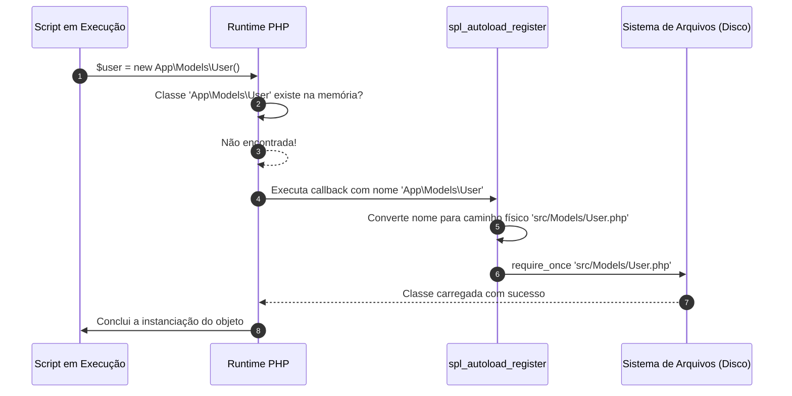

# 27. Namespaces e Autoloading PSR-4

Até este momento do curso, desenvolvemos nossos exemplos e exercícios em scripts
únicos ou dependendo de todas as declarações no mesmo arquivo de execução.

No mundo real, sistemas profissionais e aplicações web de grande porte são
compostos por centenas de classes, interfaces, serviços e controladores. Tentar
manter tudo em um único arquivo ou gerenciar manualmente a inclusão de dezenas
de arquivos gera dois grandes gargalos: **conflitos de nomes** (colisão de
classes com o mesmo identificador) e **o caos de inclusões manuais com
`require_once`**.

Neste capítulo, aprenderemos como organizar a arquitetura de código com
**`namespace`**, importar e renomear símbolos com **`use`** e **`as`**, acessar
símbolos globais com a barra invertida raiz (`\`), e automatizar o carregamento
de arquivos através da função nativa **`spl_autoload_register`** e da convenção
internacional **PSR-4**.

## A Dor: A Colisão de Nomes e o Inferno do `require`

Imagine que você está desenvolvendo uma plataforma de comércio eletrônico e
decidiu separar o código em múltiplos arquivos:

```text
projeto/
├── PagseguroUser.php   (Classe User da integração de pagamento)
├── DatabaseUser.php    (Classe User do banco de dados)
└── index.php
```

Se ambos os arquivos declararem uma classe com o nome `User`, o PHP emitirá um
erro fatal imediatamente ao tentar carregá-los no mesmo script:

```php
<?php

// index.php
require_once __DIR__ . '/DatabaseUser.php';
require_once __DIR__ . '/PagseguroUser.php';

// ❌ ERRO FATAL DO PHP:
// Cannot declare class User, because the name is already in use in ...
```

Historicamente, antes do PHP 5.3, os desenvolvedores eram obrigados a criar
nomes gigantescos com prefixos manuais para evitar colisões (ex.: `class
App_Database_Entities_User` e `class Vendor_Pagseguro_Api_User`).

Além disso, conforme o projeto crescia para 50 ou 100 arquivos, o início de cada
script acumulava uma lista interminável e frágil de instruções `require_once`:

```php
<?php

// ❌ O INFERNO DE REQUIRES MANUAIS:
require_once __DIR__ . '/Config/Database.php';
require_once __DIR__ . '/Entities/Product.php';
require_once __DIR__ . '/Entities/Category.php';
require_once __DIR__ . '/Repositories/ProductRepository.php';
require_once __DIR__ . '/Services/NotificationService.php';
require_once __DIR__ . '/Controllers/ProductController.php';
// ... e assim por diante.
```

## O Que São Namespaces?

Um **`namespace`** (espaço de nomes) é um mecanismo de encapsulamento lógico que
permite agrupar classes, interfaces, traits, funções e constantes sob um
identificador único e hierárquico.

> 💡 **A Analogia das Pastas no Computador:**
>
> Você não pode ter dois arquivos chamados `relatorio.pdf` dentro da mesma
> pasta. Contudo, pode ter perfeitamente um `financeiro/relatorio.pdf` e um
> `marketing/relatorio.pdf`.
>
> O `namespace` funciona exatamente como essas pastas lógicas para os símbolos
> do seu código.

### Declarando um Namespace

A declaração de um namespace deve ser **a primeira instrução do arquivo PHP**
(logo após a tag de abertura `<?php` e eventuais declarações de
`declare(strict_types=1)`):

```php
<?php

declare(strict_types=1);

namespace App\Domain\Entities;

final class User
{
    public function __construct(
        public string $name,
        public string $email
    ) {}
}
```

O nome completo e qualificado dessa classe no PHP passou a ser:
`App\Domain\Entities\User` (_Fully Qualified Class Name_ - FQCN).

### Sub-Namespaces e Hierarquias

Namespaces utilizam a contrabarra (`\`) como separador de níveis:

```php
namespace App\Http\Controllers;      // Controlador web
namespace App\Domain\Services;       // Serviço de domínio
namespace App\Infrastructure\Db;     // Conexão com banco
```

## Importando Símbolos com `use`

Para utilizar uma classe que pertence a outro namespace, podemos escrever seu
nome completo qualificado ou **importá-la** no topo do arquivo utilizando a
palavra-chave `use`:

```php
<?php

declare(strict_types=1);

namespace App\Http\Controllers;

// 1. Importa a classe de outro namespace:
use App\Domain\Entities\User;

final class UserController
{
    public function show(): void
    {
        // 2. Utiliza o nome curto diretamente:
        $user = new User(name: 'Ana Silva', email: 'ana@fatec.sp.gov.br');
        echo "Usuário instanciado: {$user->name}\n";
    }
}
```

### Resolvendo Conflitos com Apelidos (`as`)

Quando você precisa utilizar no mesmo arquivo duas classes que possuem o mesmo
nome curto (mas pertencem a namespaces distintos), utilize a cláusula **`as`**
para atribuir um pseudônimo (_alias_):

```php
<?php

declare(strict_types=1);

namespace App\Services;

// Importa a entidade interna do sistema:
use App\Domain\Entities\User;

// Importa o modelo de usuário da API de pagamento com um apelido:
use Vendor\PaymentGateway\Entities\User as GatewayCustomer;

final class CheckoutService
{
    public function process(User $user): void
    {
        // Instancia o cliente esperado pelo Gateway de pagamento:
        $customer = new GatewayCustomer(
            externalId: (string) $user->name,
            billingEmail: $user->email
        );

        echo "Cliente do gateway criado para: {$customer->billingEmail}\n";
    }
}
```

### Importando Funções e Constantes

Além de classes e interfaces, o PHP permite importar funções e constantes
declaradas em namespaces específicos utilizando as diretivas `use function` e
`use const`:

```php
<?php

declare(strict_types=1);

namespace App\Formatters;

const DEFAULT_CURRENCY = 'BRL';

function formatCurrency(float $amount): string
{
    return 'R$ ' . number_format($amount, 2, ',', '.');
}
```

Importando e consumindo em outro arquivo:

```php
<?php

declare(strict_types=1);

namespace App\Http;

use const App\Formatters\DEFAULT_CURRENCY;
use function App\Formatters\formatCurrency;

echo "Moeda padrão: " . DEFAULT_CURRENCY . "\n";
echo "Valor: " . formatCurrency(1500.50) . "\n";
```

### Importações em Grupo (_Group use_) e a Ausência de Coringa (`*`)

Diferente de linguagens como Java ou Python, o **PHP não suporta o operador
coringa (`*`) para importar todos os símbolos de um namespace** (a instrução
`use App\Domain\Entities\*;` é inválida e causa erro de sintaxe).

Isso é uma decisão de design: como o PHP utiliza autoloading sob demanda, um
coringa forçaria o interpretador a escanear recursivamente o sistema de arquivos
a cada arquivo carregado, degradando o desempenho.

Para agrupar múltiplas importações do mesmo namespace sem repetir linhas, o PHP
disponibiliza a **sintaxe de importação em grupo** com chaves `{}`:

```php
<?php

declare(strict_types=1);

namespace App\Http\Controllers;

// Importa múltiplas classes do mesmo namespace em uma única declaração:
use App\Domain\Entities\{User, Product, Category, Order};

// Também suporta funções e constantes agrupadas:
use function App\Formatters\{formatCurrency, slugify};
use const App\Config\{DEFAULT_TIMEOUT, MAX_RETRIES};
```

Alternativamente, é possível importar o **namespace pai** e acessar suas classes
de forma qualificada:

```php
<?php

declare(strict_types=1);

namespace App\Http\Controllers;

use App\Domain\Entities;

// Acesso qualificado a partir do namespace importado:
$user = new Entities\User(name: 'Carlos', email: 'carlos@fatec.sp.gov.br');
$product = new Entities\Product(id: 1, name: 'Mouse', price: 99.90);
```

## Acessando o Escopo Global com a Barra Invertida Raiz (`\`)

Quando o seu arquivo está dentro de um namespace (ex.: `namespace
App\Services;`) e você referencia uma classe nativa do PHP (como
`DateTimeImmutable`, `InvalidArgumentException` ou `PDO`), o PHP procurará essa
classe **dentro do namespace atual** por padrão (isto é,
`App\Services\DateTimeImmutable`).

Para indicar que você está referenciando uma classe nativa do espaço global,
existem duas abordagens:

### Abordagem 1: Prefixar com a barra invertida raiz (`\`)

```php
<?php

declare(strict_types=1);

namespace App\Services;

final class OrderService
{
    public function createOrder(): void
    {
        // O prefixo '\' força a busca no escopo global raiz do PHP:
        $now = new \DateTimeImmutable();

        if (false) {
            throw new \InvalidArgumentException("Dados inválidos.");
        }
    }
}
```

### Abordagem 2: Importar explicitamente no topo do arquivo (Recomendado)

```php
<?php

declare(strict_types=1);

namespace App\Services;

// Importa explicitamente as classes do escopo global:
use DateTimeImmutable;
use InvalidArgumentException;

final class OrderService
{
    public function createOrder(): void
    {
        $now = new DateTimeImmutable();

        if (false) {
            throw new InvalidArgumentException("Dados inválidos.");
        }
    }
}
```

## O Mecanismo de Autoloading

Até agora, organizamos nossos identificadores lógicos com namespaces. Mas como o
PHP encontra o arquivo físico no disco rígido sem precisarmos escrever
`require_once` para cada classe?

A resposta é o **_Autoloading_** (Carregamento Automático sob Demanda).

### A Função Nativa `spl_autoload_register`

O PHP disponibiliza a função nativa **`spl_autoload_register()`**, que registra
uma função de retorno (_callback_).

Sempre que o código tentar instanciar ou referenciar uma classe que ainda não
foi carregada na memória, o interpretador PHP **pausa a execução e invoca
automaticamente esse callback**, passando o nome completo da classe como
parâmetro:



## O Padrão PSR-4

Para evitar que cada biblioteca ou desenvolvedor criasse sua própria regra
incompatível de conversão de nomes para arquivos, o grupo internacional
**PHP-FIG** (_PHP Framework Interop Group_) criou a norma **PSR-4** (_PHP
Standard Recommendation 4_).

### A Regra de Ouro da PSR-4

A PSR-4 estabelece uma correspondência direta entre o **Namespace da Classe** e
a **Estrutura de Pastas no Sistema de Arquivos**:

1. Um **Prefixo de Namespace** raiz (ex.: `App\`) é mapeado para um **Diretório
   Base** no projeto (ex.: `src/`).
2. Cada sub-namespace seguinte corresponde exatamente a uma **subpasta** com o
   mesmo nome.
3. O nome da classe corresponde ao **nome do arquivo `.php`** (com exata
   correspondência entre maiúsculas e minúsculas — _Case Sensitive_).

| Diretório Base | Prefixo Mapeado | Nome Completo da Classe (FQCN)           | Caminho do Arquivo Físico no Disco           |
| :------------- | :-------------- | :--------------------------------------- | :------------------------------------------- |
| `src/`         | `App\`          | `App\Entities\Product`                   | `src/Entities/Product.php`                   |
| `src/`         | `App\`          | `App\Http\Controllers\UserController`    | `src/Http/Controllers/UserController.php`    |
| `src/`         | `App\`          | `App\Infrastructure\Database\Connection` | `src/Infrastructure/Database/Connection.php` |

## Implementando um Autoloader PSR-4 Nativo

Vejamos como implementar manualmente um carregador automático PSR-4 nativo em
PHP puro, desmistificando o que ferramentas como o Composer fazem por baixo dos
panos:

```php
<?php

declare(strict_types=1);

// Registra a regra de carregamento automático PSR-4:
spl_autoload_register(function (string $className): void {
    // 1. Define o prefixo de namespace do projeto e o diretório base físico:
    $prefix = 'App\\';
    $baseDir = __DIR__ . '/src/';

    // 2. Verifica se a classe chamada utiliza o prefixo configurado:
    $prefixLength = strlen($prefix);
    if (strncmp($prefix, $className, $prefixLength) !== 0) {
        // Se a classe não pertence ao namespace App\, repassa para outros autoloaders:
        return;
    }

    // 3. Obtém o nome relativo da classe (ex.: "Http\Controllers\UserController"):
    $relativeClass = substr($className, $prefixLength);

    // 4. Substitui as barras invertidas de namespace pelas barras de diretório do SO:
    $file = $baseDir . str_replace('\\', DIRECTORY_SEPARATOR, $relativeClass) . '.php';

    // 5. Se o arquivo existir no disco, inclui-o na memória:
    if (file_exists($file)) {
        require_once $file;
    }
});
```

## Exemplo Completo do Domínio: Projeto Estruturado com PSR-4

Vejamos um exemplo prático de um projeto organizado com múltiplos arquivos e
namespaces, simulando a estrutura de uma aplicação real:

### Estrutura de Arquivos no Projeto

```text
minha-aplicacao/
├── src/
│   ├── Domain/
│   │   └── Entities/
│   │       └── Product.php
│   ├── Infrastructure/
│   │   └── Logger/
│   │       └── FileLogger.php
│   └── Http/
│       └── Controllers/
│           └── ProductController.php
├── autoloader.php
└── index.php
```

### 1. `src/Domain/Entities/Product.php`

```php
<?php

declare(strict_types=1);

namespace App\Domain\Entities;

final readonly class Product
{
    public function __construct(
        public int $id,
        public string $name,
        public float $price
    ) {}
}
```

### 2. `src/Infrastructure/Logger/FileLogger.php`

```php
<?php

declare(strict_types=1);

namespace App\Infrastructure\Logger;

use DateTimeImmutable;

final class FileLogger
{
    public function log(string $message): void
    {
        $timestamp = (new DateTimeImmutable())->format('Y-m-d H:i:s');
        echo "[LOG - {$timestamp}]: {$message}\n";
    }
}
```

### 3. `src/Http/Controllers/ProductController.php`

```php
<?php

declare(strict_types=1);

namespace App\Http\Controllers;

use App\Domain\Entities\Product;
use App\Infrastructure\Logger\FileLogger;

final class ProductController
{
    public function __construct(
        private readonly FileLogger $logger
    ) {}

    public function handle(): void
    {
        $product = new Product(id: 101, name: 'Monitor UltraWide 29"', price: 1299.90);

        $this->logger->log("Produto consultado: {$product->name} (ID: {$product->id})");

        echo "Resposta HTTP 200: Produto {$product->name} - R$ " . number_format($product->price, 2) . "\n";
    }
}
```

### 4. Ponto de Entrada: `index.php`

```php
<?php

declare(strict_types=1);

// 1. Registra o autoloader UMA ÚNICA VEZ no ponto de entrada da aplicação:
require_once __DIR__ . '/autoloader.php';

use App\Http\Controllers\ProductController;
use App\Infrastructure\Logger\FileLogger;

// 2. A partir daqui, qualquer classe referenciada é carregada automaticamente sob demanda:
$logger = new FileLogger();
$controller = new ProductController($logger);

$controller->handle();
```

> 💡 **Onde o Autoloader deve ser incluído?**
>
> Uma dúvida muito comum de quem está começando é: _"Preciso colocar
> `require_once 'autoloader.php'` no topo de todos os arquivos do meu sistema?"_
>
> **A resposta é NÃO.** O autoloader é registrado **uma única vez** no arquivo
> de inicialização da aplicação (conhecido como _Entry Point_ ou Ponto de
> Entrada, como o `index.php` da web ou um comando CLI).
>
> Como a função `spl_autoload_register()` registra um ouvinte global no runtime
> do PHP, qualquer classe instanciada a partir desse ponto — seja no próprio
> `index.php`, dentro de um controlador, serviço ou entidade — ativará o
> carregamento automático em cascata, sem que nenhum arquivo interno precise
> incluir o autoloader ou fazer `require` manual.

### Saída no Terminal

```text
[LOG - 2026-09-22 12:30:00]: Produto consultado: Monitor UltraWide 29" (ID: 101)
Resposta HTTP 200: Produto Monitor UltraWide 29" - R$ 1.299,90
```

Nenhum arquivo de classe (`Product.php`, `FileLogger.php`,
`ProductController.php`) precisou de `require_once` em seu próprio código nem no
`index.php`. Todo o ciclo de resolução de dependências ocorreu de maneira
transparente e sob demanda.

## Comparativo: Organização Tradicional vs Moderna

| Aspecto                    | Abordagem Tradicional (Legada)                               | Abordagem Moderna (Namespaces + PSR-4)                |
| :------------------------- | :----------------------------------------------------------- | :---------------------------------------------------- |
| **Prevenção de Colisões**  | Prefixos gigantescos no nome da classe (`App_Entities_User`) | Espaços lógicos limpos (`namespace App\Entities;`)    |
| **Importação de Arquivos** | Dezenas de `require_once` manuais no topo dos arquivos       | Carregamento automático transparente via PSR-4        |
| **Organização Física**     | Arquivos soltos ou sem padronização de diretórios            | Mapeamento estrito 1:1 entre Namespace e Pastas       |
| **Manutenibilidade**       | Risco constante de referências esquecidas ou cíclicas        | Modular, previsível e compatível com pacotes externos |

## O Que Vem a Seguir?

Neste capítulo, aprendemos a organizar nossos sistemas em múltiplos arquivos com
**`namespace`**, importar símbolos com **`use`** e automatizar o carregamento de
classes no padrão internacional **PSR-4** com `spl_autoload_register`.

Embora tenhamos construído nosso próprio autoloader para entender os princípios
internos da linguagem, no dia a dia profissional não escrevemos essa função
manualmente. Utilizamos a ferramenta padrão de gerenciamento de dependências e
automação do PHP: o **Composer**.

No **[Capítulo 28: Gerenciamento de Pacotes com
Composer](28-gerenciamento-de-pacotes-com-composer.md)**, aprenderemos como o
Composer inicializa projetos com `composer.json`, gera o autoloader PSR-4
otimizado automaticamente e permite instalar bibliotecas de terceiros do
repositório oficial Packagist.

---

<a href="26-superglobais-e-ciclo-de-vida-da-requisicao.md">← Superglobais e
Ciclo de Vida da Requisição</a>

<p align="right"><a href="28-gerenciamento-de-pacotes-com-composer.md">Próximo: Gerenciamento de Pacotes com Composer →</a></p>
