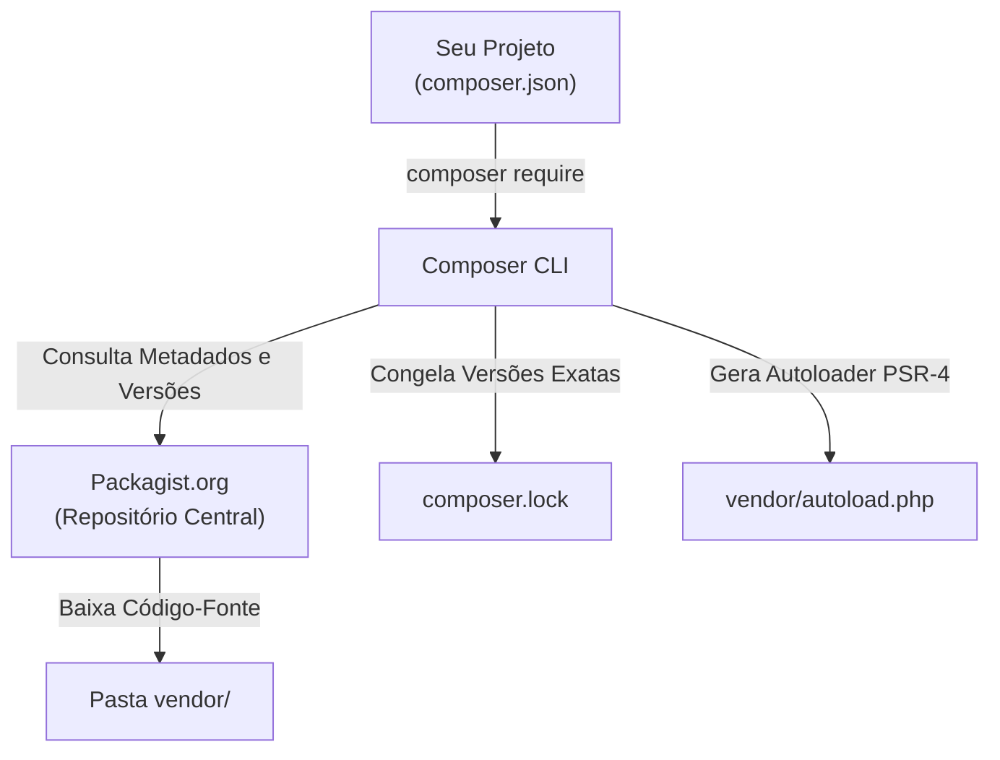
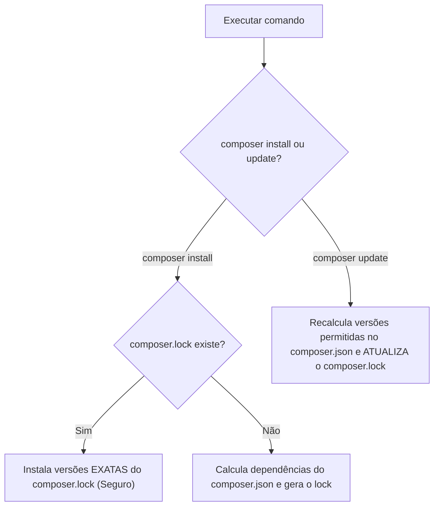

# 28. Gerenciamento de Pacotes com Composer

No capítulo anterior, compreendemos o poder dos **namespaces** e construímos um
carregador automático baseado no padrão **PSR-4** para eliminar dezenas de
inclusões manuais com `require_once`.

Contudo, no ecossistema de desenvolvimento moderno, dificilmente construímos
todas as ferramentas do zero. Precisamos de bibliotecas consolidadas para
emissão de logs estruturados, conexões avançadas com APIs, validação de dados,
testes automatizados e roteamento HTTP.

No passado, adicionar uma biblioteca externa significava baixar arquivos `.zip`,
descompactá-los dentro do projeto e tentar resolver manualmente os conflitos de
dependências.

Neste capítulo, aprenderemos o funcionamento do **Composer** — o gerenciador de
dependências oficial do PHP —, a estrutura dos arquivos **`composer.json`** e
**`composer.lock`**, a configuração profissional do **Autoloading PSR-4**, os
comandos essenciais do dia a dia e a criação de scripts de automação.

## A Dor: O Caos do Gerenciamento Manual de Bibliotecas

Imagine que sua aplicação precisa de um gerador de PDFs. Você baixa a biblioteca
`PDFMaker v1.0` e a coloca na sua pasta de bibliotecas:

```text
projeto/
├── libs/
│   └── pdfmaker/ (que depende internamente de ImageHelper v2.0)
└── index.php
```

Meses depois, você decide instalar uma biblioteca de manipulação de imagens
chamada `PhotoEditor v3.0`. Ao descompactá-la, descobre que ela depende de
`ImageHelper v1.0`.

Esse cenário cria o clássico **"Inferno de Dependências"** (_Dependency Hell_):
duas ferramentas exigem versões incompatíveis da mesma biblioteca base,
resultando em erros de classes duplicadas ou comportamentos inesperados.

O **Composer** foi criado para resolver esse problema de forma determinística e
automatizada.

## O Que É o Composer?

O **Composer** é a ferramenta padrão da indústria para gerenciamento de
dependências no PHP. Ele se conecta ao repositório público oficial de pacotes
PHP, o **[Packagist](https://packagist.org/)**, calcula o grafo completo de
dependências do seu projeto, baixa as versões compatíveis e gera automaticamente
o arquivo de carregamento universal **`vendor/autoload.php`**.



## Anatomia de um Projeto com Composer

Ao inicializar um projeto com Composer (através do comando `composer init`), a
seguinte estrutura de governança é estabelecida:

```text
meu-projeto/
├── src/                    (Código-fonte da sua aplicação)
│   └── Domain/
│       └── Entities/
│           └── User.php
├── vendor/                 (Bibliotecas de terceiros baixadas - NÃO comitar)
│   ├── monolog/
│   ├── psr/
│   └── autoload.php        (Autoloader gerado automaticamente)
├── composer.json           (Declaração de dependências e regras de autoload)
├── composer.lock           (Registro das versões exatas instaladas)
├── .gitignore              (Configurado para ignorar a pasta vendor/)
└── index.php               (Ponto de entrada)
```

### 1. O Arquivo `composer.json`

É o manifesto do seu projeto. Ele descreve o nome do pacote, metadados, regras
de carregamento automático e as dependências necessárias:

```json
{
  "name": "fatec/loja-virtual",
  "description": "API da Loja Virtual do curso de desenvolvimento web na FATEC",
  "type": "project",
  "require": {
    "php": ">=8.2",
    "monolog/monolog": "^3.5"
  },
  "require-dev": {
    "phpunit/phpunit": "^10.5"
  },
  "autoload": {
    "psr-4": {
      "App\\": "src/"
    }
  }
}
```

- **`require`:** Dependências obrigatórias para a aplicação rodar em produção.
- **`require-dev`:** Dependências exclusivas para o ambiente de desenvolvimento
  e testes (ex.: linters, analisadores estáticos e suites de teste).
- **`autoload`:** Mapeamento PSR-4 do seu próprio código-fonte.

### 2. O Arquivo `composer.lock`

Enquanto o `composer.json` expressa restrições flexíveis de versão (ex.:
`^3.5`), o **`composer.lock`** registra os commits e as versões exatas de cada
pacote que foram efetivamente baixados no momento da instalação.

> ⚠️ **A Regra de Ouro do `composer.lock`:**
>
> O arquivo `composer.lock` **DEVE ser comitado no repositório Git**. Isso
> garante que todos os membros da equipe, servidores de homologação e o ambiente
> de produção instalem exatamente as mesmas versões de dependências, evitando o
> clássico _"na minha máquina funciona"_.

### 3. A Pasta `vendor/`

É o diretório onde o Composer armazena os códigos-fonte de todas as bibliotecas
baixadas.

> ⛔ **Nunca comite a pasta `vendor/`:**
>
> Adicione sempre `vendor/` ao seu arquivo `.gitignore`. Ela pode conter
> milhares de arquivos e deve ser reconstruída em cada máquina através do
> comando `composer install`.

## Configurando o Autoloading PSR-4 com Composer

No capítulo anterior, tivemos que escrever manualmente uma função
`spl_autoload_register()`. Com o Composer, declaramos o mapeamento diretamente
no `composer.json`:

```json
{
  "autoload": {
    "psr-4": {
      "App\\": "src/"
    }
  },
  "autoload-dev": {
    "psr-4": {
      "App\\Tests\\": "tests/"
    }
  }
}
```

Após editar a seção `autoload`, executamos no terminal:

```bash
composer dump-autoload
```

O Composer lerá a configuração e gerará o arquivo **`vendor/autoload.php`**,
capaz de carregar tanto as suas próprias classes (`App\...`) quanto todas as
classes das bibliotecas externas instaladas.

## Comandos Essenciais do Dia a Dia

### 1. `composer require <pacote>`

Adiciona uma nova dependência de produção ao projeto, atualiza o
`composer.json`, baixa os arquivos para `vendor/` e regrava o `composer.lock`:

```bash
composer require monolog/monolog
```

Para adicionar dependências exclusivas de desenvolvimento (como PHPUnit ou
PHPStan), utilize a flag `--dev`:

```bash
composer require --dev phpunit/phpunit
```

### 2. `composer install` vs `composer update`

A diferença entre esses dois comandos é um dos pontos mais críticos do
ecossistema:

| Comando                | O que ele faz?                                                                                                                               | Quando utilizar?                                                                |
| :--------------------- | :------------------------------------------------------------------------------------------------------------------------------------------- | :------------------------------------------------------------------------------ |
| **`composer install`** | Lê o **`composer.lock`** e instala exatamente as versões registradas nele. Se o lock não existir, lê o `composer.json` e cria o lock.        | **Ao clonar um projeto**, no deploy em produção e em pipelines de CI/CD.        |
| **`composer update`**  | **Ignora o `composer.lock`**, recalcula as versões mais recentes permitidas no `composer.json`, atualiza a pasta `vendor/` e regrava o lock. | Apenas quando você deseja **atualizar deliberadamente** as versões dos pacotes. |



### 3. `composer remove <pacote>`

Desinstala uma biblioteca, remove os arquivos da pasta `vendor/` e limpa as
entradas nos arquivos `composer.json` e `composer.lock`:

```bash
composer remove monolog/monolog
```

## Entendendo o Versionamento Semântico (SemVer)

O Composer utiliza o padrão **SemVer** (_Semantic Versioning_:
`MAJOR.MINOR.PATCH`):

- **MAJOR (1.x.x):** Quebra de compatibilidade retroativa (_Breaking Changes_).
- **MINOR (x.1.x):** Novas funcionalidades sem quebrar código existente.
- **PATCH (x.x.1):** Correções de bugs e segurança retrocompatíveis.

Nas restrições do `composer.json`, os operadores mais comuns são:

```text
^1.2.3   -> Permite atualizações >= 1.2.3 e < 2.0.0 (Seguro contra quebras)
~1.2.3   -> Permite atualizações >= 1.2.3 e < 1.3.0 (Apenas patches)
1.2.*    -> Qualquer versão da série 1.2
```

## Criando Scripts Customizados no Composer

O Composer permite registrar atalhos para comandos frequentes na seção
`"scripts"` do `composer.json`:

```json
{
  "scripts": {
    "start": "php -S localhost:8000 -t public",
    "test": "phpunit --colors=always",
    "check": ["@composer validate --strict", "phpstan analyse src"]
  }
}
```

Para executar um script registrado:

```bash
composer start
```

## Exemplo Completo do Domínio: Projeto com Composer e Monolog

Vejamos como uma aplicação moderna consome o autoloader universal do Composer e
utiliza uma biblioteca externa de mercado (**Monolog**) integrada às classes do
próprio domínio:

### 1. `composer.json` do Projeto

```json
{
  "name": "fatec/ecommerce-api",
  "type": "project",
  "require": {
    "php": ">=8.2",
    "monolog/monolog": "^3.5"
  },
  "autoload": {
    "psr-4": {
      "App\\": "src/"
    }
  }
}
```

### 2. `src/Domain/Entities/Order.php`

```php
<?php

declare(strict_types=1);

namespace App\Domain\Entities;

final readonly class Order
{
    public function __construct(
        public string $id,
        public string $customerEmail,
        public float $amount
    ) {}
}
```

### 3. `src/Services/OrderService.php`

```php
<?php

declare(strict_types=1);

namespace App\Services;

use App\Domain\Entities\Order;
use Monolog\Logger;
use Monolog\Handler\StreamHandler;

final class OrderService
{
    private Logger $logger;

    public function __construct()
    {
        // Configura o logger profissional da biblioteca externa Monolog:
        $this->logger = new Logger('orders');
        $this->logger->pushHandler(new StreamHandler('php://stdout', Logger::INFO));
    }

    public function process(Order $order): void
    {
        $this->logger->info('Iniciando processamento do pedido', [
            'order_id' => $order->id,
            'customer' => $order->customerEmail,
            'amount'   => $order->amount,
        ]);

        // Regra de negócio...
        echo "Pedido #{$order->id} processado com sucesso para R$ " . number_format($order->amount, 2) . "!\n";
    }
}
```

### 4. Ponto de Entrada: `public/index.php`

```php
<?php

declare(strict_types=1);

// 1. Carrega o autoloader universal gerado pelo Composer:
require_once __DIR__ . '/../vendor/autoload.php';

use App\Domain\Entities\Order;
use App\Services\OrderService;

// 2. Instancia entidades e serviços locais e externos de forma transparente:
$service = new OrderService();

$order = new Order(
    id: 'PED-9821',
    customerEmail: 'aluno@fatec.sp.gov.br',
    amount: 349.90
);

$service->process($order);
```

### Saída no Terminal

```text
[2026-09-22T13:30:00.000000+00:00] orders.INFO: Iniciando processamento do pedido {"order_id":"PED-9821","customer":"aluno@fatec.sp.gov.br","amount":349.9} []
Pedido #PED-9821 processado com sucesso para R$ 349,90!
```

Com apenas o `require_once __DIR__ . '/../vendor/autoload.php'`, tanto a
biblioteca externa `Monolog` quanto as classes internas da nossa aplicação
(`App\Domain\Entities\Order`, `App\Services\OrderService`) foram resolvidas e
carregadas automaticamente sob demanda.

## Comparativo: Gerenciamento Manual vs Composer

| Aspecto                     | Gerenciamento Manual (Legado)                        | Gerenciamento com Composer                           |
| :-------------------------- | :--------------------------------------------------- | :--------------------------------------------------- |
| **Obtenção de Pacotes**     | Download manual de arquivos `.zip` em sites variados | `composer require vendor/pacote` direto do Packagist |
| **Resolução de Conflitos**  | Manual, propensa a erros de incompatibilidade        | Algoritmo determinístico de resolução de grafo       |
| **Carregamento (Autoload)** | Inclusão manual ou autoloaders dispersos             | Arquivo único e padronizado `vendor/autoload.php`    |
| **Garantia de Versões**     | Nenhuma (versões alteradas sem rastreabilidade)      | Congelamento estrito e auditável via `composer.lock` |
| **Automação de Tarefas**    | Shell scripts externos não padronizados              | Seção nativa `"scripts"` no `composer.json`          |

## O Que Vem a Seguir?

Neste capítulo, concluímos o **Bloco 6: Web Nativa, Modularização & Composer**.
Agora compreendemos o ciclo de requisição HTTP, a governança de código com
namespaces e PSR-4, e a gestão de dependências com o Composer.

No próximo bloco, entraremos em tópicos avançados do sistema de tipos,
reaproveitamento horizontal e metaprogramação do PHP 8+.

No **[Capítulo 29: Enums e Backed Enums](29-enums-e-backed-enums.md)**,
aprenderemos como modelar estados, tipos fixos e categorias de domínio usando
**Enums nativos**, Backed Enums (`string`/`int`), métodos e interfaces em
enumerações.

---

<a href="27-namespaces-e-psr-4-autoloading.md">← Namespaces e Autoloading
PSR-4</a>

<p align="right"><a href="29-enums-e-backed-enums.md">Próximo: Enums e Backed Enums →</a></p>
