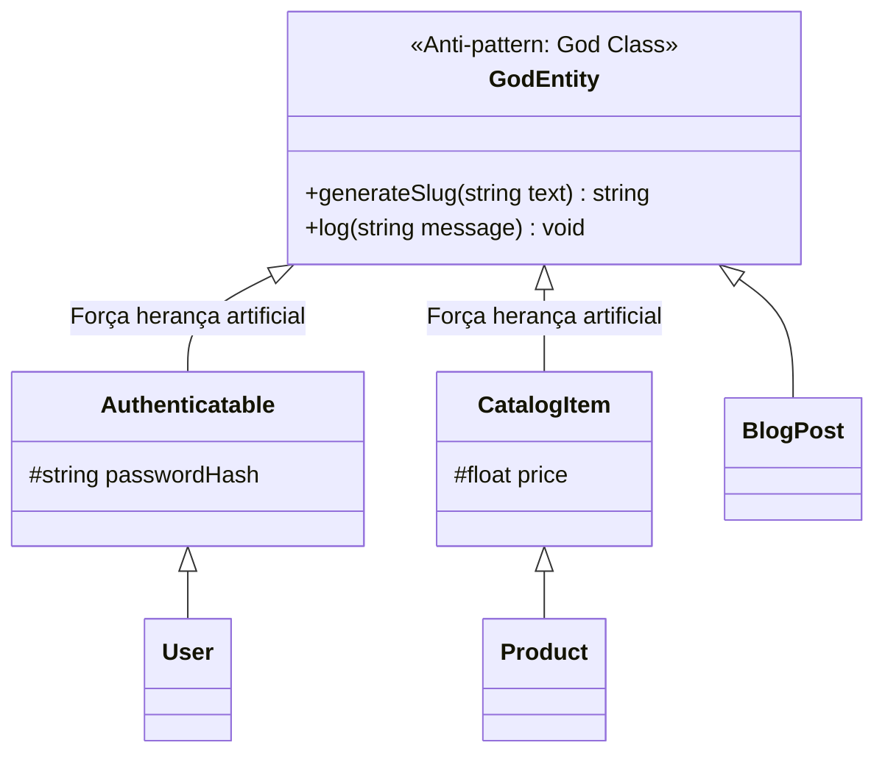
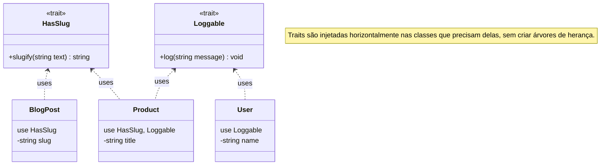

# 30. Traits e Composição Horizontal

Ao modelarmos sistemas orientados a objetos no PHP, aprendemos a definir
contratos puros com **Interfaces** (Cap. 23), reaproveitar código verticalmente
com **Herança** (Cap. 24) e criar estruturas com **Classes Abstratas** (Cap.
25).

Contudo, a herança tradicional no PHP possui uma restrição estrutural rígida: o
PHP adota **herança simples**, o que significa que uma classe só pode herdar de
**uma única superclasse** com `extends`.

E quando precisamos compartilhar um mesmo bloco de código concreto e
comportamento entre classes que pertencem a famílias e hierarquias completamente
distintas (como um `User`, um `Product` e um `Order`)?

Neste capítulo, aprenderemos o conceito de **Composição Horizontal** através das
**Traits** — a palavra-chave **`trait`**, a instrução **`use`**, a resolução de
conflitos de colisão com **`insteadof`** e **`as`**, e como combinar **Traits
com Interfaces** para criar arquiteturas flexíveis e desacopladas.

## A Dor: O Dilema da Herança Simples

Imagine que estamos desenvolvendo uma plataforma web e precisamos adicionar duas
funcionalidades recorrentes em várias entidades do sistema:

1. **Geração de Slugs:** Converter títulos em URLs amigáveis (ex.: `"PHP 8
Moderno"` $\rightarrow$ `"php-8-moderno"`).
2. **Registro de Auditoria de Log:** Formatar e emitir mensagens de log com
   data, hora e nome da classe.

Essas funcionalidades são necessárias em entidades distintas:

- `Product` (que já herda de `CatalogItem`);
- `User` (que já herda de `Authenticatable`);
- `BlogPost` (que não herda de ninguém).

Sem um mecanismo de reaproveitamento horizontal, desenvolvedores costumam cair
em uma de três armadilhas de modelagem:



### As 3 Armadilhas Tradicionais

1. **A Superclasse "Deus" (_God Class_):** Criar uma classe base genérica
   (`BaseEntity` ou `Model`) e colocar nela métodos de log, slug, datas,
   conversão de JSON, etc. Todas as classes do sistema herdam dessa base,
   acumulando dezenas de métodos irrelevantes para seu domínio específico.
2. **Duplicação de Código (Copiar e Colar):** Repetir a mesma implementação do
   algoritmo de slug e log em cada classe que precisar deles. Se a regra do slug
   mudar, dezenas de arquivos precisarão ser alterados.
3. **Heranças Forçadas e Sem Sentido Semântico:** Fazer `BlogPost extends
CatalogItem` apenas para "pegar emprestado" um método, violando gravemente o
   princípio de responsabilidade única e a relação "É-UM".

## O Conceito: O Que É uma Trait?

Uma **Trait** (termo em inglês para _"traço"_ ou _"característica"_) é uma
unidade de código projetada para permitir o **reaproveitamento horizontal de
métodos e propriedades** entre classes independentes.

### Características Fundamentais de uma Trait:

- **Não pode ser instanciada diretamente:** Não é possível executar `new
MinhaTrait()`.
- **Não é um tipo de dados:** Traits não criam tipos nominais, ou seja, **não é
  possível tipar um parâmetro como `function process(MinhaTrait $param)`**.
- **Injeção de Código em Tempo de Execução:** Quando uma classe declara `use
MinhaTrait;`, o PHP injeta os métodos e propriedades da trait diretamente na
  classe, como se tivessem sido escritos manualmente nela.



## Declarando e Utilizando Traits (`trait` e `use`)

Declaramos uma trait com a palavra-chave **`trait`** e a incorporamos em uma
classe utilizando a palavra-chave **`use`** dentro do corpo da classe:

```php
<?php

declare(strict_types=1);

// 1. Declaração da Trait de Slug:
trait HasSlug
{
    public function slugify(string $text): string
    {
        // Converte para minúsculas, troca espaços por hífens e remove caracteres especiais:
        $slug = strtolower(trim($text));
        $slug = preg_replace('/[^a-z0-9-]+/', '-', $slug);
        return trim((string) $slug, '-');
    }
}

// 2. Declaração da Trait de Auditoria:
trait Loggable
{
    public function log(string $action): void
    {
        $className = static::class;
        $timestamp = date('Y-m-d H:i:s');
        echo "[LOG - {$timestamp}] [{$className}]: {$action}\n";
    }
}
```

Agora, qualquer classe pode incorporar uma ou mais traits de forma limpa:

```php
// Incorporando em BlogPost:
class BlogPost
{
    use HasSlug;
    use Loggable;

    public function __construct(
        public readonly string $title,
        public readonly string $content
    ) {}

    public function getUrl(): string
    {
        $slug = $this->slugify($this->title);
        $this->log("URL gerada: /posts/{$slug}");
        return "/posts/{$slug}";
    }
}

// Incorporando em Product (hierarquia completamente diferente):
class Product
{
    use HasSlug;

    public function __construct(
        public readonly string $name,
        public readonly float $price
    ) {}

    public function getPermalink(): string
    {
        return "/produtos/" . $this->slugify($this->name);
    }
}

$post = new BlogPost("PHP 8 Moderno e Orientação a Objetos!", "Conteúdo do artigo...");
echo $post->getUrl() . "\n";
// [LOG - 2026-09-21 23:45:00] [BlogPost]: URL gerada: /posts/php-8-moderno-e-orientacao-a-objetos
// /posts/php-8-moderno-e-orientacao-a-objetos

$product = new Product("Teclado Mecânico RGB", 350.00);
echo $product->getPermalink() . "\n";
// /produtos/teclado-mecanico-rgb
```

## Recursos Avançados de Traits

### 1. Métodos Abstratos em Traits (Exigindo Contratos da Classe)

Uma trait pode declarar métodos **`abstract`**. Isso força a classe que a
utiliza a fornecer a implementação do método exigido:

```php
<?php

declare(strict_types=1);

trait Timestampable
{
    protected ?DateTimeImmutable $createdAt = null;

    // ✅ A trait exige que a classe hospedeira forneça um identificador para log:
    abstract public function getEntityIdentifier(): string;

    public function touch(): void
    {
        $this->createdAt = new DateTimeImmutable();
        echo "Entidade [{$this->getEntityIdentifier()}] atualizada em {$this->createdAt->format('d/m/Y H:i:s')}\n";
    }
}

class UserAccount
{
    use Timestampable;

    public function __construct(
        private string $email
    ) {}

    // Obrigatório fornecer este método exigido pela trait:
    public function getEntityIdentifier(): string
    {
        return $this->email;
    }
}

$user = new UserAccount("aluno@fatec.sp.gov.br");
$user->touch();
// Entidade [aluno@fatec.sp.gov.br] atualizada em 21/09/2026 23:45:00
```

### 2. Composição de Traits (Traits Compondo Outras Traits)

Assim como classes podem usar múltiplas traits, **uma trait pode ser composta
por outras traits**:

```php
<?php

declare(strict_types=1);

trait Auditable
{
    use HasSlug;
    use Loggable;
    use Timestampable;
}

class Article
{
    // Importa as 3 traits de uma só vez:
    use Auditable;

    public function getEntityIdentifier(): string
    {
        return "Article-01";
    }
}
```

### 3. Resolução de Conflitos de Nomes (`insteadof` e `as`)

Quando duas traits utilizadas pela mesma classe definem um método com o **mesmo
nome**, o PHP disparará um erro fatal de colisão se o conflito não for
explicitamente resolvido.

Para resolver a colisão, o PHP disponibiliza dois operadores:

- **`insteadof`:** Define qual método de qual trait deve ser o prioritário.
- **`as`:** Cria um apelido (_alias_) com novo nome para o método que foi
  preterido, ou altera sua visibilidade.

```php
<?php

declare(strict_types=1);

trait LoggerA
{
    public function log(string $msg): void
    {
        echo "[LoggerA]: {$msg}\n";
    }
}

trait LoggerB
{
    public function log(string $msg): void
    {
        echo "[LoggerB]: {$msg}\n";
    }
}

class Service
{
    use LoggerA, LoggerB {
        // 1. Usa o método log() de LoggerA no lugar do de LoggerB:
        LoggerA::log insteadof LoggerB;

        // 2. Cria um apelido 'logFromB' para acessar o método preterido de LoggerB:
        LoggerB::log as logFromB;
    }
}

$service = new Service();
$service->log("Mensagem principal");     // [LoggerA]: Mensagem principal
$service->logFromB("Mensagem secundária"); // [LoggerB]: Mensagem secundária
```

### 4. Alterando Visibilidade de Métodos da Trait

Podemos utilizar a palavra-chave `as` para tornar um método da trait mais
restrito (ex.: transformar `public` em `protected` ou `private` na classe
consumidora):

```php
<?php

declare(strict_types=1);

trait InternalHasher
{
    public function hashData(string $data): string
    {
        return hash('sha256', $data);
    }
}

class PaymentToken
{
    // Torna o método da trait 'private' dentro desta classe:
    use InternalHasher {
        hashData as private generateInternalHash;
    }

    public function create(string $cardNumber): string
    {
        // Acesso restrito ao método interno:
        return $this->generateInternalHash($cardNumber);
    }
}
```

## A Combinação Ideal: Interfaces + Traits

Como as traits **não criam tipos nominais**, você **nunca deve utilizar traits
como substituto de interfaces**.

O padrão recomendado na engenharia de software com PHP é:

1. **Use uma `interface` para definir o contrato de tipo público** (para tipagem
   e polimorfismo).
2. **Use uma `trait` para fornecer uma implementação padrão reutilizável desse
   contrato**.

```php
<?php

declare(strict_types=1);

// 1. CONTRATO PÚBLICO (Interface para tipagem e polimorfismo):
interface ExportableToJsonInterface
{
    public function toJson(): string;
}

// 2. IMPLEMENTAÇÃO REUTILIZÁVEL (Trait que fornece o comportamento):
trait ExportableToJsonTrait
{
    public function toJson(): string
    {
        return (string) json_encode(get_object_vars($this), JSON_PRETTY_PRINT | JSON_THROW_ON_ERROR);
    }
}

// 3. CLASSE CONCRETA: Assina a interface e reaproveita o código da trait
class CustomerProfile implements ExportableToJsonInterface
{
    use ExportableToJsonTrait;

    public function __construct(
        public readonly string $name,
        public readonly string $city
    ) {}
}

// 4. CONSUMIDOR: Tipado estritamente pela Interface
function exportReport(ExportableToJsonInterface $exportable): void
{
    echo "=== Relatório JSON ===\n";
    echo $exportable->toJson() . "\n";
}

$customer = new CustomerProfile("Mariana Ramos", "São Paulo");
exportReport($customer);
```

**Saída da Execução:**

```json
=== Relatório JSON ===
{
    "name": "Mariana Ramos",
    "city": "S\u00e3o Paulo"
}
```

## Comparativo: `class` vs `interface` vs `trait`

| Característica             | `class` Concreta               | `interface`                            | `trait`                                    |
| :------------------------- | :----------------------------- | :------------------------------------- | :----------------------------------------- |
| **Pode dar `new`?**        | ✅ **Sim**                     | ❌ **Não**                             | ❌ **Não**                                 |
| **Pode ter código `{}`?**  | ✅ **Sim**                     | ❌ **Não** (apenas assinaturas)        | ✅ **Sim** (métodos concretos e abstratos) |
| **Pode ter Propriedades?** | ✅ **Sim**                     | ❌ **Não** (apenas constantes)         | ✅ **Sim** (`protected`, `private`, etc.)  |
| **Serve para Tipagem?**    | ✅ **Sim** (`User $user`)      | ✅ **Sim** (`LoggableInterface $log`)  | ❌ **Não** (não cria tipo nominal)         |
| **Adoção Múltipla**        | ❌ Herança Simples (`extends`) | ✅ Múltipla (`implements A, B`)        | ✅ Múltipla (`use TraitA, TraitB`)         |
| **Finalidade Central**     | Estado e regras do domínio     | **Definir contratos formais de tipos** | **Reutilizar blocos de código horizontal** |

## Boas Práticas e Cuidados ao Usar Traits

1. **Evite Dependências Ocultas:** Traits não devem acessar diretamente
   propriedades privadas da classe hospedeira sem que isso esteja explícito via
   método `abstract`.
2. **Não Substitua Injeção de Dependências por Traits:** Não use traits para
   injetar serviços pesados (como clientes de banco de dados ou gateways de
   pagamento); use Injeção de Dependências no construtor.
3. **Mantenha Traits Pequenas e Focadas:** Uma boa trait resolve uma única
   capacidade auxiliar coesa (ex.: `HasSlug`, `SoftDeletes`,
   `JsonSerializable`).

## O Que Vem a Seguir?

Neste capítulo, aprendemos a utilizar as **Traits** para compor comportamentos
horizontalmente e eliminar duplicações de código sem a rigidez da herança
múltipla.

Além de estender classes e compor comportamentos com traits, o PHP possui uma
série de mecanismos internos para **interceptar operações e mensagens de
objetos** em tempo de execução (como acessar propriedades inexistentes, disparar
chamadas dinâmicas ou transformar objetos em texto).

No **[Capítulo 31: Métodos Mágicos](31-metodos-magicos.md)**, aprenderemos como
utilizar os métodos mágicos (`__get`, `__set`, `__call`, `__toString`,
`__invoke`) para dominar a metaprogramação orientada a objetos no PHP moderno.

---

<a href="29-enums-e-backed-enums.md">← Enums e Backed Enums</a>

<p align="right"><a href="31-metodos-magicos.md">Próximo: Métodos Mágicos →</a></p>
