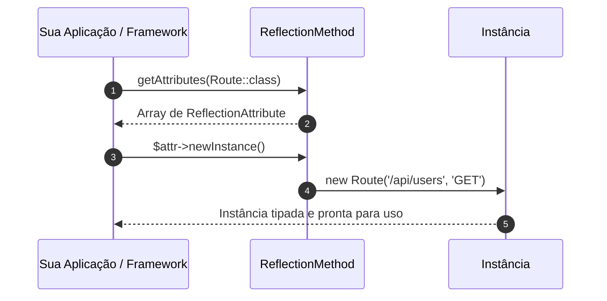

# 32. Atributos e Metadados Nativos

Ao longo deste módulo, exploramos a modelagem de tipos, o controle de acesso, o
compartilhamento de código e a interceptação dinâmica com métodos mágicos.

No entanto, em aplicações web e frameworks modernos (como Laravel, Symfony e
Doctrine), frequentemente precisamos anexar **metadados declarativos** a
classes, métodos e propriedades: indicar que um método responde a uma rota HTTP
específica, que uma propriedade deve ser validada como e-mail ou que uma classe
deve ser mapeada para uma tabela no banco de dados.

Historicamente, o PHP dependia de anotações em blocos de comentários
(_DocBlocks_), que eram frágeis, sem tipagem e lentos para processar.

Com o **PHP 8.0**, a linguagem introduziu os **Atributos Nativos**
(_Attributes_), permitindo adicionar metadados estruturados, tipados e validados
pelo próprio compilador do PHP.

Neste capítulo, aprenderemos a sintaxe de atributos (`#[...]`), como criar
**atributos customizados**, como limitar seus alvos com `Attribute::TARGET_*`, e
como inspecioná-los em tempo de execução utilizando a **API de Reflexão**
(_Reflection API_).

## A Dor: O Passado Frágil das Anotações em DocBlocks

Antes do PHP 8.0, para adicionar metadados a um controlador ou entidade, os
desenvolvedores utilizavam comentários especiais:

```php
<?php

// ❌ ABORDAGEM LEGADA: Metadados baseados em comentários de texto
class LegacyUserController
{
    /**
     * @Route("/api/users", methods={"GET"})
     * @Auth(role="ADMIN")
     */
    public function listUsers(): void
    {
        // ...
    }
}
```

Essa abordagem em comentários trazia grandes desvantagens:

1. **Ausência de Validação Sintática:** O PHP ignora comentários durante a
   execução. Se você errasse o nome de um parâmetro ou cometesse um erro de
   digitação (`@Routte("/users")`), nenhum erro de sintaxe seria emitido.
2. **Sem Tipagem Estrita:** Todos os parâmetros eram analisados como strings
   brutas através de expressões regulares complexas e custosas.
3. **Falta de Suporte da IDE:** Refatorações automáticas (como renomear uma
   classe) não atualizavam os comentários confiavelmente.

## O Que São Atributos Nativos?

Os **Atributos Nativos** são instruções de metadados de primeira classe da
linguagem, delimitados pela sintaxe **`#[NomeDoAtributo]`**.

Eles não são comentários: são **símbolos reconhecidos e validados pelo
interpretador PHP**, suportam passagem de argumentos tipados, argumentos
nomeados e validação estrita.

```php
<?php

declare(strict_types=1);

namespace App\Http\Controllers;

use App\Attributes\Route;
use App\Attributes\Authenticated;

final class UserController
{
    #[Route(path: '/api/users', method: 'GET')]
    #[Authenticated(role: 'ADMIN')]
    public function listUsers(): void
    {
        echo "Retornando lista de usuários...\n";
    }
}
```

## Criando Atributos Personalizados

Para criar um atributo customizado, declaramos uma classe comum e a decoramos
com o atributo nativo **`#[Attribute]`**:

```php
<?php

declare(strict_types=1);

namespace App\Attributes;

use Attribute;

#[Attribute]
final readonly class Route
{
    public function __construct(
        public string $path,
        public string $method = 'GET'
    ) {}
}
```

Como os atributos são classes reais, seu construtor aceita tipos estritos
(`string`, `int`, `array`, `Enums`), valores padrão e verificação de tipagem em
tempo de compilação.

### Restringindo Alvos de Aplicação (`Attribute::TARGET_*`)

Por padrão, um atributo pode ser aplicado em qualquer elemento de código. Para
garantir que um atributo seja utilizado apenas onde faz sentido (por exemplo, um
atributo de validação de campo aplicado apenas em propriedades), passamos flags
bit a bit para o `#[Attribute]`:

| Flag de Alvo                  | Onde pode ser aplicado?                                            |
| :---------------------------- | :----------------------------------------------------------------- |
| `Attribute::TARGET_CLASS`     | Apenas em declarações de classes e interfaces                      |
| `Attribute::TARGET_METHOD`    | Apenas em métodos                                                  |
| `Attribute::TARGET_PROPERTY`  | Apenas em propriedades de classes                                  |
| `Attribute::TARGET_PARAMETER` | Apenas em parâmetros de funções/métodos                            |
| `Attribute::TARGET_ALL`       | Em qualquer elemento (padrão)                                      |
| `Attribute::IS_REPEATABLE`    | Permite aplicar o mesmo atributo múltiplas vezes no mesmo elemento |

#### Exemplo: Restringindo a Métodos e Permitindo Repetição

```php
<?php

declare(strict_types=1);

namespace App\Attributes;

use Attribute;

// Aplicável apenas em métodos e permite repetição no mesmo método:
#[Attribute(Attribute::TARGET_METHOD | Attribute::IS_REPEATABLE)]
final readonly class HttpRoute
{
    public function __construct(
        public string $path,
        public string $method = 'GET'
    ) {}
}

class ProductController
{
    // ✅ Válido: Múltiplas rotas aplicadas ao mesmo método
    #[HttpRoute(path: '/produtos', method: 'GET')]
    #[HttpRoute(path: '/produtos/todos', method: 'GET')]
    public function index(): void {}
}
```

## Lendo Atributos com a Reflection API

> 💡 **Você vai escrever Reflection no dia a dia?**
>
> Na rotina real de um desenvolvedor de aplicações web, **dificilmente você
> precisará criar atributos do zero ou escrever código com a Reflection API**.
>
> Na grande maioria dos projetos, nós apenas **consumimos os atributos prontos
> fornecidos pelos frameworks** (como o `#[Route]` do Symfony, regras de
> validação do Laravel ou `#[Column]` do Doctrine). O próprio framework se
> encarrega de inspecionar essas marcações via Reflection por baixo dos panos.
>
> O exemplo a seguir serve como uma demonstração prática para **desmistificar a
> "mágica" dos frameworks**, permitindo que você entenda exatamente o que
> acontece nos bastidores quando uma biblioteca lê seus atributos.

Atributos por si só são metadados passivos — eles não alteram a execução do
código a menos que um mecanismo os inspecione.

Para ler os atributos declarados em tempo de execução, utilizamos a **API de
Reflexão** do PHP (`ReflectionClass`, `ReflectionMethod`, `ReflectionProperty`):

```php
<?php

declare(strict_types=1);

use App\Attributes\Route;
use App\Http\Controllers\UserController;

// 1. Cria o refletor para inspecionar a classe:
$reflectionClass = new ReflectionClass(UserController::class);

// 2. Obtém o método desejado:
$reflectionMethod = $reflectionClass->getMethod('listUsers');

// 3. Lê os atributos do tipo Route anexados ao método:
$attributes = $reflectionMethod->getAttributes(Route::class);

foreach ($attributes as $attributeReflection) {
    // 4. Instancia a classe real do Atributo com os argumentos passados:
    /** @var Route $route */
    $route = $attributeReflection->newInstance();

    echo "Rota encontrada: [{$route->method}] {$route->path}\n";
    // Imprime: "Rota encontrada: [GET] /api/users"
}
```



## Exemplo Completo do Domínio: Um Mini Validador de DTOs

Vejamos um caso de uso prático e poderoso: a criação de um motor de validação de
DTOs usando Atributos customizados e Reflection API.

### 1. Definição dos Atributos de Validação

```php
<?php

declare(strict_types=1);

namespace App\Validation\Attributes;

use Attribute;

#[Attribute(Attribute::TARGET_PROPERTY)]
final readonly class NotBlank
{
    public function __construct(
        public string $message = 'Este campo não pode ser vazio.'
    ) {}
}

#[Attribute(Attribute::TARGET_PROPERTY)]
final readonly class MinValue
{
    public function __construct(
        public float $min,
        public string $message = 'O valor informado é menor que o mínimo permitido.'
    ) {}
}
```

### 2. O Motor de Validação Genérico via Reflection

```php
<?php

declare(strict_types=1);

namespace App\Validation;

use App\Validation\Attributes\NotBlank;
use App\Validation\Attributes\MinValue;
use ReflectionClass;

final class Validator
{
    /**
     * @return array<string, string> Lista de erros no formato [campo => mensagem]
     */
    public static function validate(object $dto): array
    {
        $errors = [];
        $reflector = new ReflectionClass($dto);

        foreach ($reflector->getProperties() as $property) {
            $propertyName = $property->getName();
            $value = $property->getValue($dto);

            // Valida regra #[NotBlank]:
            $notBlankAttrs = $property->getAttributes(NotBlank::class);
            if (!empty($notBlankAttrs)) {
                /** @var NotBlank $notBlank */
                $notBlank = $notBlankAttrs[0]->newInstance();
                if ($value === null || (is_string($value) && trim($value) === '')) {
                    $errors[$propertyName] = $notBlank->message;
                    continue; // Pula para a próxima propriedade se já falhou
                }
            }

            // Valida regra #[MinValue]:
            $minAttrs = $property->getAttributes(MinValue::class);
            if (!empty($minAttrs) && is_numeric($value)) {
                /** @var MinValue $minValue */
                $minValue = $minAttrs[0]->newInstance();
                if ((float) $value < $minValue->min) {
                    $errors[$propertyName] = $minValue->message;
                }
            }
        }

        return $errors;
    }
}
```

### 3. DTO Decorado com Atributos e Execução

```php
<?php

declare(strict_types=1);

use App\Validation\Attributes\NotBlank;
use App\Validation\Attributes\MinValue;
use App\Validation\Validator;

final readonly class CreateProductDTO
{
    public function __construct(
        #[NotBlank(message: 'O nome do produto é obrigatório.')]
        public string $name,

        #[MinValue(min: 0.01, message: 'O preço deve ser maior que zero.')]
        public float $price,

        #[MinValue(min: 1, message: 'O estoque inicial deve ser de pelo menos 1 unidade.')]
        public int $stock
    ) {}
}

// ----------------------------------------------------
// Cenário 1: DTO com dados inválidos
// ----------------------------------------------------
$invalidProduct = new CreateProductDTO(
    name: '   ',
    price: -15.50,
    stock: 0
);

$errors = Validator::validate($invalidProduct);

echo "=== Erros de Validação ===\n";
foreach ($errors as $field => $errorMsg) {
    echo "- [{$field}]: {$errorMsg}\n";
}

// ----------------------------------------------------
// Cenário 2: DTO válido
// ----------------------------------------------------
$validProduct = new CreateProductDTO(
    name: 'Cadeira Ergonômica',
    price: 899.90,
    stock: 10
);

$validErrors = Validator::validate($validProduct);
echo "\nTotal de erros no produto válido: " . count($validErrors) . "\n";
```

**Saída da Execução:**

```text
=== Erros de Validação ===
- [name]: O nome do produto é obrigatório.
- [price]: O preço deve ser maior que zero.
- [stock]: O estoque inicial deve ser de pelo menos 1 unidade.

Total de erros no produto válido: 0
```

## Comparativo: DocBlocks vs Atributos Nativos

| Critério                    | Anotações em DocBlocks (`/** @Route */`) | Atributos Nativos (`#[Route]`)               |
| :-------------------------- | :--------------------------------------- | :------------------------------------------- |
| **Integração na Linguagem** | ❌ Comentários ignorados pelo runtime    | ✅ Símbolos nativos de 1ª classe no PHP 8+   |
| **Checagem de Sintaxe**     | ❌ Nenhuma (erros passam silenciosos)    | ✅ Totalmente validado pelo compilador       |
| **Tipagem de Argumentos**   | ❌ Strings brutas não validadas          | ✅ Tipos estritos (`int`, `string`, `Enums`) |
| **Performance de Leitura**  | ❌ Lenta (requer parsing de regex)       | ✅ Alta (leitura estruturada direta na AST)  |
| **Refatoração na IDE**      | ❌ Frágil e propensa a quebras           | ✅ Autocompletar e renomeação automáticos    |

---

<a href="31-metodos-magicos.md">← Métodos Mágicos</a>
