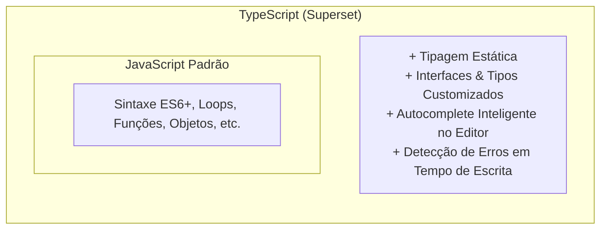
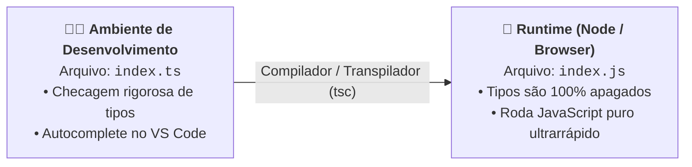

# 01. O Que É o TypeScript e Por Que Ele Existe?

Quando começamos a construir aplicações para a Web moderna, nos deparamos com um
ecossistema vibrante e em constante evolução. No centro desse universo está uma
das ferramentas mais adotadas e queridas por equipes de engenharia de software
no mundo inteiro: o **TypeScript**.

Mas antes de configurarmos compiladores ou escrevermos qualquer linha de código
tipado, precisamos dar um passo atrás e responder a uma pergunta essencial:
**qual dor real o JavaScript causou na indústria para que o TypeScript se
tornasse indispensável em praticamente todas as grandes empresas de
tecnologia?**

Neste capítulo, vamos compreender a transição do dinamismo puro do JavaScript
para a segurança estática do TypeScript e como essa camada nos protege contra os
erros mais comuns e caros do desenvolvimento de software.

## A Dor: O JavaScript em Projetos Grandes

O JavaScript foi criado em 1995 em apenas 10 dias. O objetivo original era
modesto: adicionar pequenas interações visuais em páginas estáticas (como
validar se um campo de formulário estava preenchido ou abrir um menu).

Hoje, a Web hospeda sistemas gigantescos e de alta complexidade: bancos
digitais, editores de vídeo no navegador, redes sociais e plataformas de
comércio eletrônico com milhões de linhas de código.

Nesse cenário de escala, o JavaScript puro apresenta três desafios críticos:

### 1. Erros de Digitação Silenciosos (_Typos_)

No JavaScript puro, se você cometer um pequeno erro de digitação ao acessar uma
propriedade de um objeto, o programa não avisa nada durante a escrita:

```javascript
// ❌ JAVASCRIPT PURO
const user = {
  name: "Ana Silva",
  email: "ana@email.com",
};

// Erro de digitação: 'emial' em vez de 'email'
console.log(user.emial); // Retorna: undefined (sem nenhum aviso de erro!)
```

O JavaScript simplesmente atribui `undefined` e continua executando normalmente.
O problema só vai estourar muito tempo depois, quando outra função tentar enviar
esse e-mail e quebrar na cara do usuário final.

### 2. O Terror da Refatoração

Imagine que você precisa alterar o nome de um campo no banco de dados de `price`
para `unitPrice`.

No JavaScript puro, você precisa procurar manualmente por todas as ocorrências
dessa palavra em dezenas de arquivos torcendo para não esquecer nenhum. Se
esquecer uma única linha, ela só falhará quando o cliente clicar naquele botão
específico em produção.

### 3. O Famoso Erro: _Cannot read properties of undefined_

O campeão absoluto de falhas em aplicações web é tentar acessar uma propriedade
dentro de algo que não existe:

```javascript
// ❌ O bug mais comum da Web
function formatAddress(user) {
  return `${user.address.street}, ${user.address.number}`;
}

// Se o cliente ainda não cadastrou endereço:
formatAddress({ name: "Carlos" });
// 💥 TypeError: Cannot read properties of undefined (reading 'street')
```

## A Solução: O Que É o TypeScript?

Criado pela Microsoft em 2012 (liderado por Anders Hejlsberg, o mesmo arquiteto
do C#), o **TypeScript** é um **Superset Tipado** (_Superset_) do JavaScript.



Dizer que o TypeScript é um _superset_ (superconjunto) significa que:

- **Todo código JavaScript válido já é um código TypeScript válido;**
- O TypeScript adiciona uma **camada de tipos** sobre o JavaScript existente.

### A Experiência de Desenvolvimento com TypeScript

Veja como o mesmo exemplo anterior se comporta no TypeScript enquanto você
digita no VS Code:

```typescript
// ✅ TYPESCRIPT
type User = {
  name: string;
  email: string;
};

const user: User = {
  name: "Ana Silva",
  email: "ana@email.com",
};

// O editor sublinha em vermelho na mesma hora:
console.log(user.emial);
// ❌ Erro do compilador: Property 'emial' does not exist on type 'User'. Did you mean 'email'?
```

O TypeScript funciona como um **copiloto vigilante**: ele conhece a estrutura
dos seus dados e aponta o erro no mesmo instante em que você digita, antes mesmo
de você salvar ou rodar o código.

## Os Tipos Existem em Runtime?

Esta é uma das regras conceituais mais importantes de todo o curso:

> **Os tipos do TypeScript só existem durante o desenvolvimento (em tempo de
> compilação). Eles NÃO existem quando o código está rodando no navegador ou no
> Node.js.**



Pense nos tipos do TypeScript como os **andaimes de uma construção**:

- Eles são fundamentais enquanto o prédio está sendo erguido, dando segurança
  para os operários trabalharem sem cair;
- Quando o prédio fica pronto para a inauguração, os andaimes são completamente
  desmontados e retirados;
- O que o cliente final visita é apenas a estrutura sólida do edifício.

Como o compilador do TypeScript remove todas as anotações de tipo ao gerar o
JavaScript final, **o TypeScript não adiciona nenhum peso extra nem deixa a
aplicação mais lenta em produção**.

<details>
<summary>🔍 Por que os navegadores não executam TypeScript nativamente?</summary>

Muitos desenvolvedores se perguntam: _"Se o TypeScript é tão bom, por que os
navegadores não aprendem a rodar arquivos `.ts` diretamente?"_

Existem dois motivos arquiteturais principais:

1. **Velocidade de Execução:** Checar tipos em tempo de execução tornaria o
   carregamento das páginas muito mais lento. O navegador é projetado para rodar
   instruções o mais rápido possível, sem perder tempo validando regras de tipos
   que já deveriam ter sido resolvidas pelo programador antes do deploy;
2. **Consenso e Padrões da Web:** Para uma linguagem rodar nativamente nos
   navegadores, ela precisa ser padronizada pelo comitê internacional **ECMA**
   (onde todas as empresas como Google, Apple, Mozilla e Microsoft precisam
   concordar com cada detalhe). Ao manter o TypeScript como um superset
   transpilado, a equipe do TypeScript tem liberdade total para evoluir a
   linguagem rapidamente sem depender de burocracias de navegadores.

</details>

## Comparativo: JavaScript Puro vs TypeScript

| Aspecto                          | JavaScript Puro                        | TypeScript                               |
| :------------------------------- | :------------------------------------- | :--------------------------------------- |
| **Sistema de Tipos**             | Dinâmico e fraco (em runtime)          | Estático e forte (em compilação)         |
| **Momento do Erro**              | Quando o código é executado            | Enquanto você digita no editor           |
| **Refatoração**                  | Arriscada e manual em projetos médios  | Segura, com renomeação automática global |
| **Autocompletar (IntelliSense)** | Básico e baseado em suposições         | Preciso e documentado automaticamente    |
| **Onde Executa?**                | Navegadores e Runtimes (Node/Deno/Bun) | Transpila para JS para ser executado     |

## O Que Vem a Seguir?

Agora que você compreende **por que** o TypeScript existe e como seu sistema de
tipagem estática opera como um escudo durante o desenvolvimento, surge uma
dúvida prática fundamental:

> _"Se o TypeScript é convertido para JavaScript puro no final, onde e como esse
> código realmente roda no computador ou no servidor?"_

No **[Capítulo 02: O Que É um Runtime
JavaScript?](02-o-que-e-um-runtime-js.md)**, vamos desmistificar o que é um
ambiente de execução (_runtime_), entender por que o navegador possui regras de
segurança estritas e descobrir como ferramentas como o **Node.js** permitiram
que o JavaScript conquistasse o mundo dos servidores e da linha de comando.

---

<p align="right"><a href="02-o-que-e-um-runtime-js.md">Próximo: O Que É um Runtime JavaScript? →</a></p>
