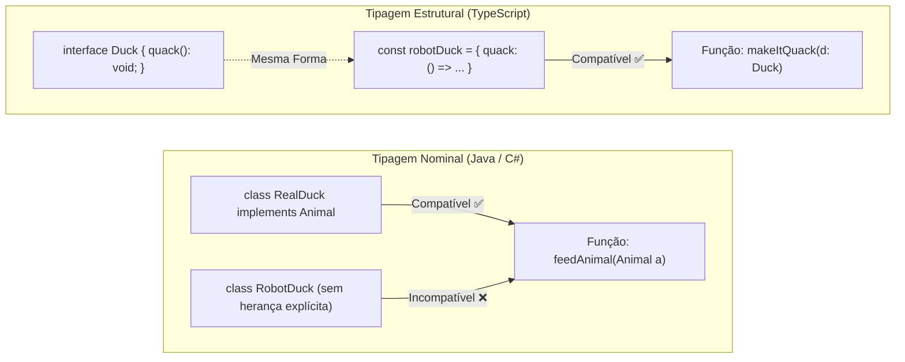

# 26. Tipagem Estrutural (Duck Typing)

No [Capítulo 25: Interfaces](25-interfaces.md), aprendemos a definir contratos
de dados utilizando `interface` e vimos como o polimorfismo permite trocar
implementações sob uma mesma forma. No entanto, a maneira como o TypeScript
avalia se um objeto atende ou não a esses contratos representa um dos maiores
choques de paradigma para quem vem de linguagens clássicas como Java ou C#.

Enquanto a maioria das linguagens estáticas tradicionais opera sob o modelo de
**Tipagem Nominal**, o TypeScript foi construído sobre o conceito de **Tipagem
Estrutural** (frequentemente associado no ecossistema dinâmico ao **_Duck
Typing_**).

Neste capítulo, você entenderá como o compilador do TypeScript avalia a
compatibilidade entre tipos, compreenderá o mecanismo de **Checagem de
Propriedades Excessivas** e descobrirá por que a tipagem estrutural é o pilar
que torna o TypeScript perfeito para o desenvolvimento Web moderno.

## Tipagem Nominal vs. Tipagem Estrutural

Para compreender a tipagem estrutural, vejamos primeiro como funciona a
linguagem em que muitos desenvolvedores foram alfabetizados:

### 1. Tipagem Nominal (Java, C#, C++)

Na tipagem nominal, a compatibilidade de tipos é determinada **pelo nome
explícito da classe ou interface**. Se duas classes possuem exatamente as mesmas
propriedades e métodos, mas não compartilham uma declaração formal de herança
(`implements Interface` ou `extends Classe`), o compilador **rejeita** a
atribuição:

```java
// Em Java / C#: Incompatível mesmo com métodos idênticos!
class RealDuck implements Animal {
  public void quack() {
    /* ... */
  }
}

class RobotDuck {
  public void quack() {
    /* ... */
  }
} // Não implementa Animal explicitamente

void makeNoise(Animal a) {
  a.quack();
}

// makeNoise(new RobotDuck()); // ❌ Erro de compilação em linguagens nominais!
```

### 2. Tipagem Estrutural (TypeScript, Go)

No TypeScript, a compatibilidade é determinada **pela forma (_shape_) e
conteúdo** do dado, e não pelo seu nome ou declaração de origem:

> _"Se anda como um pato, nada como um pato e voa como um pato, então para todos
> os efeitos práticos, é um pato."_

Se um objeto possui as propriedades e métodos exigidos por uma `interface` ou
`type`, o TypeScript o aceita imediatamente — sem necessidade de palavras-chave
como `implements` ou instanciação formal de classes:



## Duck Typing: A Forma Mais Pura de Polimorfismo

Para quem aprendeu Orientação a Objetos em linguagens como Java ou C#, existe um
mito clássico e muito difundido: _"Polimorfismo só existe quando criamos árvores
de herança com `extends` ou declaramos interfaces nominais com `implements`"_.

O **_Duck Typing_** do TypeScript desconstrói esse equívoco e resgata a
definição fundamental da computação:

> 💡 **A Verdadeira Essência do Polimorfismo:**
>
> Polimorfismo **não é sobre herança de classes nem sobre burocracia de tipos
> nominais**.
>
> Polimorfismo significa simplesmente **múltiplas formas**: a capacidade de
> diferentes objetos responderem ao **mesmo evento ou mensagem (chamada de
> método)** de maneiras distintas, cada um de acordo com a sua própria natureza.

### Polimorfismo sem Herança na Prática

Observe como três entidades com origens e estruturas completamente diferentes
podem ser tratadas polimorficamente sem nenhuma relação de parentesco nominal:

```typescript
// Contrato estrutural que define o 'evento' ou 'mensagem' esperado:
interface Notifier {
  send(message: string): void;
}

// 1. Uma classe tradicional
class EmailService {
  send(message: string): void {
    console.log(`[Email] Enviando mensagem via SMTP: ${message}`);
  }
}

// 2. Um objeto literal criado dinamicamente
const slackWebhookNotifier = {
  webhookUrl: "https://hooks.slack.com/services/...",
  channel: "#dev-alerts",
  send(message: string): void {
    console.log(`[Slack] Postando no canal #dev-alerts: ${message}`);
  },
};

// 3. Uma função construtora ou biblioteca legada
class SMSGateway {
  public provider = "Twilio";
  send(message: string): void {
    console.log(
      `[SMS/Twilio] Disparando SMS para número cadastrado: ${message}`,
    );
  }
}

// Função consumidora polimórfica: ela só se importa com a capacidade de responder a `send`
function broadcastSystemAlert(notifier: Notifier, alertMessage: string): void {
  notifier.send(alertMessage);
}

// ✅ Polimorfismo em ação: três objetos distintos respondendo ao mesmo evento de formas diferentes!
const email = new EmailService();
const sms = new SMSGateway();

broadcastSystemAlert(email, "Servidor em alta carga de CPU!");
broadcastSystemAlert(
  slackWebhookNotifier,
  "Deploy da versão 2.4 concluído com sucesso.",
);
broadcastSystemAlert(sms, "Alerta crítico: banco de dados inacessível!");
```

Nenhum desses três emissores precisou escrever `implements Notifier` nem herdar
de uma classe base comum. Ainda assim, todos se comportam de maneira polimórfica
sob a perspectiva da função consumidora `broadcastSystemAlert`.

## Demonstração Prática de Subtipagem Estrutural

Observe o exemplo a seguir. Temos uma função que processa o envio de recibos por
e-mail baseada em um contrato `ReceiptRecipient`:

```typescript
interface ReceiptRecipient {
  name: string;
  email: string;
}

function sendReceiptEmail(recipient: ReceiptRecipient): void {
  console.log(
    `Enviando recibo fiscal para: ${recipient.name} <${recipient.email}>`,
  );
}

// Objeto completo vindo de um banco de dados ou resposta de API:
const databaseUserRecord = {
  id: "usr_8821",
  name: "Mariana Costa",
  email: "mariana.costa@empresa.com",
  role: "admin",
  lastLogin: new Date(),
  accountBalance: 1250.0,
};

// ✅ 100% VÁLIDO no TypeScript!
sendReceiptEmail(databaseUserRecord);
```

### A Regra dos Requisitos Mínimos

Por que o código acima compila perfeitamente sem nenhum aviso de erro?

Para o TypeScript, contratos funcionam como **requisitos mínimos de forma**.
Como `databaseUserRecord` possui as propriedades `name` (do tipo `string`) e
`email` (do tipo `string`), ele satisfaz plenamente todas as exigências de
`ReceiptRecipient`. As propriedades extras (`id`, `role`, `accountBalance`) são
simplesmente ignoradas pela função `sendReceiptEmail`.

Isso confere ao TypeScript um poder extraordinário de **reuso e
desacoplamento**: módulos diferentes podem exigir apenas o subconjunto de dados
que realmente utilizam, sem obrigar o restante do sistema a criar classes ou
conversores artificiais.

## Checagem de Propriedades Excessivas (_Excess Property Checks_)

Ao experimentar a tipagem estrutural, é muito comum desenvolvedores se depararem
com um comportamento aparentemente contraditório do compilador.

Se o TypeScript aceita objetos com propriedades adicionais, por que o código
abaixo **gera erro de compilação**?

```typescript
interface ServerOptions {
  host: string;
  port: number;
}

function startServer(options: ServerOptions): void {
  console.log(`Servidor ativo em ${options.host}:${options.port}`);
}

// ❌ ERRO DE COMPILAÇÃO:
startServer({
  host: "localhost",
  port: 8080,
  timeoutMs: 5000, // Erro: Object literal may only specify known properties, and 'timeoutMs' does not exist in type 'ServerOptions'.
});
```

### O Motivo da Proteção

O TypeScript aplica uma regra especial chamada **Checagem de Propriedades
Excessivas** (_Excess Property Checking_) **exclusivamente sobre objetos
literais criados no momento exato da chamada ou atribuição**:

1. **Literais Criados no Momento da Invocação (`startServer({ ... })`):** Como o
   objeto está sendo escrito manualmente naquele instante, passar uma
   propriedade inexistente (`timeoutMs`) tem 99% de chance de ser um **erro de
   digitação (_typo_)** ou um mal-entendido sobre os parâmetros aceitos pela
   função.
2. **Objetos Armazenados em Variáveis (`const config = { ... };
startServer(config)`):** Como a variável pode ter sido originada em outro
   contexto ou módulo mais amplo, o compilador suspende a checagem de
   propriedades excessivas e aplica a regra pura da tipagem estrutural.

```typescript
// ✅ Caso 1: Passagem via variável intermediária (quando campos extras são intencionais)
const customServerConfig = {
  host: "localhost",
  port: 8080,
  timeoutMs: 5000,
};
startServer(customServerConfig); // Válido!

// ✅ Caso 2: Atualização formal da interface (quando o campo deve ser suportado)
interface ExtendedServerOptions {
  host: string;
  port: number;
  timeoutMs?: number; // Opcional
}
```

## Por Que a Tipagem Estrutural É a Alma da Web?

No ecossistema Web moderno, os dados trafegam constantemente em formato **JSON
puro** através de requisições HTTP (`fetch`, `axios`), respostas de bancos de
dados e eventos do navegador.

Em linguagens com tipagem puramente nominal, todo JSON recebido da rede precisa
ser instanciado e convertido manualmente para classes concretas antes de poder
ser utilizado em funções de negócio.

No TypeScript, graças à **Tipagem Estrutural**:

- Qualquer objeto JavaScript puro que tenha a estrutura compatível pode ser
  tratado diretamente como o tipo desejado.
- Não há custo de performance em tempo de execução (_zero runtime overhead_)
  para conversão de tipos.
- O código permanece declarativo, leve e perfeitamente integrado à flexibilidade
  nativa da Web.

## O Que Vem a Seguir?

Compreendida a flexibilidade da tipagem estrutural e a modelagem com
`interface`, estamos prontos para explorar como representar dados que podem
assumir múltiplos estados válidos e regras de negócio complexas.

No **[Capítulo 27: Uniões Literais e Discriminated
Unions](27-unioes-literais-e-discriminated-unions.md)**, aprenderemos a combinar
tipos com operadores de união (`|`) e interseção (`&`), restringir valores com
tipos literais e construir máquinas de estado infalíveis com o padrão de
**Uniões Discriminadas**.

---

<a href="25-interfaces.md">← Interfaces: Modelagem de Contratos</a>

<p align="right"><a href="27-unioes-literais-e-discriminated-unions.md">Próximo: Uniões Literais e Discriminated Unions →</a></p>
