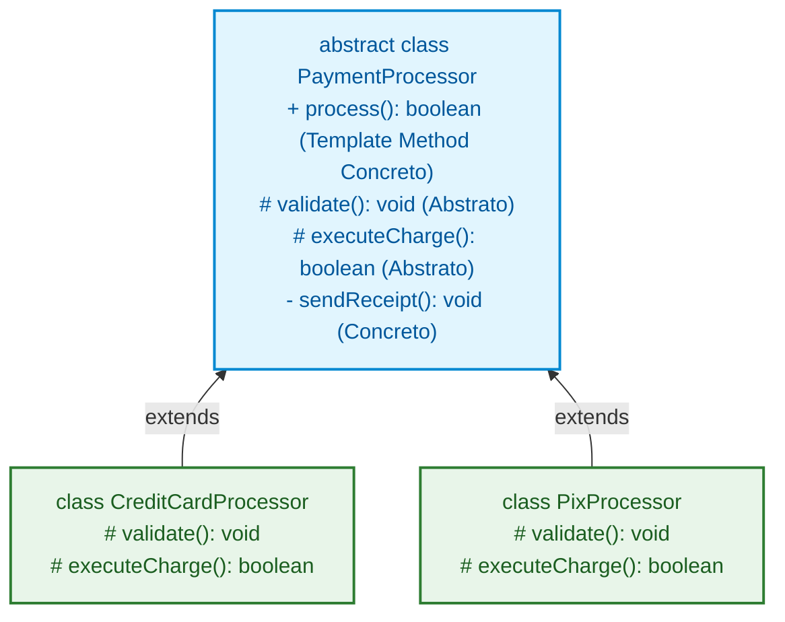

# 36. Classes Abstratas e Template Method

No [Capítulo 35: Herança e Sobrescrita de
Métodos](35-heranca-e-sobrescrita-de-metodos.md), aprendemos a reaproveitar
estado e comportamento entre classes utilizando `extends`, `super` e `override`.

Entretanto, quando tentamos usar classes base concretas para representar
conceitos genéricos do domínio, esbarramos em limites arquiteturais importantes.

Neste capítulo, resolveremos esses problemas através de **Classes Abstratas**
(`abstract class`), **Métodos Abstratos**, a **delegação de interfaces** e o
clássico padrão de design **Template Method**.

## Os Limites de Classes Base Concretas

Considere a classe `BasePayment` criada para compartilhar o identificador e o
valor entre diferentes meios de cobrança:

```typescript
export class BasePayment {
  constructor(
    public readonly id: string,
    public readonly amountInCents: number,
  ) {
    if (amountInCents <= 0) {
      throw new Error("O valor da cobrança deve ser positivo.");
    }
  }

  public getFormattedAmount(): string {
    return `R$ ${(this.amountInCents / 100).toFixed(2)}`;
  }
}
```

O uso dessa classe base concreta introduz dois problemas imediatos:

### 1. Instanciação Indesejada de Conceitos Genéricos

No mundo real, ninguém realiza um pagamento "genérico": realiza-se um pagamento
específico por Pix, Boleto ou Cartão. Contudo, como `BasePayment` é uma classe
concreta comum, o TypeScript permite instanciá-la livremente com `new`:

```typescript
// ❌ PROBLEMA 1: Uma abstração genérica sendo instanciada diretamente sem erro estático
const genericPayment = new BasePayment("tx_001", 15000);
```

### 2. Implementação Falsa de Contratos

Se quisermos que `BasePayment` atenda a uma `interface PaymentMethod` (que exige
o método `process()`), seremos forçados a criar um método com código "falso" ou
lançar exceções em tempo de execução:

```typescript
export interface PaymentMethod {
  id: string;
  amountInCents: number;
  process(): boolean;
}

// ❌ PROBLEMA 2: Classe base forçada a escrever código dummy ou lançar erro em runtime
export class BasePayment implements PaymentMethod {
  constructor(
    public readonly id: string,
    public readonly amountInCents: number,
  ) {}

  public process(): boolean {
    throw new Error(
      "Este método não deveria ser chamado diretamente na classe base!",
    );
  }
}
```

Essa abordagem é perigosa porque troca garantias estáticas de compilação por
potenciais falhas em produção.

## O Conceito de Classes Abstratas (`abstract class`)

Uma **Classe Abstrata** funciona como uma **fusão híbrida entre uma `interface`
e uma classe tradicional**:

- **O Lado "Interface":** Não pode ser instanciada diretamente com `new` e serve
  como um molde conceitual para definir contratos obrigatórios.
- **O Lado "Classe Normal":** Ao contrário de uma interface (que é apagada após
  a compilação), ela existe de verdade no runtime do JavaScript: possui
  `constructor`, métodos prontos e pode gerenciar **estado próprio** (inclusive
  propriedades `private` ou `#campo` para manter dados internos que nem as
  subclasses conseguem corromper).

Para declarar uma classe abstrata, adicionamos a palavra-chave **`abstract`**
antes de `class`:

```typescript
// ✅ Classe Abstrata: Molde não-instanciável com estado e lógica próprios
export abstract class BasePayment {
  public readonly id: string;
  public readonly amountInCents: number;
  public readonly createdAt: Date;

  // Estado estritamente privado: gerenciado apenas pela superclasse
  private internalAuditToken: string;

  constructor(id: string, amountInCents: number) {
    if (amountInCents <= 0) {
      throw new Error("O valor da cobrança deve ser positivo.");
    }
    this.id = id;
    this.amountInCents = amountInCents;
    this.createdAt = new Date();
    this.internalAuditToken = `audit_${Math.random().toString(36).substring(2, 9)}`;
  }

  // Método concreto: lógica utilitária reaproveitada por todas as subclasses
  public getFormattedAmount(): string {
    return `R$ ${(this.amountInCents / 100).toFixed(2)}`;
  }

  public getAuditSummary(): string {
    return `Transação ${this.id} registrada sob token [${this.internalAuditToken}]`;
  }
}
```

Se tentarmos instanciar `BasePayment` diretamente:

```typescript
// ❌ ERRO DE COMPILAÇÃO:
// Cannot create an instance of an abstract class.
const payment = new BasePayment("tx_01", 5000);
```

## Métodos Abstratos: Contratos Forçados pela Classe Base

Além de gerenciar estado e bloquear a instanciação direta, classes abstratas
podem declarar **Métodos Abstratos** (`abstract`).

Um método abstrato define apenas o nome, os parâmetros e o tipo de retorno,
**sem nenhum corpo (`{}`)**:

> 💡 **Paralelo com Interfaces:**
>
> A declaração de um método abstrato funciona de forma muito similar à
> assinatura de um método dentro de uma `interface`: ambos definem **o que deve
> existir** e estabelecem a tipagem de entrada e saída.
>
> A grande diferença é que, enquanto a interface é um contrato puro e isolado, o
> método abstrato convive dentro de uma classe que já possui **estado
> compartilhado e métodos concretos prontos**, permitindo amarrar a exigência ao
> fluxo da própria superclasse.

```typescript
export abstract class BasePayment {
  constructor(
    public readonly id: string,
    public readonly amountInCents: number,
  ) {}

  public getFormattedAmount(): string {
    return `R$ ${(this.amountInCents / 100).toFixed(2)}`;
  }

  // ✅ Método Abstrato: Sem corpo (como numa interface). Cada subclasse concreta DEVE implementar!
  public abstract executePayment(): boolean;
}
```

Se uma subclasse concreta herdar de `BasePayment` e esquecer de implementar o
método abstrato:

```typescript
// ❌ ERRO DE COMPILAÇÃO:
// Non-abstract class 'BoletoPayment' does not implement inherited abstract member 'executePayment' from class 'BasePayment'.
export class BoletoPayment extends BasePayment {
  // Faltou implementar executePayment()
}
```

### Delegação de Interfaces para Subclasses

Compreendido o mecanismo de métodos abstratos, podemos resolver com elegância o
segundo dilema que vimos no início do capítulo.

Em classes concretas, implementar uma interface exige fornecer código para todos
os seus métodos. Já com **classes abstratas**, podemos implementar uma interface
e **delegar os métodos específicos para as subclasses filhas** através de
`abstract`:

```typescript
export interface PaymentMethod {
  id: string;
  amountInCents: number;
  process(): boolean;
}

// ✅ A classe abstrata implementa a interface e delega 'process' via abstract
export abstract class BasePayment implements PaymentMethod {
  constructor(
    public readonly id: string,
    public readonly amountInCents: number,
  ) {}

  public getFormattedAmount(): string {
    return `R$ ${(this.amountInCents / 100).toFixed(2)}`;
  }

  // Delegação formal do contrato da interface para as subclasses:
  public abstract process(): boolean;
}
```

Dessa forma, eliminamos completamente o código "dummy" e garantimos segurança de
tipos em 100% da hierarquia.

## O Padrão Template Method com Classes Abstratas

A maior aplicação prática e arquitetural de classes abstratas é o padrão de
projeto **Template Method** (Método Modelo).

No Template Method, a classe abstrata define um **método concreto mestre que
atua como o esqueleto invariante de um processo**, chamando em sequência passos
abstratos protegidos que cada subclasse deve customizar:



### 1. Definindo o Esqueleto do Algoritmo Mestre

```typescript
export abstract class PaymentProcessor {
  constructor(
    public readonly transactionId: string,
    public readonly amountInCents: number,
  ) {}

  public getFormattedAmount(): string {
    return `R$ ${(this.amountInCents / 100).toFixed(2)}`;
  }

  // ✅ TEMPLATE METHOD: O esqueleto do pipeline é fixo e invariante
  public process(): boolean {
    console.log(`[PIPELINE] Iniciando transação ${this.transactionId}...`);

    // Passo 1: Validação específica de cada meio de pagamento
    this.validate();

    // Passo 2: Execução concreta da cobrança
    const success = this.executeCharge();

    // Passo 3: Pós-processamento e notificação comum
    if (success) {
      this.sendReceipt();
    }

    return success;
  }

  // Passos abstratos que cada subclasse DEVE implementar:
  protected abstract validate(): void;
  protected abstract executeCharge(): boolean;

  // Passo concreto privado reutilizado por todos:
  private sendReceipt(): void {
    console.log(
      `[PIPELINE] Recibo de ${this.getFormattedAmount()} enviado ao cliente.`,
    );
  }
}
```

### 2. Implementando as Subclasses Concretas

Cada subclasse se preocupa unicamente em preencher suas próprias regras
específicas:

```typescript
// Subclasse Especializada: Cartão de Crédito
export class CreditCardProcessor extends PaymentProcessor {
  constructor(
    transactionId: string,
    amountInCents: number,
    public readonly cardToken: string,
  ) {
    super(transactionId, amountInCents);
  }

  protected override validate(): void {
    if (!this.cardToken.startsWith("tok_")) {
      throw new Error("Token de cartão de crédito inválido.");
    }
  }

  protected override executeCharge(): boolean {
    console.log(
      `Cobrando ${this.getFormattedAmount()} no gateway via token ${this.cardToken}`,
    );
    return true;
  }
}

// Subclasse Especializada: Pix
export class PixProcessor extends PaymentProcessor {
  constructor(
    transactionId: string,
    amountInCents: number,
    public readonly pixKey: string,
  ) {
    super(transactionId, amountInCents);
  }

  protected override validate(): void {
    if (!this.pixKey.includes("@") && this.pixKey.length < 11) {
      throw new Error("Chave Pix inválida.");
    }
  }

  protected override executeCharge(): boolean {
    console.log(
      `Gerando QR Code Pix de ${this.getFormattedAmount()} para a chave ${this.pixKey}`,
    );
    return true;
  }
}
```

### 3. Executando o Fluxo

```typescript
function checkout(processor: PaymentProcessor): void {
  processor.process();
}

const credit = new CreditCardProcessor("tx-01", 12000, "tok_mastercard_4421");
const pix = new PixProcessor("tx-02", 4500, "aluno@fatec.sp.gov.br");

checkout(credit);
checkout(pix);
```

**Saída da Execução:**

```text
[PIPELINE] Iniciando transação tx-01...
Cobrando R$ 120.00 no gateway via token tok_mastercard_4421
[PIPELINE] Recibo de R$ 120.00 enviado ao cliente.

[PIPELINE] Iniciando transação tx-02...
Gerando QR Code Pix de R$ 45.00 para a chave aluno@fatec.sp.gov.br
[PIPELINE] Recibo de R$ 45.00 enviado ao cliente.
```

<details>
<summary>🔍 Aprofundamento: Impossibilidade Semântica de Fechar Hierarquias e Comportamentos (<code>final</code> / <code>sealed</code>)</summary>

Em linguagens como Java, C# e PHP, existem modificadores como **`final`** ou
**`sealed`** com duas finalidades cruciais:

1. **Fechamento de Hierarquias (`final class`):** Impede que uma classe seja
   estendida por terceiros (`final class DatabaseConfig { ... }`).
2. **Fechamento de Comportamentos (`final method`):** Impede que um método
   específico seja sobrescrito. No padrão **Template Method**, isso é vital:
   marcar `final public function process()` garante que nenhuma subclasse possa
   sobrescrever o método mestre e ignorar a pipeline de validação e auditoria!

No **TypeScript / JavaScript moderno**, **não existe a palavra-chave nativa
`final`**.

Isso significa que:

- Qualquer classe concreta ou abstrata pode, semanticamente, ser estendida.
- Qualquer método público ou protegido (inclusive o método mestre do Template
  Method) pode ser sobrescrito por uma subclasse desavisada (`public override
process()`).

Para mitigar esses riscos no ecossistema TypeScript, utilizam-se técnicas
arquiteturais como:

- **Construtor Privado com Métodos Fábrica Estáticos:**

  ```typescript
  export class ImmutableConfig {
    private constructor(public readonly apiKey: string) {}

    public static create(apiKey: string): ImmutableConfig {
      return new ImmutableConfig(apiKey);
    }
  }

  // class CustomConfig extends ImmutableConfig {} // ❌ Erro: Construtor inacessível para herança
  ```

- **Encapsulamento de Módulos:** Manter as classes base e o template em módulos
  internos e exportar apenas funções de fachada (_facades_) ou instâncias
  prontas.
- **Preferência por Composição:** Quando a integridade do pipeline for crítica,
  usar objetos executores injetados via interface em vez de herança aberta.

</details>

## Comparativo: `interface` vs `abstract class` vs `class`

| Característica                               |                `interface`                |                 `abstract class`                 |        `class` Concreta         |
| :------------------------------------------- | :---------------------------------------: | :----------------------------------------------: | :-----------------------------: |
| **Gera código no JS compilado?**             |          ❌ Não (_Type Erasure_)          |      ✅ Sim (Função Construtora/Protótipo)       |             ✅ Sim              |
| **Pode ser instanciada com `new`?**          |                  ❌ Não                   |                      ❌ Não                      |             ✅ Sim              |
| **Pode conter lógica/métodos concretos?**    |                  ❌ Não                   |                      ✅ Sim                      |             ✅ Sim              |
| **Pode conter métodos abstratos sem corpo?** |              ✅ Sim (todos)               |               ✅ Sim (`abstract`)                |             ❌ Não              |
| **Adoção múltipla?**                         |        ✅ Sim (`implements A, B`)         |         ❌ Não (apenas 1 com `extends`)          | ❌ Não (apenas 1 com `extends`) |
| **Cenário Ideal**                            | Contratos de DTOs, APIs e formas de dados | Moldes com algoritmo base e estado compartilhado | Instanciação direta de objetos  |

## O Que Vem a Seguir?

Com o domínio de classes, interfaces, modificadores, herança e classes
abstratas, concluímos a jornada completa de Orientação a Objetos no TypeScript.

No **[Capítulo 37: Programação Assíncrona](37-programacao-assincrona.md)**,
chegaremos ao grande capítulo de fechamento do Módulo 01. Vamos desvendar como o
motor do JavaScript lida com operações concorrentes sem travar a interface
(_Event Loop_), o funcionamento de **Promises**, a sintaxe moderna de **`async /
await`** e operações concorrentes com `Promise.all`.

---

<a href="35-heranca-e-sobrescrita-de-metodos.md">← Herança e Sobrescrita de
Métodos</a>

<p align="right"><a href="37-programacao-assincrona.md">Próximo: Programação Assíncrona: Promises e Async/Await →</a></p>
