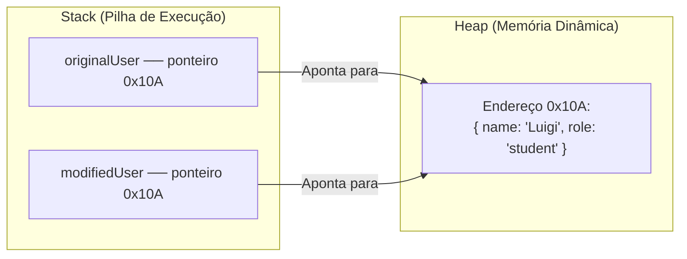

# 4. Tipos por Referência e Objetos em Memória

Nos capítulos anteriores, exploramos os tipos primitivos (`number`, `string`,
`boolean`...) e aprendemos que cada variável armazena um único dado isolado por
vez.

No entanto, no mundo real do desenvolvimento de software, as informações quase
nunca andam sozinhas. Uma aplicação precisa representar entidades completas —
como um estudante com nome, idade e matrícula, ou um produto com título, preço e
estoque.

Neste capítulo, vamos entender o que são **Objetos Literais**, como definir
modelos de dados tipados no TypeScript e como esses dados se comportam na
memória como **Tipos por Referência**.

## 1. O Que São Objetos em JavaScript e TypeScript?

### A Dor: Variáveis Primitivas Desconexas

Imagine que precisamos registrar os dados de três estudantes no nosso sistema.
Se utilizarmos apenas tipos primitivos isolados, o código rapidamente se torna
desorganizado e difícil de manter:

```typescript
// ❌ DADOS DESCONEXOS: Difícil de agrupar e passar para funções
const student1Name: string = "Luigi";
const student1Age: number = 22;
const student1Course: string = "Desenvolvimento Web";

const student2Name: string = "Ana";
const student2Age: number = 20;
const student2Course: string = "Banco de Dados";
```

Se precisássemos criar uma função para matricular um estudante, teríamos que
passar cada uma dessas variáveis separadamente como parâmetros:
`enrollStudent(student1Name, student1Age, student1Course)`. Conforme a entidade
ganha novos campos (endereço, telefone, notas), a manutenção se torna inviável.

### O Conceito de Objeto Literal (`{}`)

Um **Objeto** é uma estrutura de dados que agrupa múltiplos pares de
**chave-valor** (_key-value_) sob um único nome. As chaves são chamadas de
**propriedades** do objeto:

```typescript
// ✅ ESTRUTURA COESA: Todas as informações pertencem à mesma entidade
const studentProfile = {
  name: "Luigi",
  age: 22,
  course: "Desenvolvimento Web",
  isEnrolled: true,
};
```

Agora, o estudante é uma unidade coesa. Para passá-lo para qualquer função,
basta enviar uma única variável: `enrollStudent(studentProfile)`.

### Acessando e Modificando Propriedades

Existem duas formas de acessar e alterar as propriedades de um objeto:

#### 1. Notação de Ponto (`.`)

É a forma mais comum e idiomática no dia a dia:

```typescript
// Leitura de propriedades:
console.log(studentProfile.name); // "Luigi"
console.log(studentProfile.age); // 22

// Modificação de propriedades existentes:
studentProfile.age = 23;

// Criação de novas propriedades dinamicamente (em JavaScript puro):
studentProfile.semester = 4;
```

#### 2. Notação de Colchetes (`[]`)

Útil quando o nome da propriedade precisa ser acessado dinamicamente através de
uma variável:

```typescript
const propertyToRead = "course";

// Acessa dinamicamente a propriedade guardada na variável:
console.log(studentProfile[propertyToRead]); // "Desenvolvimento Web"
```

## 2. Modelagem e Tipagem de Objetos no TypeScript

No JavaScript puro, objetos são totalmente livres: você pode adicionar ou
remover propriedades a qualquer momento, sem nenhuma garantia de consistência.

No TypeScript, podemos definir **contratos de tipo estáticos** para garantir que
um objeto contenha exatamente as propriedades e os tipos que esperamos.

### Tipagem Explícita de Objeto Literal

Podemos declarar a estrutura esperada do objeto diretamente na definição da
variável:

```typescript
// Definindo o modelo (formato) que a variável deve seguir:
const courseInstructor: {
  name: string;
  subject: string;
  workloadHours: number;
  isActive: boolean;
} = {
  name: "Carlos Eduardo",
  subject: "Estruturas de Dados",
  workloadHours: 80,
  isActive: true,
};
```

Se esquecermos alguma propriedade ou atribuirmos um tipo incompatível (como
passar um texto em `workloadHours`), o TypeScript alertará imediatamente o erro
antes da execução.

### Propriedades Opcionais (`?`)

Nem todas as propriedades de uma entidade precisam existir obrigatoriamente em
todos os momentos. Por exemplo, o telefone de contato ou o link do avatar de um
usuário podem ser opcionais:

```typescript
const registeredUser: {
  id: number;
  email: string;
  phoneNumber?: string; // Propriedade opcional (string | undefined)
} = {
  id: 1,
  email: "usuario@fatec.sp.gov.br",
  // 'phoneNumber' pode ser omitido sem nenhum erro de compilação!
};
```

O símbolo `?` indica que a propriedade pode conter uma `string` ou ser
`undefined`.

### Propriedades Somente Leitura com `readonly`

Em muitas regras de negócio, certos campos nunca devem ser alterados após a
criação do objeto (como o ID de um registro no banco de dados ou o CPF do
cliente).

Para proteger uma propriedade contra alterações acidentais, usamos a
palavra-chave **`readonly`**:

```typescript
const systemAccount: {
  readonly accountId: number; // Campo imutável
  holderName: string;
  balance: number;
} = {
  accountId: 98765,
  holderName: "Mariana Souza",
  balance: 1500.0,
};

systemAccount.balance += 200.0; // ✅ Permitido: 'balance' é mutável

// systemAccount.accountId = 11111;
// ❌ Erro: Cannot assign to 'accountId' because it is a read-only property.
```

## 3. Tipos por Referência: A Mecânica de Memória

Agora que entendemos como criar e tipar objetos, precisamos analisar um aspecto
crucial: **como os objetos são armazenados na memória do computador**.

Ao contrário dos primitivos (que são copiados por valor), os objetos são **Tipos
por Referência**.

### A Dor: A Pegadinha da Mutação Silenciosa

Observe o código abaixo e tente prever o que acontecerá:

```typescript
// ❌ PROBLEMA COMUM: Tentativa ingênua de copiar um objeto
const originalUser = {
  name: "Luigi",
  role: "admin",
};

// O desenvolvedor tenta criar um novo usuário baseado no primeiro:
const modifiedUser = originalUser;
modifiedUser.role = "student";

console.log(modifiedUser.role); // "student"
console.log(originalUser.role); // "student" (OPS! originalUser também foi alterado!)
```

Ao alterar a propriedade `role` de `modifiedUser`, o objeto `originalUser`
também foi modificado.

Por que isso aconteceu? A resposta está na divisão entre a **Stack** e a
**Heap**.

### Como a Memória Funciona: Stack vs. Heap

O motor do JavaScript (como o V8) organiza a memória em duas regiões principais:



- **Stack (Pilha):** Memória rápida e de tamanho fixo. Armazena variáveis
  primitivas (`number`, `string`, `boolean`) e **endereços de memória
  (ponteiros)**;
- **Heap (Memória Dinâmica):** Memória ampla e flexível. Armazena o conteúdo
  real de estruturas complexas como **Objetos**, **Arrays** e **Funções**.

Quando criamos `originalUser`, o objeto é alocado na **Heap** (no endereço
`0x10A`), e a variável na **Stack** guarda apenas esse endereço.

Ao fazer `const modifiedUser = originalUser;`, **nenhum objeto novo foi
criado**. Apenas copiamos o endereço de memória. Ambas as variáveis na Stack
passaram a apontar para o mesmíssimo objeto na Heap!

### Cópia por Valor vs. Cópia por Referência

```typescript
// 1. Primitivos: Cópia por Valor (independente)
let scoreA: number = 10;
let scoreB: number = scoreA; // scoreB recebe uma cópia do valor (10)

scoreB = 7;
console.log(scoreA); // 10 (intocado!)
console.log(scoreB); // 7

// 2. Objetos: Cópia por Referência (compartilhado)
const settingsA = { theme: "dark" };
const settingsB = settingsA; // settingsB recebe o endereço de memória de settingsA

settingsB.theme = "light";
console.log(settingsA.theme); // "light" (ambas apontam para o mesmo objeto no Heap)
```

### O `const` Impede a Modificação de Propriedades?

Um mito muito comum é achar que declarar um objeto com `const` impede que suas
propriedades sejam alteradas.

A palavra-chave `const` protege apenas a **variável na Stack** (impedindo que
ela seja reatribuída para apontar para outro endereço), mas **não congela as
propriedades do objeto na Heap**:

```typescript
const currentConfig = {
  theme: "dark",
  fontSize: 14,
};

// ❌ PROIBIDO: Reatribuir a variável na Stack
// currentConfig = { theme: "light", fontSize: 16 };
// TypeError: Assignment to constant variable.

// ✅ PERMITIDO: Alterar propriedades internas no Heap
currentConfig.fontSize = 16;
console.log(currentConfig.fontSize); // 16
```

## Resumo Comparativo: Primitivos vs. Objetos

| Característica             | Tipos Primitivos               | Tipos por Referência (Objetos)         |
| :------------------------- | :----------------------------- | :------------------------------------- |
| **Exemplos**               | `number`, `string`, `boolean`  | `{}` (Objetos), `[]` (Arrays), Funções |
| **Onde são guardados?**    | Stack (Pilha)                  | Heap (conteúdo) + Stack (ponteiro)     |
| **Comportamento na cópia** | Cópia por Valor (independente) | Cópia por Referência (mesmo endereço)  |
| **Imutabilidade de dados** | 100% Imutáveis por padrão      | Mutáveis por padrão                    |
| **Comparação (`===`)**     | Compara o **valor** real       | Compara o **endereço de memória**      |

> **Regra de Ouro:**
>
> `const` impede a reatribuição da variável na Stack, mas não impede a alteração
> de suas propriedades no Heap. Para criar objetos protegidos contra mutações
> acidentais, utilize `readonly` em suas propriedades ou realize cópias
> explícitas ao manipulá-los.

<details>
<summary>🔍 Aprofundamento: Cópia Rasa (Shallow Copy) vs Cópia Profunda (Deep Copy)</summary>

Como podemos clonar um objeto de forma que alterações no clone não afetem o
original?

### 1. Cópia Rasa com o Operador Spread (`...`)

O operador spread (`...`) cria um novo objeto na Heap e copia as propriedades do
primeiro nível:

```typescript
const originalProfile = {
  username: "luigi_fatec",
  role: "instructor",
};

// Cria um NOVO objeto no Heap com uma cópia das propriedades:
const clonedProfile = { ...originalProfile };
clonedProfile.role = "student";

console.log(originalProfile.role); // "instructor" (o original foi preservado!)
console.log(clonedProfile.role); // "student"
```

### O Limite do Spread em Objetos Aninhados

O operador `...` realiza apenas uma **cópia rasa** (_Shallow Copy_). Se o objeto
possuir objetos internos aninhados, as referências internas continuam
compartilhadas:

```typescript
const userWithAddress = {
  name: "Luigi",
  location: {
    city: "São Paulo",
    state: "SP",
  },
};

const shallowClone = { ...userWithAddress };

// Alterar o endereço afeta AMBOS os objetos:
shallowClone.location.city = "Campinas";
console.log(userWithAddress.location.city); // "Campinas" (Compartilhado!)
```

### 2. A Solução Nativa Moderna: `structuredClone()`

Para criar uma cópia profunda (_Deep Copy_) que clona todos os níveis aninhados
de forma verdadeiramente independente, o JavaScript moderno disponibiliza a
função nativa **`structuredClone()`**:

```typescript
const deepClone = structuredClone(userWithAddress);

deepClone.location.city = "Santos";
console.log(userWithAddress.location.city); // "Campinas" (O original permaneceu intocado!)
console.log(deepClone.location.city); // "Santos"
```

A função `structuredClone()` é suportada nativamente em todas as versões
recentes do Node.js e dos navegadores.

</details>

## O Que Vem a Seguir?

Agora que dominamos a estrutura de objetos e o comportamento de tipos por
referência na memória, estamos prontos para aprofundar nas regras de
gerenciamento de variáveis.

No próximo capítulo, vamos entender como declarar e organizar variáveis com
`const` e `let`, o perigo histórico do `var` e como o TypeScript realiza a
**Inferência Estática de Tipos** de forma inteligente sem que precisemos digitar
anotações de tipo em todas as linhas.

---

<a href="03-string.md">← Manipulação de Strings e Template Literals</a>

<p align="right"><a href="05-variaveis-e-constantes.md">Próximo: Declaração de Variáveis, Constantes e Inferência de Tipos →</a></p>
