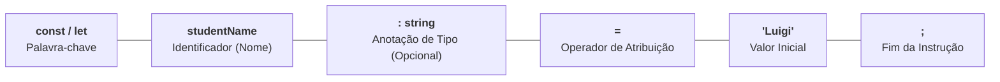

# 4. Variáveis e Constantes

Nos capítulos anteriores, exploramos os tipos primitivos fundamentais da
linguagem (`number`, `string`, `boolean`...) e vimos como eles representam dados
em memória.

Mas como armazenamos e manipulamos esses dados no código? Como funciona a
mecânica de declaração, por que o mercado abandonou o `var` e como o TypeScript
infere tipos automaticamente sem que precisemos digitar anotações em todas as
linhas?

Neste capítulo, vamos desvendar:

1. A anatomia da declaração e as **três operações fundamentais** (declaração,
   inicialização e atribuição);
2. A distinção entre **`const`** e **`let`** e por que o **`var`** foi
   aposentado;
3. O poder da **Inferência Estática de Tipos** do TypeScript.

## O Que É uma Variável e a Anatomia da Declaração

Uma **variável** é um espaço nomeado na memória do computador destinado a
guardar um valor que o seu programa precisa consultar ou transformar ao longo da
execução.

No TypeScript, a anatomia padrão para criar uma constante ou variável é composta
por 5 elementos fundamentais:



```typescript
// Exemplo em código TypeScript:
const studentName: string = "Luigi";
let currentScore: number = 9.5;
```

## As Três Operações Fundamentais

Trabalhar com variáveis envolve três etapas distintas no ciclo de vida do dado:

### 1. Declaração

É o ato de **apresentar o nome da variável ao compilador**, reservando o seu
identificador dentro do escopo:

```typescript
// Declaração pura (sem valor inicial):
let pendingTasksCount: number;
```

### 2. Inicialização

É o momento em que a variável **recebe um valor pela primeira vez**.

A inicialização pode ocorrer de forma separada ou combinada com a declaração:

```typescript
// Inicialização posterior:
pendingTasksCount = 5;

// Declaração + Inicialização simultâneas (o padrão mais comum):
let activeUsersCount: number = 10;
```

### 3. Atribuição / Reatribuição

É o ato de **substituir o valor existente** da variável por um novo valor:

```typescript
// Reatribuindo um novo valor a uma variável existente:
activeUsersCount = 11;
activeUsersCount = activeUsersCount + 1; // Agora vale 12
```

## `const` vs. `let`: Imutabilidade na Vinculação

A diferença entre `const` e `let` baseia-se diretamente nas três operações que
acabamos de aprender:

### `let` (Permite Reatribuição)

- Pode ser declarada sem inicialização imediata;
- **Permite que seu valor seja reatribuído** quantas vezes forem necessárias ao
  longo do algoritmo:

```typescript
let downloadProgress = 0; // Inicialização
downloadProgress = 50; // ✅ Reatribuição permitida
downloadProgress = 100; // ✅ Reatribuição permitida
```

### `const` (Vinculação de Atribuição Única)

- **Exige inicialização obrigatória** no exato momento da declaração;
- **Proíbe qualquer reatribuição** posterior. Uma vez inicializada, o
  identificador não pode ser apontado para outro valor:

```typescript
const applicationPort = 3000; // ✅ Declaração e inicialização obrigatórias

// applicationPort = 8080;
// ❌ Erro: Cannot assign to 'applicationPort' because it is a constant.

// const databaseHost: string;
// ❌ Erro: 'const' declarations must be initialized.
```

> **Desmistificando o `const`:**
>
> Usar `const` não significa que o valor é "fixo para sempre em todo o sistema"
> como uma constante matemática global ($\pi = 3.14159$). Significa apenas que,
> **naquele bloco de execução**, a variável não pode receber uma nova atribuição
> após ser inicializada.
>
> Em funções, por exemplo, a mesma variável declarada com `const` recebe valores
> diferentes a cada chamada:
>
> ```typescript
> function createGreeting(userName: string): string {
>   // 'greeting' é constante durante esta execução, mas varia a cada chamada:
>   const greeting = `Olá, ${userName}!`;
>   return greeting;
> }
>
> console.log(createGreeting("Luigi")); // "Olá, Luigi!"
> console.log(createGreeting("Ana")); // "Olá, Ana!"
> ```

### A Regra de Ouro do Mercado: `const` por Padrão

As melhores práticas mundiais de engenharia de software e código limpo seguem
uma diretriz simples:

1. **`const` (Padrão para 95% dos casos):** Declare tudo como `const`. Isso
   garante que as variáveis não mudem de valor de surpresa, tornando seu código
   previsível e imutável;
2. **`let` (Apenas quando a mutabilidade for necessária):** Use `let` apenas
   quando a variável realmente precisar sofrer reatribuições (contadores de
   laços, acumuladores, flags de estado);
3. **`var` (Nunca):** O `var` é uma relíquia histórica obsoleta.

## O Fim do `var`: Os Problemas Históricos

No JavaScript clássico (de 1995 a 2015), existia apenas a palavra-chave
**`var`**. Ela foi abandonada pelo mercado moderno devido a problemas graves:

### 1. Vazamento para Fora de Blocos

O `var` ignora blocos delimitados por chaves `{ ... }` como `if`, `for` ou
`while`, vazando a variável para o escopo externo:

```javascript
// ❌ JAVASCRIPT LEGADO: O var vaza para fora do bloco if
if (true) {
  var userRole = "admin";
}

console.log(userRole); // Imprime "admin"! A variável vazou para o escopo externo.
```

Com `let` e `const`, o escopo é restrito ao bloco onde foram criadas:

```typescript
// ✅ TYPESCRIPT MODERNO: let e const respeitam o bloco
if (true) {
  const secureRole = "admin";
}

// console.log(secureRole);
// ❌ Erro: Cannot find name 'secureRole'.
```

### 2. Redeclaração Silenciosa

O `var` permite redeclarar a mesma variável repetidas vezes no mesmo arquivo sem
acusar erro, facilitando a sobrescrita acidental de dados:

```javascript
// ❌ JAVASCRIPT LEGADO: Sobrescrita acidental sem aviso
var maxScore = 100;
var maxScore = 50; // Sobrescreveu a variável anterior silenciosamente!
```

Com `const` e `let`, o compilador bloqueia redeclarações:

```typescript
// ✅ TYPESCRIPT MODERNO: Proteção contra redeclaração
const maxScore = 100;

// const maxScore = 50;
// ❌ Erro: Cannot redeclare block-scoped variable 'maxScore'.
```

### 3. _Hoisting_ com `undefined` vs. Zona Morta Temporal (TDZ)

Ao executar um arquivo, o motor do JavaScript realiza uma fase prévia de
varredura da memória:

- Com **`var`**, a variável é içada (_hoisted_) e inicializada prematuramente
  com o valor `undefined`, permitindo que ela seja lida antes da linha onde foi
  declarada (mascarando bugs graves);
- Com **`let` e `const`**, a variável entra na **Zona Morta Temporal**
  (_Temporal Dead Zone_ - TDZ). Tentar lê-la antes de sua declaração lança um
  erro imediato:

```typescript
// console.log(productPrice);
// ❌ ReferenceError: Cannot access 'productPrice' before initialization

const productPrice = 250;
console.log(productPrice); // ✅ 250
```

As mecânicas detalhadas de como o motor de execução do JavaScript realiza o
içamento (_hoisting_) e gerencia a TDZ na fase de criação de escopo serão
aprofundadas no [Capítulo 11: Escopo e Closures](11-escopo-e-closures.md).

## Inferência Estática de Tipos: Deixe o TypeScript Trabalhar

Uma das maiores qualidades do TypeScript é que ele possui um poderoso motor de
**Inferência de Tipos**.

Isso significa que, se você atribuir um valor inicial a uma variável no momento
da declaração, o TypeScript **deduz o tipo automaticamente**. Você não precisa
digitar o tipo manualmente!

### Código Verboso vs. Código Idiomático

Observe o contraste:

```typescript
// 🟡 VÁLIDO, MAS EXCESSIVAMENTE VERBOSO (Redundante):
const studentName: string = "Luigi";
const studentAge: number = 22;
const isEnrolled: boolean = true;
const allowedRoles: string[] = ["admin", "student"];
```

```typescript
// ✅ CÓDIGO IDIOMÁTICO E LIMPO (Inferência de Tipos):
const studentName = "Luigi"; // TS infere: string
const studentAge = 22; // TS infere: number
const isEnrolled = true; // TS infere: boolean
const allowedRoles = ["admin", "student"]; // TS infere: string[]
```

Em ambos os casos, a proteção de tipo é **exatamente a mesma**! Se você tentar
atribuir um número a `studentName` mais tarde, o TypeScript bloqueará com o
mesmo rigor.

### A Diferença de Inferência entre `let` e `const`

O TypeScript analisa como a variável foi declarada para inferir o tipo mais
preciso possível:

```typescript
// Com 'let': O valor pode mudar no futuro, então o TS infere o tipo genérico
let serverStatus = "online";
// Tipo inferido: string (pode virar "offline", "manutenção", etc.)

// Com 'const': O valor NUNCA mudará, então o TS infere um Tipo Literal exato
const fixedRole = "admin";
// Tipo inferido: "admin" (e não apenas string!)
```

Essa inferência de tipos literais com `const` é a base de recursos avançados que
estudaremos mais adiante, como _Union Types_ e _Discriminated Unions_.

### Quando a Tipagem Explícita É Obrigatória?

Apesar do poder da inferência, existem três cenários essenciais onde você
**deve** definir o tipo explicitamente:

#### 1. Declaração Tardia (Variável inicializada sem valor)

Se você declarar uma variável sem atribuir um valor inicial, o TypeScript não
terá como adivinhar o tipo e atribuirá implicitamente o tipo inseguro `any`:

```typescript
// ❌ PROBLEMÁTICO: O TypeScript infere 'any'
let searchResult;
searchResult = "Encontrado";
searchResult = 123; // Sem proteção de tipo!
```

```typescript
// ✅ CORRETO: Anotação explícita ao declarar sem inicializar
let searchResult: string;
searchResult = "Encontrado";
// searchResult = 123; // ❌ Erro: Type 'number' is not assignable to type 'string'.
```

#### 2. União de Múltiplos Tipos Aceitáveis

Quando uma variável precisa aceitar mais de um tipo de dado (por exemplo, um
dado que começa como `null` ou `undefined` antes de ser preenchido):

```typescript
// ✅ OBRIGATÓRIO: Anotação de Union Type
let selectedStudentId: number | null = null;

selectedStudentId = 105; // ✅ Válido
```

#### 3. Parâmetros e Retorno de Funções

Parâmetros de funções não possuem valores iniciais previsíveis no momento em que
o código é escrito. Por isso, **parâmetros de função sempre devem ser anotados
explicitamente**:

```typescript
// ✅ Parâmetros sempre com tipagem explícita:
function calculateDiscount(basePrice: number, discountRate: number): number {
  return basePrice * (1 - discountRate);
}
```

## Resumo Comparativo: `const` vs. `let` vs. `var`

| Característica          | `const`          | `let`              | `var` (Obsoleto)  |
| :---------------------- | :--------------- | :----------------- | :---------------- |
| **Escopo**              | Bloco `{ ... }`  | Bloco `{ ... }`    | Função            |
| **Pode Reatribuir?**    | ❌ Não           | ✅ Sim             | ✅ Sim            |
| **Pode Redeclarar?**    | ❌ Não           | ❌ Não             | ✅ Sim (Perigoso) |
| **Içamento (Hoisting)** | TDZ (Erro)       | TDZ (Erro)         | `undefined`       |
| **Uso Recomendado**     | **Padrão (95%)** | **Quando mutável** | **Nunca usar**    |

> **Regra de Ouro:**
>
> Adote **`const` como sua declaração padrão**. Altere para `let` apenas se
> houver uma necessidade explícita de reatribuição ao longo do algoritmo. Nunca
> utilize `var`. Confie na inferência de tipos do TypeScript para manter seu
> código limpo e adicione anotações manuais apenas em uniões ou declarações
> tardias.

## O Que Vem a Seguir?

Agora que dominamos como declarar variáveis, garantir imutabilidade com `const`
e aproveitar a inferência de tipos em dados primitivos, surge a pergunta:

> _"Como agrupamos múltiplos dados relacionados em uma única entidade e como o
> JavaScript e o TypeScript gerenciam essas estruturas na memória?"_

No próximo capítulo, vamos analisar o que são **Objetos Literais** e como a
divisão entre **Stack** e **Heap** dá origem aos chamados **Tipos por
Referência**.

---

<a href="03-string.md">← String</a>

<p align="right"><a href="05-objetos.md">Próximo: Objetos →</a></p>
