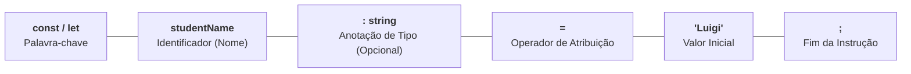

# 4. Variáveis

Nos capítulos anteriores, exploramos os tipos primitivos fundamentais da
linguagem (`number`, `string`, `boolean`...) e vimos como eles representam dados
em memória.

Mas como armazenamos e manipulamos esses dados no código? Como funciona a
declaração moderna e como o TypeScript infere tipos automaticamente sem que
precisemos digitar anotações em todas as linhas?

Neste capítulo, vamos desvendar:

1. A anatomia da declaração de variáveis;
2. A distinção prática entre **`const`** e **`let`**;
3. O poder da **Inferência Estática de Tipos** do TypeScript.

## O Que É uma Variável e a Anatomia da Declaração

Uma **variável** é um espaço nomeado na memória destinado a guardar um valor que
seu programa precisa consultar ou transformar ao longo da execução.

No TypeScript, a estrutura padrão para declarar uma variável é composta por 5
elementos fundamentais:



```typescript
const studentName: string = "Luigi";
let currentScore: number = 9.5;
```

## `const` vs. `let`: Mutabilidade e Reatribuição

No TypeScript e JavaScript moderno, você tem duas opções para declarar
variáveis: **`const`** e **`let`**. A diferença entre elas é direta:

### `let` (Permite Reatribuição)

Utilize `let` quando o valor da variável precisar mudar ao longo do tempo:

```typescript
let downloadProgress = 0; // Declaração com valor inicial
downloadProgress = 50; // ✅ Reatribuição permitida
downloadProgress = 100; // ✅ Reatribuição permitida
```

Uma variável com `let` também pode ser declarada sem valor inicial:

```typescript
let pendingTasksCount: number; // Apenas declarada
pendingTasksCount = 5; // Inicializada posteriormente
```

### `const` (Impede Reatribuição)

Utilize `const` para variáveis que **não devem sofrer reatribuição**:

- **Exige inicialização obrigatória** no momento da declaração;
- **Proíbe qualquer nova atribuição** com o operador `=`:

```typescript
const applicationPort = 3000; // ✅ Inicialização obrigatória

// applicationPort = 8080;
// ❌ Erro: Cannot assign to 'applicationPort' because it is a constant.

// const databaseHost: string;
// ❌ Erro: 'const' declarations must be initialized.
```

### O Que o `const` Realmente Faz?

Um equívoco comum é imaginar que `const` cria uma "constante matemática global
fixa para sempre".

Na prática, o `const` **apenas impede a operação de reatribuição** para aquela
variável no bloco em que foi criada.

Isso traz um benefício enorme de **previsibilidade**: ao ler um código com
`const`, você tem a certeza absoluta de que o valor daquela variável não foi
sobrescrito por acidente no meio do algoritmo.

### A Regra de Ouro do Mercado: `const` por Padrão

As melhores práticas de desenvolvimento seguem uma regra simples:

1. **`const` (Padrão para quase tudo):** Declare tudo como `const`. Seu código
   fica mais seguro e previsível;
2. **`let` (Apenas quando a mutabilidade for mandatória):** Use `let` apenas
   para contadores, acumuladores ou valores que realmente precisam mudar;
3. **`var` (Obsoleto):** O `var` é a forma legada do JavaScript antigo. Ele foi
   aposentado porque vaza de blocos (`if`, `for`) e permite leitura antes da
   declaração, causando bugs silenciosos. Em projetos modernos, **nunca usamos
   `var`**.

## Inferência Estática de Tipos: Deixe o TypeScript Trabalhar

Uma das maiores qualidades do TypeScript é o seu poderoso motor de **Inferência
de Tipos**.

Quando você atribui um valor inicial a uma variável na declaração, o TypeScript
**deduz o tipo automaticamente**. Você não precisa digitar anotações de tipo
manualmente em todas as linhas.

### Código Verboso vs. Código Idiomático

Observe a diferença:

```typescript
// 🟡 VÁLIDO, MAS EXCESSIVAMENTE VERBOSO (Redundante):
const studentName: string = "Luigi";
const studentAge: number = 22;
const isEnrolled: boolean = true;
```

```typescript
// ✅ CÓDIGO IDIOMÁTICO E LIMPO (Inferência de Tipos):
const studentName = "Luigi"; // TS infere: string
const studentAge = 22; // TS infere: number
const isEnrolled = true; // TS infere: boolean
```

Em ambos os casos, a proteção de tipos é **exatamente a mesma**! Se você tentar
atribuir um número a `studentName` mais tarde, o TypeScript acusará o erro com o
mesmo rigor.

### A Diferença de Inferência entre `let` e `const`

O TypeScript analisa como a variável foi declarada para inferir o tipo mais
adequado:

```typescript
// Com 'let': O valor pode mudar no futuro, então o TS infere o tipo amplo:
let serverStatus = "online";
// Tipo inferido: string (pode virar "offline", "manutenção", etc.)

// Com 'const': O valor NUNCA mudará, então o TS infere um Tipo Literal exato:
const fixedRole = "admin";
// Tipo inferido: "admin" (e não apenas string!)
```

Essa inferência de tipos literais com `const` é um recurso poderoso que
estudaremos mais adiante ao trabalhar com uniões de tipos (_Union Types_).

### Quando a Tipagem Explícita É Obrigatória?

Apesar do poder da inferência, há dois cenários fundamentais em que você
**precisa** anotar o tipo explicitamente:

#### 1. Declaração Tardia (Sem valor inicial)

Se você declarar uma variável com `let` sem atribuir um valor inicial, o
TypeScript não tem como deduzir o tipo e atribuirá implicitamente o tipo
inseguro `any`:

```typescript
// ❌ PROBLEMÁTICO: O TypeScript infere 'any'
let searchResult;
searchResult = "Encontrado";
searchResult = 123; // Sem proteção de tipo!
```

```typescript
// ✅ CORRETO: Anotação explícita ao declarar sem inicializar
let searchResult: string;
searchResult = "Encontrado";
// searchResult = 123; // ❌ Erro: Type 'number' is not assignable to type 'string'.
```

#### 2. União de Tipos Aceitáveis

Quando uma variável pode legitimamente alternar entre diferentes tipos de dados
(por exemplo, um dado que começa como `null` antes de ser preenchido):

```typescript
// ✅ OBRIGATÓRIO: Anotação de Union Type
let selectedStudentId: number | null = null;

selectedStudentId = 105; // ✅ Válido
```

## Resumo Comparativo

| Palavra-chave | Permite Reatribuição? | Exige Inicialização Imediata? | Recomendação de Uso            |
| :------------ | :-------------------- | :---------------------------- | :----------------------------- |
| **`const`**   | ❌ Não                | ✅ Sim                        | **Padrão para 95% do código**  |
| **`let`**     | ✅ Sim                | ❌ Não                        | **Apenas quando o valor muda** |
| **`var`**     | ✅ Sim                | ❌ Não                        | ❌ **Nunca usar (obsoleto)**   |

> **Regra de Ouro:**
>
> Comece sempre declarando suas variáveis com **`const`**. Só mude para `let` se
> houver uma necessidade real de reatribuir o valor ao longo do algoritmo.
> Confie na **inferência de tipos** do TypeScript para manter o código limpo, e
> adicione anotações manuais apenas em uniões (`| null`) ou declarações sem
> valor inicial.

## O Que Vem a Seguir?

Agora que dominamos como declarar variáveis, garantir previsibilidade com
`const` e aproveitar a inferência de tipos em dados primitivos, surge a
pergunta:

> _"Como agrupamos múltiplos dados relacionados em uma única entidade e como o
> TypeScript modela essas estruturas?"_

No próximo capítulo, vamos analisar o que são **Objetos Literais** e como
definir contratos de dados tipados.

---

<a href="03-string-e-template-literals.md">← String e Template Literals</a>

<p align="right"><a href="05-objetos-literais.md">Próximo: Objetos Literais →</a></p>
