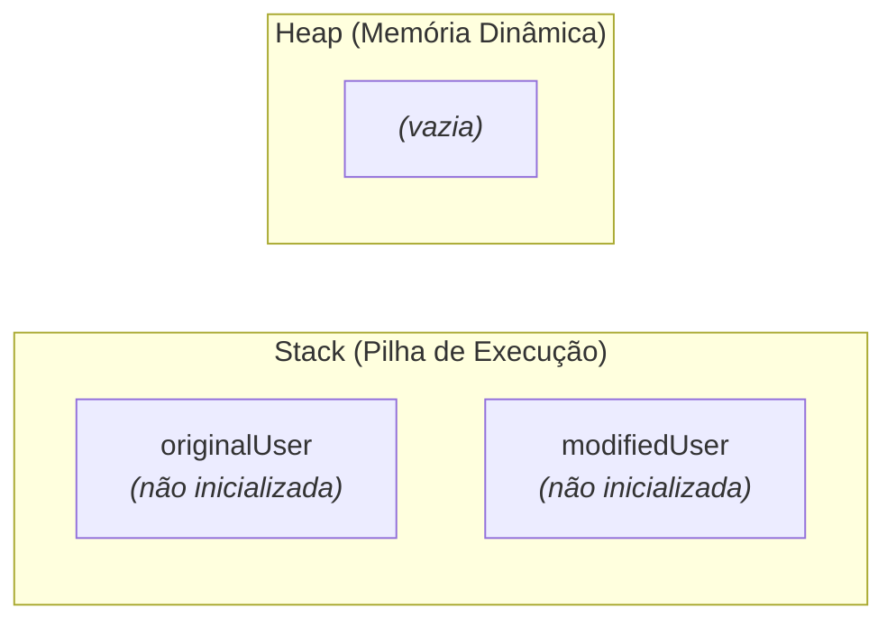
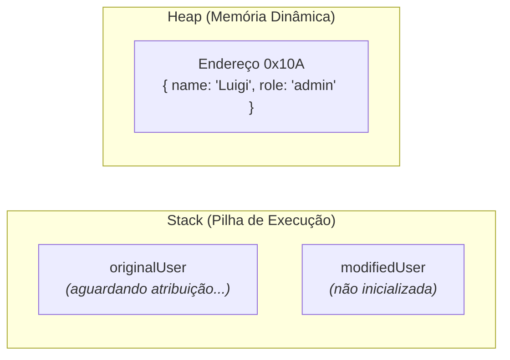
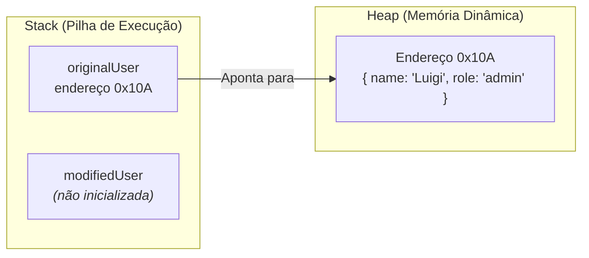
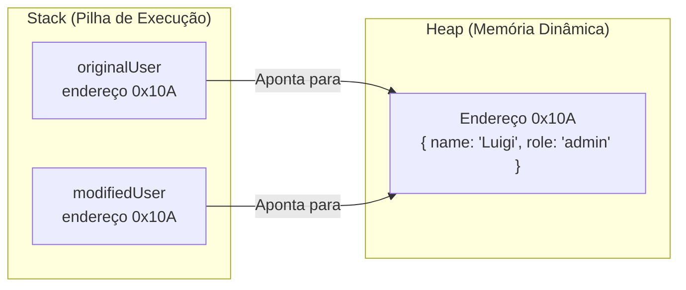
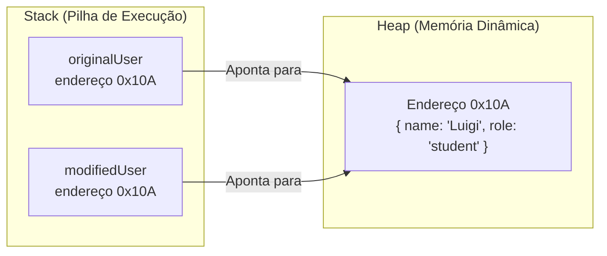

# 6. Tipos por Referência e Memória

No capítulo anterior, aprendemos a agrupar dados em objetos literais e a
estabelecer contratos estáticos para garantir que nossas entidades contenham as
propriedades e tipos corretos.

No entanto, conforme começamos a passar esses objetos entre variáveis e partes
da aplicação, nos deparamos com comportamentos que desafiam a intuição de quem
está acostumado apenas com tipos primitivos.

Neste capítulo, vamos desvendar como o JavaScript e o TypeScript gerenciam a
memória do computador através da divisão entre **Stack** e **Heap**, entendendo
a diferença crucial entre **cópia por valor** e **cópia por referência**, por
que o `const` não congela objetos e como protegê-los com `readonly` e `as
const`.

## O Contraste: Primitivos vs. Objetos

Até o momento, trabalhamos predominantemente com tipos primitivos (`number`,
`string`, `boolean`). Ao fazer testes com primitivos, você deve ter notado um
comportamento bastante previsível e independente:

**1. Primitivos: Cópia por Valor (totalmente independentes):**

```typescript
let scoreA: number = 10;
let scoreB: number = scoreA; // scoreB recebe uma cópia independente do valor 10

scoreB = 20; // Alteramos apenas scoreB

console.log(scoreA); // 10 (permaneceu intocado!)
console.log(scoreB); // 20
```

Cada variável primitiva guarda seu próprio dado de forma isolada. Alterar uma
nunca afeta a outra.

Agora, ao realizar testes similares atribuindo um objeto literal a outra
variável, surge um comportamento curioso:

**2. Objetos: Cópia por Referência (compartilhamento de dados):**

```typescript
const originalUser = {
  name: "Luigi",
  role: "admin",
};

// Tentativa de criar um novo usuário baseado no primeiro:
const modifiedUser = originalUser;
modifiedUser.role = "student";

console.log(modifiedUser.role); // "student"
console.log(originalUser.role); // "student" (OPS! originalUser também foi alterado!)
```

Ao alterar a propriedade `role` em `modifiedUser`, o objeto original
`originalUser` também foi modificado!

Por que isso aconteceu? A resposta está na forma como o motor de execução do
JavaScript organiza a memória em **Stack** e **Heap**.

## Como a Memória Funciona: Stack vs. Heap

O motor de execução organiza a memória do seu programa em duas regiões com
propósitos distintos:

### 1. A Stack (Pilha de Execução)

A **Stack** é uma memória rápida, de tamanho fixo e altamente organizada,
responsável por gerenciar a execução do programa:

- Armazena variáveis locais com dados primitivos isolados (`number`, `boolean`);
- Armazena **endereços de memória (ponteiros)** que indicam onde estruturas
  maiores estão guardadas.

### 2. A Heap (Memória Dinâmica)

A **Heap** é uma área ampla e flexível da memória, destinada a armazenar
estruturas dinâmicas e de tamanho variável:

- É onde residem os **Objetos**, **Arrays** e **Funções**;
- Os valores das propriedades de um objeto (mesmo que sejam primitivos como
  strings e números) são armazenados dentro daquele bloco alocado na Heap.

### Passo a Passo: A Mecânica da Memória em Ação

Para compreender com clareza o que aconteceu no nosso teste anterior, vamos
acompanhar a evolução da memória passo a passo.

#### Estado Inicial

Inicialmente, o espaço para as variáveis é reservado na Stack, mas a Heap ainda
não contém o nosso objeto:



> **Nota:** Vamos aprofundar em detalhes como a Stack aloca e organiza variáveis
> na memória quando estudarmos escopo e ciclo de vida no [Capítulo 13: Escopo,
> Hoisting e Closures](13-escopo-hoisting-e-closures.md).

#### Passo 1: Criação do Objeto na Heap

A instrução `const originalUser = { name: "Luigi", role: "admin" };` ocorre em
dois momentos. Primeiro, a expressão literal `{ ... }` avalia e aloca o objeto
na Heap em um endereço livre (por exemplo, `0x10A`):



#### Passo 2: Atribuição do Endereço à Variável na Stack

Em seguida, a variável `originalUser` recebe o endereço de memória `0x10A` na
Stack, passando a apontar diretamente para o objeto na Heap:



#### Passo 3: Atribuição `const modifiedUser = originalUser;` (Cópia da Referência)

Quando executamos `const modifiedUser = originalUser;`, o JavaScript copia o
conteúdo de `originalUser` na Stack — ou seja, **o endereço de memória `0x10A`**
— para a nova variável `modifiedUser`.

Note que o comportamento da Stack continua sendo o mesmo de primitivos (uma
cópia de valor), mas o valor copiado é um **endereço de memória**. **Nenhum
objeto novo é criado na Heap:**



#### Passo 4: Mutação em `modifiedUser.role = "student"`

Ao alterar a propriedade através de `modifiedUser`, o motor de execução segue o
ponteiro `0x10A` da Stack até a Heap e altera o valor da propriedade diretamente
no objeto:



#### Passo 5: Leitura Compartilhada

Ao inspecionar `originalUser.role` ou `modifiedUser.role`, o runtime segue o
endereço `0x10A` e lê o mesmo objeto na Heap. Como o objeto foi alterado na
fonte compartilhada, ambas as variáveis refletem a mesma mudança:

```typescript
console.log(modifiedUser.role); // "student"
console.log(originalUser.role); // "student" (aponta para o mesmo endereço 0x10A!)
```

## Por Que o `const` Não Impede a Alteração de Propriedades?

No capítulo sobre variáveis, aprendemos que `const` impede qualquer operação de
reatribuição com o operador `=`.

Um mito muito comum entre iniciantes é acreditar que declarar um objeto com
`const` torna todas as suas propriedades imutáveis.

Como vimos no modelo de memória, o `const` protege apenas a **variável na
Stack** (impedindo que ela aponte para outro endereço de memória), mas **não
congela as propriedades do objeto na Heap**:

```typescript
const appSettings = {
  theme: "dark",
  fontSize: 14,
};

// ❌ PROIBIDO: Reatribuir a variável na Stack para apontar para outro objeto
// appSettings = { theme: "light", fontSize: 16 };
// TypeError: Assignment to constant variable.

// ✅ PERMITIDO: Modificar as propriedades internas do objeto na Heap
appSettings.fontSize = 16;
console.log(appSettings.fontSize); // 16
```

## Protegendo Objetos Contra Mutações

Se quisermos impedir que as propriedades de um objeto sejam alteradas, o
TypeScript oferece duas abordagens fundamentais:

### 1. Modificador `readonly` em Propriedades Específicas

Como vimos no capítulo anterior, podemos marcar campos individuais como
imutáveis diretamente no contrato:

```typescript
const systemConfig: {
  readonly environment: string;
  maxConnections: number;
} = {
  environment: "production",
  maxConnections: 100,
};

systemConfig.maxConnections = 150; // ✅ Permitido: 'maxConnections' é mutável

// systemConfig.environment = "staging";
// ❌ Erro: Cannot assign to 'environment' because it is a read-only property.
```

### 2. Congelamento Total com `as const` (Const Assertions)

Quando queremos que **todas as propriedades** de um objeto se tornem
automaticamente `readonly` e tenham seus tipos inferidos como valores literais
exatos, adicionamos o sufixo **`as const`** ao final do objeto:

```typescript
// ✅ Todas as propriedades tornam-se readonly automaticamente:
const routes = {
  home: "/dashboard",
  login: "/auth/login",
  profile: "/users/profile",
} as const;

// routes.home = "/initial";
// ❌ Erro: Cannot assign to 'home' because it is a read-only property.
```

Essa asserção é amplamente utilizada no ecossistema moderno de frontend e
backend para definir dicionários de rotas, configurações fixas e tabelas de
status sem duplicar código de anotação manual.

## Resumo Comparativo

| Característica                   | Tipos Primitivos Isolados        | Tipos por Referência (Objetos)                                 |
| :------------------------------- | :------------------------------- | :------------------------------------------------------------- |
| **Onde os dados vivem?**         | Stack                            | Heap (dados e propriedades) + Stack (ponteiro)                 |
| **Comportamento na cópia (`=`)** | Cópia do valor (independente)    | Cópia do endereço de memória (compartilhado)                   |
| **Efeito do `const`**            | Valor totalmente protegido       | Impede reatribuir a variável, mas permite alterar propriedades |
| **Proteção de propriedades**     | Não se aplica (já são imutáveis) | Modificador `readonly` ou asserção `as const`                  |

> **Regra de Ouro:**
>
> Ao atribuir um objeto a uma nova variável com `=`, você não está criando uma
> cópia independente dos dados, mas apenas compartilhando a mesma referência na
> memória. Para proteger propriedades contra mutações acidentais, utilize
> `readonly` ou a asserção `as const`.

<details>
<summary>🔍 Aprofundamento: Como Criar Cópias Independentes de um Objeto?</summary>

Se a atribuição direta com `=` apenas compartilha referências, como podemos
criar uma cópia verdadeiramente independente de um objeto?

### 1. Cópia Manual Propriedade por Propriedade

A forma mais direta é declarar um novo objeto e copiar os valores manualmente:

```typescript
const originalProfile = {
  username: "luigi_fatec",
  role: "instructor",
};

// Cria um novo objeto na Heap copiando os dados:
const manualClone = {
  username: originalProfile.username,
  role: originalProfile.role,
};

manualClone.role = "student";
console.log(originalProfile.role); // "instructor" (o original permaneceu intacto!)
```

### 2. O Atalho Moderno: Operador Spread (`...`)

Copiar manualmente propriedade por propriedade torna-se exaustivo conforme o
objeto cresce. O JavaScript moderno disponibiliza o operador **Spread (`...`)**
para automatizar a cópia das propriedades de primeiro nível:

```typescript
// Cria um novo objeto na Heap e espalha as propriedades do original:
const spreadClone = { ...originalProfile };

spreadClone.role = "student";
console.log(originalProfile.role); // "instructor" (o original permaneceu intacto!)
```

> **Nota:** Estudaremos o operador Spread e todas as suas aplicações em detalhes
> no [Capítulo 18: Operadores Rest e Spread](18-operadores-rest-e-spread.md).

### 3. Cópia Profunda com `structuredClone()`

O operador Spread (`...`) realiza apenas uma **cópia rasa** (_Shallow Copy_). Se
o objeto contiver outros objetos aninhados internamente, as referências mais
profundas continuarão compartilhadas:

```typescript
const originalUser = {
  name: "Luigi",
  address: {
    city: "São Paulo",
    state: "SP",
  },
};

// Cópia rasa com spread:
const shallowClone = { ...originalUser };

// Propriedades primitivas de primeiro nível são independentes:
shallowClone.name = "Carlos";
console.log(originalUser.name); // "Luigi" (intocado!)

// Mas o objeto interno em 'address' ainda compartilha a mesma referência:
shallowClone.address.city = "Campinas";
console.log(originalUser.address.city); // "Campinas" (OPS! O objeto original foi mutado!)
```

Para clonar uma árvore completa de objetos aninhados com independência total
(_Deep Copy_), utilizamos a função nativa moderna **`structuredClone()`**:

```typescript
const userWithAddress = {
  name: "Luigi",
  address: {
    city: "São Paulo",
    state: "SP",
  },
};

// Clona todos os níveis aninhados de forma 100% independente:
const deepClone = structuredClone(userWithAddress);

deepClone.address.city = "Campinas";

console.log(userWithAddress.address.city); // "São Paulo" (intocado!)
console.log(deepClone.address.city); // "Campinas"
```

A função `structuredClone()` é nativa em todas as versões modernas de
navegadores e do Node.js.

</details>

## O Que Vem a Seguir?

Agora que dominamos a anatomia de objetos literais e como eles se comportam na
memória, surge uma pergunta natural de produtividade:

> _"Como damos nomes claros e reutilizáveis aos nossos contratos de tipos sem
> precisar redigitar `{ name: string; age: number; ... }` em todas as variáveis
> e funções do sistema?"_

No próximo capítulo, vamos conhecer os **Type Aliases**, a ferramenta central do
TypeScript para definir tipos reutilizáveis e manter nosso código limpo.

---

<a href="05-objetos-literais.md">← Objetos Literais</a>

<p align="right"><a href="07-type-aliases.md">Próximo: Type Aliases →</a></p>
