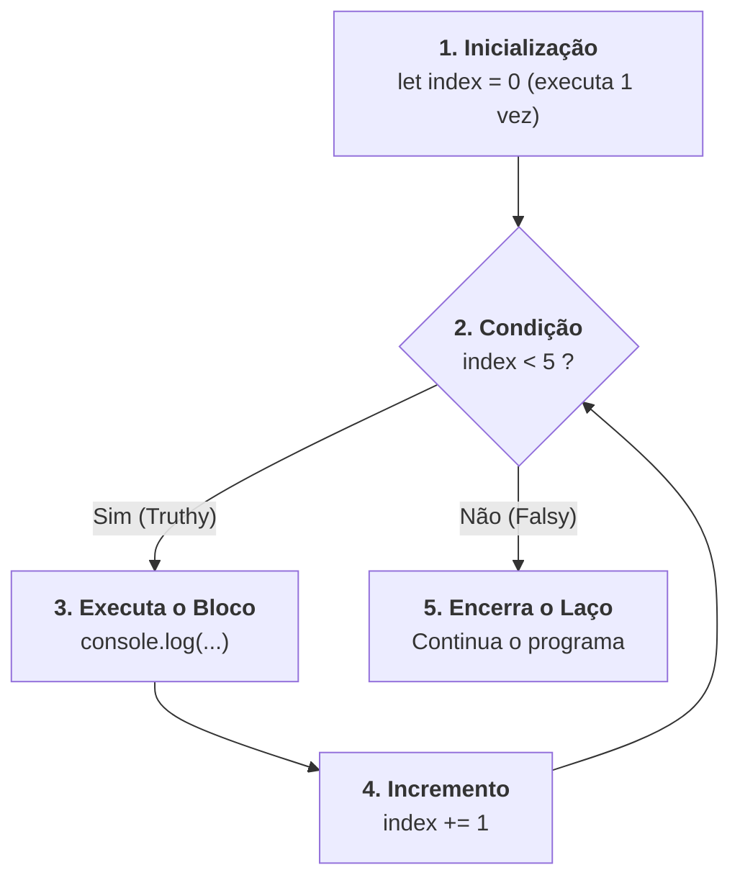

# 8. Estruturas de Repetição e Laços

Nos capítulos anteriores, aprendemos a calcular expressões e tomar decisões
pontuais com estruturas como `if` e `switch`.

Da mesma forma que decidir o que e quando executar é um dos pilares fundamentais
da computação, **executar o mesmo conjunto de instruções várias vezes** com
velocidade e precisão é indispensável: processar listas de clientes, somar itens
de um carrinho de compras ou tentar reconectar a um servidor até obter sucesso.

Neste capítulo, vamos dominar os **Laços de Repetição (Loops)** do TypeScript: o
`for` clássico, `while`, `do-while`, o controle de fluxo com `break` e
`continue`, além de entender por que estruturas como **`for..of`** e
**`for..in`** costumam ser evitadas no desenvolvimento moderno em favor de
métodos funcionais de arrays e objetos.

## O Laço `for` Tradicional

O laço `for` clássico é utilizado quando sabemos previamente quantas vezes a
repetição deve acontecer ou quando precisamos controlar explicitamente um índice
numérico.

Sua sintaxe é dividida em três partes separadas por ponto e vírgula:

```typescript
// for (inicializacao; condicao_de_continuidade; incremento)
for (let index = 0; index < 5; index += 1) {
  console.log(`Iteração número: ${index}`);
}
```



## Laços Baseados em Condição: `while` e `do-while`

Quando o número de repetições não é fixo e depende de uma condição dinâmica
(como aguardar a resposta de uma conexão de rede), usamos `while` ou `do-while`.

### O Laço `while` (Verifica Antes de Executar)

O `while` testa a condição **antes** de executar o bloco. Se a condição for
falsa logo no início, o código interno nunca será executado (0 ou mais vezes):

```typescript
let retryAttempts = 0;
const maxRetries = 3;

while (retryAttempts < maxRetries) {
  console.log(`Tentativa de conexão ${retryAttempts + 1}...`);
  retryAttempts += 1;
}
```

> **Alerta de Loop Infinito:** Se a condição do `while` nunca se tornar falsa, o
> programa travará executando o bloco até ser encerrado de forma forçada.
> Certifique-se sempre de que o estado interno do laço caminha em direção ao
> encerramento da condição.

### O Laço `do-while` (Executa ao Menos uma Vez)

O `do-while` executa o bloco de código **primeiro** e testa a condição apenas no
final. Isso garante que o código execute **ao menos 1 vez**, independentemente
da condição inicial:

```typescript
let userInputValue = 0;

do {
  // Executa pelo menos uma vez antes de avaliar a condição:
  console.log("Processando dados de entrada...");
  userInputValue += 10;
} while (userInputValue < 10);
```

## Controle de Fluxo no Laço: `break` e `continue`

Podemos alterar dinamicamente o fluxo normal de qualquer laço utilizando dois
comandos especiais:

### 1. O Comando `break` (Interrompe o Laço)

O comando `break` encerra imediatamente a execução de todo o laço de repetição,
saltando para a primeira linha após o loop:

```typescript
const searchTarget = 7;

for (let currentNumber = 1; currentNumber <= 10; currentNumber += 1) {
  if (currentNumber === searchTarget) {
    console.log(`Alvo ${searchTarget} encontrado! Parando a busca.`);
    break; // Encerra o for imediatamente
  }

  console.log(`Verificando número: ${currentNumber}...`);
}
```

### 2. O Comando `continue` (Pula a Iteração Atual)

O comando `continue` não encerra o laço. Ele apenas **interrompe a iteração
atual** e salta diretamente para o próximo passo do loop:

```typescript
for (let numberItem = 1; numberItem <= 5; numberItem += 1) {
  // Ignora números pares:
  if (numberItem % 2 === 0) {
    continue; // Pula o console.log e vai direto para numberItem += 1
  }

  console.log(`Número ímpar: ${numberItem}`);
}
// Saída: 1, 3, 5
```

## Iterando Estruturas: `for..of` e `for..in`

O JavaScript introduziu duas estruturas adicionais para iteração: `for..of` e
`for..in`. Embora você vá encontrá-las em códigos legados ou em bibliotecas, **o
uso de ambas é geralmente desencorajado no TypeScript moderno** em favor de
abordagens mais seguras e expressivas.

### 1. `for..of` (Iteração de Valores)

O laço `for..of` percorre os **valores** de estruturas iteráveis (como Arrays e
Strings):

```typescript
const programmingLanguages: string[] = ["TypeScript", "Python", "Go"];

for (const language of programmingLanguages) {
  console.log(`Linguagem: ${language}`);
}
```

### 2. `for..in` (Iteração de Propriedades/Chaves)

O laço `for..in` percorre os **nomes das chaves** de um objeto:

```typescript
const serverConfig = {
  host: "localhost",
  port: 3000,
  isSecure: true,
};

for (const configKey in serverConfig) {
  console.log(`Chave: ${configKey}`);
}
```

### Por Que Evitar `for..of` e `for..in` no Dia a Dia?

1. **Confusão e Ambiguidade:** A semelhança sintática entre `in` e `of` leva a
   erros frequentes. Usar `for..in` em arrays é uma das armadilhas mais comuns
   de JavaScript (itera sobre os índices como texto `"0"`, `"1"` e pode puxar
   propriedades herdadas do protótipo).
2. **Código Menos Idiomático:** No desenvolvimento moderno com TypeScript e
   frameworks como React, você raramente usará laços imperativos para manipular
   listas ou objetos.
3. **Alternativas Mais Expressivas:**
   - Para **Arrays**: veremos métodos funcionais declarativos (`map`, `filter`,
     `forEach`, `reduce`) nos capítulos adiante, que evitam mutações e expressam
     diretamente a intenção do código.
   - Para **Objetos**: métodos utilitários como `Object.keys()`,
     `Object.values()` e `Object.entries()` oferecem controle explícito e seguro
     sobre chaves e valores.

> **💡 Recomendação Prática:**
>
> - Use **`for` tradicional** ou **`while`** quando precisar de controle
>   imperativo estrito de fluxo (como índices manuais, buscas com `break` ou
>   retentativas).
> - Para processamento de coleções e listas, prefira os **métodos de Array**
>   (que estudaremos em detalhes no Bloco 2).
> - **Evite `for..in` e `for..of`**, reduzindo a chance de erros sutis e
>   mantendo o código alinhado aos padrões mais modernos do ecossistema.

## Resumo das Estruturas de Repetição

| Estrutura      | Quando Utilizar?                                                | Exemplo de Sintaxe                     |
| :------------- | :-------------------------------------------------------------- | :------------------------------------- |
| **`for`**      | Número fixo de passos, controle manual de índice                | `for (let i = 0; i < 10; i++) { ... }` |
| **`while`**    | Repetição condicional avaliada **antes** do bloco               | `while (hasMoreItems) { ... }`         |
| **`do-while`** | Repetição condicional avaliada **depois** (ao menos 1 execução) | `do { ... } while (hasErrors);`        |
| **`for..of`**  | _Evite_: prefira métodos de array (`forEach`, `map`, `filter`)  | `for (const item of list) { ... }`     |
| **`for..in`**  | _Evite_: propenso a bugs em arrays; prefira `Object.entries()`  | `for (const key in object) { ... }`    |

## O Que Vem a Seguir?

Parabéns! Com este capítulo, concluímos o **Bloco 1 (Fundamentos, Tipos &
Controle de Fluxo)** do Módulo de TypeScript.

Agora que dominamos tipos primitivos, objetos, operadores, tomada de decisões e
laços de repetição, estamos prontos para avançar para o **Bloco 2: Funções,
Operadores Modernos & Coleções**.

No próximo capítulo, vamos desvendar como criar e tipar **Funções**, a diferença
entre declarações tradicionais e _Arrow Functions_, e como aplicar a técnica de
**Guard Clauses (Early Return)**.

---

<a href="07-condicionais.md">← Estruturas de Decisão e Fluxo de Controle</a>

<p align="right"><a href="09-funcoes.md">Próximo: Funções →</a></p>
