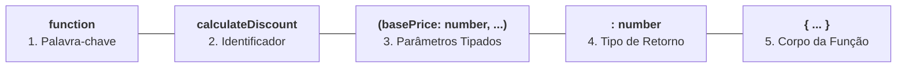

# 9. Funções

Até agora, escrevemos nossos scripts em um fluxo contínuo e linear. No entanto,
conforme uma aplicação cresce, duplicar blocos de código para calcular impostos,
validar dados de formulários ou formatar datas torna o sistema difícil de manter
e propenso a falhas.

As **funções** são os blocos fundamentais de construção de qualquer programa.
Elas nos permitem encapsular uma lógica específica, atribuir-lhe um nome
significativo e reutilizá-la sempre que necessário, recebendo dados de entrada
(**parâmetros**) e devolvendo um resultado (**retorno**).

Neste capítulo, vamos desvendar a anatomia completa de uma função no TypeScript,
as diferentes formas de declaração (_Function Declarations_, _Function
Expressions_ e _Arrow Functions_), a técnica de **Guard Clauses (Early Return)**
e o poder das funções como cidadãs de primeira classe (_First-Class Citizens_).

## Anatomia de uma Função no TypeScript

Assim como vimos na declaração de variáveis, uma função declarada no TypeScript
é composta por elementos estruturais bem definidos:



```typescript
function calculateDiscount(
  basePrice: number,
  discountPercentage: number = 10,
): number {
  const discountAmount = (basePrice * discountPercentage) / 100;
  return basePrice - discountAmount;
}

const finalPrice = calculateDiscount(200, 15);
console.log(`Preço final: R$ ${finalPrice}`); // 170
```

Vamos analisar cada um desses componentes em detalhes.

### 1. O Identificador (Nome da Função)

O **identificador** é o nome atribuído à função, servindo como o rótulo pelo
qual o programa poderá invocá-la.

> **Convenção de Nomenclatura:**
>
> Funções representam **ações**, portanto devem sempre começar com um **verbo**
> seguido opcionalmente de um substantivo no padrão _camelCase_ (ex:
> `calculateDiscount`, `formatGreeting`, `sendAlert`).

### 2. Os Parâmetros (Entrada de Dados)

Os **parâmetros** definem quais informações a função precisa receber para
executar seu trabalho.

Eles são declarados entre parênteses `( ... )` e separados por vírgula. Assim
como uma variável qualquer, cada parâmetro possui um **identificador** (seu nome
no escopo da função) e uma **anotação de tipo** (`: Tipo`) — que no TypeScript
em modo estrito é obrigatória para garantir contratos seguros:

```typescript
function registerStudent(name: string, age: number, semester: number): void {
  console.log(
    `Estudante ${name} (${age} anos) matriculado no ${semester}º sem.`,
  );
}
```

#### Parâmetros com Valor Padrão (_Default Parameters_)

Podemos definir um valor padrão na assinatura. Se o chamador omitir o argumento,
o TypeScript aplicará o valor pré-estabelecido:

```typescript
function calculateTax(amount: number, taxRate: number = 0.05): number {
  return amount * taxRate;
}

console.log(calculateTax(100)); // 5 (taxa padrão de 5%)
console.log(calculateTax(100, 0.15)); // 15 (taxa explícita de 15%)
```

#### Parâmetros Opcionais (`?`)

Quando um parâmetro não possui valor padrão e pode simplesmente não ser enviado,
utilizamos o modificador `?`. O TypeScript tipará o parâmetro como `Tipo |
undefined`:

```typescript
function buildUserProfile(fullName: string, nickname?: string): string {
  if (nickname !== undefined) {
    return `${fullName} ("${nickname}")`;
  }

  return fullName;
}

console.log(buildUserProfile("Ana Souza", "Aninha")); // "Ana Souza (\"Aninha\")"
console.log(buildUserProfile("Carlos Silva")); // "Carlos Silva"
```

> **Regra de Ouro:** Parâmetros opcionais (`?`) ou com valor padrão devem
> **sempre ser posicionados após** todos os parâmetros obrigatórios na lista.
> Tentar declarar um parâmetro obrigatório após um opcional resultará em erro
> imediato de compilação:
>
> ```typescript
> // ❌ ERRO DE COMPILAÇÃO: Parâmetro obrigatório após um opcional
> function createAccount(nickname?: string, email: string): void {
>   // Erro do compilador: A required parameter cannot follow an optional parameter.
> }
> ```

### 3. O Tipo de Retorno (Saída de Dados)

O **tipo de retorno** define o contrato daquilo que a função promete entregar ao
final de sua execução.

Ele é declarado após a lista de parâmetros, utilizando os dois pontos `:`
seguidos do tipo desejado:

```typescript
function formatGreeting(name: string): string {
  return `Olá, ${name}! Bem-vindo ao sistema.`;
}
```

#### Inferência Automática de Retorno

Se omitirmos o tipo de retorno, o compilador do TypeScript analisará as
instruções `return` internas e inferirá o tipo de forma automática:

```typescript
// O TypeScript infere automaticamente que o retorno é : number
function multiplyNumbers(factorA: number, factorB: number) {
  return factorA * factorB;
}
```

> **Boas Práticas:** Embora a inferência funcione muito bem, **anotar
> explicitamente o retorno de funções de negócio** funciona como uma trava de
> segurança: caso você altere o corpo da função por engano e retorne outro dado,
> o TypeScript avisará o erro na própria assinatura antes de espalhar falhas
> pelo projeto.

#### Funções Sem Retorno: O Tipo `void`

Quando uma função apenas executa um efeito colateral (como imprimir logs, gravar
em banco ou alterar o DOM) sem produzir um valor de retorno, anotamos seu
retorno com **`void`**:

```typescript
function logSystemEvent(eventMessage: string): void {
  console.log(`[LOG - ${new Date().toISOString()}]: ${eventMessage}`);
  // Não há instrução return com valor
}
```

### 4. O Corpo da Função e a Instrução `return`

O **corpo da função** é o bloco delimitado por chaves `{ ... }` que contém toda
a sequência de passos lógicos.

A instrução **`return`** cumpre dois papéis fundamentais:

1. Devolve o valor resultante para quem chamou a função (se a função for do tipo
   `void`, ela não devolve nenhum valor);
2. **Interrompe imediatamente a execução da função**, ignorando qualquer linha
   abaixo dela.

<details>
<summary>🛡️ Boas Práticas: Guard Clauses e Retorno Antecipado (_Early Return_)</summary>

Um dos erros mais frequentes no início do aprendizado é aninhar múltiplos blocos
`if` e `else` para realizar validações. Essa prática gera o chamado **Efeito
Pirâmide** (ou _Arrow Anti-pattern_), tornando o código difícil de ler e manter.

A técnica de **Guard Clauses (Cláusulas de Guarda)** aproveita a interrupção
imediata do `return` para validar condições de erro e falhar rápido (_fail
fast_), mantendo o "caminho feliz" (_happy path_) linear e sem aninhamento:

```typescript
// ❌ EVITE: Efeito pirâmide com ifs aninhados
function processWithdrawal(
  balance: number,
  amount: number,
  isActive: boolean,
): string {
  if (isActive) {
    if (amount > 0) {
      if (balance >= amount) {
        return `Saque de R$ ${amount} realizado com sucesso!`;
      } else {
        return "Erro: Saldo insuficiente.";
      }
    } else {
      return "Erro: Valor deve ser positivo.";
    }
  } else {
    return "Erro: Conta inativa.";
  }
}
```

Ao aplicar **Guard Clauses com retorno antecipado**, invertemos a lógica para
eliminar todos os `else`:

```typescript
// ✅ RECOMENDADO: Guard Clauses com retorno antecipado (Early Return)
function processWithdrawal(
  balance: number,
  amount: number,
  isActive: boolean,
): string {
  // 1. Cláusula de guarda: conta inativa?
  if (!isActive) {
    return "Erro: Conta inativa.";
  }

  // 2. Cláusula de guarda: valor inválido?
  if (amount <= 0) {
    return "Erro: Valor deve ser positivo.";
  }

  // 3. Cláusula de guarda: saldo insuficiente?
  if (balance < amount) {
    return "Erro: Saldo insuficiente.";
  }

  // Caminho feliz: executado apenas se todas as guardas passaram
  return `Saque de R$ ${amount} realizado com sucesso!`;
}
```

</details>

## Formas de Declarar Funções

No ecossistema JavaScript e TypeScript moderno, existem três sintaxes principais
para construir funções:

### 1. Declaração Nomeada Tradicional (_Function Declaration_)

É a sintaxe clássica com a palavra-chave `function` e um identificador (nome)
próprio:

```typescript
function sumNumbers(firstNumber: number, secondNumber: number): number {
  return firstNumber + secondNumber;
}
```

Funções declaradas com essa sintaxe sofrem do comportamento de içamento
(**_hoisting_**), de forma semelhante ao que vimos nas variáveis declaradas com
`var` no [Capítulo 04: Declaração de Variáveis, Constantes e Inferência de
Tipos](04-variaveis-e-constantes.md). Isso permite que elas sejam invocadas em
linhas anteriores à sua declaração no mesmo arquivo.

As regras completas de como o motor de execução organiza o _hoisting_ de funções
e variáveis na memória serão aprofundadas em detalhes no [Capítulo 11: Escopo e
Closures](11-escopo-e-closures.md).

### 2. Expressão de Função (_Function Expression_)

Consiste em declarar uma função com a palavra-chave `function` sem um
identificador próprio:

```typescript
const multiplyValues = function (factorA: number, factorB: number): number {
  return factorA * factorB;
};

console.log(multiplyValues(4, 5)); // 20
```

Note que a sintaxe é muito semelhante à _Function Declaration_. A única
diferença é que a função **não possui um identificador próprio** (não há nome
entre a palavra `function` e os parênteses).

Dizemos que essa é uma **função anônima**. Para podermos invocá-la
posteriormente no código, armazenamos sua referência dentro de uma constante
(`const multiplyValues`) e chamamos a função utilizando o nome dessa variável.

### 3. Funções de Seta (_Arrow Functions_)

Introduzidas no ES6, as **Arrow Functions** são a forma mais concisa e moderna
de escrever funções no ecossistema TypeScript. Para declará-las, dispensamos a
palavra-chave `function` e inserimos o operador de seta (`=>`) após os
parâmetros ou a anotação do tipo de retorno (caso este seja declarado):

```typescript
// Arrow Function com corpo completo em bloco:
const divideValues = (dividend: number, divisor: number): number => {
  if (divisor === 0) {
    throw new Error("Divisão por zero não é permitida.");
  }

  return dividend / divisor;
};
```

A sintaxe acima representa a forma completa com bloco `{ ... }`. Caso a função
consista em apenas uma única instrução ou expressão, podemos omitir as chaves
`{}` e a palavra-chave `return`:

```typescript
// 1. Retorno Implícito de valor (avalia a expressão e devolve o resultado):
const isEven = (targetNumber: number): boolean => targetNumber % 2 === 0;

// 2. Instrução única sem retorno (executa a ação void diretamente):
const logSystemAlert = (message: string): void =>
  console.log(`[ALERTA]: ${message}`);
```

Assim como as _Function Expressions_, as Arrow Functions também são **funções
anônimas** e não possuem identificador na sua assinatura — nós as atribuímos a
constantes para podermos reutilizá-las ao longo do código.

Além da sintaxe enxuta e do suporte a retorno implícito, as Arrow Functions
possuem comportamentos internos específicos (como a captura léxica do `this`,
que exploraremos em detalhes quando estudarmos Orientação a Objetos e classes).

<details>
<summary>🔍 Expressões Executadas Imediatamente: O que são IIFEs?</summary>

Como tanto as _Function Expressions_ quanto as _Arrow Functions_ são
**expressões** (ou seja, produzem uma função como valor imediatamente no
código), não somos obrigatoriamente forçados a guardá-las em uma variável antes
de usá-las.

Podemos definir uma função anônima e **executá-la no mesmíssimo instante de sua
criação**. Esse padrão é conhecido como **IIFE** (_Immediately Invoked Function
Expression_):

```typescript
// 1. IIFE com Function Expression tradicional:
(function () {
  console.log("Executado imediatamente na inicialização!");
})();

// 2. IIFE com Arrow Function e parâmetros:
((userName: string) => {
  console.log(`Inicializando sessão segura para ${userName}...`);
})("Luigi");
```

> **Contexto Histórico:** No JavaScript anterior ao ES6, as IIFEs eram o padrão
> essencial para evitar que variáveis e funções vazassem para o escopo global.
> No TypeScript moderno, com a chegada de `const`/`let` e do sistema de módulos
> (`import`/`export`), o uso de IIFEs tornou-se bem menos frequente, mas
> continua sendo uma demonstração clara de como funções operam como expressões
> livres.

</details>

## Invocação de Funções

Declarar uma função apenas define o molde e a lógica a ser executada. Para
colocá-la em ação, realizamos a **invocação** (ou chamada) utilizando o
identificador da função seguido do operador de chamada `( ... )`.

### Parâmetros vs. Argumentos: Qual é a Diferença?

Embora esses dois termos sejam frequentemente tratados como sinônimos no dia a
dia, eles possuem papéis distintos:

- **Parâmetros:** São as **variáveis declaradas na assinatura da função** (o
  molde que define quais dados a função espera receber);
- **Argumentos:** São os **valores reais ou expressões passadas** para a função
  no momento exato em que ela é chamada.

```typescript
// 'price' e 'tax' são os PARÂMETROS (na declaração da função)
function calculateTotalWithTax(price: number, tax: number): number {
  return price + tax;
}

const currentPrice = 100;

// 'currentPrice' e '15' são os ARGUMENTOS (na chamada da função)
const totalAmount = calculateTotalWithTax(currentPrice, 15);
console.log(`Total: R$ ${totalAmount}`); // 115
```

### Invocação Segura com Encadeamento Opcional (`?.()`)

No [Capítulo 06: Expressões, Operadores e Coerção de
Tipos](06-expressoes-e-operadores.md), aprendemos a utilizar o operador de
**Encadeamento Opcional (`?.`)** para acessar propriedades de objetos com
segurança.

Esse mesmo operador pode ser combinado com a chamada de funções no formato
**`?.()`** para **invocar funções de forma segura** quando estivermos lidando
com funções guardadas em variáveis ou propriedades que possam ser `undefined` ou
`null`:

```typescript
type NotificationCallback = (message: string) => void;

function triggerSystemAlert(
  alertMessage: string,
  onNotify?: NotificationCallback, // Callback opcional (pode ser undefined)
): void {
  console.log(`Alerta do Sistema: ${alertMessage}`);

  // Invocação segura: executa apenas se 'onNotify' for uma função definida
  onNotify?.(alertMessage);
}

// 1. Chamada passando o callback:
triggerSystemAlert("Servidor reiniciado", (msg) => {
  console.log(`Notificado: ${msg}`);
});

// 2. Chamada omitindo o callback opcional (não lança TypeError):
triggerSystemAlert("Backup concluído");
```

> **Por Que Usar `?.()`?**
>
> Sem o operador `?.()`, tentar chamar diretamente uma função que seja
> `undefined` (`onNotify(alertMessage)`) lançaria um erro fatal em tempo de
> execução: `TypeError: onNotify is not a function`. Com `?.()`, o JavaScript
> verifica se o valor é invocável antes de executar a chamada.

## Funções como Cidadãs de Primeira Classe (_First-Class Citizens_)

No JavaScript e TypeScript, funções são tratadas como **cidadãs de primeira
classe** (_First-Class Citizens_). Isso significa que as funções são **valores**
em si (assim como números, textos e objetos), desfrutando de todos os
privilégios que qualquer outro dado possui na linguagem.

Essa característica se manifesta em três capacidades fundamentais:

### 1. Podem Ser Atribuídas a Variáveis ou Constantes

Podemos armazenar uma função validadora dentro de uma constante para utilizá-la
quando necessário:

```typescript
// Valida se um nome de usuário é alfanumérico e possui pelo menos 4 caracteres:
const isValidUsername = (username: string): boolean => {
  const cleanUsername = username.trim();
  const isAlphanumeric = /^[a-zA-Z0-9_]+$/.test(cleanUsername);

  return isAlphanumeric && cleanUsername.length >= 4;
};
```

### 2. Podem Ser Passadas como Argumentos para Outras Funções (Callbacks)

Quando enviamos uma função como parâmetro para guiar o comportamento de outra
função (por exemplo, filtrando uma coleção), nós a chamamos de **Callback**:

```typescript
// 1. Declarando uma função de filtragem que recebe um predicado (função que retorna bool):
function filterStrings(
  items: string[],
  predicate: (item: string) => boolean,
): string[] {
  const matchingItems: string[] = [];

  for (const item of items) {
    if (predicate(item)) {
      matchingItems.push(item);
    }
  }

  return matchingItems;
}

const userTags = ["dev", "admin!", "frontend_2026", "a", "web#master"];

// 2. Passando uma função previamente guardada em variável:
const validUsers = filterStrings(userTags, isValidUsername);
console.log(validUsers); // ["frontend_2026"]

// 3. Passando uma Arrow Function anônima diretamente como argumento:
const shortTags = filterStrings(userTags, (tag) => tag.length <= 4);
console.log(shortTags); // ["dev", "a"]
```

### 3. Podem Ser Retornadas por Outras Funções

Uma função pode atuar como uma **fábrica**, gerando e devolvendo uma nova função
customizada de acordo com os parâmetros recebidos.

Essa estratégia é especialmente útil quando temos funções que consomem callbacks
(como a nossa `filterStrings`) e precisamos aplicar praticamente o mesmo
comportamento, variando apenas uma regra ou parâmetro específico (neste caso, o
tamanho mínimo da string). Em vez de criar manualmente dezenas de funções quase
idênticas, criamos uma **fábrica de funções** que gera validadores sob medida:

```typescript
// 1. Função geradora (fábrica) que cria validadores especializados de tamanho:
function createLengthValidator(minLength: number): (text: string) => boolean {
  return (text: string): boolean => {
    const cleanText = text.trim();

    return cleanText.length >= minLength;
  };
}

// 2. Criando validadores customizados sob demanda:
const isPasswordValid = createLengthValidator(8);
const isZipCodeValid = createLengthValidator(5);

// 3. Executando as funções geradas:
console.log(isPasswordValid("fatec2026")); // true
console.log(isPasswordValid("123")); // false
console.log(isZipCodeValid("01000")); // true

// 4. Integrando diretamente com a nossa função 'filterStrings':
const longTags = filterStrings(userTags, createLengthValidator(6));
console.log(longTags); // ["frontend_2026", "web#master"]
```

> **Funções de Alta Ordem (_Higher-Order Functions_):**
>
> Funções que **recebem outras funções como argumentos** ou que **retornam
> funções** são chamadas na ciência da computação de **Funções de Alta Ordem**
> (_Higher-Order Functions_ - HOFs). Elas são a base da programação funcional e
> são amplamente utilizadas em todo o ecossistema JavaScript/TypeScript.

### Tipagem de Funções e Callbacks

Para definir com precisão o contrato de um callback, utilizamos a sintaxe de
**Tipo de Função** (_Function Type_). Ela possui um formato muito semelhante ao
de uma _Arrow Function_: uma lista de parâmetros entre parênteses seguida por
uma seta (`=>`) apontando para o tipo de retorno:

- `() => void`: Função sem parâmetros e sem retorno;
- `(value: number) => number`: Função com parâmetro e retorno tipados;
- `(message: string, priority?: number) => void`: Função com parâmetros
  opcionais;

> **Sobre os Nomes dos Parâmetros no Tipo:**
>
> Na declaração `(value: number) => number`, o identificador `value` é exigido
> sintaticamente pelo TypeScript e atua como **auto-documentação**. No entanto,
> a função real passada como argumento não precisa utilizar esse mesmo nome de
> parâmetro (você pode nomeá-lo livremente como `(x) => x - 10` ou `(price) => price * 0.9`).

## Resumo das Formas de Função

| Sintaxe                   | Exemplo                                               | Quando Utilizar?                                                       |
| :------------------------ | :---------------------------------------------------- | :--------------------------------------------------------------------- |
| **`function` Declarada**  | `function sum(a: number, b: number): number { ... }`  | Funções globais de módulo ou quando o _hoisting_ for intencional       |
| **Arrow Function**        | `const sum = (a: number, b: number): number => a + b` | **Padrão no TS moderno**, callbacks, funções inline e retorno conciso  |
| **Guard Clauses**         | `if (!isValid) return "Erro";`                        | **Padrão de ouro** para evitar aninhamento de `if` (_Efeito Pirâmide_) |
| **Callback / High-Order** | `fn: (price: number) => number`                       | Passagem de comportamentos desacoplados entre funções                  |

---

<a href="08-lacos.md">← Laços</a>

<p align="right"><a href="10-desestruturacao-rest-e-spread.md">Próximo: Desestruturação, Rest e Spread →</a></p>
