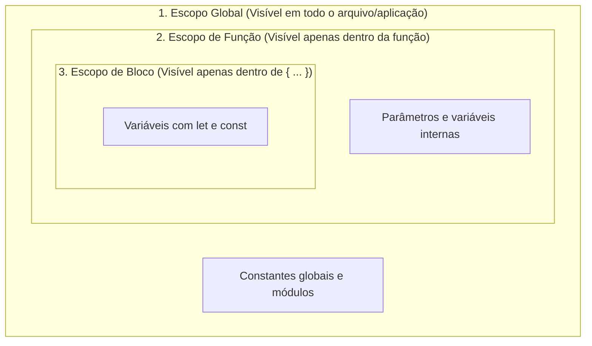
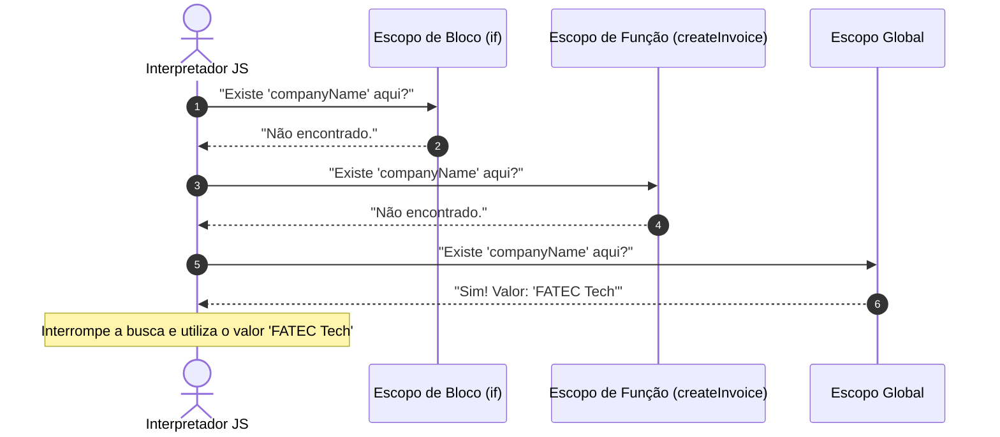
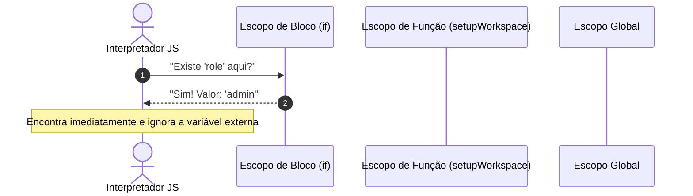
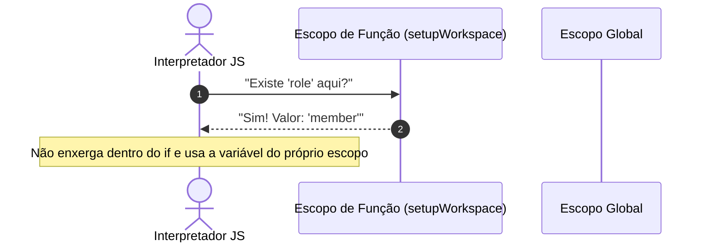
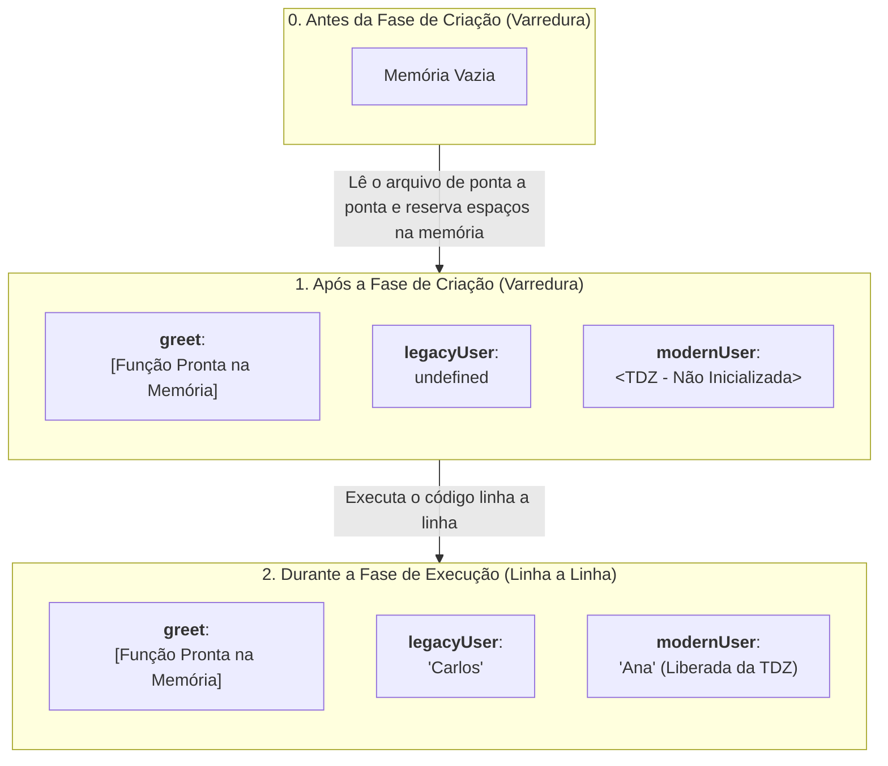

# 10. Escopo

Nos capítulos anteriores, aprendemos a declarar variáveis, manipular objetos e
estruturar funções reutilizáveis. No entanto, uma pergunta fundamental surge
conforme nossos programas crescem: **onde exatamente uma variável pode ser
acessada e por quanto tempo ela permanece viva na memória?**

Se todas as variáveis fossem visíveis por qualquer parte do código a qualquer
momento, um projeto com milhares de linhas rapidamente entraria em colapso
devido a colisões de nomes e alterações acidentais de estado.

Neste capítulo, vamos explorar as regras invisíveis que organizam a visibilidade
no JavaScript e TypeScript: o **Escopo**, a cadeia de resolução léxica (_Scope
Chain_), o mecanismo por trás do **Hoisting** e da **TDZ** (_Temporal Dead
Zone_), além de uma introdução ao conceito de **Closures**.

## O Que é Escopo?

**Escopo** é o conjunto de regras que define a acessibilidade e o ciclo de vida
de variáveis, funções e tipos dentro do seu programa. Ele atua como uma barreira
de proteção que impede que partes isoladas do sistema interfiram umas nas
outras.

No TypeScript moderno, trabalhamos essencialmente com três níveis de escopo:



### 1. Escopo Global

Variáveis declaradas fora de qualquer função ou bloco pertencem ao **escopo
global**. Elas podem ser lidas e modificadas por qualquer outra função no mesmo
módulo ou arquivo.

```typescript
const applicationName = "FatecHub";

function displaySystemInfo(): void {
  console.log(`Sistema: ${applicationName}`); // Acessa livremente a constante global
}

displaySystemInfo();
```

> **Regra de Ouro:**
>
> Evite ao máximo armazenar estados mutáveis (`let`) no escopo global. Qualquer
> função pode alterar esses dados, tornando o comportamento do sistema
> imprevisível e difícil de rastrear.

### 2. Escopo de Função

Variáveis declaradas dentro de uma função (incluindo seus parâmetros formais)
nascem quando a função é executada e pertencem exclusivamente a ela. Nenhuma
instrução de fora da função consegue enxergá-las:

```typescript
function calculateCartTotal(subtotal: number, discountPercent: number): number {
  const discountAmount = (subtotal * discountPercent) / 100;
  const serviceTax = 5.0;
  const total = subtotal - discountAmount + serviceTax;

  return total;
}

const finalTotal = calculateCartTotal(200, 10);
console.log(`Total a pagar: R$ ${finalTotal}`); // "Total a pagar: R$ 185"

// ❌ Erros de compilação: nem os parâmetros nem as variáveis internas existem fora da função
// console.log(subtotal); // ReferenceError: Cannot find name 'subtotal'
// console.log(total); // ReferenceError: Cannot find name 'total'
```

### 3. Escopo de Bloco

Um **bloco de código** é delimitado por um par de chaves `{ ... }`, presente em
instruções como `if`, `switch`, `for`, `while` ou até mesmo em chaves isoladas.

Variáveis declaradas com **`let`** e **`const`** respeitam estritamente o bloco
onde foram criadas:

```typescript
const isUserAdmin = true;

if (isUserAdmin) {
  const secretKey = "MASTER_ADMIN_KEY";
  console.log(`Chave autorizada: ${secretKey}`);
}

// ❌ Erro: 'secretKey' não é acessível fora do bloco 'if'
// console.log(secretKey);
```

<details>
<summary>⚠️ Relembrando o perigo do <code>var</code> e a ausência de escopo de bloco</summary>

Como vimos no [Capítulo 04: Variáveis e
Constantes](04-variaveis-e-constantes.md), a palavra-chave legada `var` **não
possui escopo de bloco**, apenas escopo de função ou global.

```typescript
if (true) {
  var leakedVariable = "Vazei do bloco!";
}

console.log(leakedVariable); // ❌ Imprime a string! Poluiu o escopo externo.
```

Por essa razão, `var` nunca deve ser utilizado no desenvolvimento moderno.

</details>

## Como Avaliar se um Identificador é Acessível

No JavaScript e TypeScript, para definir se um trecho de código tem acesso a uma
variável, constante ou função, o interpretador analisa a hierarquia de escopos
**do mais interno para o mais externo** (processo conhecido como **Cadeia de
Escopos** ou _Scope Chain_).

Vejamos um exemplo prático:

```typescript
const companyName = "FATEC Tech";

function createInvoice(customerName: string): void {
  const serviceFee = 15;

  if (customerName.trim().length > 0) {
    // Tentamos acessar 'companyName', 'customerName' e 'serviceFee'
    console.log(`Empresa: ${companyName}`);
    console.log(`Cliente: ${customerName}`);
    console.log(`Taxa de Serviço: R$ ${serviceFee}`);
  }
}

createInvoice("Luigi");
```

Quando a linha `console.log(companyName)` dentro do bloco `if` é executada, o
motor do JavaScript inicia uma busca ordenada a partir do ponto onde a instrução
está:



Podemos resumir esse processo em três passos:

1. **`companyName` está definida dentro do bloco `if`?** Não. Então passamos
   para o escopo imediatamente mais externo (a função `createInvoice`).
2. **`companyName` está definida na função `createInvoice`?** Não. Então
   passamos para o próximo nível (o escopo global).
3. **`companyName` está definida no escopo global?** Sim! O interpretador
   interrompe a busca e utiliza o valor encontrado (`"FATEC Tech"`).

Existem dois detalhes fundamentais nesse mecanismo:

- **Ausência em todos os níveis:** Se a variável não tivesse sido declarada em
  nenhum desses escopos, o TypeScript apontaria um erro de compilação e o
  runtime lançaria um `ReferenceError` informando que o identificador não
  existe.
- **A busca é estritamente de dentro para fora:** O interpretador **nunca**
  procura variáveis dentro de blocos ou funções filhas. Se declararmos uma
  variável dentro do `if` e tentarmos acessá-la do lado de fora (no corpo da
  função), a busca irá para a função e depois para o global, mas jamais entrará
  no bloco:

```typescript
function createInvoice(customerName: string, serviceFee: number): void {
  if (customerName.trim().length > 0) {
    const total = serviceFee + 10;
  }

  // ❌ Erro de compilação: 'total' foi declarada no bloco 'if'.
  // O motor procura no escopo da função e no escopo global, mas nunca dentro do if!
  // console.log(total); // ReferenceError: Cannot find name 'total'
}
```

> **Escopo Léxico (ou Estático):**
>
> A forma como o JavaScript e o TypeScript avaliam a acessibilidade é conhecida
> como **escopo léxico** (ou _estático_). Isso significa que a visibilidade de
> qualquer variável é definida pela **posição física onde o código foi escrito
> no arquivo**, permitindo que você descubra o que é acessível apenas lendo a
> estrutura do arquivo.

## Sombreamento de Variáveis (_Variable Shadowing_)

O **sombreamento** (_shadowing_) é um fenômeno que ocorre quando usamos o
**mesmo identificador** em escopos diferentes, desde que um escopo esteja
**aninhado dentro do outro** (relação hierárquica de pai e filho).

Vejamos um exemplo prático:

```typescript
function setupWorkspace(): void {
  const role = "member";

  if (true) {
    const role = "admin";
    console.log(`Papel no if: ${role}`); // "admin"
  }

  console.log(`Papel na função: ${role}`); // "member"
}

setupWorkspace();
```

Vamos analisar o que acontece quando o interpretador precisa resolver o valor de
`role` em cada um dos dois momentos:

### 1. Ao acessar `role` dentro do bloco `if`



### 2. Ao acessar `role` no corpo da função `setupWorkspace`:



Note que, embora a constante tenha exatamente o mesmo nome (`role`), o resultado
em cada linha é diferente. Isso decorre da regra que vimos anteriormente: **a
busca acontece sempre de dentro para fora**:

- Dentro do `if`, a variável `role` é encontrada imediatamente no primeiro nível
  da busca, de modo que a variável `role` da função fica "na sombra" (oculta).
- Fora do `if`, a função não possui visibilidade de variáveis declaradas dentro
  de blocos filhos, utilizando a sua própria constante `role`.

### Escopos Isolados Não Sofrem Sombreamento

O sombreamento **só acontece quando os escopos estão aninhados**. Se tivermos
escopos independentes (irmãos), como duas funções separadas, cada uma possui seu
próprio ambiente isolado:

```typescript
function configureGuestSession(): void {
  const role = "guest";
  console.log(`Papel: ${role}`);
}

function configureAdminSession(): void {
  const role = "admin";
  console.log(`Papel: ${role}`);
}
```

Nesse cenário, não há aninhamento de escopos: os dois ambientes são
completamente independentes e não interferem um no outro.

### E a Declaração Dupla no Mesmo Escopo?

O que acontece se tentarmos declarar duas variáveis com o mesmo identificador
dentro do **mesmo** bloco de código?

```typescript
function setupProfile(): void {
  const userStatus = "active";

  // ❌ Erro de compilação: Não podemos declarar dois identificadores iguais no mesmo escopo
  // const userStatus = "pending"; // Cannot redeclare block-scoped variable 'userStatus'
}
```

Com exceção do comportamento inseguro do antigo `var` (que permitia
redeclarações acidentais e causava falhas silenciosas — um dos motivos cruciais
para termos abandonado seu uso), o TypeScript e o JavaScript moderno com `let` e
`const` **proíbem terminantemente** declarar duas variáveis com o mesmo nome no
mesmo escopo.

> **Dica de Boas Práticas:**
>
> Embora a sintaxe permita o sombreamento entre escopos aninhados, **evite
> usá-lo no dia a dia**. Reutilizar o mesmo nome em blocos internos gera
> confusão mental para quem lê o código e facilita a introdução de bugs sutis.
> Prefira sempre nomes descritivos e distintos (por exemplo: `defaultRole` e
> `elevatedRole`).

## Hoisting

No [Capítulo 04: Variáveis e Constantes](04-variaveis-e-constantes.md) e no
[Capítulo 09: Funções](09-funcoes.md), mencionamos um comportamento curioso: em
alguns casos, é possível invocar uma função ou tentar ler uma variável em linhas
**anteriores** ao ponto onde elas foram escritas no arquivo:

**1. Function Declaration: funciona perfeitamente antes da sua linha:**

```typescript
sayHello(); // ✅ Imprime: "Olá, estudante!"

function sayHello(): void {
  console.log("Olá, estudante!");
}
```

**2. var (legado): existe na memória, mas vale undefined:**

```typescript
console.log(legacyMessage); // ⚠️ Imprime: undefined

var legacyMessage = "Mensagem com var";
```

**3. const e let (moderno): o motor bloqueia o acesso prematuro:**

```typescript
console.log(modernMessage); // ❌ ReferenceError: Cannot access 'modernMessage' before initialization

const modernMessage = "Mensagem com const";
```

Esse fenômeno é conhecido como **Hoisting** (Içamento). Mas por que isso
acontece e como o motor do JavaScript realmente processa o nosso código por
baixo dos panos?

### As Duas Fases de Processamento do Motor

Para entender o Hoisting, precisamos saber que o interpretador não executa o
código de uma só vez. Ele opera sempre em **duas fases distintas**:

1. **Fase de Criação (Varredura do Escopo):** Antes de rodar a primeira linha de
   código, o motor analisa o arquivo de ponta a ponta, identifica todas as
   funções e variáveis, mapeia os escopos e reserva os espaços necessários na
   memória com valores padrão ou marcações especiais.
2. **Fase de Execução:** Com a estrutura de memória já montada, o motor executa
   o código linha por linha, atribuindo os valores reais e rodando as operações.

Vejamos como essas duas fases se comportam na memória com um exemplo simples:

```typescript
function greet(name: string): string {
  return `Olá, ${name}!`;
}

var legacyUser = "Carlos";
const modernUser = "Ana";
```

Podemos visualizar o estado da memória após a varredura e durante a execução:



Na prática, como a memória já foi reservada na fase de criação, é como se o
motor do JavaScript tivesse reorganizado mentalmente o nosso código da seguinte
forma antes de executá-lo:

```typescript
// --- 1. Espaço reservado na fase de criação (Hoisting) ---
function greet(name: string): string {
  return `Olá, ${name}!`;
}

var legacyUser = undefined; // 'var' é içada e inicializada com undefined
// 'modernUser' é registrada, mas permanece bloqueada na TDZ

// --- 2. Fase de execução (linha por linha) ---
console.log(greet("FATEC")); // ✅ Funciona perfeitamente (greet já existe por completo)
console.log(legacyUser); // ⚠️ Imprime undefined (ainda não recebeu o valor real)

legacyUser = "Carlos"; // Agora sim recebe o valor "Carlos"
const modernUser = "Ana"; // Fim da TDZ: a partir daqui 'modernUser' pode ser lida
```

No entanto, como vimos no diagrama e no código acima, o motor trata cada tipo de
declaração de maneiras muito diferentes:

| Declaração                    | O que é Içado?         | Valor Inicial na Criação | Acesso Antes da Linha |
| :---------------------------- | :--------------------- | :----------------------- | :-------------------- |
| **`function` declarada**      | Nome + Corpo completo  | A própria função pronta  | ✅ Permitido          |
| **`var` (legado)**            | Apenas o identificador | `undefined`              | ⚠️ `undefined`        |
| **`let` / `const` (moderno)** | Apenas o identificador | _(Não inicializado)_     | ❌ `ReferenceError`   |

> **A _Temporal Dead Zone_ (TDZ):**
>
> Você deve ter notado a sigla **TDZ** no diagrama anterior. Ela significa
> **_Temporal Dead Zone_** (Zona Morta Temporal).
>
> Quando declaramos uma variável com `let` ou `const`, o JavaScript aloca espaço
> para ela na memória na fase de criação (assim como faz com `var`), mas **não
> permite utilizá-la**.
>
> Esse intervalo entre o ponto onde o espaço da variável é alocado (início do
> escopo) e a linha onde ela é inicializada de fato é o que chamamos de **TDZ**:
>
> ```typescript
> function calculateTotal(): void {
>   // 1. O espaço na memória para 'discount' já foi alocado na fase de criação.
>
>   // 2. Aqui 'discount' ainda está na TDZ (o JS/TS impede o acesso):
>   // console.log(discount); // ❌ ReferenceError: Cannot access 'discount' before initialization
>
>   // 3. Linha de inicialização (fim da TDZ):
>   const discount = 15;
>
>   // 4. A partir daqui a variável se torna totalmente acessível:
>   console.log(`Desconto aplicado: ${discount}%`); // ✅ 15%
> }
>
> calculateTotal();
> ```
>
> A TDZ é uma proteção intencional do JavaScript moderno para garantir que você
> nunca consuma uma constante ou variável antes que ela tenha sido formalmente
> inicializada.

<details>
<summary>🔍 Aprofundamento: O Que São Closures?</summary>

Para compreender o conceito de **Closure**, observe atentamente estes dois
exemplos:

### Exemplo 1: O Contador com Estado Privado

```typescript
function createOrderCounter(initialId: number = 1000) {
  // 'currentId' está protegida no escopo da função fábrica
  let currentId = initialId;

  return function generateNextId(): number {
    currentId += 1; // A função filha lê e modifica 'currentId'
    return currentId;
  };
}

// Criamos duas instâncias totalmente independentes
const foodOrdersCounter = createOrderCounter(100);
const clothesOrdersCounter = createOrderCounter(500);

console.log(foodOrdersCounter()); // 101
console.log(foodOrdersCounter()); // 102

console.log(clothesOrdersCounter()); // 501
console.log(foodOrdersCounter()); // 103 (mantém seu próprio estado intacto!)
```

### Exemplo 2: Criador de Formatadores de Moeda

```typescript
function createCurrencyFormatter(
  currencySymbol: string,
  decimalPlaces: number = 2,
) {
  // Retornamos uma arrow function que consome os parâmetros externos
  return (value: number): string => {
    return `${currencySymbol} ${value.toFixed(decimalPlaces)}`;
  };
}

const formatBRL = createCurrencyFormatter("R$", 2);
const formatUSD = createCurrencyFormatter("US$", 2);

console.log(formatBRL(1250.5)); // "R$ 1250.50"
console.log(formatUSD(1250.5)); // "US$ 1250.50"
```

Note que, em ambos os exemplos, algo curioso acontece:

Temos uma função externa que retorna uma nova função (lembra do que vimos sobre
_First-Class Citizens_ e _Higher-Order Functions_ no [Capítulo 09:
Funções](09-funcoes.md)?).

Em circunstâncias normais, quando uma função termina de executar, todas as suas
variáveis locais são imediatamente descartadas da memória. No entanto:

- No **Exemplo 1**, a função interna `generateNextId` **não declara** nenhuma
  variável de estado própria; ela apenas lê e modifica `currentId`, que foi
  declarada no escopo de `createOrderCounter`. Além disso, ambos os contadores
  funcionam de maneira 100% independente: chamamos um após o outro e eles não se
  afetam.
- No **Exemplo 2**, as funções retornadas não declaram novas variáveis de
  configuração: elas recebem apenas o valor numérico, mas continuam enxergando
  `currencySymbol` e `decimalPlaces` mesmo após `createCurrencyFormatter` já ter
  encerrado sua execução.

Esse fenômeno é chamado de **Closure** (ou fechamento léxico). A lógica funciona
da seguinte forma:

1. **Uma função externa retorna outra função** (como `createOrderCounter` e
   `createCurrencyFormatter`).
2. **A função retornada acessa variáveis declaradas na função externa** (como
   `generateNextId` acessando `currentId`, ou a arrow function acessando
   `currencySymbol`).
3. **A função filha carrega uma "mochila" com esse estado:** O motor do
   JavaScript aloca esse escopo na memória (_Heap_) e permite que a função filha
   continue visualizando e modificando esses dados sempre que for invocada.
4. **Isolamento de instâncias:** Para cada execução da função geradora, um novo
   conjunto de variáveis é criado. Por isso, funções criadas em momentos
   diferentes não interferem uma na outra.

> **Conexão com o Capítulo Anterior:**
>
> Embora não tenhamos formalizado o termo na época, vimos esse mesmo mecanismo
> em ação no [Capítulo 09: Funções](09-funcoes.md) quando criamos a fábrica
> `createLengthValidator` para gerar validadores customizados!

### Quando Isso É Útil na Prática?

1. **Encapsulamento e Estado Privado:** Permite proteger dados internos sem
   expor variáveis globais para o restante da aplicação.
2. **Fábricas de Funções (_Factory Functions_):** Criação de funções utilitárias
   altamente especializadas com parâmetros pré-configurados.
3. **Mecanismos de Cache e Memoization:** Armazenar resultados de cálculos
   pesados em um escopo privado para reaproveitamento em chamadas subsequentes.

</details>

---

<a href="09-funcoes.md">← Funções</a>

<p align="right"><a href="11-excecoes-e-erros.md">Próximo: Exceções e Tratamento de Erros →</a></p>
