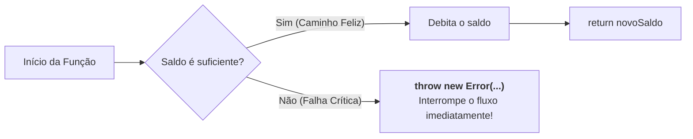
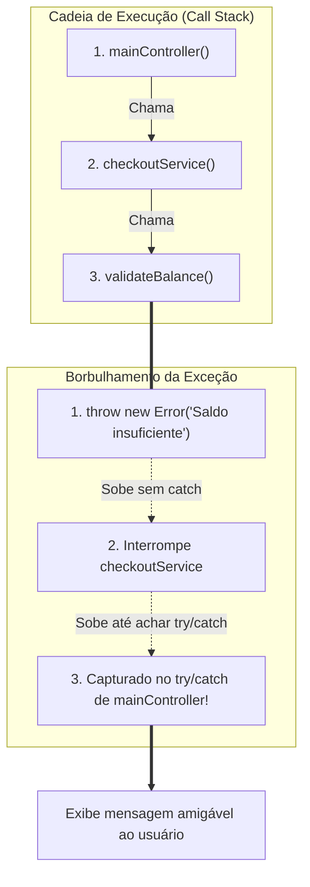

# 11. Exceções e Tratamento de Erros

No mundo ideal, todo programa executa perfeitamente do início ao fim: os
usuários digitam dados válidos, os servidores respondem instantaneamente e os
arquivos solicitados sempre existem no disco. Esse cenário ideal é o que
chamamos na engenharia de software de **caminho feliz** (_happy path_).

No entanto, o mundo real é repleto de imprevistos. Conexões de rede caem no meio
de uma transação, discos ficam sem espaço, usuários digitam valores negativos
onde se esperava uma quantidade positiva e bancos de dados ficam temporariamente
indisponíveis.

Quando uma situação dessas acontece, o seu programa não pode simplesmente travar
a aplicação do usuário ou continuar executando como se nada tivesse acontecido,
gerando dados corrompidos.

Neste capítulo, vamos entender como representar falhas em nossos programas, como
funciona o mecanismo de **Erros e Exceções**, como lançá-los com `throw`, como
criar redes de segurança com `try`, `catch` e `finally`, e como o TypeScript nos
ajuda a lidar com erros de forma tipada e segura.

## O Dilema das Falhas: Como Indicar que Algo Deu Errado?

Imagine que estamos construindo o módulo financeiro de um sistema de comércio
eletrônico e precisamos implementar uma função para processar o saque de saldo
de uma carteira digital:

```typescript
function processWithdrawal(accountBalance: number, amount: number): number {
  if (amount <= 0 || amount > accountBalance) {
    // Como avisamos a quem chamou que o saque falhou?
  }

  return accountBalance - amount;
}
```

Historicamente, linguagens de programação mais antigas (como C) ou abordagens
ingênuas recorriam ao uso de **valores sentinela** (valores mágicos que indicam
falha), como retornar `-1`, `false` ou `null`:

```typescript
// ❌ EVITE: Retornar valores mágicos/sentinelas para indicar falha
function processWithdrawal(accountBalance: number, amount: number): number {
  if (amount <= 0 || amount > accountBalance) {
    return -1; // -1 indica que a operação falhou
  }

  return accountBalance - amount;
}

const initialBalance = 100;
const requestedAmount = 250; // Saldo insuficiente!

const remainingBalance = processWithdrawal(initialBalance, requestedAmount);

// O chamador esquece de verificar se o retorno foi -1:
console.log(`Novo saldo: R$ ${remainingBalance}`); // "Novo saldo: R$ -1"
const bonus = remainingBalance * 0.1; // O sistema continua calculando com dados corrompidos!
```

O grande perigo dessa abordagem é a **fragilidade silenciosa**:

1. **O tipo de retorno é enganoso:** A função promete devolver um `number`
   representando o novo saldo, mas na verdade devolve um número com dois
   significados opostos (um saldo legítimo ou um código de erro).
2. **Nada obriga a verificação:** O desenvolvedor que chamou a função pode
   simplesmente esquecer de fazer `if (remainingBalance === -1)` e continuar a
   execução. O erro se propaga silenciosamente pelo sistema e causa falhas
   catastróficas linhas ou módulos adiante.

Para resolver esse problema de forma definitiva, as linguagens modernas oferecem
um canal de comunicação especial e urgente: as **Exceções**.

## Interrompendo o Fluxo com `throw` e o Objeto `Error`

Quando ocorre um erro que impede a continuidade lógica de uma operação, podemos
disparar um sinal de alerta vermelho na linguagem utilizando a instrução
**`throw`** (lançar).

Ao lançar um erro, o fluxo normal de execução da função é **interrompido
imediatamente**. Nenhuma linha seguinte daquela função será executada:



### O Objeto Nativo `Error`

Embora o JavaScript permita lançar tecnicamente qualquer valor com `throw` (como
strings ou números), a boa prática universal é lançar sempre uma instância da
classe nativa **`Error`**:

```typescript
// ✅ RECOMENDADO: Lançar instâncias do objeto Error com mensagens descritivas
function processWithdrawal(accountBalance: number, amount: number): number {
  if (amount <= 0) {
    throw new Error("O valor do saque deve ser estritamente positivo.");
  }

  if (amount > accountBalance) {
    throw new Error(
      `Saldo insuficiente. Disponível: R$ ${accountBalance}, Solicitado: R$ ${amount}.`,
    );
  }

  return accountBalance - amount;
}
```

O objeto `Error` carrega consigo três propriedades fundamentais:

| Propriedade   | Descrição                                                                                         | Exemplo de Valor                                       |
| :------------ | :------------------------------------------------------------------------------------------------ | :----------------------------------------------------- |
| **`message`** | A descrição textual legível do que causou o problema.                                             | `"Saldo insuficiente."`                                |
| **`name`**    | O tipo/nome do erro (por padrão, `"Error"`).                                                      | `"Error"` ou `"TypeError"`                             |
| **`stack`**   | O rastreamento de pilha (_Stack Trace_), detalhando o arquivo e a linha exata onde o erro nasceu. | `Error: Saldo... at processWithdrawal (index.ts:7:11)` |

```typescript
// ❌ EVITE: Lançar tipos primitivos puros
throw "Erro no pagamento"; // Não possui rastreamento de pilha (stack trace) nem metadados!

// ✅ RECOMENDADO: Lançar sempre uma instância de Error
throw new Error("Falha ao processar pagamento na operadora.");
```

## A Rede de Proteção: `try`, `catch` e `finally`

Se um erro for lançado com `throw` e ninguém estiver preparado para recebê-lo,
ele viajará até o topo da aplicação e fará com que o runtime (Node.js ou o
Navegador) aborte o programa com uma mensagem de falha no terminal ou no
console.

Para evitar que a aplicação quebre diante do usuário final e permitir uma
recuperação graciosa, utilizamos a estrutura de controle **`try...catch`**,
composta por até três blocos interdependentes:

```typescript
try {
  // 1. Bloco Monitorado (Zona de Risco)
  // Código que queremos executar, mas que pode vir a lançar uma exceção.
} catch (error) {
  // 2. Bloco de Recuperação (Rede de Segurança)
  // Executado APENAS se alguma exceção for lançada dentro do bloco try.
  // Se o try executar com sucesso do início ao fim, este bloco é ignorado.
} finally {
  // 3. Bloco de Limpeza (Execução Garantida - Opcional)
  // Executado SEMPRE ao término de tudo, ocorrendo erro ou não.
}
```

Vejamos como essa estrutura funciona na prática ao monitorar a chamada da nossa
função `processWithdrawal`:

```typescript
try {
  console.log("Iniciando operação bancária...");

  // ⚠️ Esta linha lança um Error("Saldo insuficiente...")
  const updatedBalance = processWithdrawal(100, 250);

  // 🛑 Esta linha NUNCA será executada, pois o erro interrompeu o try imediatamente
  console.log(`Saque realizado! Novo saldo: R$ ${updatedBalance}`);
} catch (error) {
  // 🛡️ O fluxo salta direto para cá para recuperar a aplicação:
  console.error("Não foi possível concluir a transação.");
} finally {
  // 🧹 Executado incondicionalmente:
  console.log("Operação de saque finalizada no terminal bancário.");
}

// ✅ Como o erro foi capturado, o programa NÃO trava e continua normalmente:
console.log("O sistema segue ativo para a próxima operação!");
```

### O Papel do Bloco `finally`

O bloco `finally` é executado **incondicionalmente**, independentemente de o
bloco `try` ter terminado com sucesso ou de uma exceção ter sido capturada no
`catch` (e até mesmo se houver um `return` explícito no meio do caminho).

Ele é o local ideal para **limpeza de recursos** e restauração de estados:

- Fechar conexões abertas com arquivos ou bancos de dados.
- Desativar indicadores visuais de carregamento em interfaces (`isLoading =
false`).
- Liberar travas de memória ou temporizadores.

```typescript
let isProcessingTransaction = true;

try {
  console.log("Conectando ao gateway de pagamento...");
  processWithdrawal(50, 100);
} catch (error) {
  console.error("Falha na operadora. Tente novamente mais tarde.");
} finally {
  // Garante que o indicador de processamento seja liberado em qualquer cenário
  isProcessingTransaction = false;
  console.log(`Processamento liberado: ${isProcessingTransaction}`);
}
```

## TypeScript e a Segurança de Tipos no `catch`

Se você já programa em outras linguagens fortemente tipadas como Java ou C#,
talvez espere poder anotar o tipo do erro diretamente no `catch`:

```typescript
// ❌ Erro de compilação no TypeScript:
// Catch clause variable cannot have an type annotation other than 'any' or 'unknown'.
try {
  // ...
} catch (error: Error) {
  console.log(error.message);
}
```

Por que o TypeScript **proíbe** tipar o erro diretamente como `catch (error:
Error)`?

A resposta reside na flexibilidade histórica do ecossistema JavaScript: em JS,
qualquer biblioteca de terceiros pode fazer `throw "uma string qualquer"` ou
`throw 404`. Como o compilador não pode ter 100% de garantia em tempo de
compilação de que o valor lançado será de fato uma instância de `Error`, as
configurações estritas do TypeScript tipam a variável de erro como
**`unknown`**.

### Afunilamento Seguro com `instanceof Error`

Como vimos no [Capítulo 02: Tipos Primitivos e
Especiais](02-tipos-primitivos-e-especiais.md), o tipo `unknown` nos impede de
acessar propriedades como `.message` diretamente sem antes verificar o que
aquele dado realmente é.

A maneira idiomática e segura de manipular erros no TypeScript é utilizando o
operador **`instanceof`** para realizar o afunilamento (_narrowing_):

```typescript
function executeFinancialOperation(): void {
  try {
    const newBalance = processWithdrawal(100, 300);
    console.log(`Sucesso: R$ ${newBalance}`);
  } catch (error: unknown) {
    // ✅ RECOMENDADO: Verificar se o erro é uma instância legítima de Error
    if (error instanceof Error) {
      console.error(`Erro de Negócio (${error.name}): ${error.message}`);
    } else {
      // Caso algum código legado tenha lançado algo inesperado (ex: string ou número)
      console.error("Ocorreu um erro desconhecido e inesperado:", error);
    }
  }
}

executeFinancialOperation();
```

## Propagação de Erros na Pilha de Execução (_Call Stack_)

Uma das características mais poderosas das exceções é a **propagação
automática** (comumente chamada de "borbulhamento" de erros).

Quando uma função lança uma exceção e não possui um bloco `try...catch` interno
para tratá-la, ela encerra imediatamente e devolve a exceção para a função que a
chamou. Se essa função também não tratar, o erro continua subindo a pilha de
chamadas até encontrar o primeiro `catch` disponível:



Vejamos isso em código:

```typescript
function validateBalance(balance: number, amount: number): void {
  if (amount > balance) {
    throw new Error("Saldo indisponível para completar o pedido.");
  }
}

function checkoutService(balance: number, amount: number): void {
  console.log("Iniciando checkout...");
  validateBalance(balance, amount); // Não precisa de try/catch aqui se não souber como tratar!
  console.log("Pedido faturado com sucesso!");
}

function mainController(): void {
  try {
    checkoutService(50, 200);
  } catch (error: unknown) {
    // O erro lançado lá em validateBalance é capturado aqui no topo!
    if (error instanceof Error) {
      console.error(`[Interface do Usuário] Falha: ${error.message}`);
    }
  }
}

mainController();
```

> **Regra de Ouro da Propagação:**
>
> Só capture um erro com `try...catch` se você souber **o que fazer com ele**
> naquele ponto do código (exibir um alerta ao usuário, tentar uma rota
> alternativa ou registrar um log estruturado). Se uma função intermediária não
> tem como consertar a falha, deixe o erro subir livremente para as camadas
> superiores.

## Boas Práticas e Antipadrões com Exceções

O tratamento de exceções é uma ferramenta indispensável, mas requer disciplina
arquitetural para não tornar o código confuso ou lento.

### 1. ❌ Nunca engula erros (_Silent Catch_)

O pior erro que um desenvolvedor pode cometer é capturar uma exceção e
simplesmente ignorá-la sem nenhum aviso ou tratamento:

```typescript
// ❌ PÉSSIMO: Engolir o erro silenciosamente
try {
  processWithdrawal(100, 500);
} catch (error) {
  // Silêncio absoluto... O sistema quebrou mas ninguém nunca saberá o motivo!
}
```

Se um erro for engolido, você passará horas procurando por que determinados
dados desapareceram do sistema sem nenhum log ou pista.

### 2. ❌ Não use exceções para controle de fluxo comum

Lançar e capturar exceções é uma operação mais pesada para o runtime, pois exige
a interrupção abrupta do fluxo e a montagem completa da pilha de chamadas
(_Stack Trace_).

Não utilize `throw` como um substituto para estruturas de decisão (`if/else`) em
situações cotidianas e previsíveis (como checar se um campo de formulário veio
preenchido ou se um item buscado existe na lista). Para esses casos, retornos
diretos e tipados (como `null`, `undefined`, booleanos ou objetos de resultado)
são muito mais claros e eficientes.

Reserve o lançamento de exceções para **situações genuinamente anômalas, falhas
críticas de infraestrutura ou violações graves onde o código não tem como
prosseguir**:

- **Fronteiras da aplicação e dados fora de conformidade:** O TypeScript nos dá
  segurança estática durante o desenvolvimento, mas em tempo de execução os
  dados vêm do mundo real (um payload corrompido de uma API externa, um
  `JSON.parse` malformado ou alguém injetando valores inesperados via console do
  navegador). Quando a função recebe um dado em um formato incompatível com o
  que ela precisa para funcionar, lançar um erro é a resposta correta para
  evitar corrupção em cascata.
- **Falhas externas de infraestrutura:** Queda de conexão com o banco de dados,
  falha de rede na comunicação com serviços essenciais ou estouro de recursos do
  sistema.

| Situação                                                       | Abordagem Recomendada                      | Justificativa                                           |
| :------------------------------------------------------------- | :----------------------------------------- | :------------------------------------------------------ |
| **Email inválido digitado pelo usuário em formulário**         | Retorno de validação / objeto de resultado | Erro esperado e rotineiro da interação do usuário.      |
| **Busca de item por ID no catálogo**                           | Retornar `undefined` ou `null`             | É perfeitamente normal que um ID pesquisado não exista. |
| **Payload da API recebido em formato incompatível/corrompido** | Lançar `throw new Error(...)`              | Quebra inesperada de contrato em tempo de execução.     |
| **Queda de conexão com o banco de dados / serviço externo**    | Lançar `throw new Error(...)`              | Falha crítica de infraestrutura que impede a operação.  |

<details>
<summary>🔍 Aprofundamento: O Padrão Result (Modelando Sucesso e Falha com Tipos)</summary>

No ecossistema moderno de desenvolvimento de software, muitos desenvolvedores
optam por evitar o uso de `throw` para erros esperados de regras de negócio,
adotando o chamado **Result Pattern**.

Em vez de interromper o fluxo com uma exceção, a função sempre retorna um objeto
seguro contendo um indicador explícito de sucesso ou falha:

```typescript
type Result<TData, TError> =
  | { success: true; data: TData }
  | { success: false; error: TError };

function safeDivide(
  numerator: number,
  denominator: number,
): Result<number, string> {
  if (denominator === 0) {
    return { success: false, error: "Divisão por zero não permitida." };
  }

  return { success: true, data: numerator / denominator };
}

const result = safeDivide(10, 0);

if (result.success) {
  console.log(`Resultado do cálculo: ${result.data}`);
} else {
  console.error(`Falha no cálculo: ${result.error}`);
}
```

Essa técnica combina dois dos recursos mais expressivos do TypeScript: as
**Uniões Discriminadas (_Discriminated Unions_)**, que estudaremos no **Capítulo
17**, e os **Tipos Genéricos (_Generics_)**, que veremos no **Capítulo 19**! Com
isso, o próprio compilador nos impede de acessar `.data` se não tivermos checado
`if (result.success)` previamente.

</details>

---

<a href="10-escopo.md">← Escopo</a>

<p align="right"><a href="12-arrays-e-tuplas.md">Próximo: Arrays e Tuplas →</a></p>
