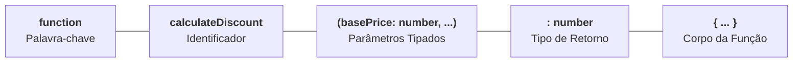

# 11. Funções: Anatomia e Sintaxe

Nos capítulos anteriores, aprendemos a modelar dados na memória, avaliar
expressões e controlar o fluxo de execução com condicionais e laços de
repetição.

No entanto, até agora nosso código foi escrito em sequências lineares de
instruções. Conforme uma aplicação cresce, duplicar blocos de código para
calcular impostos, validar dados de formulários ou formatar textos torna o
sistema frágil, difícil de manter e propenso a erros.

As **funções** são os blocos de construção fundamentais de qualquer programa.
Elas nos permitem encapsular uma lógica específica, atribuir-lhe um nome
significativo e reutilizá-la quantas vezes forem necessárias, recebendo dados de
entrada (**parâmetros**) e produzindo um resultado (**retorno**).

Neste capítulo, vamos dominar a anatomia completa de uma função no TypeScript,
as três formas modernas de declaração (_Function Declarations_, _Function
Expressions_ e _Arrow Functions_), o uso de parâmetros opcionais e padrão, e a
técnica de **Guard Clauses (Early Return)** para manter seu código limpo e
legível.

## Anatomia de uma Função no TypeScript

Uma função declarada no TypeScript é composta por elementos estruturais bem
definidos:



```typescript
function calculateDiscount(
  basePrice: number,
  discountPercentage: number = 10,
): number {
  const discountAmount = (basePrice * discountPercentage) / 100;
  return basePrice - discountAmount;
}

const finalPrice = calculateDiscount(200, 15);
console.log(`Preço final: R$ ${finalPrice}`); // 170
```

Vamos analisar cada um desses componentes em detalhes:

### 1. O Identificador (Nome da Função)

O **identificador** é o rótulo pelo qual a função é invocada no programa.

> **Convenção de Nomenclatura:**
>
> Funções representam **ações**, portanto devem sempre começar com um **verbo**
> no padrão _camelCase_ (ex: `calculateDiscount`, `formatGreeting`,
> `validateUserInput`, `sendNotification`).

### 2. Parâmetros e Tipagem de Entrada

Os **parâmetros** definem quais dados a função precisa receber para realizar seu
trabalho.

Caso a função não precise de nenhuma informação externa para executar sua
lógica, os parênteses permanecem vazios `()`:

```typescript
// Função sem parâmetros:
function getSystemStatus(): string {
  return "Servidor operacional.";
}

// Função com múltiplos parâmetros tipados:
function registerStudent(name: string, age: number, semester: number): void {
  console.log(
    `Estudante ${name} (${age} anos) matriculado no ${semester}º semestre.`,
  );
}
```

> **Por Que Parâmetros Exigem Anotação de Tipo Explícita?**
>
> No [Capítulo 04: Variáveis](04-variaveis.md), vimos que o TypeScript infere o
> tipo de variáveis inicializadas automaticamente (`const score = 100`).
>
> No entanto, com parâmetros de função, o compilador não tem como adivinhar
> quais valores serão passados por outros pontos do sistema no futuro. Por isso,
> em modo estrito, o TypeScript **exige a anotação explícita do tipo de cada
> parâmetro** (`name: string`, `age: number`), impedindo que assumam
> implicitamente o tipo `any` e garantindo um contrato seguro.

#### Parâmetros com Valor Padrão (_Default Parameters_)

Podemos definir um valor padrão na assinatura. Se o chamador omitir o argumento
ou passar `undefined`, o TypeScript assumirá o valor pré-estabelecido:

```typescript
function calculateTax(amount: number, taxRate: number = 0.05): number {
  return amount * taxRate;
}

console.log(calculateTax(100)); // 5 (taxa padrão de 5%)
console.log(calculateTax(100, 0.15)); // 15 (taxa explícita de 15%)
```

#### Parâmetros Opcionais (`?`)

Quando um parâmetro não possui valor padrão e pode simplesmente não ser enviado,
utilizamos o modificador `?`. O TypeScript infere o tipo desse parâmetro como
`Tipo | undefined`:

```typescript
function buildGreeting(name: string, title?: string): string {
  if (title !== undefined) {
    return `Olá, ${title} ${name}!`;
  }
  return `Olá, ${name}!`;
}

console.log(buildGreeting("Luigi")); // "Olá, Luigi!"
console.log(buildGreeting("Luigi", "Prof.")); // "Olá, Prof. Luigi!"
```

> **Regra de Posição:** Parâmetros opcionais ou com valor padrão devem sempre
> ser declarados **após** os parâmetros obrigatórios na lista de argumentos.

### 3. Tipo de Retorno

O tipo de retorno declara explicitamente o formato do dado devolvido pela
instrução `return`:

- **Funções que devolvem valores:** Anotamos o tipo correspondente (`: number`,
  `: string`, `: UserProfile`, etc.);
- **Funções sem retorno (`void`):** Quando a função apenas executa uma ação
  (como gravar um log, exibir algo no console ou disparar um evento) sem
  devolver nenhum valor com `return`, seu tipo de retorno é anotado como
  **`void`**:

```typescript
function logWarning(message: string): void {
  console.warn(`[AVISO]: ${message}`);
}
```

## Formas de Declarar Funções

No ecossistema JavaScript e TypeScript moderno, existem três sintaxes principais
para construir funções:

### 1. Declaração Nomeada Tradicional (_Function Declaration_)

É a sintaxe clássica que utiliza a palavra-chave `function` acompanhada de um
nome próprio:

```typescript
function sumNumbers(firstNumber: number, secondNumber: number): number {
  return firstNumber + secondNumber;
}
```

Funções declaradas dessa forma sofrem o comportamento de içamento
(**_hoisting_**), permitindo que sejam invocadas em linhas anteriores à sua
declaração no arquivo (aprofundaremos o _hoisting_ no Capítulo 13).

### 2. Expressão de Função (_Function Expression_)

Consiste em declarar uma **função anônima** e atribuí-la diretamente a uma
variável ou constante:

```typescript
const multiplyValues = function (factorA: number, factorB: number): number {
  return factorA * factorB;
};

console.log(multiplyValues(4, 5)); // 20
```

Nessa abordagem, a função não possui nome próprio na sua assinatura e é
executada chamando a constante `multiplyValues(...)`.

### 3. Funções de Seta (_Arrow Functions_)

Introduzidas no ES6, as **Arrow Functions** são a forma mais concisa, moderna e
frequente de escrever funções no TypeScript. Elas dispensam a palavra `function`
e utilizam a sintaxe de seta (`=>`):

```typescript
// Arrow Function com bloco de código { ... }:
const divideValues = (dividend: number, divisor: number): number => {
  if (divisor === 0) {
    throw new Error("Divisão por zero não é permitida.");
  }
  return dividend / divisor;
};
```

#### Retorno Implícito em Linha Única

Quando o corpo da Arrow Function contém apenas uma única expressão, podemos
**omitir as chaves `{}` e a palavra-chave `return`**:

```typescript
// Retorno implícito de valor:
const isEven = (value: number): boolean => value % 2 === 0;

// Instrução única sem retorno (void):
const logSuccess = (msg: string): void => console.log(`✅ ${msg}`);
```

<details>
<summary>🔍 Código Limpo: Simplificando Funções com Guard Clauses (Early Return)</summary>

Uma das maiores armadilhas ao lidar com fluxos de decisão dentro de funções é o
aninhamento excessivo de blocos `if / else`, gerando a famosa **"Pirâmide da
Perdição"** (_Arrow Anti-Pattern_):

```typescript
// ❌ CÓDIGO COMPLEXO: Aninhamento excessivo e difícil de ler
function processWithdrawal(
  balance: number,
  amount: number,
  isActive: boolean,
): string {
  if (isActive) {
    if (amount > 0) {
      if (balance >= amount) {
        return `Saque de R$ ${amount} realizado com sucesso!`;
      } else {
        return "Erro: Saldo insuficiente.";
      }
    } else {
      return "Erro: Valor deve ser positivo.";
    }
  } else {
    return "Erro: Conta inativa.";
  }
}
```

A técnica de **Guard Clauses (Cláusulas de Guarda / Early Return)** resolve esse
problema invertendo as verificações: tratamos e encerramos todos os casos de
erro ou exceção no topo da função, deixando o **caminho feliz** desaninhado e
limpo no final:

```typescript
// ✅ CÓDIGO LIMPO: Guard Clauses com retorno antecipado
function processWithdrawal(
  balance: number,
  amount: number,
  isActive: boolean,
): string {
  // 1. Cláusula de guarda: conta inativa?
  if (!isActive) {
    return "Erro: Conta inativa.";
  }

  // 2. Cláusula de guarda: valor inválido?
  if (amount <= 0) {
    return "Erro: Valor deve ser positivo.";
  }

  // 3. Cláusula de guarda: saldo insuficiente?
  if (balance < amount) {
    return "Erro: Saldo insuficiente.";
  }

  // Caminho feliz: executado apenas se todas as guardas passaram
  return `Saque de R$ ${amount} realizado com sucesso!`;
}
```

</details>

## Resumo das Sintaxes de Função

| Sintaxe                  | Exemplo                                                      | Destaque / Caso de Uso                                  |
| :----------------------- | :----------------------------------------------------------- | :------------------------------------------------------ |
| **Function Declaration** | `function sum(a: number, b: number): number { ... }`         | Sintaxe clássica, sofre hoisting                        |
| **Function Expression**  | `const sum = function(a: number, b: number): number { ... }` | Função anônima atribuída a variável                     |
| **Arrow Function**       | `const sum = (a: number, b: number): number => a + b`        | Sintaxe moderna, retorno implícito, padrão da indústria |

> **Regra de Ouro:**
>
> 1. Adote **Arrow Functions** como padrão para funções utilitárias e código
>    moderno do dia a dia.
> 2. Sempre anote os **tipos dos parâmetros** e o **tipo de retorno** de forma
>    explícita para criar contratos robustos e autodocumentados.
> 3. Aplique **Guard Clauses** para eliminar `else` desnecessários e manter o
>    caminho principal das suas funções limpo e legível.

## O Que Vem a Seguir?

Agora que dominamos a criação e tipagem de funções, podemos dar o próximo passo
arquitetural: entender como o JavaScript e o TypeScript tratam funções como
valores manipuláveis na memória.

No próximo capítulo, vamos explorar as **Funções de Primeira Classe**,
aprendendo a definir tipos de função (`(x: T) => R`), passar funções como
argumentos (**Callbacks**) e criar funções de ordem superior (_Higher-Order
Functions_).

---

<a href="10-lacos-de-repeticao.md">← Laços de Repetição</a>

<p align="right"><a href="12-funcoes-de-primeira-classe.md">Próximo: Funções de Primeira Classe e Callbacks →</a></p>
