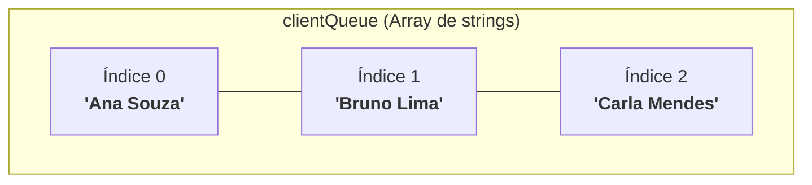
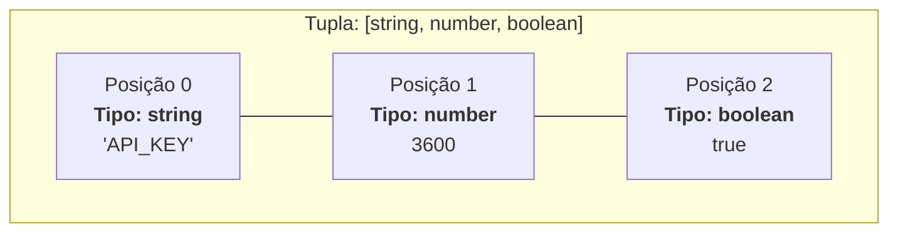

# 12. Arrays e Tuplas

Até agora, trabalhamos principalmente com variáveis isoladas, objetos
representando entidades únicas e funções que operam sobre valores individuais.
No entanto, no dia a dia do desenvolvimento de software, quase nunca lidamos com
dados soltos.

Um catálogo de e-commerce exibe centenas de produtos, uma rede social gerencia
listas de comentários e um painel financeiro processa sequências ordenadas de
transações.

Para organizar e manipular grupos de dados de forma estruturada, ordenada e
eficiente, o TypeScript disponibiliza duas estruturas fundamentais: os
**Arrays** e as **Tuplas**.

Neste capítulo, você aprenderá a declarar arrays e tuplas fortemente tipados,
compreenderá por que ambas as estruturas compartilham os mesmos métodos, e
dominará os métodos essenciais de manipulação de dados.

## A Dor das Variáveis Soltas e a Necessidade de Listas

Imagine que você precise gerenciar a fila de atendimento de clientes em uma
plataforma de suporte. Sem uma estrutura de coleção, você rapidamente se
depararia com este cenário:

```typescript
// ❌ EVITE: Gerenciar coleções de dados com variáveis isoladas
const client1 = "Ana Souza";
const client2 = "Bruno Lima";
const client3 = "Carla Mendes";

function serveClient(clientName: string): void {
  console.log(`Atendendo cliente: ${clientName}`);
}

serveClient(client1);
serveClient(client2);
serveClient(client3);
```

Essa abordagem se torna insustentável no momento em que a fila cresce
dinamicamente:

1. **Falta de escalabilidade:** Você não pode criar uma nova variável em tempo
   de execução para cada cliente que entra no sistema.
2. **Impossibilidade de iteração:** Você não consegue ordenar, filtrar ou
   percorrer os dados utilizando laços de repetição de maneira genérica.

Um **Array** resolve esse problema reunindo múltiplos elementos sob um único
identificador, preservando a ordem de inserção e permitindo o acesso direto a
qualquer posição através de um **índice numérico** (iniciado em `0`).

## Declarando Arrays no TypeScript

Podemos declarar o tipo de um array no TypeScript utilizando duas sintaxes
equivalentes:

```typescript
// 1. Notação com colchetes: Tipo[] (Mais comum e recomendada pela comunidade)
const clientQueue: string[] = ["Ana Souza", "Bruno Lima", "Carla Mendes"];

// 2. Notação Genérica: Array<Tipo> (Sintaxe equivalente)
const transactionValues: Array<number> = [120.5, 45.0, 300.25];
```



No TypeScript, os arrays são homogêneos por padrão — ou seja, espera-se que
todos os elementos de uma lista compartilhem o mesmo tipo de dado.

### Inferência de Tipos em Arrays

Assim como ocorre com variáveis simples, o compilador do TypeScript é capaz de
inferir automaticamente o tipo do array a partir dos seus valores iniciais:

```typescript
// O TypeScript infere automaticamente como: boolean[]
const featureFlags = [true, false, true];

// ❌ Erro de compilação: O TypeScript impede inserção de tipos incompatíveis
// featureFlags.push("habilitado"); // Argument of type 'string' is not assignable to parameter of type 'boolean'.
```

### Acesso por Índice

Os elementos de um array são acessados utilizando colchetes `[ ]` e a posição
numérica desejada. Ao trabalhar com índices no JavaScript e TypeScript, dois
comportamentos merecem atenção especial:

#### 1. Indexação Baseada em Zero (_Zero-Based_)

A contagem das posições inicia estritamente em **`0`**. Em uma lista de três
itens, os elementos ocupam os índices `0`, `1` e `2`. O último elemento sempre
reside no índice correspondente a `array.length - 1`:

```typescript
const products: string[] = ["Teclado Mecânico", "Mouse Sem Fio", "Monitor 4K"];

console.log(products[0]); // "Teclado Mecânico" (Primeiro elemento)
console.log(products[1]); // "Mouse Sem Fio" (Segundo elemento)

// Acessando o último elemento de forma dinâmica:
const lastIndex = products.length - 1;
console.log(products[lastIndex]); // "Monitor 4K"
```

#### 2. Acesso a Índices Inválidos (_Out of Bounds_)

Ao contrário de linguagens como Java ou Python — que disparam exceções
imediatamente ao tentar ler um índice inexistente — a _engine_ do JavaScript
simplesmente devolve **`undefined`**:

```typescript
const categories: string[] = ["Hardware", "Games"];

console.log(categories[10]); // undefined (índice além do tamanho)
console.log(categories[-1]); // undefined (índice negativo)
```

Embora nenhum erro ocorra imediatamente na linha do acesso, esse valor
`undefined` pode propagar falhas silenciosas ou quebrar a aplicação linhas
adiante se tentarmos invocar operações sobre ele:

```typescript
// ❌ Cuidado: Chamar métodos diretamente sobre o retorno undefined quebra a aplicação:
// categories[10].toUpperCase(); // TypeError: Cannot read properties of undefined
```

## Tuplas: Restringindo O Que Um Array Pode Conter

Em um array comum como `string[]` ou `number[]`, a lista pode ter qualquer
tamanho (0, 1, 10 ou 1000 elementos) e todos os elementos geralmente seguem o
mesmo tipo.

No entanto, existem situações onde precisamos representar uma estrutura com
**número exato de elementos**, onde cada posição possui um **significado e um
tipo específico**:

- Um par de coordenadas geográficas: `[latitude, longitude]`.
- Uma resposta de status de rede: `[statusCode, statusMessage]`.
- O retorno do hook `useState` do React: `[stateValue, updateFunction]`.

Para esses casos, o TypeScript disponibiliza o conceito de **Tupla** (_Tuple_).

### Declarando Tuplas

A tupla é definida especificando explicitamente os tipos esperados em cada
posição entre colchetes:

```typescript
// Declaração de uma Tupla: exatamente 2 elementos
// O primeiro elemento deve ser do tipo string, e o segundo do tipo number
let systemUser: [string, number];

// ✅ Atribuição válida: respeita a ordem e os tipos
systemUser = ["Luigi", 28];

// ❌ Erros de compilação detectados pelo TypeScript:
// systemUser = [28, "Luigi"]; // Inversão de tipos! Posição 0 deve ser string.
// systemUser = ["Luigi"]; // Tamanho incorreto! Faltou o segundo elemento.
// systemUser = ["Luigi", 28, true]; // Tamanho incorreto! Excedeu a quantidade de elementos.
```



### Tuplas Rotuladas (_Labeled Tuple Elements_)

Para aumentar a legibilidade do código e facilitar o trabalho em equipe, o
TypeScript permite adicionar rótulos descritivos a cada elemento da tupla.

É fundamental destacar que **esses rótulos são puramente informativos e servem
apenas como documentação de apoio**:

- Eles **não** criam propriedades nomeadas (como `.statusCode` ou `.message`).
- O acesso aos dados continua sendo realizado exclusivamente pelos índices
  numéricos (`[0]`, `[1]`, etc.).
- O objetivo dos rótulos é aprimorar o autocompletar e as dicas de tipo no
  editor, esclarecendo a semântica de cada posição.

```typescript
// Declaração de variável com tupla rotulada:
const httpResponse: [statusCode: number, message: string, isSuccess: boolean] =
  [200, "Servidor operacional", true];

// O acesso permanece estritamente por índice numérico:
console.log(`Status: ${httpResponse[0]} - ${httpResponse[1]}`); // "Status: 200 - Servidor operacional"

// ❌ Erro de compilação: Rótulos NÃO criam propriedades de objeto!
// console.log(httpResponse.statusCode); // Property 'statusCode' does not exist on type '[statusCode: number, ...]'
```

### Quando Usar Tuplas em Vez de Objetos?

Ao conhecer as tuplas, uma dúvida muito comum surge: _se um objeto como `{
statusCode: 200, message: "OK" }` possui chaves com nomes explícitos, por que e
quando deveríamos preferir uma tupla `[200, "OK"]`?_

A regra geral é que **os objetos são o padrão para representar a maioria das
entidades de negócio** (como `User`, `Product` ou `Order`). No entanto, as
tuplas são a escolha ideal em dois cenários principais:

#### 1. Pares e Coordenadas com Ordem Natural

Dados matemáticos, espaciais ou geométricos onde a ordem é universalmente
conhecida e autoexplicativa (como `[x, y]`, `[latitude, longitude]` ou
`[largura, altura]`):

```typescript
const fatecCoordinates: [latitude: number, longitude: number] = [
  -23.5293, -46.6328,
];
```

#### 2. Agrupamento Estruturado sem Nomes Rígidos

Quando queremos associar dados de forma estruturada, mas **estabelecer um nome
fixo de propriedade não faz sentido ou limitaria a flexibilidade de quem consome
o dado**:

Métodos nativos como `Object.entries` e estruturas como `Map` retornam arrays de
tuplas `[key, value]` que podemos desestruturar em variáveis com nomes conforme
o contexto de uso.

```typescript
const userSettings = {
  theme: "dark",
  notifications: "enabled",
  language: "pt-BR",
  timezone: "America/Sao_Paulo",
};

// Object.entries retorna um array de tuplas [key, value]
const settingsTuples: [string, string][] = Object.entries(userSettings);

for (const [setting, value] of settingsTuples) {
  console.log(`${setting}: ${value}`);
}
```

> **Conexão com o Próximo Capítulo:**
>
> Você deve ter reparado na sintaxe `const [setting, value]` no laço acima. Esse
> recurso prático que nos permite descompactar os elementos posicionais de uma
> tupla diretamente em variáveis locais é conhecido como **Desestruturação**
> (_Destructuring_) — e será o tema central que exploraremos no [Capítulo 13:
> Desestruturação, Rest e Spread](13-desestruturacao-rest-e-spread.md)!

### Como Tuplas se Comportam em Tempo de Execução?

É importante compreender que as tuplas são uma construção **exclusiva do sistema
de tipos do TypeScript**.

Quando o TypeScript é compilado para JavaScript, os tipos são apagados (_Type
Erasure_). Em tempo de execução, a sua tupla na verdade é um **Array comum do
JavaScript**.

Por essa razão, **as tuplas herdam todos os métodos nativos de array** que
estudaremos a seguir (`.push()`, `.pop()`, `.slice()`, `.length`, etc.).

## Resumo Comparativo: Array vs Tupla

| Característica               | Array (`T[]`)                                         | Tupla (`[T1, T2, ...]`)                             |
| :--------------------------- | :---------------------------------------------------- | :-------------------------------------------------- |
| **Quantidade de Elementos**  | Dinâmica e variável (0 a N itens).                    | Fixa e pré-determinada no contrato.                 |
| **Homogeneidade dos Tipos**  | Homogêneo (todos os itens compartilham o mesmo tipo). | Heterogêneo (cada posição possui seu próprio tipo). |
| **Significado das Posições** | Qualquer item pode estar em qualquer índice.          | A posição numérica define a semântica do dado.      |
| **Execução no Runtime (JS)** | Array nativo do JavaScript.                           | Array nativo do JavaScript.                         |
| **Exemplo de Aplicação**     | Lista de comentários, carrinho de compras, tags.      | Coordenadas `[lat, long]`, pares `[chave, valor]`.  |

## Métodos Essenciais de Manipulação

Como vimos, tanto arrays quanto tuplas compartilham os mesmos métodos nativos
fornecidos pela linguagem para adicionar, retirar, extrair, consultar e
reordenar dados.

### 1. Inserção e Remoção de Elementos

Para manipular itens nas extremidades ou em posições específicas da lista:

| Assinatura                                         | O que faz                                            | Retorno                              |
| :------------------------------------------------- | :--------------------------------------------------- | :----------------------------------- |
| **`array.push(item1, ..., itemN)`**                | Insere um ou mais elementos no **final** da lista.   | Novo tamanho (`.length`)             |
| **`array.pop()`**                                  | Remove e extrai o **último** elemento da lista.      | O elemento removido (ou `undefined`) |
| **`array.unshift(item1, ..., itemN)`**             | Insere um ou mais elementos no **início** da lista.  | Novo tamanho (`.length`)             |
| **`array.shift()`**                                | Remove e extrai o **primeiro** elemento da lista.    | O elemento removido (ou `undefined`) |
| **`array.splice(start, deleteCount, item1, ...)`** | Remove e/ou insere elementos em **qualquer índice**. | Novo array com os itens removidos    |

```typescript
const cartItems: string[] = ["Notebook", "Mouse"];

// 1. Inserindo no final e no início (push / unshift aceitam múltiplos argumentos):
cartItems.push("Headset", "Mousepad"); // ["Notebook", "Mouse", "Headset", "Mousepad"]
cartItems.unshift("Mochila"); // ["Mochila", "Notebook", "Mouse", "Headset", "Mousepad"]

// 2. Removendo das extremidades:
const lastItem = cartItems.pop(); // Remove "Mousepad"
const firstItem = cartItems.shift(); // Remove "Mochila"
console.log(`Removidos: ${firstItem} e ${lastItem}`);

// 3. Modificando no meio com splice(início, quantidadeRemover, ...novosItens):
// No índice 1 ("Mouse"), removemos 1 item e inserimos "Teclado Sem Fio"
const removedItems = cartItems.splice(1, 1, "Teclado Sem Fio");

console.log("Itens removidos pelo splice:", removedItems); // ["Mouse"]
console.log("Carrinho final:", cartItems); // ["Notebook", "Teclado Sem Fio", "Headset"]
```

### 2. Fatiamento e Extração

Para extrair um subconjunto de elementos sem alterar a lista original:

| Assinatura                      | O que faz                                                             | Retorno                    |
| :------------------------------ | :-------------------------------------------------------------------- | :------------------------- |
| **`array.slice(start?, end?)`** | Extrai uma fatia de elementos (do índice `start` até antes de `end`). | **Novo array** com a fatia |

```typescript
const fullQueue = ["Ana", "Bruno", "Carlos", "Daniela", "Eduardo"];

// Extrai do índice 0 até antes do índice 3 (índices 0, 1 e 2):
const priorityBatch = fullQueue.slice(0, 3); // ["Ana", "Bruno", "Carlos"]

// Omitindo o segundo argumento, fatia até o final da lista:
const remainingBatch = fullQueue.slice(3); // ["Daniela", "Eduardo"]

console.log("Fila original intacta:", fullQueue);
```

### 3. Combinação e Junção

Para unir múltiplos arrays ou transformar a lista em uma representação textual:

| Assinatura                            | O que faz                                                               | Retorno                    |
| :------------------------------------ | :---------------------------------------------------------------------- | :------------------------- |
| **`array.concat(itemOrArray1, ...)`** | Combina o array atual com outros arrays ou itens.                       | **Novo array** com a união |
| **`array.join(separator?)`**          | Converte todos os elementos em uma string separados por um delimitador. | String concatenada         |

```typescript
const morningTasks = ["Checar e-mails", "Reunião de alinhamento"];
const afternoonTasks = ["Code review", "Deploy"];

// 1. Unindo arrays em uma nova lista:
const allTasks = morningTasks.concat(afternoonTasks); // ["Checar e-mails", "Reunião de alinhamento", "Code review", "Deploy"]

// 2. Formatando como texto único:
const timeline = allTasks.join(" -> ");

console.log("Fluxo do dia:", timeline);
// "Checar e-mails -> Reunião de alinhamento -> Code review -> Deploy"
```

### 4. Busca e Verificação de Existência

Para checar a presença de valores ou descobrir a posição de um item:

| Assinatura                                 | O que faz                                             | Retorno                   |
| :----------------------------------------- | :---------------------------------------------------- | :------------------------ |
| **`array.includes(value, fromIndex?)`**    | Verifica se determinado valor existe dentro da lista. | `true` ou `false`         |
| **`array.indexOf(value, fromIndex?)`**     | Encontra a primeira posição onde o valor se encontra. | O índice numérico ou `-1` |
| **`array.lastIndexOf(value, fromIndex?)`** | Encontra a última posição onde o valor se encontra.   | O índice numérico ou `-1` |

```typescript
const userRoles = ["user", "editor", "admin", "editor"];

console.log(userRoles.includes("admin")); // true
console.log(userRoles.includes("superadmin")); // false

console.log(userRoles.indexOf("editor")); // 1 (primeira ocorrência)
console.log(userRoles.lastIndexOf("editor")); // 3 (última ocorrência)
console.log(userRoles.indexOf("guest")); // -1 (não encontrado)
```

### 5. Ordenação e Inversão

Para reordenar os elementos de uma coleção alfabeticamente, numericamente ou
invertê-los:

| Assinatura                       | O que faz                                       | Tipo de Operação         |
| :------------------------------- | :---------------------------------------------- | :----------------------- |
| **`array.sort(compareFn?)`**     | Ordena os elementos no próprio array.           | Modificador (_in-place_) |
| **`array.toSorted(compareFn?)`** | Ordena e retorna um novo array (ES2023+).       | Puro (_imutável_)        |
| **`array.reverse()`**            | Inverte a ordem dos elementos no próprio array. | Modificador (_in-place_) |
| **`array.toReversed()`**         | Inverte e retorna um novo array (ES2023+).      | Puro (_imutável_)        |

```typescript
const scores = [40, 10, 100, 5];

// 1. Ordenação numérica crescente com a função comparadora (a - b):
const sortedScores = scores.toSorted((a, b) => a - b);
console.log("Ordenado:", sortedScores); // [5, 10, 40, 100]

// 2. Inversão dos elementos:
const reversedScores = sortedScores.toReversed();
console.log("Invertido:", reversedScores); // [100, 40, 10, 5]

console.log("Array original permanece intacto:", scores); // [40, 10, 100, 5]
```

> **⚠️ Alerta de Boas Práticas: Mutabilidade vs Imutabilidade**
>
> Ao utilizar métodos nativos de coleção, tenha sempre clareza sobre o impacto
> na memória:
>
> - **Métodos Modificadores (`push`, `pop`, `shift`, `unshift`, `splice`,
>   `sort`, `reverse`):** Alteram o array original diretamente (_in-place_).
> - **Métodos Puros (`concat`, `slice`, `join`, `includes`, `indexOf`,
>   `toSorted`, `toReversed`):** Não alteram o array de origem; devolvem novos
>   arrays ou valores calculados.
>
> Em arquiteturas modernas — especialmente com React ou no gerenciamento de
> estado de APIs — **a mutação acidental de coleções compartilhadas é uma das
> maiores causas de bugs**. Sempre que possível, priorize métodos que preservam
> a imutabilidade dos dados.

<details>
<summary>🔍 Aprofundamento: Imutabilidade Absoluta com <code>readonly</code> e <code>as const</code></summary>

Por padrão no TypeScript, uma tupla ou array declarado com `let` ou `const`
ainda permite a alteração de seus elementos internos por meio de métodos como
`.push()`.

Para garantir que uma lista nunca seja alterada após sua criação, podemos
utilizar o modificador **`readonly`** ou uma asserção de constante (**`as
const`**):

```typescript
// 1. Array Imutável com readonly
const availableSemesters: readonly number[] = [1, 2, 3, 4, 5, 6];
// availableSemesters.push(7); // ❌ Erro: Property 'push' does not exist on type 'readonly number[]'.

// 2. Tupla Imutável com 'as const'
const serverConfig = ["https://api.fatec.br", 8080] as const;
// O TypeScript infere como: readonly ["https://api.fatec.br", 8080]

// serverConfig[0] = "https://hack.com"; // ❌ Erro: Cannot assign to '0' because it is a read-only property.
```

Essa técnica é amplamente utilizada em bibliotecas e arquiteturas robustas para
proteger configurações globais contra alterações acidentais.

</details>

---

<a href="11-excecoes-e-erros.md">← Exceções e Tratamento de Erros</a>

<p align="right"><a href="13-desestruturacao-rest-e-spread.md">Próximo: Desestruturação, Rest e Spread →</a></p>
