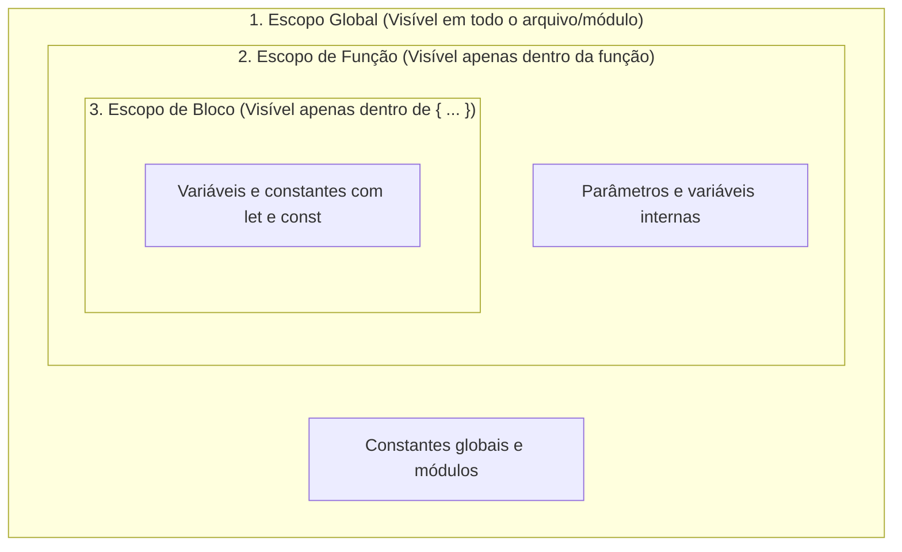
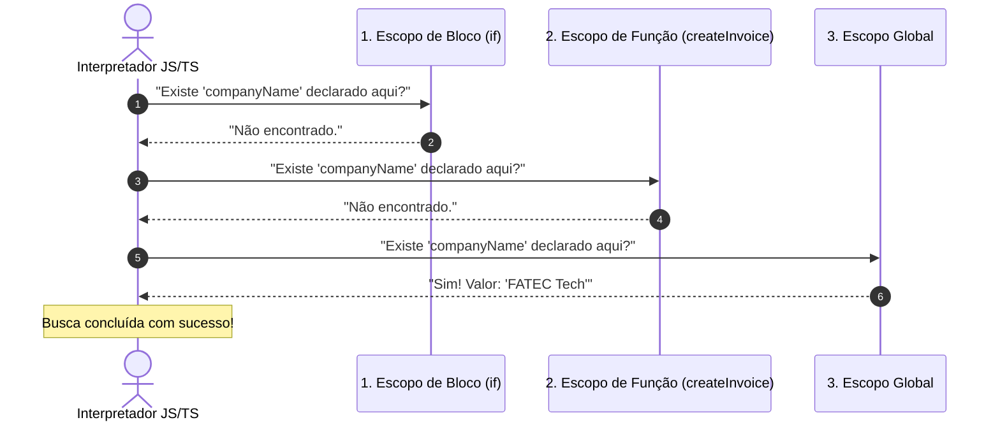
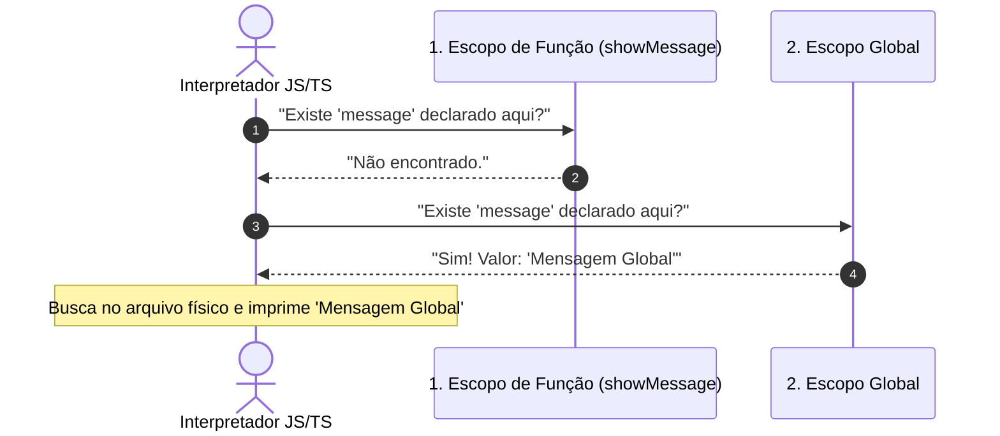
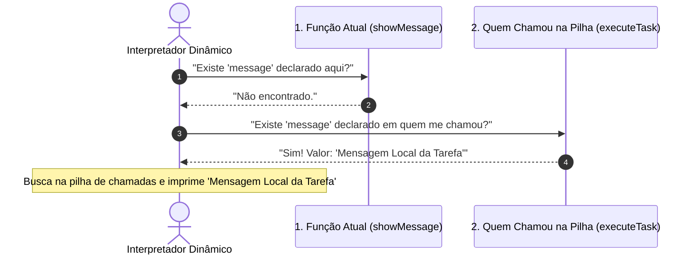
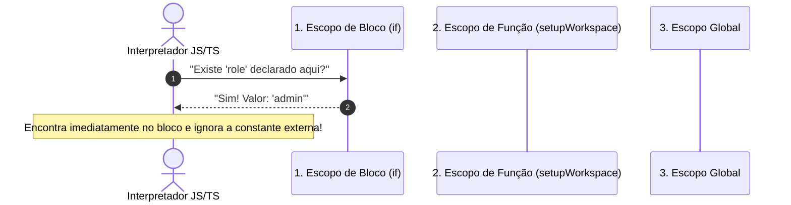
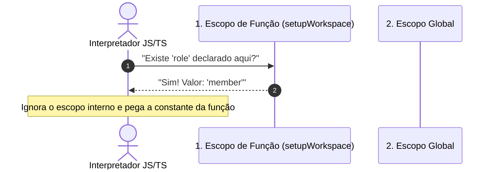
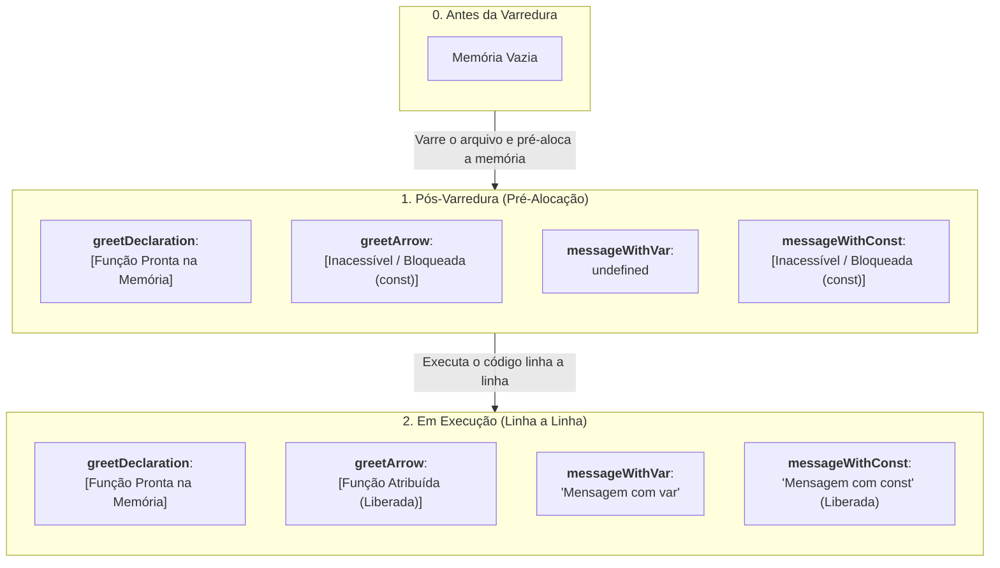

# 13. Escopo e Sombreamento

Nos capítulos anteriores, aprendemos a declarar variáveis, manipular objetos e
estruturar funções de primeira classe que recebem e executam callbacks. No
entanto, uma pergunta fundamental surge conforme nossas aplicações crescem:

> _"Onde exatamente uma variável pode ser acessada dentro do código e onde ela é
> invisível?"_

Se todas as variáveis fossem visíveis por qualquer parte do programa a qualquer
momento, um projeto com centenas de linhas rapidamente entraria em colapso
devido a colisões de nomes e alterações acidentais de estado.

Neste capítulo, vamos compreender as regras que organizam a visibilidade no
TypeScript: os **Níveis de Escopo**, a busca ordenada da **Cadeia de Escopo**
(_Scope Chain_) e o fenômeno do **Sombreamento de Variáveis** (_Variable
Shadowing_).

## O Que É Escopo?

**Escopo** é o conjunto de regras que define a acessibilidade e a visibilidade
de variáveis, constantes, funções e tipos dentro do programa. Ele atua como uma
fronteira de proteção que impede que partes isoladas do sistema interfiram umas
nas outras.

No TypeScript moderno, trabalhamos essencialmente com três níveis de escopo:



### 1. Escopo Global

Identificadores declarados fora de qualquer função ou bloco pertencem ao
**escopo global**. Eles podem ser lidos por qualquer função ou bloco no mesmo
módulo ou arquivo:

```typescript
const applicationName = "FatecHub";

function displaySystemInfo(): void {
  console.log(`Sistema: ${applicationName}`); // ✅ Acessa a constante global
}

displaySystemInfo();
```

> **Aviso de Boa Prática:**
>
> Evite armazenar estados mutáveis (`let`) no escopo global. Quando qualquer
> função pode alterar uma variável a qualquer instante, o comportamento do
> sistema se torna imprevisível e difícil de depurar.

### 2. Escopo de Função

Variáveis declaradas dentro de uma função (incluindo seus parâmetros formais)
pertencem exclusivamente a ela. Nenhuma instrução do lado de fora consegue
enxergá-las:

```typescript
function calculateCartTotal(subtotal: number, discountPercent: number): number {
  const discountAmount = (subtotal * discountPercent) / 100;
  const serviceFee = 5.0;
  const total = subtotal - discountAmount + serviceFee;

  return total;
}

const finalTotal = calculateCartTotal(200, 10);
console.log(`Total: R$ ${finalTotal}`); // "Total: R$ 185"

// ❌ Erros de compilação: nem os parâmetros nem as variáveis internas existem fora da função
// console.log(subtotal);       // Cannot find name 'subtotal'
// console.log(discountAmount); // Cannot find name 'discountAmount'
// console.log(total);          // Cannot find name 'total'
```

### 3. Escopo de Bloco

Um **bloco de código** é delimitado por um par de chaves `{ ... }`, presente em
instruções como `if`, `switch`, `for`, `while` ou blocos isolados.

Variáveis e constantes declaradas com **`let`** e **`const`** respeitam
estritamente o bloco onde foram criadas:

```typescript
const isUserAdmin = true;

if (isUserAdmin) {
  const secretApiKey = "MASTER_ADMIN_KEY_123";
  console.log(`Chave autorizada: ${secretApiKey}`); // ✅ Acessível dentro do bloco
}

// ❌ Erro de compilação: 'secretApiKey' não existe fora do bloco 'if'
// console.log(secretApiKey); // Cannot find name 'secretApiKey'
```

<details>
<summary>⚠️ O perigo do <code>var</code>: ausência de escopo de bloco</summary>

No [Capítulo 04: Variáveis](04-variaveis.md), mencionamos rapidamente que a
palavra-chave legada `var` foi aposentada. O principal motivo técnico é que
`var` **não possui escopo de bloco**, existindo apenas nos níveis de função ou
global:

```typescript
if (true) {
  var leakedVariable = "Vazei do bloco!";
}

console.log(leakedVariable); // ❌ Imprime: "Vazei do bloco!" (poluiu o escopo externo)
```

Variáveis declaradas com `var` dentro de qualquer `if`, `for` ou `while` "vazam"
para o escopo externo, o que gerava inúmeros bugs silenciosos no JavaScript
clássico. Por isso, no TypeScript e JavaScript moderno, usamos exclusivamente
`const` e `let`.

</details>

## Como o Interpretador Busca Identificadores: A Cadeia de Escopo (_Scope Chain_)

Quando o interpretador precisa ler o valor de uma variável ou constante, ele
inicia uma busca ordenada **do escopo mais interno para o mais externo** (_Scope
Chain_):

```typescript
const companyName = "FATEC Tech";

function createInvoice(customerName: string): void {
  const serviceFee = 15;

  if (customerName.trim().length > 0) {
    // Acessando identificadores de diferentes níveis hierárquicos:
    console.log(`Empresa: ${companyName}`);
    console.log(`Cliente: ${customerName}`);
    console.log(`Taxa: R$ ${serviceFee}`);
  }
}

createInvoice("Luigi");
```

Quando a linha `console.log(companyName)` dentro do bloco `if` é executada, a
busca ocorre nos seguintes passos:



1. **`companyName` existe no bloco `if`?** Não. O interpretador sobe um nível
   para a função `createInvoice`.
2. **`companyName` existe na função `createInvoice`?** Não. O interpretador sobe
   mais um nível para o escopo global.
3. **`companyName` existe no escopo global?** Sim! A busca é interrompida e o
   valor `"FATEC Tech"` é utilizado.

> **Regras Fundamentais da Busca:**
>
> 1. **A busca é estritamente de dentro para fora:** O interpretador **nunca**
>    procura variáveis dentro de blocos ou funções filhas.
> 2. **Escopo Léxico (ou Estático):** A visibilidade de qualquer identificador é
>    determinada pela **posição física onde o código foi escrito no arquivo**, e
>    não pelo local de onde uma função é chamada.
> 3. **Identificador ausente em todos os escopos:** Caso a busca percorra toda a
>    cadeia até o escopo global sem encontrar a variável, o TypeScript acusará
>    um erro em tempo de compilação (`Cannot find name`). No runtime do
>    JavaScript, o motor interrompe a execução com um erro fatal
>    (`ReferenceError: ... is not defined`).

<details>
<summary>🔍 Aprofundamento: O que significa Escopo Léxico (Estático) vs. Escopo Dinâmico?</summary>

Para entender na prática a diferença entre o **Escopo Léxico** (usado no motor
do JavaScript/TypeScript) e o **Escopo Dinâmico**, observe o trecho de código
abaixo:

```typescript
const message = "Mensagem Global";

function showMessage(): void {
  console.log(message);
}

function executeTask(): void {
  const message = "Mensagem Local da Tarefa";
  showMessage();
}

executeTask();
```

O tipo de escopo da linguagem define exatamente qual texto aparecerá no console
ao executar `executeTask()`:

### 1. Escopo Léxico (JavaScript, TypeScript, C#, Java, Python...)

No modelo léxico, a busca por variáveis segue rigorosamente a **posição física
onde o código foi escrito no arquivo**.

A função `showMessage` busca a variável primeiro no seu próprio escopo interno
e, em seguida, sobe direto para o escopo global onde ela foi declarada. Ela
ignora completamente quem a invocou (`executeTask`), imprimindo `"Mensagem
Global"`:



### 2. Escopo Dinâmico (Bash e dialetos antigos de Lisp)

Em linguagens com escopo dinâmico, a busca por variáveis não segue o arquivo,
mas sim a **pilha de chamadas em tempo de execução** (_Call Stack_).

A função `showMessage` não encontraria `message` em seu corpo e procuraria no
escopo de **quem realizou a chamada** (`executeTask`). Como `executeTask` possui
uma constante `message`, o programa imprimiria `"Mensagem Local da Tarefa"`:



### Conclusão

São dois modelos mentais distintos de resolução de escopo. O **modelo léxico** é
o padrão absoluto das linguagens modernas porque é altamente previsível: basta
ler a estrutura física do arquivo para determinar o que uma função pode acessar,
sem precisar rastrear todos os pontos do sistema que possam vir a chamá-la.

</details>

## Sombreamento de Variáveis (_Variable Shadowing_)

O **sombreamento** (_shadowing_) ocorre quando declaramos uma variável em um
escopo interno com o **mesmo nome** de outra variável já existente em um escopo
externo:

```typescript
function setupWorkspace(): void {
  const role = "member";

  if (true) {
    const role = "admin"; // ⚠️ Sombreia a constante 'role' externa dentro deste bloco
    console.log(`Papel no if: ${role}`); // "admin" (encontra no bloco imediatamente)
  }

  console.log(`Papel na função: ${role}`); // "member" (não enxerga dentro do if)
}

setupWorkspace();
```

Vamos analisar visualmente como o interpretador resolve o identificador `role`
em cada um dos dois momentos:

### 1. Busca ao executar dentro do bloco `if`

O interpretador inicia a busca no escopo mais interno (o próprio bloco `if`):



Como a constante foi encontrada logo no primeiro nível da busca, a variável
`role` declarada na função fica "na sombra" (oculta).

### 2. Busca ao executar fora do `if` (no corpo da função)

O interpretador inicia a busca a partir do escopo da própria função
`setupWorkspace`:



> **Atenção ao sentido da busca:**
>
> Ao executar instruções no corpo da função, o escopo de bloco do `if` sequer
> participa da busca. Como vimos nas regras fundamentais, o interpretador
> **nunca olha para dentro** de blocos filhos, apenas para o próprio escopo e
> para os escopos superiores (como o global).

> **Recomendação de Código Limpo:**
>
> Evite o sombreamento de variáveis no dia a dia. Reutilizar o mesmo nome em
> blocos aninhados gera confusão mental para quem lê o código e facilita a
> introdução de bugs sutis. Prefira nomes descritivos e distintos (como
> `defaultRole` e `elevatedRole`).

<details>
<summary>🔍 Aprofundamento: Içamento na memória (Hoisting) e a diferença entre declarações</summary>

Ao utilizar `const` e `let`, você deve ter notado que não é possível tentar
acessar uma variável antes da linha onde ela foi declarada:

```typescript
// ❌ Erro: Cannot access 'message' before initialization
// console.log(message);

const message = "Mensagem com const";
```

No entanto, ao declarar funções tradicionais com a palavra-chave `function`,
você talvez tenha percebido que o comportamento é diferente:

```typescript
// ✅ Funciona perfeitamente mesmo antes da sua linha no arquivo!
sayHello(); // Imprime: "Olá, estudante!"

function sayHello(): void {
  console.log("Olá, estudante!");
}
```

E no JavaScript clássico, ao declarar variáveis com a palavra-chave legada
`var`, temos outro comportamento peculiar:

```typescript
// ⚠️ A variável já existe na memória, mas vale undefined!
console.log(message); // Imprime: undefined

var message = "Mensagem com var";
```

### Por Que Isso Acontece? As Duas Fases do Motor JS

Esse fenômeno é conhecido como **Hoisting** (Içamento). Ele ocorre porque o
motor do JavaScript executa o código em etapas: primeiro ele realiza uma
**varredura** do arquivo para pré-alocar o espaço de memória necessário para
cada identificador, e apenas depois ele executa o código linha a linha
preenchendo essa memória com dados reais.

Vejamos um exemplo comparativo:

```typescript
// 1. Function Declaration (içada por completo na fase de criação):
function greetDeclaration(name: string): string {
  return `Olá, ${name}!`;
}

// 2. Arrow Function em const (bloqueada na memória até a sua linha):
const greetArrow = (name: string): string => {
  return `Olá, ${name}!`;
};

// 3. Variáveis com var e const:
var messageWithVar = "Mensagem com var";
const messageWithConst = "Mensagem com const";
```

Podemos visualizar como o estado da memória evolui entre a varredura e a
execução:



Observe o que acontece em cada um dos casos:

- **`greetDeclaration` já está pronta na varredura:** Como se trata de uma
  _Function Declaration_ formal (e não uma expressão), o motor do JavaScript
  constrói a função inteira e a deixa disponível na memória logo na fase
  inicial.
- **`greetArrow` fica bloqueada na memória:** Por ter sido declarada com
  `const`, ela respeita as regras de variáveis modernas. Além disso, como _Arrow
  Functions_ são expressões, a função só é construída no momento em que a linha
  da declaração é executada.
- **`messageWithVar` é alocada e preenchida precocemente:** A variável nasce
  valendo `undefined` antes da sua linha. Tentar ler esse valor antes da hora
  não gera erro imediato, mas produz falhas silenciosas e difíceis de rastrear.
- **`messageWithConst` é alocada, mas tem o acesso bloqueado:** O motor impede
  qualquer tentativa de leitura ou escrita até que o fluxo de execução atinja a
  sua linha.

Por conta desses comportamentos:

1. Usamos **exclusivamente `const` e `let`** no dia a dia para garantir a
   segurança das variáveis;
2. Muitas equipes preferem declarar funções como **_Arrow Functions_ atribuídas
   a constantes (`const`)** para evitar o _Hoisting_, mantendo a ordem de
   leitura e execução do código linear, previsível e intuitiva.

</details>

## O Que Vem a Seguir?

Até o momento, nossos programas assumiram um cenário ideal onde tudo funciona
sem falhas. Mas o que acontece quando uma validação não passa, um dado
obrigatório está ausente ou uma operação não pode ser concluída?

No próximo capítulo, vamos aprender sobre **Exceções e Tratamento de Erros**,
dominando o lançamento de erros com `throw new Error()`, a captura segura com
blocos `try/catch/finally` e a tipagem de exceções no TypeScript com `unknown` e
`instanceof Error`.

---

<a href="12-funcoes-de-primeira-classe.md">← Funções de Primeira Classe e
Callbacks</a>

<p align="right"><a href="14-excecoes-e-tratamento-de-erros.md">Próximo: Exceções e Tratamento de Erros →</a></p>
