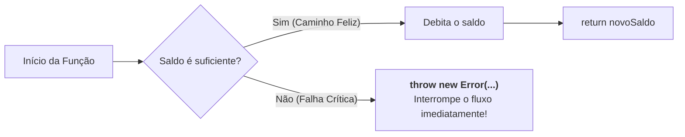
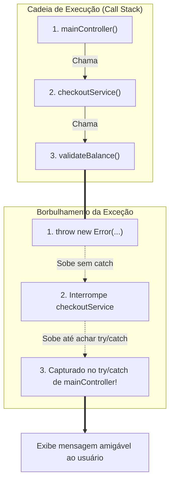

# 14. Exceções e Tratamento de Erros

No mundo ideal, todo programa executa perfeitamente do início ao fim: os
usuários sempre digitam dados válidos, os servidores respondem instantaneamente
e os arquivos solicitados sempre existem no disco. Esse cenário ideal é o que
chamamos na engenharia de software de **caminho feliz** (_happy path_).

No entanto, o desenvolvimento web real é repleto de imprevistos: conexões de
rede oscilam no meio de uma requisição, o armazenamento local fica sem espaço,
usuários enviam formatos inesperados e serviços externos ficam temporariamente
indisponíveis.

Quando uma situação dessas acontece, o seu programa não pode simplesmente travar
a aplicação do usuário ou continuar executando como se nada tivesse acontecido,
gerando dados corrompidos.

Neste capítulo, vamos aprender a lidar com falhas de forma profissional:
compreender o papel do objeto nativo **`Error`**, lançar exceções com
**`throw`**, criar redes de segurança com **`try`**, **`catch`** e
**`finally`**, e dominar o afunilamento seguro de erros no TypeScript com
**`unknown`** e **`instanceof Error`**.

## O Dilema das Falhas: Como Indicar que Algo Deu Errado?

Imagine que estamos construindo o módulo financeiro de uma aplicação e
precisamos implementar uma função para processar o saque de uma conta:

```typescript
function processWithdrawal(accountBalance: number, amount: number): number {
  if (amount <= 0 || amount > accountBalance) {
    // Como avisamos ao código que chamou que a operação falhou?
  }

  return accountBalance - amount;
}
```

Historicamente, abordagens ingênuas recorriam ao uso de **valores sentinela**
(valores mágicos que indicam erro), como retornar `-1`, `false` ou `null`:

```typescript
// ❌ EVITE: Retornar valores mágicos para indicar erro
function processWithdrawal(accountBalance: number, amount: number): number {
  if (amount <= 0 || amount > accountBalance) {
    return -1; // -1 indica que falhou
  }

  return accountBalance - amount;
}

const initialBalance = 100;
const requestedAmount = 250; // Saldo insuficiente!

const remainingBalance = processWithdrawal(initialBalance, requestedAmount);

// O código esquece de verificar se o retorno foi -1:
console.log(`Novo saldo: R$ ${remainingBalance}`); // "Novo saldo: R$ -1"
const cashback = remainingBalance * 0.05; // O sistema calcula bônus com saldo corrompido!
```

O grande problema dessa abordagem é a **fragilidade silenciosa**:

1. **O tipo de retorno é ambíguo:** A função promete devolver um `number`
   representando o novo saldo, mas devolve um número com dois significados
   opostos (um saldo legítimo ou um código de falha).
2. **Nada obriga a verificação:** O desenvolvedor pode esquecer de checar `if
(remainingBalance === -1)`. O erro se propaga silenciosamente pelo sistema e
   causa falhas catastróficas linhas ou módulos adiante.

Para resolver esse problema de forma definitiva, o JavaScript e o TypeScript
oferecem um canal expresso de comunicação para situações anômalas: as
**Exceções**.

## Interrompendo o Fluxo com `throw` e o Objeto `Error`

Quando ocorre uma falha que impede a continuidade lógica de uma operação,
disparamos um sinal de alerta vermelho utilizando a instrução **`throw`**
(lançar).

Ao lançar um erro, o fluxo normal de execução da função é **interrompido
imediatamente**. Nenhuma linha seguinte daquela função será executada:



### O Objeto Nativo `Error`

Embora a linguagem permita lançar tecnicamente qualquer valor com `throw` (como
textos ou números), a boa prática universal é lançar sempre uma instância da
classe nativa **`Error`**:

```typescript
// ✅ RECOMENDADO: Lançar instâncias do objeto Error com mensagens descritivas
function processWithdrawal(accountBalance: number, amount: number): number {
  if (amount <= 0) {
    throw new Error("O valor do saque deve ser estritamente positivo.");
  }

  if (amount > accountBalance) {
    throw new Error(
      `Saldo insuficiente. Disponível: R$ ${accountBalance}, Solicitado: R$ ${amount}.`,
    );
  }

  return accountBalance - amount;
}
```

O objeto `Error` carrega consigo três propriedades essenciais:

| Propriedade   | Descrição                                                                               | Exemplo de Valor                                       |
| :------------ | :-------------------------------------------------------------------------------------- | :----------------------------------------------------- |
| **`message`** | A descrição textual do que causou o problema.                                           | `"Saldo insuficiente."`                                |
| **`name`**    | O nome do tipo de erro (por padrão, `"Error"`).                                         | `"Error"` ou `"TypeError"`                             |
| **`stack`**   | O rastreamento de pilha (_Stack Trace_), detalhando o arquivo e a linha exata da falha. | `Error: Saldo... at processWithdrawal (index.ts:8:11)` |

```typescript
// ❌ EVITE: Lançar tipos primitivos puros (perde stack trace e metadados)
// throw "Erro ao salvar";

// ✅ RECOMENDADO: Lançar instâncias completas de Error
throw new Error("Falha ao comunicar com a operadora de pagamentos.");
```

## A Rede de Proteção: `try`, `catch` e `finally`

Se um erro for lançado com `throw` e nenhuma parte do programa o capturar, ele
viajará até a raiz da aplicação e fará com que o runtime (Node.js ou o
navegador) aborte a execução com uma mensagem de falha no console.

Para evitar que a aplicação quebre diante do usuário final e permitir uma
recuperação graciosa, utilizamos a estrutura de controle **`try...catch`**:

```typescript
try {
  // 1. Bloco Monitorado (Zona de Risco)
  // Código que queremos executar, mas que pode vir a lançar uma exceção.
} catch (error) {
  // 2. Bloco de Recuperação (Rede de Segurança)
  // Executado APENAS se alguma exceção for lançada dentro do try.
  // Se o try executar com sucesso do início ao fim, este bloco é ignorado.
} finally {
  // 3. Bloco de Limpeza (Execução Garantida - Opcional)
  // Executado SEMPRE ao término de tudo, ocorrendo erro ou não.
}
```

Vejamos como essa estrutura funciona ao executar uma operação arriscada:

```typescript
try {
  console.log("Iniciando operação de saque...");

  // ⚠️ Esta linha lança um Error("Saldo insuficiente...")
  const updatedBalance = processWithdrawal(100, 250);

  // 🛑 Esta linha NUNCA será executada, pois o erro interrompeu o try imediatamente
  console.log(`Saque realizado! Novo saldo: R$ ${updatedBalance}`);
} catch (error) {
  // 🛡️ O fluxo salta direto para cá para tratar a falha:
  console.error("Não foi possível concluir o saque bancário.");
} finally {
  // 🧹 Executado incondicionalmente:
  console.log("Operação finalizada no terminal.");
}

// ✅ Como o erro foi capturado, o programa NÃO trava e segue normalmente:
console.log("Sistema pronto para a próxima operação!");
```

### O Papel do Bloco `finally`

O bloco `finally` é executado **sempre**, independentemente de o bloco `try` ter
sucedido ou de uma exceção ter sido capturada no `catch` (mesmo se houver um
`return` dentro do bloco).

Ele é o local ideal para **limpeza de recursos** e restauração de indicadores:

```typescript
let isProcessing = true;

try {
  console.log("Conectando ao banco de dados...");
  processWithdrawal(50, 100);
} catch (error) {
  console.error("Falha ao processar transação.");
} finally {
  // Garante que a trava de processamento seja liberada em qualquer cenário
  isProcessing = false;
  console.log(`Processamento liberado: ${isProcessing}`);
}
```

## TypeScript e a Segurança de Tipos no `catch`

No TypeScript estrito, a variável capturada no bloco `catch` recebe
automaticamente o tipo **`unknown`**:

```typescript
try {
  processWithdrawal(100, 500);
} catch (error: unknown) {
  // ❌ Erro de compilação no TypeScript:
  // 'error' is of type 'unknown'.
  // console.log(error.message);
}
```

> **Por que o TypeScript tipa o erro como `unknown`?**
>
> Porque no JavaScript qualquer código de terceiros pode lançar literalmente
> qualquer coisa com `throw` (como `throw "erro"` ou `throw 500`). Como o
> compilador não tem como prever com 100% de certeza o tipo exato do dado
> lançado em tempo de execução, ele força você a validar o dado antes de usá-lo.

### Afunilamento Seguro com `instanceof Error`

A maneira idiomática e segura de manipular erros no TypeScript é utilizar o
operador **`instanceof`** para verificar se o valor capturado é realmente uma
instância da classe `Error`:

```typescript
function executeTransfer(): void {
  try {
    const balance = processWithdrawal(100, 300);
    console.log(`Sucesso: R$ ${balance}`);
  } catch (error: unknown) {
    // ✅ Verificação segura com afunilamento de tipo:
    if (error instanceof Error) {
      console.error(`Falha (${error.name}): ${error.message}`);
    } else {
      console.error("Ocorreu um erro inesperado e desconhecido:", error);
    }
  }
}

executeTransfer();
```

Ao passar pela checagem `if (error instanceof Error)`, o TypeScript passa a
reconhecer `error` como o objeto `Error`, liberando o acesso seguro a
`.message`, `.name` e `.stack`.

## Propagação de Erros na Pilha de Chamadas (_Call Stack_)

Uma das características fundamentais das exceções é a **propagação automática**
(borbulhamento).

Se uma função interna lança um erro e não possui um bloco `try...catch` próprio,
ela encerra imediatamente e repassa o erro para a função que a chamou. Esse
processo sobe a pilha de chamadas até encontrar o primeiro `catch` disponível:



```typescript
function validateBalance(balance: number, amount: number): void {
  if (amount > balance) {
    throw new Error("Saldo indisponível para completar o pedido.");
  }
}

function checkoutService(balance: number, amount: number): void {
  console.log("Iniciando checkout...");
  validateBalance(balance, amount); // Repassa o erro se não souber como tratar!
  console.log("Pedido concluído com sucesso!");
}

function mainController(): void {
  try {
    checkoutService(50, 200);
  } catch (error: unknown) {
    // O erro lançado em validateBalance é capturado aqui no topo da camada:
    if (error instanceof Error) {
      console.error(`[Interface]: ${error.message}`);
    }
  }
}

mainController();
```

> **Regra de Ouro da Propagação:**
>
> Só capture um erro com `try...catch` se você souber **o que fazer com ele**
> naquele ponto (exibir um aviso ao usuário, tentar uma rota de contingência ou
> gravar um log). Se a função atual não tem capacidade de resolver a falha,
> deixe o erro subir livremente para as camadas superiores.

## Boas Práticas no Tratamento de Erros

1. **❌ Nunca engula erros silenciosamente (_Silent Catch_):**
   ```typescript
   // ❌ PÉSSIMO: Engolir o erro sem nenhum log ou ação
   try {
     processWithdrawal(100, 500);
   } catch (error) {
     // Silêncio absoluto... O sistema quebra sem deixar pistas!
   }
   ```
2. **❌ Não use exceções para fluxo comum e esperado:** Lançar exceções
   interrompe o fluxo normal e gera uma pilha de rastreamento completa. Para
   cenários rotineiros (como validar se um usuário preencheu um campo de
   formulário ou se uma busca não encontrou resultados), use retornos simples
   (`null`, `undefined` ou booleanos).
3. **✅ Reserve exceções para violações de contrato e falhas reais:** Use `throw`
   quando uma função recebe dados corrompidos que violam suas precondições
   básicas ou quando serviços externos e conexões falham de forma crítica.

<details>
<summary>🔍 Aprofundamento: O Padrão Result (Modelando Sucesso e Falha com Tipos)</summary>

Em muitos padrões funcionais e APIs modernas, desenvolvedores preferem modelar
erros de negócio através de objetos de retorno explícitos em vez de `throw`,
utilizando o chamado **Result Pattern**:

```typescript
type Result<TData, TError> =
  | { success: true; data: TData }
  | { success: false; error: TError };

function safeDivide(
  numerator: number,
  denominator: number,
): Result<number, string> {
  if (denominator === 0) {
    return { success: false, error: "Divisão por zero não permitida." };
  }

  return { success: true, data: numerator / denominator };
}

const calculation = safeDivide(10, 0);

if (calculation.success) {
  console.log(`Resultado: ${calculation.data}`);
} else {
  console.error(`Erro: ${calculation.error}`);
}
```

Esse padrão utiliza **Uniões Discriminadas (_Discriminated Unions_)** e
**Generics**, recursos que exploraremos a fundo nos blocos seguintes do curso!

</details>

## O Que Vem a Seguir?

Até este ponto, trabalhamos principalmente com valores isolados e funções
individuais. No entanto, o desenvolvimento de software profissional opera sobre
**conjuntos e coleções de dados**: listas de produtos, catálogos de cursos,
carrinhos de compras e resultados de consultas a bancos de dados.

No próximo bloco, iniciaremos o estudo de **Coleções e Padrões Modernos**,
começando pelo **Capítulo 15: Arrays**, onde aprenderemos a declarar listas
tipadas, manipular elementos de forma segura e evitar armadilhas de mutação em
memória.

---

<a href="13-escopo-e-sombreamento.md">← Escopo e Sombreamento</a>

<p align="right"><a href="15-arrays.md">Próximo: Arrays →</a></p>
