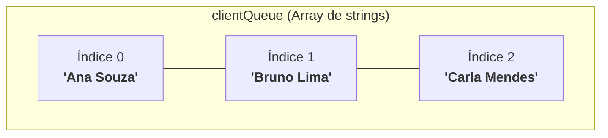

# 15. Arrays

Até agora, trabalhamos principalmente com variáveis isoladas, objetos
representando entidades únicas e funções que operam sobre dados pontuais. No
entanto, no dia a dia do desenvolvimento web, quase nunca lidamos com dados
soltos.

Um catálogo de e-commerce precisa exibir centenas de produtos, uma rede social
gerencia feeds de postagens e uma API REST devolve listas ordenadas de registros
para preencher tabelas no frontend.

Para organizar, armazenar e manipular grupos ordenados de dados de forma
eficiente e tipada, utilizamos a estrutura de coleção fundamental da linguagem:
os **Arrays**.

Neste capítulo, você aprenderá a declarar e tipar arrays no TypeScript, dominará
a indexação segura e os métodos essenciais de manipulação, e compreenderá o
impacto crítico da **mutabilidade versus imutabilidade** na memória.

## A Dor das Variáveis Soltas e a Necessidade de Listas

Imagine que você precise gerenciar a fila de atendimento de clientes em uma
plataforma de suporte. Sem uma estrutura de coleção, você rapidamente se
depararia com este cenário:

```typescript
// ❌ EVITE: Gerenciar coleções de dados com variáveis isoladas
const client1 = "Ana Souza";
const client2 = "Bruno Lima";
const client3 = "Carla Mendes";

function serveClient(clientName: string): void {
  console.log(`Atendendo cliente: ${clientName}`);
}

serveClient(client1);
serveClient(client2);
serveClient(client3);
```

Essa abordagem se torna insustentável no momento em que a fila cresce:

1. **Falta de escalabilidade:** Você não pode criar uma nova variável no código
   para cada cliente que entra no sistema em tempo de execução.
2. **Impossibilidade de iteração genérica:** Você não consegue ordenar, filtrar
   ou percorrer os dados utilizando laços de repetição de forma automatizada.

Um **Array** resolve esse problema reunindo múltiplos elementos sob um único
identificador, preservando a ordem de inserção e permitindo o acesso a qualquer
posição através de um **índice numérico** (iniciado em `0`).

## Declarando Arrays no TypeScript

Podemos declarar o tipo de um array no TypeScript utilizando duas sintaxes
equivalentes:

```typescript
// 1. Notação com colchetes: Tipo[] (Mais comum e recomendada)
const clientQueue: string[] = ["Ana Souza", "Bruno Lima", "Carla Mendes"];

// 2. Notação Genérica: Array<Tipo> (Sintaxe equivalente)
const transactionValues: Array<number> = [120.5, 45.0, 300.25];
```



No TypeScript, os arrays são homogêneos por padrão — ou seja, espera-se que
todos os elementos da lista pertençam ao mesmo tipo de dado.

### Inferência Estática de Tipos em Arrays

Assim como ocorre com variáveis simples, o TypeScript é capaz de inferir
automaticamente o tipo do array a partir dos seus valores iniciais:

```typescript
// O TypeScript infere automaticamente como: boolean[]
const featureFlags = [true, false, true];

// ❌ Erro de compilação: O TypeScript impede inserção de tipos incompatíveis
// featureFlags.push("habilitado"); // Argument of type 'string' is not assignable to parameter of type 'boolean'.
```

### Acesso por Índice e Cuidados

Os elementos de um array são acessados utilizando colchetes `[ ]` e a posição
numérica desejada:

#### 1. Indexação Baseada em Zero (_Zero-Based_)

A contagem das posições inicia estritamente em **`0`**. Em uma lista de três
itens, os elementos ocupam os índices `0`, `1` e `2`. O último elemento sempre
reside no índice correspondente a `array.length - 1`:

```typescript
const products: string[] = ["Teclado Mecânico", "Mouse Sem Fio", "Monitor 4K"];

console.log(products[0]); // "Teclado Mecânico" (Primeiro elemento)
console.log(products[1]); // "Mouse Sem Fio" (Segundo elemento)

// Acessando o último elemento de forma dinâmica:
const lastIndex = products.length - 1;
console.log(products[lastIndex]); // "Monitor 4K"
```

#### 2. Acesso a Índices Inválidos (_Out of Bounds_)

Ao contrário de linguagens que disparam exceções imediatamente ao tentar ler um
índice inexistente, o runtime do JavaScript simplesmente devolve
**`undefined`**:

```typescript
const categories: string[] = ["Hardware", "Games"];

console.log(categories[10]); // undefined (índice além do tamanho da lista)
console.log(categories[-1]); // undefined (índice negativo)
```

> **Atenção:**
>
> Tentar executar métodos diretamente sobre um retorno `undefined` causará um
> erro fatal de runtime:
>
> ```typescript
> // ❌ Erro fatal em runtime:
> // categories[10].toUpperCase(); // TypeError: Cannot read properties of undefined
> ```

## Métodos Essenciais de Manipulação

A linguagem disponibiliza um rico catálogo de métodos nativos para adicionar,
remover, extrair, buscar e ordenar itens.

### 1. Inserção e Remoção nas Extremidades

| Método                                 | O que faz                                           | Retorno                              |
| :------------------------------------- | :-------------------------------------------------- | :----------------------------------- |
| **`array.push(item1, ..., itemN)`**    | Insere um ou mais elementos no **final** da lista.  | Novo tamanho (`.length`)             |
| **`array.pop()`**                      | Remove e extrai o **último** elemento da lista.     | O elemento removido (ou `undefined`) |
| **`array.unshift(item1, ..., itemN)`** | Insere um ou mais elementos no **início** da lista. | Novo tamanho (`.length`)             |
| **`array.shift()`**                    | Remove e extrai o **primeiro** elemento da lista.   | O elemento removido (ou `undefined`) |

```typescript
const cartItems: string[] = ["Notebook", "Mouse"];

// 1. Inserindo no final e no início:
cartItems.push("Headset", "Mousepad"); // ["Notebook", "Mouse", "Headset", "Mousepad"]
cartItems.unshift("Mochila"); // ["Mochila", "Notebook", "Mouse", "Headset", "Mousepad"]

// 2. Removendo das pontas:
const lastItem = cartItems.pop(); // Remove "Mousepad"
const firstItem = cartItems.shift(); // Remove "Mochila"

console.log(`Removidos: ${firstItem} e ${lastItem}`);
console.log("Itens no carrinho:", cartItems); // ["Notebook", "Mouse", "Headset"]
```

### 2. Fatiamento Imutável com `slice`

O método **`slice`** extrai uma fatia de elementos gerando um **novo array**,
sem modificar a lista original:

```typescript
const fullQueue = ["Ana", "Bruno", "Carlos", "Daniela", "Eduardo"];

// Extrai do índice 0 até antes do índice 3 (índices 0, 1 e 2):
const priorityBatch = fullQueue.slice(0, 3); // ["Ana", "Bruno", "Carlos"]

// Omitindo o segundo argumento, fatia até o final da lista:
const remainingBatch = fullQueue.slice(3); // ["Daniela", "Eduardo"]

console.log("Fila original intacta:", fullQueue);
```

### 3. Combinação e Junção (`concat` e `join`)

```typescript
const morningTasks = ["Checar e-mails", "Reunião de alinhamento"];
const afternoonTasks = ["Code review", "Deploy"];

// 1. Unindo arrays em uma nova lista:
const allTasks = morningTasks.concat(afternoonTasks);

// 2. Convertendo a lista em texto único com um separador:
const timeline = allTasks.join(" -> ");

console.log("Fluxo do dia:", timeline);
// "Checar e-mails -> Reunião de alinhamento -> Code review -> Deploy"
```

### 4. Busca e Verificação de Existência

| Método                                     | O que faz                                             | Retorno                   |
| :----------------------------------------- | :---------------------------------------------------- | :------------------------ |
| **`array.includes(value, fromIndex?)`**    | Verifica se determinado valor existe dentro da lista. | `true` ou `false`         |
| **`array.indexOf(value, fromIndex?)`**     | Encontra a primeira posição onde o valor se encontra. | O índice numérico ou `-1` |
| **`array.lastIndexOf(value, fromIndex?)`** | Encontra a última posição onde o valor se encontra.   | O índice numérico ou `-1` |

```typescript
const userRoles = ["user", "editor", "admin", "editor"];

console.log(userRoles.includes("admin")); // true
console.log(userRoles.includes("guest")); // false

console.log(userRoles.indexOf("editor")); // 1 (primeira ocorrência)
console.log(userRoles.lastIndexOf("editor")); // 3 (última ocorrência)
console.log(userRoles.indexOf("guest")); // -1 (não encontrado)
```

### 5. Ordenação e Inversão Imutáveis (`toSorted` e `toReversed`)

Historicamente, os métodos `sort()` e `reverse()` alteravam o array original
diretamente na memória (_mutação in-place_). A partir do ECMAScript 2023+, temos
métodos **puros e imutáveis**:

```typescript
const scores = [40, 10, 100, 5];

// 1. Ordenação numérica crescente com função comparadora (a - b):
const sortedScores = scores.toSorted((a, b) => a - b);
console.log("Ordenado:", sortedScores); // [5, 10, 40, 100]

// 2. Inversão dos elementos:
const reversedScores = sortedScores.toReversed();
console.log("Invertido:", reversedScores); // [100, 40, 10, 5]

console.log("Array original permanece intacto:", scores); // [40, 10, 100, 5]
```

> **⚠️ Alerta de Boas Práticas: Mutabilidade vs. Imutabilidade**
>
> - **Métodos Modificadores (`push`, `pop`, `shift`, `unshift`, `sort`,
>   `reverse`):** Alteram o array original diretamente na memória.
> - **Métodos Puros (`slice`, `concat`, `join`, `includes`, `toSorted`,
>   `toReversed`):** Não modificam o array original; devolvem novos arrays ou
>   valores calculados.
>
> No desenvolvimento moderno com React e APIs, **a mutação acidental de arrays
> compartilhados é uma das maiores fontes de bugs sutis**. Sempre que possível,
> priorize métodos que preservam a imutabilidade!

<details>
<summary>🔍 Aprofundamento: Arrays Imutáveis com <code>readonly</code></summary>

Para garantir em tempo de compilação que um array nunca seja modificado após sua
criação, utilize o modificador **`readonly`**:

```typescript
const availableSemesters: readonly number[] = [1, 2, 3, 4, 5, 6];

// ❌ Erros de compilação: TypeScript impede qualquer operação de escrita
// availableSemesters.push(7);    // Property 'push' does not exist on type 'readonly number[]'.
// availableSemesters[0] = 10;    // Index signature in type 'readonly number[]' only permits reading.
```

Essa abordagem protege configurações fixas e listas globais contra mutações
acidentais no sistema.

</details>

## O Que Vem a Seguir?

Vimos que os arrays são ideais para listas dinâmicas e homogêneas. Mas e quando
precisamos de uma coleção de **tamanho estritamente fixo**, onde cada posição
possui um **significado e um tipo diferente** (como um par de coordenadas
`[latitude, longitude]` ou um par de estado `[valor, funcaoModificadora]`)?

No próximo capítulo, vamos explorar as **Tuplas** (`16-tuplas.md`), aprendendo a
definir contratos posicionais rígidos e a utilizar rótulos para
auto-documentação.

---

<a href="14-excecoes-e-tratamento-de-erros.md">← Exceções e Tratamento de
Erros</a>

<p align="right"><a href="16-tuplas.md">Próximo: Tuplas →</a></p>
